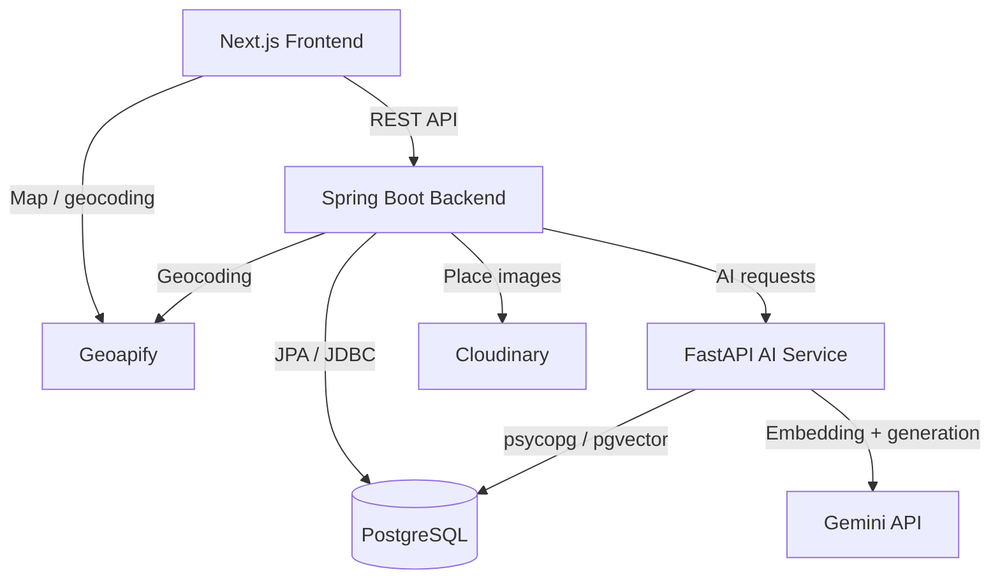

# SaigonPlanTravel

SaigonPlanTravel is a full-stack travel itinerary planning system for **one-day trips in Ho Chi Minh City**. It combines semantic place retrieval, deterministic scheduling, and Retrieval-Augmented Generation (RAG) while keeping the user in control of the final itinerary.

The project was developed as an academic software engineering project and is designed around a clear separation of responsibilities between the web frontend, Spring Boot business backend, AI service, and PostgreSQL/pgvector storage.

## Highlights

- Create and manage personal trips with time, budget, starting location, and travel preferences.
- Search and filter places, then manually add, replace, remove, or reorder itinerary stops.
- Recalculate itinerary timeline and estimated travel information after itinerary changes.
- Retrieve places semantically from natural-language preferences using vector embeddings.
- Build itinerary previews with deterministic business constraints and a Greedy scheduling strategy.
- Rank feasible candidates using weighted scoring based on semantic relevance, travel time, budget fit, and environment preference.
- Generate RAG-based explanations for places **after** the scheduler has selected and ordered them.
- Visualize places and itineraries on an interactive Leaflet map.
- Provide a Thymeleaf-based admin interface for place, category, opening-hour, and image data management.

## Smart Itinerary Flow


The AI service does **not** directly decide the final itinerary. Semantic retrieval finds potentially relevant places, while the Spring Boot scheduler validates feasibility and determines the visit order. RAG is used afterward to generate explanations grounded in the project's place corpus.

## Architecture



## Tech Stack

| Layer | Technologies |
| --- | --- |
| Frontend | Next.js 16, React 19, TypeScript, Tailwind CSS, shadcn/ui, Leaflet, React Leaflet |
| Backend | Java 21, Spring Boot 4.1, Spring MVC, Spring Security, Spring Data JPA, Thymeleaf |
| Database | PostgreSQL, pgvector, Flyway |
| AI Service | Python, FastAPI, LangChain text splitters, psycopg, psycopg-pool |
| AI Models | Gemini embeddings and generation |
| External services | Geoapify, Cloudinary |
| Testing / Quality | JUnit, Spring Boot Test, Testcontainers, JaCoCo, Spotless, ESLint, Ruff |

## Repository Structure

```text
saigon-plan-travel/
├── backend/       # Spring Boot REST API, business rules, scheduling, admin UI
├── frontend/      # Next.js user-facing web application
├── ai-service/    # Semantic retrieval, corpus ingestion and RAG
├── infra/         # Docker Compose infrastructure
└── docs/          # Project/report supporting documents
```

## Core Modules

### Backend

- **Authentication** — JWT-based user authentication and Spring Security configuration.
- **Places** — place catalog, categories, opening hours, images, search and filtering.
- **Trips** — trip creation and management.
- **Itinerary** — add, replace, remove and reorder itinerary items.
- **Scheduling** — travel estimation, feasibility checks, candidate scoring/ranking and Greedy scheduling.
- **Recommendation integration** — calls the AI service for semantic candidate retrieval and RAG explanations.
- **Admin** — session-based Thymeleaf administration pages.

### AI Service

- Structured corpus ingestion from JSON place documents.
- Structure-aware chunking with recursive splitting for oversized sections.
- Gemini embedding generation.
- pgvector similarity retrieval.
- Semantic place recommendation.
- RAG-based itinerary explanations.

The repository currently includes a corpus for **70 Ho Chi Minh City places**, aligned with the development seed data.

## Local Development

### Prerequisites

Install:

- Java 21
- Node.js and npm
- Python 3.10+
- Docker and Docker Compose

You also need credentials for the external services used by the project:

- Gemini API
- Geoapify
- Cloudinary

### 1. Configure environment variables

Create the root environment file:

```bash
cp .env.example .env
```

Fill in the required PostgreSQL, JWT, Geoapify, Cloudinary and AI-service values.

Create the AI service environment file:

```bash
cp ai-service/.env.example ai-service/.env
```

Example AI database URL:

```text
DATABASE_URL=postgresql://<user>:<password>@localhost:<port>/<database>
```

For the frontend, create `frontend/.env.local`:

```env
NEXT_PUBLIC_BACKEND_API_BASE_URL=http://localhost:8080
NEXT_PUBLIC_GEOAPIFY_API_KEY=<your_geoapify_key>
```

> Never commit real API keys, passwords, or JWT secrets.

### 2. Start PostgreSQL + pgvector

From the repository root:

```bash
docker compose --env-file .env -f infra/compose.yaml up -d postgres
```

### 3. Start the backend

Flyway migrations run automatically when Spring Boot starts.

```bash
cd backend
set -a
source ../.env
set +a
./mvnw spring-boot:run
```

The backend is available at:

```text
http://localhost:8080
```

Health endpoint:

```text
http://localhost:8080/actuator/health
```

### 4. Load development place data

After the database schema has been created by Flyway, run the development seed from the repository root:

```bash
docker compose --env-file .env -f infra/compose.yaml exec -T postgres \
  sh -c 'psql -U "$POSTGRES_USER" -d "$POSTGRES_DB"' \
  < backend/src/main/resources/db/dev/seed_hcm_catalog.sql
```

### 5. Set up and ingest the AI corpus

```bash
cd ai-service
python -m venv .venv
source .venv/bin/activate
pip install -r requirements.txt
python -m scripts.ingest_corpus
uvicorn app.main:app --reload --port 8000
```

The AI service is available at:

```text
http://localhost:8000
```

FastAPI documentation:

```text
http://localhost:8000/docs
```

### 6. Start the frontend

```bash
cd frontend
npm ci
npm run dev
```

Open:

```text
http://localhost:3000
```

## AI Service Endpoints

Main AI endpoints include:

```text
POST /api/v1/recommendations/places
POST /api/v1/rag/ask
POST /api/v1/rag/itinerary-reasons
```

The Spring Boot backend consumes the recommendation and itinerary-reason endpoints as part of the smart itinerary workflow.

## Verification

### Backend

```bash
cd backend
./mvnw verify
```

Apply/check Java formatting with Spotless:

```bash
./mvnw spotless:apply
```

### Frontend

```bash
cd frontend
npm run lint
npm run build
```

### AI Service

```bash
cd ai-service
pip install -r requirements-dev.txt
ruff check .
ruff format --check .
python -m compileall app scripts
```

## Current Limitations

- The current scope focuses on one-day trips in Ho Chi Minh City.
- Travel distance and duration are estimated rather than calculated from real-time routing/traffic data.
- Scheduling uses heuristic weighted scoring and a Greedy strategy, so it does not guarantee a globally optimal itinerary.
- Weather, traffic, crowd levels, and dynamic re-planning are not yet integrated.
- Quantitative evaluation of semantic retrieval and RAG quality is planned for a larger corpus and evaluation dataset.

## Future Work

Potential extensions include:

- routing-based travel-time estimation;
- larger place/corpus coverage;
- quantitative retrieval and RAG evaluation;
- extraction of structured constraints from natural-language requests;
- dynamic re-planning using weather, traffic, and crowd information;
- comparison with optimization approaches such as Orienteering Problem, TSP variants, or metaheuristics.

## License

This project is licensed under the [MIT License](LICENSE).
