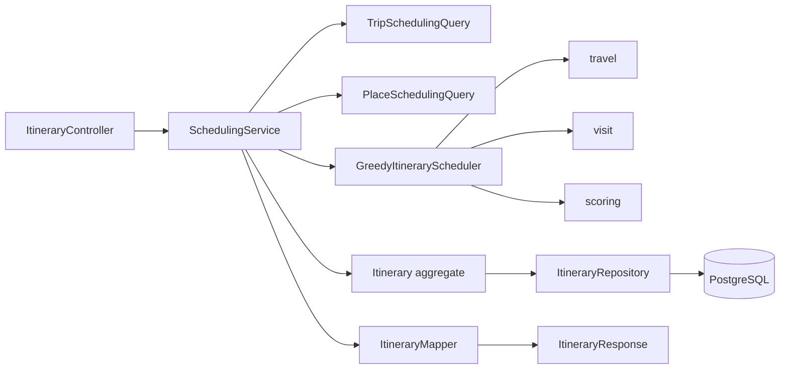

# CURRENT_IMPLEMENTATION — SaigonPlanTravel

> Working-tree snapshot refreshed on 2026-08-09 after the FEAT-005 backend
> milestone. Current source and Flyway migrations remain authoritative when this
> note becomes stale.

## 1. Git snapshot

- Branch: `experiment/feat-005-codex`.
- FEAT-005 production and test changes are currently uncommitted in this
  experimental worktree.
- Unrelated pre-existing documentation, skill, and frontend changes remain in the
  worktree and are not evidence of FEAT-005 behavior.

Always inspect `git status --short` before continuing work.

## 2. Implemented backend capabilities

### Place — FEAT-001–003

- Place list/search/filter/pagination and detail APIs.
- Category catalog and weekly opening-hour model.
- Purpose-specific scheduling projections loaded with a bounded set of repository
  queries through `PlaceSchedulingQuery`.
- Missing opening-hours rows are represented as `UNKNOWN`.
- Administrative-unit name/type may both be absent for demo places; the system does
  not infer missing administrative data from address or coordinates.

### Authentication

- Registration, login, current-user endpoint, JWT authentication, and stateless
  Spring Security.
- Trip and Itinerary ownership is derived from the authenticated `UserPrincipal`.

### Frontend CORS

- Spring Security accepts browser API calls only from the configured
  `app.security.cors.allowed-origin`.
- Local default is `http://localhost:3000`.
- Allowed methods: GET, POST, PUT, DELETE, OPTIONS.
- Allowed request headers: Authorization, Content-Type, Accept.
- `Location` is exposed for resource-creation responses.
- Credentialed cookies are disabled; current browser authentication uses
  Bearer JWT.
- `SecurityConfigCorsTest` covers accepted and rejected preflight origins.

### Trip — FEAT-004

- Authenticated create/get/full-replace endpoints.
- Ownership lookup by `(publicId, userId)`.
- Trip validation and preferred-category persistence.
- `TripSchedulingQuery` returns the immutable `TripSchedulingSnapshot` consumed by
  Scheduling.

### Scheduling — FEAT-005 backend milestone

The current backend implements the complete request-to-persistence baseline:

1. validated `SchedulingProperties` and immutable `SchedulingPolicy`;
2. Haversine straight-line distance and deterministic travel-time estimation;
3. pace-adjusted visit duration;
4. environment, budget, opening-hours, waiting, trip-window, and closing-time
   feasibility;
5. explainable weighted scoring and stable tie-breakers;
6. multi-iteration `GREEDY_V1` with state recomputation after every selection;
7. immutable itinerary, item, preference, and warning snapshots;
8. transactional generation orchestration;
9. authenticated POST generation and GET-by-public-UUID APIs;
10. `ProblemDetail` handling for malformed input, missing ownership-scoped resources,
    inconsistent scheduling snapshots, and zero-feasible results;
11. immutable version creation and Trip timestamp-based `stale` calculation.

Public endpoints:

```http
POST /api/v1/trips/{tripPublicId}/itineraries
GET  /api/v1/itineraries/{itineraryPublicId}
```

POST returns `201 Created` with `Location` when at least one place is schedulable.
Zero feasible places returns `422 NO_FEASIBLE_ITINERARY` before repository save.
GET returns the stored snapshot and computes `stale`; it does not regenerate.

## 3. FEAT-005 execution boundaries



Scheduling does not import Trip/Place entities or repositories. Cross-module reads
use the existing immutable contracts owned by those modules.

## 4. FEAT-005 persistence

| Migration | Actual schema change |
| --- | --- |
| V13 | `itineraries` and `itinerary_preferred_categories` |
| V14 | `itinerary_items` and `itinerary_warnings` |
| V15 | allows the administrative-unit name/type snapshot pair to be `(null, null)` |

JPA mapping:

- `Itinerary` is the aggregate root.
- Preferred category IDs use `@ElementCollection`.
- Items and warnings use ordered `@OneToMany` relationships with cascade and
  orphan removal.
- Trip, User, Place, and Category references remain scalar IDs/snapshots rather than
  cross-module JPA entity relationships.
- DTO mapping prevents JPA entities and internal Trip/Itinerary/User IDs from being
  serialized by the public API.

V15 is a forward migration resolving a source/schema conflict: Place source permits
unknown administrative units, while the original V14 item snapshot required values.
Applied migrations V1–V14 were not edited.

## 5. GREEDY_V1 behavior

For each iteration, the scheduler evaluates all remaining candidates from the current
time, location, and budget. Feasibility is checked before scoring. Feasible candidates
are scored from category preference, distance, cost, opening confidence, and time
efficiency. The best candidate is selected using stable tie-breakers, appended to the
timeline, removed from the pool, and the state is updated before the next evaluation.

The algorithm is deterministic for the same immutable snapshots and configuration,
apart from generated itinerary UUID and timestamp. Its worst-case complexity is
`O(n²)` with configuration limiting the pool to at most 100 candidates.

Haversine output is straight-line distance, not road-route distance. Travel duration
uses configured average speed plus fixed transfer time. Cost uses each place's
`minCost` snapshot. These are estimates and are exposed as such in warnings/response
assumptions.

## 6. Verification evidence

Commands executed from `backend/` for this milestone:

```bash
./mvnw test
./mvnw clean verify
./mvnw clean test
```

Latest generated Surefire reports after `./mvnw clean test`:

| Evidence | Result |
| --- | ---: |
| Test suites | 33 |
| Tests | 130 |
| Failures | 0 |
| Errors | 0 |
| Skipped | 0 |

`./mvnw clean verify` also completed successfully, including clean compilation,
Flyway V1–V15 on Testcontainers PostgreSQL, Hibernate schema validation, tests, JAR
creation, and Spring Boot repackaging.

Coverage includes pure scheduling rules, deterministic input permutation, service
orchestration, MockMvc API/security/error contracts, migration/database constraints,
aggregate persistence, immutable versions, stored GET behavior, stale detection, and
cross-user Itinerary lookup.

## 7. Evidence not yet available

Do not claim the following as completed measurements:

- live HTTP/JWT smoke flow against a manually running backend;
- warm generation runtime at 30–100 candidates;
- instrumented candidate query-count evidence at 30–100 candidates;
- failure-injected proof of aggregate transaction rollback;
- verified real-world accuracy of demo place costs, hours, addresses, or travel times.

The Place seed data remains demo/unverified. No latency, route accuracy, or global
optimality claim is supported by the current evidence.

## 8. Frontend and later features

The frontend implements Place discovery plus the FE-F01 browser authentication
baseline:

- `/register` calls the public registration endpoint and sends successful users to
  `/login`; registration does not invent an access token.
- `/login` stores only the returned JWT access token in `sessionStorage`.
- `AuthProvider` restores a tab session through `GET /api/v1/auth/me`, clears failed
  or expired sessions, and exposes current-user/loading/guest state to the header.
- Protected frontend features can use its `runAuthenticated` boundary to receive the
  current token and clear the browser session consistently on `401`.
- Browser auth calls use `NEXT_PUBLIC_BACKEND_API_BASE_URL`; existing server-rendered
  Place reads continue to use `BACKEND_API_BASE_URL`.
- The session design has no refresh-token behavior and logout is local token removal.

The FE-F02 Trip preference flow is also implemented:

- `/trips/new` loads categories through the public server-side category client and
  submits a complete authenticated `SaveTripRequest` through `POST /api/v1/trips`.
- `/trips/{publicId}` loads the ownership-scoped persisted Trip with a browser Bearer
  request, renders its stored preferences, and supports edit mode through full
  `PUT /api/v1/trips/{publicId}` replacement.
- Trip forms use backend category slugs, expose only useful HTML/category-count UX
  validation, and map `ProblemDetail.fieldErrors` plus unknown-category extensions.
- Protected Trip calls run through FE-F01 `runAuthenticated`; `401` clears the tab
  session and routes the user to login.
- The itinerary-generation CTA is present but disabled until FE-F03.

Trip list/delete/archive and itinerary timeline/generation UI are not implemented.

FEAT-006 routing, FEAT-007 RAG explanation, FEAT-008 weather context, and FEAT-009
re-planning remain unimplemented. FEAT-005 performs no route, weather, RAG, LLM, or
AI calls.

## 9. Recommended next milestone

Run and record the live FEAT-005 JWT smoke flow and measured runtime/query-count
evidence, then review the documentation checkpoint before beginning FEAT-006.
