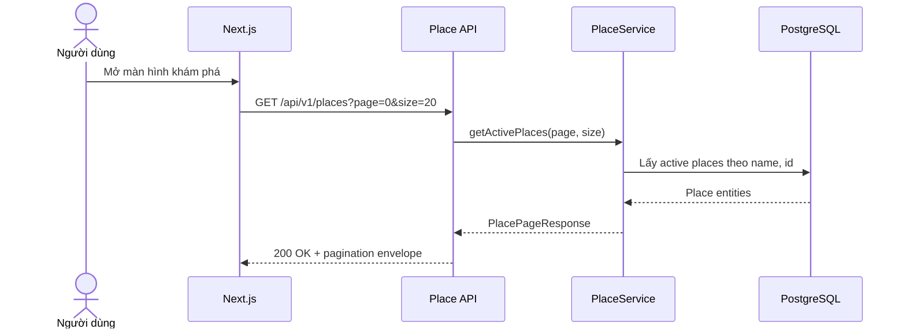

# FEAT-001 — Place Catalog API MVP

> [!note] Frontend consumer (cập nhật 2026-07-27)
> Route `/places` dùng đúng 12-field summary và 7-field pagination envelope để
> render place cards/markers. Khi chưa có mapping đơn vị hành chính, frontend
> hiển thị “Chưa xác định”.

> [!summary]
> Xây dựng vertical slice đầu tiên của SaigonPlanTravel để frontend lấy danh sách địa điểm đang hoạt động tại TP.HCM qua `GET /api/v1/places`. Feature bao gồm schema `places`, dữ liệu demo có gắn nhãn, Entity, Repository, Service, Mapper, DTO, Controller và tests tối thiểu. Đây là nền dữ liệu bắt buộc trước khi triển khai bản đồ, lọc địa điểm, lập lịch và RAG.

## 1. Trạng thái và phê duyệt

| Thuộc tính | Giá trị |
| --- | --- |
| Trạng thái | `done` |
| Độ ưu tiên | `P0 — nền tảng MVP` |
| Người phụ trách | Nguyễn Bá Tân |
| Backend | Spring Boot modular monolith |
| Module | `com.saigonplantravel.backend.place` |
| Database | PostgreSQL, Flyway migration-first |
| API chính | `GET /api/v1/places` |
| Mốc liên quan | MVP có thể demo trước 30/08/2026 |

### Điều kiện chuyển trạng thái

- `ready-for-review` → `approved`: phạm vi, schema và API contract được duyệt.
- `approved` → `in-progress`: bắt đầu thay đổi code/migration.
- `in-progress` → `done`: toàn bộ Definition of Done ở mục 16 đạt yêu cầu.

## 2. Bối cảnh và lý do ưu tiên

SaigonPlanTravel cần dữ liệu địa điểm làm đầu vào cho hầu hết chức năng phía sau:

- Hiển thị marker và card trên bản đồ.
- Tìm kiếm, lọc và gợi ý địa điểm.
- Tính thời lượng, chi phí và khoảng cách khi lập lịch.
- Xây dựng corpus và metadata cho RAG.
- Chọn địa điểm thay thế khi tái lập lịch.

Hạ tầng PostgreSQL, Flyway và Spring Boot đã hoạt động; `Place Module` đã được chọn làm vertical slice đầu tiên. Vì vậy, hoàn thành API danh sách địa điểm là bước tiếp theo có giá trị cao nhất và ít phụ thuộc nhất.

## 3. Mục tiêu

### 3.1. Mục tiêu sản phẩm

Cho phép frontend lấy một danh sách địa điểm công khai, đang hoạt động tại TP.HCM với đủ dữ liệu cơ bản để hiển thị card và marker trên bản đồ.

### 3.2. Mục tiêu kỹ thuật

- Xác lập mẫu triển khai chuẩn cho các module Spring Boot tiếp theo theo luồng:

```text
PostgreSQL → Entity → Repository → Service → Mapper → DTO → Controller → JSON
```

- Xác minh Flyway là nguồn sự thật của schema và Hibernate chỉ dùng `ddl-auto: validate`.
- Giữ ranh giới module theo package-by-feature.
- Không trả JPA Entity trực tiếp qua REST API.
- Tạo baseline tests cho repository, service, mapper và controller.

### 3.3. Kết quả mong đợi

Khi backend chạy, lời gọi `GET /api/v1/places?page=0&size=20` trả `200 OK`
cùng pagination envelope chứa địa điểm `active = true`, sắp xếp theo
`name ASC, id ASC`. Nếu chưa có dữ liệu phù hợp, `content` là mảng rỗng thay
vì lỗi.

## 4. Phạm vi

### 4.1. Trong phạm vi

- Migration tạo bảng `places`.
- Ràng buộc dữ liệu cơ bản ở database.
- Seed từ 5–10 bản ghi mô phỏng phục vụ phát triển/demo, có chú thích rõ là dữ liệu demo.
- JPA Entity `Place`.
- `PlaceRepository` dùng Spring Data JPA.
- `PlaceSummaryResponse` dạng Java `record`.
- `PlaceMapper` ánh xạ Entity sang DTO.
- `PlaceService` chỉ đọc địa điểm đang hoạt động.
- `PlaceController` cung cấp `GET /api/v1/places`.
- Kết quả sắp xếp ổn định theo `name ASC`, sau đó `id ASC` khi trùng tên.
- Tests và kiểm tra thủ công tối thiểu.
- Cập nhật tài liệu database, API, development log và `PROJECT_CONTEXT.md` sau khi hoàn tất.

### 4.2. Ngoài phạm vi

- `GET /api/v1/places/{id}` hoặc detail theo `slug`.
- Search, filter và sort do client truyền vào. Pagination cố định thuộc contract
  FEAT-001.
- `Category`, `place_categories` và `OpeningHour`.
- Admin CRUD, authentication hoặc authorization.
- Thu thập/cào dữ liệu thật và quy trình kiểm chứng nguồn.
- Upload ảnh, quản lý media hoặc CDN.
- PostGIS, truy vấn theo bán kính hoặc tính tuyến đường.
- Embedding, pgvector search và RAG.
- Tích hợp frontend, bản đồ hoặc bottom sheet.
- Caching và tối ưu hóa nâng cao.

> [!important]
> Các mục ngoài phạm vi không được thêm vào cùng pull request/iteration của feature này. Chúng phải có feature spec riêng.

## 5. Tác nhân và user stories

### Tác nhân chính

- **Khách du lịch:** xem danh sách địa điểm thông qua giao diện web trong feature frontend sau.
- **Next.js frontend:** client trực tiếp gọi REST API.
- **Developer:** seed và kiểm tra dữ liệu demo trong quá trình phát triển.

### User stories

**US-001 — Xem danh sách địa điểm**  
Là một khách du lịch, tôi muốn xem các địa điểm hiện có để bắt đầu khám phá và lựa chọn cho chuyến đi.

**US-002 — Hiển thị card và marker**  
Là frontend, tôi muốn nhận tên, mô tả ngắn, đơn vị hành chính nếu đã được xác
minh, tọa độ, thời lượng và chi phí ước tính để hiển thị card và marker mà
không phụ thuộc Entity nội bộ; địa chỉ đầy đủ dành cho Place Detail.

**US-003 — Ẩn địa điểm chưa sẵn sàng**  
Là người quản trị dữ liệu, tôi muốn bản ghi `active = false` không xuất hiện trong API công khai để có thể tạm ẩn dữ liệu chưa đủ chất lượng.

## 6. Luồng người dùng và luồng hệ thống

### 6.1. Luồng chính

1. Người dùng mở màn hình khám phá địa điểm.
2. Frontend gửi `GET /api/v1/places?page=0&size=20`.
3. Controller chuyển yêu cầu sang `PlaceService`.
4. Service yêu cầu repository lấy các bản ghi `active = true` theo thứ tự tên và ID.
5. Mapper chuyển từng `Place` thành `PlaceSummaryResponse`.
6. API trả `200 OK` cùng pagination envelope.
7. Frontend dùng dữ liệu để hiển thị danh sách; việc render UI không thuộc feature này.



### 6.2. Luồng thay thế — không có dữ liệu

1. Repository không tìm thấy bản ghi `active = true`.
2. Service trả page rỗng.
3. API trả `200 OK` với `content: []` và đầy đủ pagination metadata.
4. API không trả `404` vì collection hợp lệ nhưng đang rỗng.

### 6.3. Luồng lỗi hệ thống

1. Database không khả dụng hoặc truy vấn thất bại.
2. Ngoại lệ được xử lý bởi cơ chế global exception hiện có hoặc task nền tảng riêng.
3. API không để lộ stack trace, SQL hoặc thông tin kết nối.
4. Client nhận `500 Internal Server Error` theo error contract chung của dự án.

## 7. Yêu cầu chức năng

| ID | Yêu cầu | Độ ưu tiên |
| --- | --- | --- |
| FR-001 | Hệ thống phải có bảng `places` được tạo bằng Flyway migration. | Must |
| FR-002 | Hibernate phải validate thành công Entity `Place` với schema do Flyway tạo. | Must |
| FR-003 | Hệ thống phải lưu được các trường dữ liệu ở mục 9. | Must |
| FR-004 | `GET /api/v1/places` phải truy cập công khai, không yêu cầu đăng nhập trong MVP. | Must |
| FR-005 | API chỉ được trả các bản ghi có `active = true`. | Must |
| FR-006 | Kết quả phải sắp xếp theo `name ASC`, dùng `id ASC` làm tie-breaker. | Must |
| FR-007 | API phải trả DTO, không serialize trực tiếp JPA Entity. | Must |
| FR-008 | Khi không có địa điểm phù hợp, API phải trả `200 OK`, `content: []` và đầy đủ pagination envelope. | Must |
| FR-009 | Seed data phải được ghi rõ là dữ liệu demo/mô phỏng và không được trình bày như dữ liệu đã xác minh. | Must |
| FR-010 | Repository phải kế thừa `JpaRepository`; không tạo `RepositoryImpl` cho truy vấn này. | Must |
| FR-011 | Service đọc dữ liệu phải chạy trong transaction read-only. | Should |
| FR-012 | Controller phải mỏng, không chứa truy vấn hoặc business logic. | Must |
| FR-013 | `page` mặc định là `0`, `size` mặc định là `20`; `page >= 0` và `1 <= size <= 100`. | Must |
| FR-014 | Client không được điều khiển sorting trong FEAT-001. | Must |

## 8. Quy tắc nghiệp vụ

| ID | Quy tắc |
| --- | --- |
| BR-001 | Chỉ địa điểm thuộc phạm vi TP.HCM được đưa vào dữ liệu của dự án. |
| BR-002 | `slug` là duy nhất và dùng chữ thường, số, dấu gạch ngang. |
| BR-003 | `estimated_visit_minutes` phải lớn hơn `0`. |
| BR-004 | `min_cost` và `max_cost` không âm. |
| BR-005 | `max_cost` phải lớn hơn hoặc bằng `min_cost`. |
| BR-006 | `latitude` nằm trong `[-90, 90]`; `longitude` nằm trong `[-180, 180]`. |
| BR-007 | Bản ghi `active = false` không được xuất hiện trong public list API. |
| BR-008 | Dữ liệu giá, mô tả và địa chỉ trong seed của feature này chỉ dùng cho phát triển nếu chưa có nguồn kiểm chứng. |
| BR-009 | `administrative_unit_name` và `administrative_unit_type` phải cùng `NULL` hoặc cùng có giá trị. |
| BR-010 | `administrative_unit_type` chỉ nhận `WARD`, `COMMUNE` hoặc `SPECIAL_ZONE`; không đơn giản hóa toàn bộ thành ward. |
| BR-011 | Không suy diễn hoặc tự gán đơn vị hành chính từ địa chỉ, tọa độ hay dữ liệu cũ; place chưa xác minh phải giữ cả hai field là `NULL`. |

## 9. Đặc tả dữ liệu

### 9.1. Bảng `places`

| Cột | Kiểu đề xuất | Null | Ràng buộc/Ghi chú |
| --- | --- | --- | --- |
| `id` | `BIGSERIAL` | No | Primary key |
| `name` | `VARCHAR(150)` | No | Tên hiển thị |
| `slug` | `VARCHAR(180)` | No | Unique |
| `short_description` | `VARCHAR(500)` | Yes | Dùng cho card; vẫn serialize `null` |
| `full_description` | `TEXT` | Yes | Chưa trả trong summary API |
| `address` | `VARCHAR(255)` | No | Địa chỉ văn bản |
| `administrative_unit_name` | `VARCHAR(100)` | Yes | Tên đơn vị hành chính đã được xác minh; không được blank |
| `administrative_unit_type` | `VARCHAR(20)` | Yes | `WARD`, `COMMUNE` hoặc `SPECIAL_ZONE` |
| `latitude` | `NUMERIC(10,7)` | No | Check `-90..90` |
| `longitude` | `NUMERIC(10,7)` | No | Check `-180..180` |
| `estimated_visit_minutes` | `INTEGER` | No | Check `> 0` |
| `min_cost` | `NUMERIC(12,2)` | No | Check `>= 0` |
| `max_cost` | `NUMERIC(12,2)` | No | Check `>= min_cost` |
| `indoor` | `BOOLEAN` | No | Không suy diễn từ category |
| `active` | `BOOLEAN` | No | Default `true` |
| `created_at` | `TIMESTAMPTZ` | No | Default `CURRENT_TIMESTAMP` |
| `updated_at` | `TIMESTAMPTZ` | No | Khởi tạo bằng `CURRENT_TIMESTAMP` |

### 9.2. Index tối thiểu

- Unique index cho `slug` thông qua unique constraint.
- Index riêng cho `active` **chưa bắt buộc** ở quy mô 30–100 bản ghi; chỉ thêm khi query plan hoặc feature sau cần.

### 9.3. Quy tắc migration

- `V2__create_places_table.sql` là schema `places` canonical và chứa hai cột
  administrative-unit cùng các check constraint ở BR-009–BR-010.
- V3–V5 đã tồn tại như baseline bất biến cho các feature sau; FEAT-001 không
  triển khai Category hoặc OpeningHour dù các bảng đã có.
- `V6__seed_demo_places.sql` seed 5 place active và 1 place inactive; cả sáu
  place giữ `administrative_unit_name = NULL` và
  `administrative_unit_type = NULL` vì chưa có mapping được xác minh.
- Theo quyết định owner ngày 2026-07-27, refactor này sửa trực tiếp V2 và V6,
  không tạo V11. Database đã áp dụng checksum cũ phải được drop/recreate;
  không hỗ trợ upgrade tại chỗ từ schema location cũ.
- V3–V5 và V7–V10 không bị thay đổi bởi refactor này.

## 10. API contract

### 10.1. Endpoint

```http
GET /api/v1/places?page=0&size=20
Accept: application/json
```

### 10.2. Request

- Không có path parameter.
- Query parameter `page` mặc định `0`, phải lớn hơn hoặc bằng `0`.
- Query parameter `size` mặc định `20`, phải nằm trong `1..100`.
- Không có client-controlled sorting.
- Không có request body.
- Không yêu cầu authentication trong MVP.

### 10.3. Response thành công

```http
HTTP/1.1 200 OK
Content-Type: application/json
```

```json
{
  "content": [
    {
      "id": 1,
      "name": "Demo Art Space",
      "slug": "demo-art-space",
      "shortDescription": "Dữ liệu minh họa, chưa được xác minh",
      "administrativeUnitName": null,
      "administrativeUnitType": null,
      "latitude": 10.7750000,
      "longitude": 106.7000000,
      "estimatedVisitMinutes": 90,
      "minCost": 50000.00,
      "maxCost": 150000.00,
      "indoor": true
    }
  ],
  "page": 0,
  "size": 20,
  "totalElements": 5,
  "totalPages": 1,
  "first": true,
  "last": true
}
```

> [!note]
> Payload trên là ví dụ contract, không phải dữ liệu địa điểm đã được xác minh.

### 10.4. `PlaceSummaryResponse`

```java
public record PlaceSummaryResponse(
        Long id,
        String name,
        String slug,
        String shortDescription,
        String administrativeUnitName,
        AdministrativeUnitType administrativeUnitType,
        BigDecimal latitude,
        BigDecimal longitude,
        Integer estimatedVisitMinutes,
        BigDecimal minCost,
        BigDecimal maxCost,
        Boolean indoor
) {}
```

`PlaceSummaryResponse` có đúng 12 field. Hai administrative-unit field luôn có
trong JSON và có thể là `null`.

`PlacePageResponse` có đúng 7 field cấp cao: `content`, `page`, `size`,
`totalElements`, `totalPages`, `first`, `last`.

Không trả các trường sau trong summary response:

- `fullDescription`: dành cho detail API sau.
- `active`: trạng thái nội bộ; public API đã lọc `active = true`.
- `createdAt`, `updatedAt`: không cần cho UI khám phá.

### 10.5. Response rỗng

```http
HTTP/1.1 200 OK
Content-Type: application/json
```

```json
{
  "content": [],
  "page": 0,
  "size": 20,
  "totalElements": 0,
  "totalPages": 0,
  "first": true,
  "last": true
}
```

### 10.6. Response lỗi

Pagination sai kiểu hoặc ngoài giới hạn trả HTTP 400 theo Spring
`ProblemDetail`. Lỗi hệ thống ngoài dự kiến trả HTTP 500 `ProblemDetail` an
toàn, không lộ stack trace, SQL, credential hoặc thông tin kết nối.

## 11. Yêu cầu phi chức năng

| ID | Yêu cầu |
| --- | --- |
| NFR-001 | Với tối đa 100 bản ghi, endpoint phải thực hiện một truy vấn danh sách, không phát sinh N+1. |
| NFR-002 | Ở local development sau warm-up, thời gian phản hồi mục tiêu dưới 500 ms với dữ liệu MVP; ghi nhận môi trường khi đo. |
| NFR-003 | JSON contract phải ổn định; thay đổi field hoặc kiểu dữ liệu cần cập nhật feature/API spec trước. |
| NFR-004 | Không log secret, chuỗi kết nối hoặc toàn bộ stack trace vào response. |
| NFR-005 | Code tuân thủ constructor injection, controller mỏng, DTO dạng `record`, Entity không dùng Lombok `@Data`. |
| NFR-006 | `./mvnw test` phải chạy thành công trong cấu hình test đã được dự án chấp nhận. |

## 12. Tiêu chí chấp nhận

### AC-001 — Flyway tạo bảng thành công

**Given** PostgreSQL đang chạy và database chưa có migration tạo `places`  
**When** Spring Boot khởi động  
**Then** Flyway áp dụng migration đúng một lần, bảng `places` tồn tại và Hibernate `validate` không báo schema mismatch.

### AC-002 — Trả danh sách địa điểm đang hoạt động

**Given** database có ít nhất hai địa điểm `active = true`  
**When** client gọi `GET /api/v1/places?page=0&size=20`  
**Then** API trả `200 OK`, `Content-Type: application/json`, pagination envelope
7 field và hai DTO tương ứng trong `content`.

### AC-003 — Không trả địa điểm bị ẩn

**Given** database có một địa điểm `active = true` và một địa điểm `active = false`  
**When** client gọi endpoint  
**Then** response chỉ chứa địa điểm đang hoạt động.

### AC-004 — Thứ tự ổn định

**Given** database có nhiều địa điểm không theo thứ tự tên  
**When** client gọi endpoint nhiều lần mà dữ liệu không đổi  
**Then** kết quả luôn theo `name ASC`, sau đó `id ASC` nếu trùng tên.

### AC-005 — Collection rỗng

**Given** database không có địa điểm đang hoạt động  
**When** client gọi endpoint  
**Then** API trả `200 OK`, `content: []` và đầy đủ pagination envelope, không
trả `404` hoặc `null`.

### AC-006 — Bảo vệ ranh giới DTO

**Given** một `Place` có đầy đủ dữ liệu persistence  
**When** Entity được ánh xạ sang response  
**Then** response có đúng 12 field ở mục 10.4, bao gồm hai field
administrative-unit nullable, và không có `active`, `createdAt`, `updatedAt`
hoặc thuộc tính Hibernate.

### AC-007 — Database từ chối dữ liệu không hợp lệ

**Given** một câu lệnh insert vi phạm tọa độ, thời lượng hoặc chi phí  
**When** câu lệnh được thực thi  
**Then** PostgreSQL từ chối dữ liệu bằng constraint tương ứng.

### AC-008 — Seed được nhận diện là demo

**Given** migration seed được mở để review  
**When** reviewer kiểm tra comment và nội dung  
**Then** file ghi rõ dữ liệu chỉ phục vụ development/demo và không tuyên bố là dữ liệu đã xác minh.

### AC-009 — Kiến trúc module đúng quy ước

**Given** implementation hoàn tất  
**When** review cấu trúc code  
**Then** các class nằm dưới `com.saigonplantravel.backend.place`, repository kế thừa `JpaRepository`, controller không truy cập repository trực tiếp và API không trả Entity.

### AC-010 — Test và smoke test thành công

**Given** môi trường test đã được cấu hình  
**When** chạy automated tests và gọi endpoint thủ công  
**Then** tất cả test pass, response khớp contract và log không có lỗi Flyway/Hibernate.

### AC-011 — Pagination hợp lệ và trang vượt giới hạn

**Given** có 5 active places  
**When** client gọi defaults hoặc một page vượt trang cuối  
**Then** defaults là `page=0,size=20`; page vượt giới hạn trả HTTP 200 với
`content: []` và pagination metadata đúng.

### AC-012 — Pagination không hợp lệ

**Given** `page < 0`, `size < 1`, `size > 100` hoặc tham số sai kiểu  
**When** client gọi endpoint  
**Then** API trả HTTP 400 Spring `ProblemDetail` an toàn.

## 13. Ma trận truy vết yêu cầu

| Yêu cầu | Tiêu chí chấp nhận | Bằng chứng dự kiến |
| --- | --- | --- |
| FR-001, FR-002, FR-003 | AC-001, AC-007 | Migration log, schema inspection, integration test |
| FR-004, FR-005, FR-006 | AC-002, AC-003, AC-004 | Controller/repository tests, curl response |
| FR-007, FR-012 | AC-006, AC-009 | Mapper test, MockMvc test, code review |
| FR-008 | AC-005 | Service/controller test |
| FR-009 | AC-008 | Migration review |
| FR-010, FR-011 | AC-009 | Code review, service test |
| FR-013, FR-014 | AC-011, AC-012 | MockMvc test, runtime curl smoke test |

## 14. Kế hoạch triển khai file-by-file

> [!warning]
> Chỉ bắt đầu các task code sau khi spec chuyển sang `approved`. Trước mỗi migration, kiểm tra version hiện có thay vì tin tuyệt đối vào số version trong tài liệu.

### Phase A — Chốt contract

- [x] Duyệt phạm vi: list active places có pagination; không filter,
  client-controlled sorting hoặc detail.
- [x] Duyệt 12 field của `PlaceSummaryResponse` và envelope 7 field.
- [x] Kiểm tra migration hiện có; V2 là canonical places schema và V6 là seed.
- [x] Contract đã được phê duyệt và triển khai.

### Phase B — Database và persistence

- [x] V2 tạo canonical `places` schema, administrative-unit pair và constraints.
- [x] Hibernate validate thành công với Entity `Place`.
- [x] Entity dùng Lombok có kiểm soát; tiền/tọa độ là `BigDecimal`, timestamp là
  `OffsetDateTime`.
- [x] V6 seed 5 active và 1 inactive demo place; cả sáu chưa có mapping nên
  hai administrative-unit field đều `NULL`.

### Phase C — Repository, DTO và mapper

- [x] Tạo repository, DTO record, page envelope và mapper thủ công dưới Place Module.
- [x] Query chỉ lấy active place; service áp fixed sort `name ASC, id ASC`.
- [x] Không tạo `RepositoryImpl` hoặc thêm MapStruct.

### Phase D — Service và REST API

- [x] Service read-only gọi repository/mapper; controller áp pagination
  validation và expose chính xác `GET /api/v1/places`.
- [x] Controller dùng constructor injection và không truy cập repository trực tiếp.

### Phase E — Automated tests

- [x] Mapper, service và MockMvc controller tests đã có.
- [x] PostgreSQL/pgvector Testcontainers test xác minh migrations, seed,
  constraints, active filter và ordering.
- [x] Full backend suite pass 39 tests sau administrative-unit refactor ngày
  2026-07-27.

### Phase F — Smoke test và review

- [x] Normal runtime chạy với PostgreSQL Docker trên port 8080.
- [x] Flyway V1–V10 và Hibernate validate không lỗi trên database sạch.
- [x] Curl smoke test pass cho default, out-of-range và invalid pagination.
- [x] Active filter được xác minh bằng 5 active/1 inactive fixture.

### Phase G — Cập nhật tài liệu

- [x] Cập nhật database/API notes, development log và `PROJECT_CONTEXT.md`.
- [x] Chuyển spec thành `done` ngày 2026-07-20.

## 15. Chiến lược kiểm thử

### 15.1. Unit tests

- Mapper tạo DTO đúng.
- Service gọi repository đúng một lần và trả kết quả đã map.
- Empty repository result trở thành empty list.

### 15.2. Web slice tests

- Route và HTTP method đúng.
- JSON field names dùng camelCase.
- Không xuất hiện field persistence nội bộ.
- Array rỗng vẫn trả `200`.

### 15.3. Persistence/integration tests

- Flyway migration chạy được trên PostgreSQL.
- Repository lọc `active` và ordering đúng.
- Unique/check constraints hoạt động.
- Hibernate `validate` khớp schema.

### 15.4. Kiểm tra thủ công

```bash
curl -i http://localhost:8080/api/v1/places
```

Kết quả cần lưu trong development log:

- HTTP status.
- Số bản ghi trả về.
- Một JSON sample đã loại bỏ dữ liệu không cần thiết.
- Log Flyway version.
- Kết quả `./mvnw test`.

## 16. Definition of Done

Feature được đánh dấu `done` ngày 2026-07-20 với bằng chứng:

- [x] Spec đã được duyệt và implementation không vượt phạm vi.
- [x] Flyway V1–V10 chạy thành công trên PostgreSQL Testcontainers sau khi
  refactor V2/V6 và Hibernate validation thành công.
- [x] Chạy migrate lại không seed trùng; V6 chỉ có một history row thành công.
- [x] Hibernate `ddl-auto: validate` thành công.
- [x] Endpoint đúng contract và chỉ trả 5 active places.
- [x] Empty/out-of-range page trả `200` với `content: []` và đủ envelope.
- [x] Không trả Entity trực tiếp.
- [x] `./mvnw test` pass 39 tests, 0 failure/error/skip ngày 2026-07-27.
- [x] Runtime smoke test pass cho success, out-of-range và invalid pagination.
- [x] Diff được audit; chỉ V2 và V6 được sửa có chủ đích theo quyết định
  drop/recreate database, không tạo V11 cho refactor này.
- [x] Database note, API note, development log và `PROJECT_CONTEXT.md` được cập nhật.
- [x] Seed data được ghi rõ là demo/mô phỏng.

## 17. Rủi ro và biện pháp giảm thiểu

| Rủi ro | Tác động | Giảm thiểu |
| --- | --- | --- |
| Entity không khớp Flyway schema | Backend không khởi động với `validate` | Thiết kế migration trước, map rõ từng cột, chạy startup test sớm |
| Database còn checksum V2/V6 cũ | Flyway từ chối khởi động | Drop/recreate database theo quyết định owner; không chạy refactor này trên database cần giữ dữ liệu |
| Tự suy diễn đơn vị hành chính | Hiển thị dữ liệu sai như đã xác minh | Giữ cặp field `NULL` cho đến khi được mapping thủ công |
| Seed bị hiểu là dữ liệu thật | Sai nội dung demo/báo cáo | Comment rõ `DEMO DATA`; không dùng làm nguồn RAG chính thức |
| API vô tình trả Entity | Rò field nội bộ, contract khó ổn định | DTO `record` + mapper + controller test |
| Mở rộng sang filter/category quá sớm | Trễ vertical slice đầu tiên | Giữ mục 4.2; tạo spec riêng sau khi feature này done |
| Dùng kiểu số không phù hợp | Sai tọa độ/chi phí | `BigDecimal` cho coordinate và money; kiểm thử serialization |
| Test dựa vào H2 khác PostgreSQL | Constraint/migration sai khi chạy thật | Ưu tiên PostgreSQL test profile hoặc test environment đã phê duyệt |

## 18. Quyết định đã chốt trong spec

| ID | Quyết định | Lý do |
| --- | --- | --- |
| DEC-001 | Public API chỉ trả `active = true`. | Tách trạng thái nội bộ khỏi trải nghiệm người dùng. |
| DEC-002 | Response dùng pagination envelope 7 field, `page=0`, `size=20`, tối đa `size=100`. | Contract ổn định cho frontend và quy mô dữ liệu có thể tăng. |
| DEC-003 | Mapper thủ công, chưa thêm MapStruct. | Feature nhỏ, tránh thêm dependency chưa cần thiết. |
| DEC-004 | `fullDescription` không nằm trong summary DTO. | Giữ payload gọn; detail API sẽ xử lý sau. |
| DEC-005 | Seed demo là migration version kế tiếp sau migration tạo bảng. | Có dữ liệu lặp lại được giữa các môi trường dev. |
| DEC-006 | Không tạo index riêng cho `active` trong MVP. | Quy mô nhỏ; tránh tối ưu sớm khi chưa có bằng chứng. |
| DEC-007 | Thay field location cũ bằng `administrativeUnitName` và `administrativeUnitType`. | Domain không còn phụ thuộc đơn vị hành chính cấp quận. |
| DEC-008 | Hai field administrative-unit nullable theo cặp; type gồm `WARD`, `COMMUNE`, `SPECIAL_ZONE`. | Biểu diễn đúng dữ liệu chưa biết và không ép mọi đơn vị thành ward. |
| DEC-009 | Refactor trực tiếp V2/V6, không tạo V11. | Owner chấp nhận drop/recreate database và không cần upgrade tại chỗ. |

## 19. Feature kế tiếp sau khi hoàn thành

Sau `FEAT-001`, ưu tiên gần nhất nên là một feature spec riêng cho:

1. `Place Detail + Category + OpeningHour`, nếu mục tiêu là hoàn thiện dữ liệu nghiệp vụ; hoặc
2. `Place Search/Filter/Pagination`, nếu frontend cần màn hình khám phá trước.

Không bắt đầu RAG hoặc interactive map trước khi Place API và dữ liệu tĩnh có contract ổn định.

## 20. Liên kết báo cáo khóa luận

Nội dung của feature này có thể tái sử dụng trong báo cáo:

- **Chương 3 — Phân tích và thiết kế hệ thống:** Place Module, schema `places`, API contract, luồng dữ liệu Entity–DTO.
- **Chương 3 — Cài đặt:** Flyway migration-first, Spring Data JPA, service/controller layering.
- **Chương 4 — Thực nghiệm:** thời gian phản hồi với 30–100 bản ghi, kết quả kiểm thử và tính đúng của constraints.

Development log nên liên kết ngược về note này để truy vết quyết định → implementation → test → nội dung báo cáo.

## 21. Lịch sử thay đổi

| Ngày | Phiên bản | Thay đổi |
| --- | --- | --- |
| 2026-07-17 | 0.1 | Tạo đặc tả hoàn chỉnh cho Place Catalog API MVP dựa trên `PROJECT_CONTEXT.md`. |
| 2026-07-20 | 1.0 | Đồng bộ spec với implementation thực tế, ghi nhận 15 tests và runtime smoke test thành công; chuyển FEAT-001 sang `done`. |
| 2026-07-27 | 1.1 | Đồng bộ schema/API/frontend/tests sau refactor location thành cặp administrative-unit nullable; ghi nhận V2/V6 được sửa có chủ đích và full suite 39 tests pass. |
