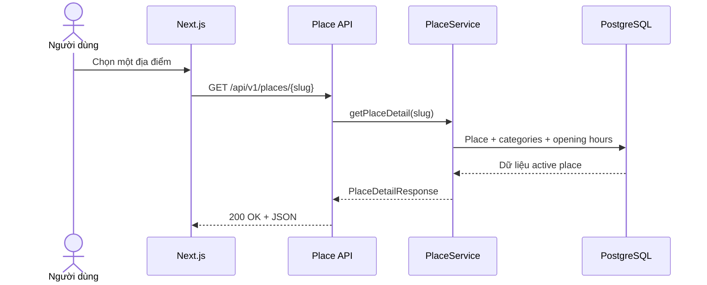

# FEAT-002 — Place Detail, Category & Opening Hours MVP

> [!note] Frontend consumer (cập nhật 2026-07-27)
> Route `/places/[slug]` hiển thị detail scalar fields, categories và opening
> hours. Missing day hiển thị “chưa có dữ liệu”; closed day giữ đúng semantics.
> Administrative unit chưa được mapping hiển thị “Chưa xác định”.

> [!summary]
> Mở rộng `Place Module` sau FEAT-001 để frontend đọc chi tiết một địa điểm theo `slug`, lấy danh mục công khai và hiển thị lịch mở cửa hằng tuần. Feature bổ sung schema `categories`, `place_categories`, `opening_hours`, dữ liệu demo có gắn nhãn, JPA mapping, DTO, service, REST API và tests. Đây là dữ liệu nền cho màn hình chi tiết, lựa chọn theo sở thích và Trip preferences.

## 1. Trạng thái, quyết định ưu tiên và phê duyệt

| Thuộc tính | Giá trị |
| --- | --- |
| Trạng thái | `done` |
| Độ ưu tiên | `P0 — nền dữ liệu khám phá địa điểm` |
| Người phụ trách | Nguyễn Bá Tân |
| Feature phụ thuộc | `FEAT-001 — Place Catalog API MVP` |
| Backend | Spring Boot modular monolith |
| Module sở hữu | `com.saigonplantravel.backend.place` |
| Database | PostgreSQL, Flyway migration-first |
| API mới | `GET /api/v1/places/{slug}`, `GET /api/v1/categories` |
| Mốc liên quan | MVP có thể demo trước 30/08/2026 |
| Implementation plan | Hoàn tất và xác minh ngày 2026-07-20 với Flyway V7–V8, 28 automated tests và runtime smoke test |

### 1.1. Vì sao đây là feature ưu tiên tiếp theo

FEAT-002 được chọn thay cho Search/Filter/Pagination vì:

- `Category` biểu diễn sở thích và là metadata đầu vào cho recommendation.
- `OpeningHour` giúp người dùng tự đánh giá thời điểm ghé thăm phù hợp.
- Detail API cung cấp nội dung cho bottom sheet/màn hình chi tiết trong prototype mobile-first.
- Search/filter có thể xây trên các bảng và contract ổn định của feature này trong FEAT-003.

### 1.2. Cổng phê duyệt

- FEAT-001 đã đạt `done` ngày 2026-07-20 với V1–V6, 15 automated tests và
  runtime smoke test thành công.
- `ready-for-review` → `approved`: duyệt phạm vi, schema, quy tắc giờ mở cửa và API contract.
- `approved` → `in-progress`: bắt đầu tạo migration mới và code.
- `in-progress` → `done`: toàn bộ Definition of Done ở mục 18 đạt yêu cầu.
- Mọi thay đổi contract sau `approved` phải được cập nhật vào spec trước khi sửa code.

## 2. Bối cảnh và vấn đề cần giải quyết

API danh sách của FEAT-001 chỉ cung cấp dữ liệu tóm tắt cho card và marker. Frontend chưa có contract để:

- Mở một địa điểm bằng URL ổn định, dễ đọc.
- Hiển thị mô tả đầy đủ.
- Hiển thị địa điểm thuộc những danh mục nào.
- Trình bày lịch mở cửa từng ngày.
- Phân biệt “đóng cửa” với “chưa biết giờ mở cửa”.
- Cung cấp category catalog cho UI và feature lọc tiếp theo.

Feature này chuẩn hóa dữ liệu giờ mở cửa để frontend phân biệt rõ ngày đóng cửa và ngày chưa có dữ liệu.

## 3. Mục tiêu

### 3.1. Mục tiêu sản phẩm

1. Cho phép người dùng mở chi tiết một địa điểm đang hoạt động bằng `slug`.
2. Cho phép UI hiển thị danh mục và lịch mở cửa hằng tuần của địa điểm.
3. Cho phép frontend lấy category catalog để chuẩn bị cho filter/preferences.
4. Không trình bày dữ liệu demo như dữ liệu thực đã được xác minh.

### 3.2. Mục tiêu kỹ thuật

- Mở rộng vertical slice `place` mà không tạo module/microservice mới.
- Duy trì Flyway là nguồn sự thật của schema và Hibernate dùng `ddl-auto=validate`.
- Giữ nguyên contract `GET /api/v1/places` của FEAT-001.
- Không serialize JPA Entity hoặc collection lazy trực tiếp qua REST.
- Chuẩn hóa semantics giờ mở cửa cho API và giao diện công khai.
- Bảo đảm detail endpoint dùng số truy vấn hữu hạn, không N+1.

### 3.3. Chỉ số hoàn thành

- Hai API mới đáp ứng toàn bộ acceptance criteria.
- Migration chạy được trên PostgreSQL sạch và trên database đã có FEAT-001.
- Hibernate validation và toàn bộ automated tests thành công.
- Response 404 không làm lộ trạng thái nội bộ của địa điểm.
- Dữ liệu giờ mở cửa được sắp xếp theo ISO day-of-week `1..7`.

## 4. Phạm vi

### 4.1. Trong phạm vi

- Bảng `categories`.
- Bảng nối `place_categories`.
- Bảng `opening_hours` cho lịch hằng tuần.
- Seed category, quan hệ place–category và giờ mở cửa dạng demo/mô phỏng.
- Entity `Category`, `OpeningHour` và quan hệ lazy với `Place`.
- DTO `CategoryResponse`, `OpeningHourResponse`, `PlaceDetailResponse`.
- Mapper cho response mới.
- `GET /api/v1/places/{slug}`.
- `GET /api/v1/categories`.
- 404 thống nhất cho slug không tồn tại hoặc place không active.
- Tests cho migration, repository, service, mapper và controller.
- Cập nhật database note, API note, development log và `PROJECT_CONTEXT.md`.

### 4.2. Ngoài phạm vi

- Search, filter, client-defined sorting và pagination.
- Thay đổi các contract ngoài administrative-unit refactor đã duyệt.
- Admin CRUD cho place/category/opening hours.
- Authentication và authorization.
- Giờ đặc biệt theo ngày cụ thể, lễ/Tết hoặc đóng cửa đột xuất.
- Nhiều khoảng mở cửa trong cùng một ngày hoặc nghỉ trưa.
- Khung giờ qua nửa đêm.
- Tính động `isOpenNow`.
- Dịch timezone; MVP chỉ lưu giờ địa phương TP.HCM.
- Thu thập/cào dữ liệu thật hoặc tự động đồng bộ nguồn ngoài.
- Ảnh/media/CDN.
- PostGIS, routing, tính khoảng cách hoặc bản đồ frontend.
- Generated recommendation, embedding và vector search.
- Frontend integration; feature này chỉ chốt backend contract.

> [!important]
> Không thêm search/filter chỉ vì đã có `categories`. Không thêm “mở cửa hiện tại” chỉ vì đã có `opening_hours`. Hai khả năng này cần feature spec riêng vì có thêm contract và edge case.

## 5. Tác nhân và user stories

### Tác nhân

- **Khách du lịch:** xem thông tin chi tiết trước khi chọn địa điểm.
- **Next.js frontend:** gọi public REST API và render dữ liệu.
- **Developer/data maintainer:** chuẩn bị dữ liệu demo có cấu trúc và kiểm tra constraint.

### User stories

**US-001 — Xem chi tiết địa điểm**  
Là một khách du lịch, tôi muốn mở địa điểm theo đường dẫn ổn định để xem mô tả, địa chỉ, chi phí, thời lượng, danh mục và giờ mở cửa trước khi quyết định ghé thăm.

**US-002 — Xem danh mục địa điểm**  
Là một khách du lịch, tôi muốn biết địa điểm thuộc nhóm văn hóa, ẩm thực, ngoài trời hoặc nhóm phù hợp khác để đánh giá nhanh mức độ phù hợp.

**US-003 — Xem lịch mở cửa**  
Là một khách du lịch, tôi muốn xem địa điểm mở hay đóng vào từng ngày để tránh chọn một thời điểm không khả thi.

**US-004 — Dùng category catalog**  
Là frontend, tôi muốn lấy danh sách category có thứ tự ổn định để hiển thị nhãn/chip và chuẩn bị cho chức năng lọc tiếp theo.

**US-005 — Ẩn dữ liệu chưa công khai**  
Là người quản trị dữ liệu, tôi muốn detail API không tiết lộ một place `active = false`, kể cả khi client biết slug.

## 6. Luồng người dùng và luồng hệ thống

### 6.1. Luồng chính — mở chi tiết địa điểm

1. Người dùng chọn một card/marker địa điểm.
2. Frontend điều hướng bằng `slug` và gọi `GET /api/v1/places/{slug}`.
3. Controller chuyển yêu cầu sang `PlaceService`.
4. Service tìm place có `slug` tương ứng và `active = true`.
5. Trong cùng read-only transaction, service lấy categories và opening hours lazy của đúng một place.
6. Mapper sắp xếp categories theo `name ASC, id ASC`; giờ mở cửa theo `dayOfWeek ASC`.
7. API trả `200 OK` cùng `PlaceDetailResponse`.
8. Frontend hiển thị nội dung; việc render không thuộc feature này.



### 6.2. Luồng thay thế — slug không hợp lệ hoặc không công khai

1. Slug không khớp bản ghi nào, hoặc chỉ khớp place `active = false`.
2. Service phát sinh `PlaceNotFoundException`.
3. Error handler trả cùng một `404 Not Found` với code `PLACE_NOT_FOUND`.
4. Response không cho biết place bị ẩn có tồn tại hay không.

### 6.3. Luồng category catalog

1. Frontend gọi `GET /api/v1/categories`.
2. Service/repository lấy toàn bộ category theo `name ASC, id ASC`.
3. API trả `200 OK` và JSON array.
4. Nếu chưa có category, API trả `200 OK` với `[]`.

### 6.4. Cách hiểu lịch mở cửa

- Có row với `closed = true`: địa điểm được xác định là đóng cả ngày.
- Có row với `closed = false`: địa điểm mở trong đúng một khoảng `openTime`–`closeTime`.
- Không có row cho một ngày: dữ liệu chưa biết/chưa được xác minh, **không được** suy diễn là đóng cửa.

## 7. Yêu cầu chức năng

| ID | Yêu cầu | Ưu tiên |
| --- | --- | --- |
| FR-001 | FEAT-002 phải giữ nguyên schema V3–V5 và chỉ bổ sung constraint/seed bằng forward migration version mới. | Must |
| FR-002 | Hibernate phải validate thành công các Entity với schema do Flyway tạo. | Must |
| FR-003 | Hệ thống phải hỗ trợ quan hệ nhiều-nhiều giữa place và category qua `place_categories`. | Must |
| FR-004 | Hệ thống phải lưu tối đa một khoảng giờ mở cửa cho mỗi place trong mỗi ngày ISO. | Must |
| FR-005 | `GET /api/v1/places/{slug}` phải công khai trong MVP. | Must |
| FR-006 | Detail API chỉ trả place có `active = true`. | Must |
| FR-007 | Slug không tồn tại và slug của place inactive phải trả cùng `404 PLACE_NOT_FOUND`. | Must |
| FR-008 | Detail API phải trả DTO, không serialize Entity trực tiếp. | Must |
| FR-009 | Categories trong detail response phải theo `name ASC`, sau đó `id ASC`. | Must |
| FR-010 | Opening hours phải theo `dayOfWeek ASC`. | Must |
| FR-011 | Ngày thiếu dữ liệu phải được biểu diễn bằng việc không có phần tử, không tự thêm `closed=true`. | Must |
| FR-012 | `GET /api/v1/categories` phải công khai và trả category theo `name ASC, id ASC`. | Must |
| FR-013 | Category catalog rỗng phải trả `200 OK` và `[]`. | Must |
| FR-014 | Contract và behavior của `GET /api/v1/places` phải giữ nguyên ngoài việc thay field location cũ bằng cặp administrative-unit đã duyệt. | Must |
| FR-015 | Seed phải ghi rõ là demo/mô phỏng, kèm comment không phải dữ liệu đã xác minh. | Must |
| FR-016 | Read service phải chạy trong `@Transactional(readOnly = true)`. | Should |
| FR-017 | Controller không được truy cập repository hoặc chứa business logic. | Must |
| FR-018 | Detail loading phải dùng số truy vấn hữu hạn cho một aggregate, không truy vấn theo từng category/hour item. | Must |
| FR-019 | API phải dùng error envelope chung nếu dự án đã có; không tạo contract cạnh tranh. | Must |
| FR-020 | `slug` rỗng/không đúng route không được gây `500`. | Must |

## 8. Quy tắc nghiệp vụ

| ID | Quy tắc |
| --- | --- |
| BR-001 | `categories.slug` là duy nhất, dùng chữ thường, số và dấu gạch ngang. |
| BR-002 | Một cặp `(place_id, category_id)` chỉ xuất hiện một lần. |
| BR-003 | `day_of_week` dùng ISO-8601: `1 = Monday` đến `7 = Sunday`. |
| BR-004 | Một place có tối đa một row `opening_hours` cho mỗi `day_of_week`. |
| BR-005 | Nếu `closed = true`, `open_time` và `close_time` đều phải `NULL`. |
| BR-006 | Nếu `closed = false`, `open_time` và `close_time` đều bắt buộc. |
| BR-007 | Với ngày mở cửa, `open_time < close_time`; feature này không hỗ trợ qua nửa đêm. |
| BR-008 | Thiếu row của một ngày có nghĩa là `unknown`, không phải `closed`. |
| BR-009 | Giờ lưu trong database là giờ địa phương TP.HCM; không chuyển đổi timezone ở feature này. |
| BR-010 | Place inactive không xuất hiện trong list hoặc detail public API. |
| BR-011 | Xóa quan hệ place/category không được xóa bản ghi category dùng chung. |
| BR-012 | Giờ mở cửa, giá và mô tả demo phải được gắn nhãn rõ trước khi dùng trong demo chính thức/RAG/báo cáo. |
| BR-013 | Category slug phải khớp `^[a-z0-9]+(?:-[a-z0-9]+)*$`; PostgreSQL phải enforce bằng forward migration. |
| BR-014 | Place slug được lookup chính xác và phân biệt hoa–thường; API không trim, lowercase hoặc redirect. |
| BR-015 | Category catalog trả toàn bộ category trong bảng, kể cả category chưa gắn với active place. |
| BR-016 | Detail response luôn có `administrativeUnitName` và `administrativeUnitType`; hai field cùng `null` khi chưa được mapping. |
| BR-017 | `administrativeUnitType` chỉ nhận `WARD`, `COMMUNE`, `SPECIAL_ZONE`; không suy diễn mapping từ địa chỉ hoặc tọa độ. |

## 9. Đặc tả dữ liệu

### 9.1. Bảng `categories`

| Cột | Kiểu đề xuất | Null | Ràng buộc/Ghi chú |
| --- | --- | --- | --- |
| `id` | `BIGSERIAL` | No | Primary key |
| `name` | `VARCHAR(100)` | No | Tên hiển thị |
| `slug` | `VARCHAR(120)` | No | Unique |
| `description` | `TEXT` | Yes | Có trong schema V3, chưa trả qua API MVP |
| `created_at` | `TIMESTAMPTZ` | No | Default `CURRENT_TIMESTAMP` |
| `updated_at` | `TIMESTAMPTZ` | No | Default `CURRENT_TIMESTAMP` |

Không thêm `active`, icon hoặc trả `description` qua API trong MVP. Category
catalog trả toàn bộ rows và không lọc theo quan hệ với active place.

### 9.2. Bảng `place_categories`

| Cột | Kiểu đề xuất | Null | Ràng buộc/Ghi chú |
| --- | --- | --- | --- |
| `place_id` | `BIGINT` | No | FK → `places(id)` |
| `category_id` | `BIGINT` | No | FK → `categories(id)` |

- Composite primary key: `(place_id, category_id)`.
- `ON DELETE CASCADE` được phép ở quan hệ join khi xóa place/category; không có API xóa trong feature này.
- Không tạo surrogate `id` vì quan hệ chưa có metadata riêng.

### 9.3. Bảng `opening_hours`

| Cột | Kiểu đề xuất | Null | Ràng buộc/Ghi chú |
| --- | --- | --- | --- |
| `id` | `BIGINT GENERATED BY DEFAULT AS IDENTITY` | No | Primary key |
| `place_id` | `BIGINT` | No | FK → `places(id)`, `ON DELETE CASCADE` |
| `day_of_week` | `SMALLINT` | No | Check `BETWEEN 1 AND 7` |
| `open_time` | `TIME` | Yes | Bắt buộc khi mở |
| `close_time` | `TIME` | Yes | Bắt buộc khi mở |
| `closed` | `BOOLEAN` | No | Default `false` |

Constraints tối thiểu:

- Unique `(place_id, day_of_week)`.
- Check trạng thái đóng/mở theo BR-005 và BR-006.
- Check `open_time < close_time` khi `closed = false`.

### 9.4. JPA mapping

- `Place.categories`: `@ManyToMany(fetch = LAZY)` qua `place_categories`.
- `Place.openingHours`: `@OneToMany(mappedBy = "place", fetch = LAZY)`.
- `OpeningHour.place`: `@ManyToOne(fetch = LAZY)`.
- Không dùng `CascadeType.REMOVE` từ `Place` sang `Category`.
- Mapping collection sang DTO phải diễn ra bên trong read-only transaction của service.
- Mapper tạo `List` đã sắp xếp; không dựa vào thứ tự của `Set`/Hibernate collection.
- Entity không dùng Lombok `@Data` hoặc serialize JSON trực tiếp.

### 9.5. Migration đã có và migration FEAT-002

Canonical migration baseline hiện gồm:

```text
V1__enable_pgvector.sql
V2__create_places_table.sql
V3__create_categories_table.sql
V4__create_place_categories_table.sql
V5__create_opening_hours_table.sql
V6__seed_demo_places.sql
V7__strengthen_category_and_opening_hour_constraints.sql
V8__seed_demo_place_metadata.sql
V9__enable_unaccent_and_place_search_index.sql
V10__create_users_table.sql
```

FEAT-002 không tạo lại ba bảng từ V3–V5. Trong phạm vi triển khai ban đầu, sau
khi kiểm tra filesystem và `flyway_schema_history`, feature đã thêm và áp dụng:

```text
V7__strengthen_category_and_opening_hour_constraints.sql
V8__seed_demo_place_metadata.sql
```

V7 bổ sung category-slug format và trạng thái giờ đóng/mở đầy đủ. V8 seed 5
category, 8 quan hệ place–category và 33 opening-hour rows có nhãn demo.
Administrative-unit refactor ngày 2026-07-27 sửa trực tiếp V2 và V6 theo quyết
định owner; V3–V5, V7–V10 giữ nguyên. Database có checksum V2/V6 cũ phải được
drop/recreate, không upgrade tại chỗ. PostgreSQL Testcontainers xác nhận clean
migration V1–V10 và Hibernate validation thành công.

## 10. API contract

### 10.1. Lấy chi tiết địa điểm

```http
GET /api/v1/places/{slug}
Accept: application/json
```

#### Path parameter

| Tên | Kiểu | Bắt buộc | Ví dụ |
| --- | --- | --- | --- |
| `slug` | string | Có | `dia-diem-demo-a` |

Lookup là exact và case-sensitive. API không trim, lowercase hoặc redirect.
Slug không khớp, sai format hoặc thuộc inactive place đều dùng cùng contract
not-found.

#### Response thành công

```http
HTTP/1.1 200 OK
Content-Type: application/json
```

```json
{
  "id": 1,
  "name": "Địa điểm demo A",
  "slug": "dia-diem-demo-a",
  "shortDescription": "Dữ liệu mô phỏng phục vụ phát triển.",
  "fullDescription": "Mô tả demo, chưa phải nội dung đã xác minh.",
  "address": "Địa chỉ demo, TP.HCM",
  "administrativeUnitName": null,
  "administrativeUnitType": null,
  "latitude": 10.776889,
  "longitude": 106.700806,
  "estimatedVisitMinutes": 90,
  "minCost": 0.00,
  "maxCost": 100000.00,
  "indoor": false,
  "categories": [
    {
      "id": 1,
      "name": "Văn hóa",
      "slug": "van-hoa"
    }
  ],
  "openingHours": [
    {
      "dayOfWeek": 1,
      "closed": false,
      "openTime": "08:00",
      "closeTime": "17:00"
    },
    {
      "dayOfWeek": 2,
      "closed": true,
      "openTime": null,
      "closeTime": null
    }
  ]
}
```

> [!note]
> Ví dụ trên mô tả contract. Tên, địa chỉ, chi phí và giờ mở cửa đều là dữ liệu demo nếu chưa có nguồn xác minh.

#### DTO đề xuất

```java
public record PlaceDetailResponse(
        Long id,
        String name,
        String slug,
        String shortDescription,
        String fullDescription,
        String address,
        String administrativeUnitName,
        AdministrativeUnitType administrativeUnitType,
        BigDecimal latitude,
        BigDecimal longitude,
        Integer estimatedVisitMinutes,
        BigDecimal minCost,
        BigDecimal maxCost,
        boolean indoor,
        List<CategoryResponse> categories,
        List<OpeningHourResponse> openingHours
) {}
```

```java
public record CategoryResponse(Long id, String name, String slug) {}
```

```java
public record OpeningHourResponse(
        short dayOfWeek,
        boolean closed,
        LocalTime openTime,
        LocalTime closeTime
) {}
```

`LocalTime` phải serialize chính xác dạng `HH:mm` theo contract. Có thể cấu
hình/annotate ở DTO; không đổi sang epoch hoặc kèm timezone. Nested collection
không có dữ liệu luôn trả `[]`, không trả `null`.

#### Response không tìm thấy

```http
HTTP/1.1 404 Not Found
Content-Type: application/problem+json
```

Response dùng Spring `ProblemDetail` hiện có và extension ổn định `code`:

```json
{
  "type": "about:blank",
  "title": "Place not found",
  "status": 404,
  "detail": "Place not found",
  "instance": "/api/v1/places/slug-khong-ton-tai",
  "code": "PLACE_NOT_FOUND"
}
```

Không trả reason khác nhau cho missing và inactive place.

### 10.2. Lấy category catalog

```http
GET /api/v1/categories
Accept: application/json
```

Response thành công:

```json
[
  {
    "id": 2,
    "name": "Ẩm thực",
    "slug": "am-thuc"
  },
  {
    "id": 1,
    "name": "Văn hóa",
    "slug": "van-hoa"
  }
]
```

Endpoint trả toàn bộ category trong bảng theo `name ASC, id ASC`, không phân
trang và không cho client điều khiển sorting. Khi không có dữ liệu, response là
`200 OK` với `[]`.

### 10.3. Tương thích ngược

- Không thêm `categories` hoặc `openingHours` vào `PlaceSummaryResponse` của FEAT-001.
- Không đổi tên/kiểu/thứ tự nghiệp vụ của các field hiện có.
- Việc thêm endpoint mới là backward-compatible.

## 11. Yêu cầu phi chức năng

| ID | Yêu cầu |
| --- | --- |
| NFR-001 | Với một detail request, việc load nested data dùng tối đa 3 truy vấn; automated query-count test phải chứng minh số query không tăng theo số nested rows. |
| NFR-002 | Với tối đa 100 places, 20 categories và 7 rows giờ/place, detail response local sau warm-up có mục tiêu dưới 500 ms; ghi môi trường khi đo nhưng không dùng latency làm automated gate. |
| NFR-003 | Không phát sinh N+1 khi map categories/opening hours. |
| NFR-004 | JSON contract ổn định; thay đổi field/semantics phải cập nhật spec và API note trước. |
| NFR-005 | Response không lộ stack trace, SQL, persistence field hoặc Hibernate proxy. |
| NFR-006 | Code dùng constructor injection, controller mỏng, DTO `record`, collection relation `LAZY`. |
| NFR-007 | `./mvnw test` phải pass trong test setup đã được dự án chấp nhận. |
| NFR-008 | Migration/constraint tests phải chạy trên PostgreSQL, không dựa duy nhất vào H2. |

## 12. Tiêu chí chấp nhận

### AC-001 — Migration nối tiếp chạy thành công

**Given** database đã áp dụng toàn bộ migration của FEAT-001  
**When** backend khởi động với migration mới  
**Then** Flyway giữ nguyên V3–V5, áp dụng forward migration FEAT-002 đúng một
lần và Hibernate `validate` thành công.

### AC-002 — Lấy chi tiết active place

**Given** một place `active = true` có categories và opening hours  
**When** client gọi `GET /api/v1/places/{slug}`  
**Then** API trả `200 OK`, đầy đủ field theo contract và không có persistence field nội bộ.

### AC-003 — Full description có thể thiếu

**Given** active place có `full_description = NULL`  
**When** client gọi detail API  
**Then** API vẫn trả `200 OK` với `fullDescription: null`.

### AC-004 — Missing và inactive cùng 404

**Given** một slug không tồn tại và một slug thuộc place `active = false`  
**When** gọi detail API cho từng slug  
**Then** cả hai response đều là `404 PLACE_NOT_FOUND` với cùng thông điệp công khai.

### AC-005 — Category được sắp xếp ổn định

**Given** place được gắn nhiều category không theo thứ tự  
**When** client lấy detail  
**Then** `categories` theo `name ASC`, dùng `id ASC` làm tie-breaker.

### AC-006 — Opening hours được sắp xếp ổn định

**Given** các row giờ được insert không theo thứ tự ngày  
**When** client lấy detail  
**Then** `openingHours` tăng dần theo `dayOfWeek`.

### AC-007 — Phân biệt đóng cửa và chưa biết

**Given** ngày 2 có row `closed = true` và ngày 3 không có row  
**When** client lấy detail  
**Then** ngày 2 xuất hiện với time `null`, còn ngày 3 không xuất hiện trong array.

### AC-008 — Database từ chối trạng thái giờ không hợp lệ

**Given** insert có ngày ngoài `1..7`, cặp giờ thiếu, giờ đóng trước giờ mở hoặc trạng thái closed còn time  
**When** SQL được thực thi  
**Then** PostgreSQL từ chối bằng constraint tương ứng.

### AC-009 — Không trùng quan hệ và lịch ngày

**Given** đã có một cặp place/category và một row place/day  
**When** insert trùng khóa nghiệp vụ  
**Then** PostgreSQL từ chối bằng primary/unique constraint.

### AC-010 — Category catalog

**Given** database có nhiều categories  
**When** client gọi `GET /api/v1/categories`  
**Then** API trả `200 OK`, đúng DTO và theo `name ASC, id ASC`.

### AC-011 — Category catalog rỗng

**Given** database chưa có category  
**When** client gọi category endpoint  
**Then** API trả `200 OK` với `[]`.

### AC-012 — FEAT-001 không bị phá vỡ

**Given** implementation FEAT-002 hoàn tất  
**When** chạy regression test `GET /api/v1/places`  
**Then** payload 12 field với cặp administrative-unit nullable, active filter,
ordering và empty behavior vẫn đúng FEAT-001 hiện hành.

### AC-013 — Không N+1

**Given** một place có nhiều categories và 7 rows giờ mở cửa  
**When** gọi detail endpoint một lần  
**Then** request dùng tối đa 3 truy vấn và số truy vấn không tăng theo số phần
tử; automated query-count test chứng minh cách load đã chọn.

### AC-014 — Dữ liệu demo được nhận diện

**Given** reviewer mở seed migration  
**When** kiểm tra comment và nội dung  
**Then** file ghi rõ dữ liệu mô phỏng, chưa được dùng như dữ liệu địa điểm đã xác minh.

### AC-015 — Error response an toàn

**Given** detail request thất bại do not-found hoặc lỗi hệ thống  
**When** client nhận response  
**Then** response không chứa SQL, connection string, stack trace hoặc tên Hibernate proxy.

### AC-016 — Test và smoke test thành công

**Given** PostgreSQL và backend đã được cấu hình  
**When** chạy toàn bộ tests, startup validation và gọi hai API mới  
**Then** tests pass, Flyway/Hibernate không lỗi và response khớp contract.

### AC-017 — Category slug được bảo vệ

**Given** một category slug chứa chữ hoa, dấu cách, ký tự ngoài `[a-z0-9-]`
hoặc dấu gạch ngang sai vị trí  
**When** câu lệnh insert/update được thực thi  
**Then** PostgreSQL từ chối bằng forward constraint của FEAT-002.

### AC-018 — Administrative unit chưa được mapping

**Given** active place chưa có mapping đơn vị hành chính đã được xác minh

**When** client gọi detail API

**Then** response trả cả `administrativeUnitName: null` và
`administrativeUnitType: null`, không suy diễn giá trị từ địa chỉ hoặc tọa độ.

## 13. Ma trận truy vết

| Nhóm yêu cầu | Acceptance criteria | Bằng chứng dự kiến |
| --- | --- | --- |
| FR-001–FR-004, BR-013 | AC-001, AC-008, AC-009, AC-017 | Migration log, PostgreSQL constraint tests |
| FR-005–FR-011 | AC-002–AC-007 | Service/mapper/controller tests, curl response |
| FR-012–FR-013 | AC-010, AC-011 | Repository + MockMvc tests |
| FR-014, BR-016–BR-017 | AC-012, AC-018 | Regression tests FEAT-001, mapper/controller/repository tests |
| FR-015 | AC-014 | Seed migration review |
| FR-016–FR-020 | AC-013, AC-015, AC-016 | Query count/log, code review, full test run |

## 14. Kế hoạch triển khai file-by-file

> [!warning]
> Implementation đã hoàn tất sau khi spec và file-by-file plan được duyệt. Tên/version migration đã được đối chiếu repository và `flyway_schema_history` trước khi tạo file.

### Phase A — Preflight và chốt contract

- [x] FEAT-001 đã `done` ngày 2026-07-20.
- [x] Đã đọc `AGENTS.md`, `PROJECT_CONTEXT.md`, nearest `AGENTS.md`, FEAT-001,
  source backend và DB/API notes hiện tại.
- [x] V1–V6 và error envelope Spring `ProblemDetail` đã được kiểm tra.
- [x] Đã duyệt semantics `closed`/`unknown`, ISO day và một interval/ngày.
- [x] Đã duyệt hai API response trong mục 10.
- [x] Frontmatter chuyển thành `approved` ngày 2026-07-20.

### Phase B — Database migrations

- [x] Kiểm tra lại version mới nhất trước implementation; version tiếp theo là V7.
- [x] Không sửa hoặc tạo lại V3–V5.
- [x] Tạo forward migration bổ sung regex constraint cho `categories.slug`.
- [x] Trong cùng forward migration hoặc version kế tiếp, bổ sung constraint
  `closed=true ⇒ open_time IS NULL AND close_time IS NULL`.
- [x] Chạy migration trên database có FEAT-001 và trên database sạch.
- [x] Xác minh V7/V8 không bị sửa; V2/V6 chỉ được refactor có chủ đích sau khi
  owner chấp nhận drop/recreate database.

### Phase C — Entity và repository

- [x] Tạo `place/entity/Category.java`.
- [x] Tạo `place/entity/OpeningHour.java`.
- [x] Mở rộng `place/entity/Place.java` bằng collection relations `LAZY`.
- [x] Giữ Entity theo quy ước `@Getter`, protected no-args constructor; không `@Data`.
- [x] Mở rộng `place/repository/PlaceRepository.java` với lookup `slug + active`.
- [x] Tạo `place/repository/CategoryRepository.java` cho catalog ordering.
- [x] Không tạo custom repository implementation; dùng derived queries.

### Phase D — DTO và mapper

- [x] Tạo `place/dto/CategoryResponse.java` dạng `record` theo package DTO hiện có.
- [x] Tạo `place/dto/OpeningHourResponse.java` dạng `record`.
- [x] Tạo `place/dto/PlaceDetailResponse.java` dạng `record`.
- [x] Mở rộng `place/mapper/PlaceMapper.java`.
- [x] Map `LocalTime` đúng định dạng `HH:mm`.
- [x] Sort nested lists rõ ràng trong mapper, không dựa vào collection order.
- [x] Đồng bộ `PlaceSummaryResponse` thành contract 12 field với cặp
  administrative-unit nullable.

### Phase E — Service, controller và error handling

- [x] Mở rộng `place/service/PlaceService.java` với `getPlaceDetailBySlug(String slug)`.
- [x] Thêm `CategoryService`; các service đọc dùng read-only transaction.
- [x] Tạo `place/exception/PlaceNotFoundException.java`.
- [x] Mở rộng `place/controller/PlaceController.java` với `GET /api/v1/places/{slug}`.
- [x] Thêm `GET /api/v1/categories` bằng `CategoryController` trong Place Module.
- [x] Tái sử dụng và mở rộng `GlobalExceptionHandler`; không tạo error contract cạnh tranh.
- [x] Xác minh controller chỉ điều phối và không mở transaction/repository trực tiếp.

### Phase F — Seed demo

- [x] Tạo `V8__seed_demo_place_metadata.sql` sau khi recheck.
- [x] Seed đúng 5 category: `Văn hóa`, `Lịch sử`, `Nghệ thuật`, `Khoa học`,
  `Ngoài trời`; slug không dấu, lowercase kebab-case.
- [x] Gắn 1–2 category cho mỗi place demo bằng place slug.
- [x] Tạo lịch tuần cho 5 active places; có place đủ 7 ngày.
- [x] Có ngày `closed=true` và ngày thiếu row để test semantics.
- [x] Comment rõ `DEMO DATA - NOT VERIFIED`.
- [x] Seed tham chiếu place bằng `slug`, không dựa vào identity ID.

### Phase G — Automated tests

- [x] `PlaceMapperTest`: nested mapping, sort, nullable description và time values.
- [x] `PlaceServiceTest`: active slug lookup và 404.
- [x] `PlaceControllerTest`/`CategoryControllerTest`: detail/category contract và errors.
- [x] `PlaceRepositoryTest`: active exact slug; inactive không được trả.
- [x] Category ordering được xác minh trong PostgreSQL repository test.
- [x] PostgreSQL migration/constraint tests: BR-002 đến BR-007.
- [x] Automated query-count test chứng minh đúng 3 query và không N+1.
- [x] Regression tests của FEAT-001 vẫn pass.
- [x] Chạy toàn bộ `./mvnw test` và `./mvnw clean verify` từ `backend/`.

### Phase H — Smoke test và diff review

- [x] Chạy PostgreSQL theo `infra/compose.yaml` và start backend tạm trên cổng 8081.
- [x] Kiểm tra Flyway V1–V10 và Hibernate `validate` trong log.
- [x] Gọi detail API với active, inactive, missing và case-mismatch slug.
- [x] Gọi category endpoint với dữ liệu và kiểm tra ordering.
- [x] Kiểm tra format `HH:mm`, `closed` và missing-day behavior.
- [x] Review diff FEAT-002; không secret; V2/V6 là ngoại lệ sửa migration đã
  được owner duyệt cho workflow drop/recreate.

### Phase I — Cập nhật tài liệu

- [x] Cập nhật `docs/03-Database/Place-Database-Design-v1.md` với constraints thực tế.
- [x] Cập nhật `docs/04-API/Place-API-v1.md` với hai endpoint, samples và error contract thực tế.
- [x] Thêm development log gồm quyết định, lỗi gặp, query behavior và test evidence.
- [x] Cập nhật `docs/00-Dashboard/PROJECT_CONTEXT.md`: FEAT-002 `done`, ưu tiên FEAT-003.
- [x] Liên kết spec ↔ DB note ↔ API note ↔ development log.
- [x] Đổi spec thành `status: done` khi toàn bộ DoD đạt.

## 15. Chiến lược kiểm thử

### 15.1. Unit tests

- Mapper giữ đúng field và không lộ Entity.
- Nested collections luôn được sort ổn định.
- Service trả not-found khi repository không có active place.
- Thiếu opening-hour row không bị thêm thành closed day.

### 15.2. Web slice tests

- Route `/{slug}` không xung đột `/api/v1/places`.
- JSON camelCase và time format đúng.
- `fullDescription` nullable.
- 404 dùng error envelope chung.
- Category endpoint trả array, kể cả empty.

### 15.3. Persistence/integration tests

- Flyway chạy đúng trên PostgreSQL.
- Hibernate mapping khớp schema.
- Unique/check/foreign-key constraints hoạt động.
- Lazy relations được map trong transaction và không gây `LazyInitializationException`.
- Số query không tăng theo số category/opening-hour rows.

### 15.4. Regression tests

- `GET /api/v1/places` giữ contract 12 field hiện hành.
- Active filter, ordering và empty collection của FEAT-001 không đổi.
- Startup và seed cũ không bị phá.

### 15.5. Kiểm tra thủ công

```bash
curl -i http://localhost:8080/api/v1/places/dia-diem-demo-a
curl -i http://localhost:8080/api/v1/places/slug-khong-ton-tai
curl -i http://localhost:8080/api/v1/categories
```

Development log cần lưu:

- HTTP status và JSON sample đã rút gọn.
- Flyway version đã áp dụng.
- Kết quả Hibernate validation.
- Kết quả `./mvnw test`.
- Số query/SQL log cho một detail request.
- Xác nhận seed là demo, không phải dữ liệu đã xác minh.

## 16. Rủi ro và biện pháp giảm thiểu

| Rủi ro | Tác động | Giảm thiểu |
| --- | --- | --- |
| Mở rộng taxonomy quá sớm | Mất thời gian, category khó ổn định | Chỉ seed nhóm cần cho prototype; admin/taxonomy management để sau |
| Semantics `unknown` bị hiểu là `closed` | Người dùng hiểu sai dữ liệu | Quy định rõ ở BR-008, contract và tests |
| JPA eager collection/N+1 | Response chậm, query khó kiểm soát | Relations `LAZY`, map trong service, query-count test |
| Multiple bag fetch/cartesian product | Lỗi hoặc dữ liệu lặp | Không ép join-fetch nhiều bag; dùng bounded lazy loads cho một aggregate hoặc strategy đã test |
| Chạy trên database còn checksum V2/V6 cũ | Flyway checksum mismatch | Drop/recreate database; refactor không hỗ trợ upgrade tại chỗ |
| Administrative unit chưa xác minh bị tự gán | Detail hiển thị dữ liệu sai | Giữ cả hai field `null` cho đến khi mapping thủ công |
| Seed hard-code identity ID | Hỏng khi dữ liệu khác môi trường | Lookup place bằng slug trong seed |
| Giờ mở cửa thay đổi ngoài đời | Demo/báo cáo sai | Gắn nhãn demo, sau này thêm provenance/monitoring workflow riêng |
| Error envelope trùng lặp | API không nhất quán | Inspect common package trước và tái sử dụng handler hiện có |
| Scope kéo sang filter hoặc feature khác | Iteration quá lớn | Giữ mục 4.2 và tạo FEAT-003 riêng |

## 17. Quyết định thiết kế đã chốt trong spec

| ID | Quyết định | Lý do |
| --- | --- | --- |
| DEC-001 | Detail route dùng `slug`, không dùng numeric ID. | URL ổn định, dễ đọc và không làm lộ sequence ID trong UI. |
| DEC-002 | `Category` và `OpeningHour` thuộc Place Module trong MVP. | Cùng aggregate/use case; chưa có lý do tách module. |
| DEC-003 | Một interval/ngày, không hỗ trợ qua nửa đêm. | Đủ cho MVP và giữ contract tuần đơn giản. |
| DEC-004 | Missing day = unknown. | Không biến thiếu dữ liệu thành thông tin đóng cửa sai. |
| DEC-005 | Detail của inactive place trả cùng 404 như missing. | Không lộ trạng thái nội bộ. |
| DEC-006 | Category catalog là endpoint riêng. | Cho frontend dùng chip/preferences và chuẩn bị FEAT-003. |
| DEC-007 | Ngoài administrative-unit refactor, không đổi list response FEAT-001. | Giữ các semantics catalog còn lại và tránh payload/N+1 không cần thiết. |
| DEC-008 | Không trả `isOpenNow`. | Cần ngày, timezone, holiday và clock semantics riêng. |
| DEC-009 | Bounded lazy loads trong read-only transaction được chấp nhận cho một detail aggregate. | Tối đa vài truy vấn rõ ràng, tránh fetch graph phức tạp ở quy mô MVP. |
| DEC-010 | Detail có đúng 16 field; hai administrative-unit field có thể `null`, nested collection luôn dùng `[]`, không dùng `null`. | Contract rõ và dễ render trên frontend. |
| DEC-016 | Detail dùng `administrativeUnitName` và `administrativeUnitType` thay field location cũ. | Domain không còn phụ thuộc đơn vị hành chính cấp quận và vẫn phân biệt ward, commune, special zone. |
| DEC-011 | Category catalog là root array không pagination, sort `name ASC, id ASC` và trả toàn bộ category. | Quy mô taxonomy MVP nhỏ; category chưa có trạng thái active. |
| DEC-012 | `LocalTime` serialize chính xác `HH:mm`; giờ là local time TP.HCM, không timezone conversion. | Giữ contract tuần đơn giản cho MVP. |
| DEC-013 | Not-found dùng Spring `ProblemDetail` và `code=PLACE_NOT_FOUND`; missing, malformed và inactive không phân biệt. | Contract ổn định, không lộ trạng thái nội bộ. |
| DEC-014 | Category slug và closed-time semantics được siết bằng forward migration sau V6. | V3–V5 bất biến; database phải bảo vệ business rules đã duyệt. |
| DEC-015 | Detail tối đa 3 query; mục tiêu dưới 500 ms được đo thủ công, không làm flaky automated gate. | Có bằng chứng chống N+1 mà không phụ thuộc timing CI. |

## 18. Definition of Done

Feature chỉ được đánh dấu `done` khi:

- [x] FEAT-001 baseline đã `done` và FEAT-002 spec đã được phê duyệt.
- [x] Implementation không vượt phạm vi mục 4.
- [x] Migration chạy thành công trên database sạch và database đã có FEAT-001.
- [x] V2/V6 được sửa có chủ đích cho clean rebuild; các migration còn lại giữ
  nguyên và restart không seed trùng.
- [x] Hibernate `ddl-auto=validate` thành công.
- [x] Detail API đúng contract, chỉ trả active place và dùng 404 thống nhất.
- [x] Category API đúng ordering và empty behavior.
- [x] Giờ mở cửa tuân thủ closed/open/unknown semantics.
- [x] `GET /api/v1/places` không đổi behavior hoặc contract.
- [x] Không trả Entity/Hibernate proxy trực tiếp.
- [x] Query behavior hữu hạn và không N+1.
- [x] PostgreSQL constraints được test.
- [x] Automated tests và smoke tests pass.
- [x] Diff FEAT-002 đã review; không có secret hoặc thay đổi ngoài scope.
- [x] Seed được ghi rõ là dữ liệu demo/mô phỏng.
- [x] DB note, API note, development log và `PROJECT_CONTEXT.md` đã cập nhật.

## 19. Feature kế tiếp đề xuất

Sau FEAT-002, tạo spec riêng cho:

**FEAT-003 — Place Search, Filter & Pagination MVP**

Các filter FEAT-003 hiện hành:

- `keyword`
- `administrativeUnitName`
- `category`
- `indoor`
- `maxCost`

FEAT-003 phải chốt pagination envelope, default page size, normalization keyword, tổ hợp filter, ordering và index dựa trên query thực tế. Không triển khai các quyết định đó trong FEAT-002.

## 20. Liên kết với prototype và báo cáo khóa luận

### Prototype mobile-first

- Place detail response cung cấp dữ liệu cho bottom sheet/màn hình chi tiết.
- Category catalog cung cấp nhãn/chip; filtering là FEAT-003.
- Opening hours có thể hiển thị trong lịch tuần; UI phải thể hiện `unknown` khác `closed`.
- Bản đồ khám phá dùng dữ liệu Place công khai; các prototype ngoài scope không phải contract triển khai.

### Báo cáo khóa luận

- **Chương 3 — Phân tích và thiết kế:** mô hình `Place`–`Category`–`OpeningHour`, business rules và API contract.
- **Chương 3 — Cài đặt:** Flyway migration-first, package-by-feature, Entity–DTO mapping và xử lý lazy relation.
- **Chương 4 — Thực nghiệm:** constraint tests, query count, API response time và regression evidence.

## 21. Lịch sử thay đổi

| Ngày | Phiên bản | Thay đổi |
| --- | --- | --- |
| 2026-07-17 | 0.1 | Tạo đặc tả FEAT-002; ưu tiên dữ liệu nghiệp vụ địa điểm trước search/filter. |
| 2026-07-20 | 0.2 | Khóa endpoint, payload lúc triển khai ban đầu, sorting, no-pagination category catalog, opening-hour semantics, ProblemDetail, demo fixtures, test/acceptance criteria; chuyển trạng thái sang `approved`. |
| 2026-07-20 | 0.3 | Owner phê duyệt file-by-file implementation plan; giữ trạng thái `approved` và chưa viết production code trong phiên requirements. |
| 2026-07-20 | 0.4 | Preflight xác nhận live database có V1–V6, 6 places/5 active và V7/V8 chưa tồn tại; chuyển sang `in-progress`. |
| 2026-07-20 | 1.0 | Hoàn tất V7–V8, application slice, 28 automated tests, clean verify, query-count test và runtime smoke test; chuyển sang `done`. |
| 2026-07-27 | 1.1 | Đồng bộ detail/list contract thành cặp administrative-unit nullable, detail 16 field, quy tắc không tự mapping và clean migration V1–V10. |
