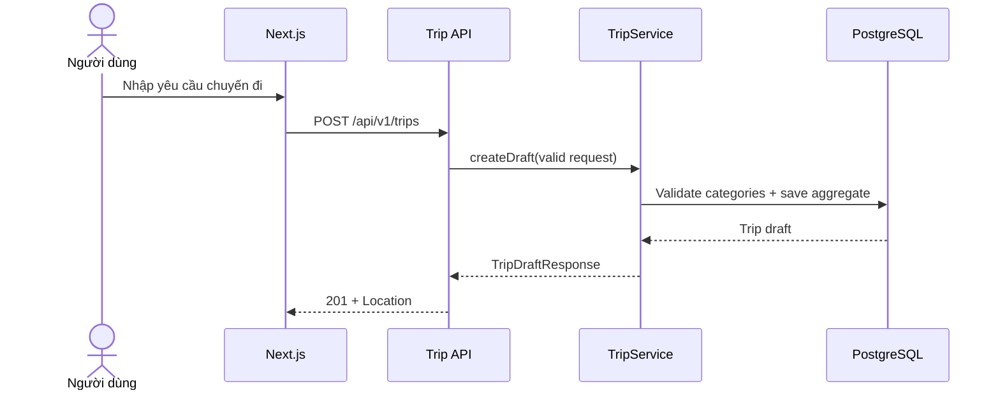

# FEAT-004 — Trip Preferences & Draft Trip MVP

> [!summary]
> Tạo vertical slice đầu tiên của `Trip Module` để người dùng ẩn danh lưu, xem và chỉnh sửa một bản nháp chuyến đi trong ngày tại TP.HCM. Draft ghi nhận ngày đi, khung giờ, ngân sách, điểm xuất phát, tốc độ trải nghiệm, môi trường indoor/outdoor và 1–5 category preferences. Feature tạo dữ liệu đầu vào ổn định cho Scheduling Module nhưng chưa sinh lịch trình, chưa chọn địa điểm và chưa gọi AI.

## 1. Trạng thái, ưu tiên và phê duyệt

| Thuộc tính | Giá trị |
| --- | --- |
| Trạng thái | `done` |
| Ngày phê duyệt requirements | 2026-07-24 |
| Ngày phê duyệt implementation plan | 2026-07-24 |
| Ngày hoàn tất và full verification | 2026-07-24 |
| Độ ưu tiên | `P0 — đầu vào lập lịch MVP` |
| Người phụ trách | Nguyễn Bá Tân |
| Feature phụ thuộc | FEAT-002; FEAT-003 nên hoàn tất để frontend khám phá địa điểm |
| Backend | Spring Boot modular monolith |
| Module sở hữu | `com.saigonplantravel.backend.trip` |
| Module được tham chiếu | `place` qua category lookup contract |
| Database | PostgreSQL, Flyway migration-first |
| API mới | `POST /api/v1/trips`, `GET /api/v1/trips/{publicId}`, `PUT /api/v1/trips/{publicId}` |
| Mốc liên quan | MVP có thể demo trước 30/08/2026 |

Requirements và file-by-file implementation plan được owner phê duyệt ngày
2026-07-24 sau phỏng vấn `$grill-with-docs`. Feature đạt `done` cùng ngày sau
60 automated tests, clean verify, live V9→V11 migration và runtime smoke.

### 1.1. Vì sao đây là feature ưu tiên tiếp theo

- Place data, detail và search đã có spec; bước tiếp theo của luồng người dùng là mô tả chuyến đi cần lập.
- Scheduling cần một input contract có validation trước khi thuật toán được thiết kế.
- Tách lưu draft khỏi scheduling giúp kiểm thử schema/API độc lập và tránh trộn CRUD, heuristic, routing, context và AI trong một iteration.
- Draft cho phép prototype mobile-first giữ tiến trình người dùng và sửa yêu cầu trước khi sinh lịch.

### 1.2. Cổng phê duyệt

- Không bắt đầu code nếu `categories` và category lookup contract của FEAT-002 chưa ổn định.
- `ready-for-review` → `approved`: duyệt one-day scope, schema, enum semantics, API contract và giới hạn anonymous MVP.
- `approved` → `in-progress`: bắt đầu migration/code.
- `in-progress` → `done`: toàn bộ Definition of Done ở mục 18 đạt yêu cầu.
- Nếu dự án đã có `Trip` schema/API khác tài liệu, dừng và cập nhật spec trước khi triển khai.

## 2. Bối cảnh và vấn đề cần giải quyết

SaigonPlanTravel cần các thông tin sau trước khi lọc ứng viên và lập lịch:

- Ngày đi.
- Giờ bắt đầu và kết thúc.
- Vị trí xuất phát.
- Sở thích category.
- Ngân sách.
- Tốc độ trải nghiệm.
- Loại trải nghiệm trong nhà/ngoài trời.

Hiện các giá trị này mới tồn tại trong prototype hoặc request tạm thời, chưa có domain model, validation, persistence và API contract chung. Nếu Scheduling Module tự nhận một payload chưa được chuẩn hóa, thuật toán sẽ phải xử lý cả validation, lưu trữ và scheduling trong cùng feature, làm tăng phạm vi và khó truy vết trong báo cáo.

FEAT-004 giải quyết phần “thu thập và quản lý input” trước. Kết quả là một draft hợp lệ có `publicId` để feature scheduling sau sử dụng.

## 3. Mục tiêu

### 3.1. Mục tiêu sản phẩm

1. Cho phép người dùng tạo bản nháp chuyến đi trong ngày tại TP.HCM.
2. Cho phép mở lại draft bằng URL/API identifier khó đoán.
3. Cho phép chỉnh sửa toàn bộ yêu cầu trước khi tạo lịch trình.
4. Trả category preferences đã được xác minh tồn tại trong Place Module.
5. Cung cấp input rõ ràng cho Scheduling Module V1.

### 3.2. Mục tiêu kỹ thuật

- Tạo `Trip Module` theo package-by-feature, không tạo microservice.
- Tạo schema bằng Flyway; Hibernate chỉ `ddl-auto=validate`.
- Dùng `BIGINT id` nội bộ và `UUID public_id` trong public API.
- Giữ module boundary: Trip Module không dùng `CategoryRepository` hoặc `Category` Entity trực tiếp.
- Áp dụng validation ở DTO/service và invariants ở PostgreSQL khi thực tế.
- Thay category preferences atomically khi cập nhật draft.
- Dùng injected `Clock` cho date validation và timestamps để tests ổn định.
- Không trả Entity trực tiếp qua REST.

### 3.3. Kết quả mong đợi

Sau một `POST /api/v1/trips` hợp lệ, API trả `201 Created`, `Location` và `TripDraftResponse`. Client có thể gọi `GET` hoặc `PUT` với `publicId`. Draft chưa có itinerary/timeline và không kích hoạt scheduling.

## 4. Phạm vi

### 4.1. Trong phạm vi

- Draft chuyến đi **một ngày**, không qua nửa đêm.
- Bảng `trips` và `trip_category_preferences`.
- `Trip`, `TripCategoryPreference` entities trong Trip Module.
- `TravelPace`: `RELAXED`, `BALANCED`, `FAST`.
- `EnvironmentPreference`: `INDOOR`, `OUTDOOR`, `MIXED`.
- 1–5 category preferences; không có trọng số/thứ tự ưu tiên.
- Điểm xuất phát gồm label, latitude, longitude.
- `POST /api/v1/trips` tạo draft.
- `GET /api/v1/trips/{publicId}` lấy draft.
- `PUT /api/v1/trips/{publicId}` thay thế toàn bộ nội dung draft.
- `UUID publicId` sinh ở application, dùng trong public route.
- Batch category lookup qua contract thuộc Place Module.
- Validation, error responses, automated tests và smoke tests.
- Cập nhật Trip ERD, Trip API, development log và `PROJECT_CONTEXT.md`.

### 4.2. Ngoài phạm vi

- Sinh itinerary, chọn địa điểm hoặc chạy scoring/greedy heuristic.
- Itinerary items, timeline, route, khoảng cách hoặc thời gian di chuyển.
- Kiểm tra giờ mở cửa với ngày/khung giờ của trip.
- Weather/traffic/crowd context.
- RAG explanation, AI service hoặc LLM call.
- Re-planning.
- Chuyến đi nhiều ngày hoặc qua nửa đêm.
- Chọn sẵn must-visit/blocked places.
- Weighted/ranked category preferences.
- Notes, number of travelers, transport mode hoặc accessibility needs.
- User account, authentication, authorization hoặc ownership.
- Danh sách tất cả trips của một người dùng.
- Delete/archive trip.
- Optimistic locking, ETag hoặc conflict resolution giữa nhiều thiết bị.
- Idempotency key cho POST.
- Geocoding, reverse geocoding hoặc xác minh point-in-polygon TP.HCM.
- Frontend implementation.

> [!warning]
> `UUID publicId` làm identifier khó đoán hơn nhưng **không phải authorization**. Anonymous MVP không được lưu tên, số điện thoại, email hoặc dữ liệu nhạy cảm. Trước khi triển khai tài khoản thật phải có feature riêng về ownership và access control.

## 5. Tác nhân và user stories

### Tác nhân

- **Khách du lịch ẩn danh:** nhập và sửa yêu cầu chuyến đi.
- **Next.js frontend:** gửi/nhận draft qua REST API.
- **Trip Module:** sở hữu persistence và validation của draft.
- **Place Module:** xác minh category slugs bằng batch lookup contract.
- **Scheduling Module tương lai:** nhận `publicId`/domain snapshot trong feature sau.

### User stories

**US-001 — Tạo draft**  
Là khách du lịch, tôi muốn lưu ngày, thời gian, ngân sách, điểm xuất phát và sở thích để không phải nhập lại trước khi tạo lịch.

**US-002 — Chọn sở thích**  
Là khách du lịch, tôi muốn chọn một số category hợp lệ để hệ thống hiểu loại địa điểm tôi quan tâm.

**US-003 — Chọn nhịp độ**  
Là khách du lịch, tôi muốn chọn nhịp độ thư thả, cân bằng hoặc nhanh để scheduling sau điều chỉnh số lượng và thời lượng địa điểm.

**US-004 — Chọn môi trường**  
Là khách du lịch, tôi muốn chọn indoor, outdoor hoặc mixed để mô tả trải nghiệm mong muốn.

**US-005 — Mở lại draft**  
Là người dùng đã tạo draft, tôi muốn mở lại bằng `publicId` để kiểm tra yêu cầu đã lưu.

**US-006 — Chỉnh sửa draft**  
Là người dùng, tôi muốn thay đổi toàn bộ yêu cầu trước khi sinh lịch trình.

## 6. Luồng người dùng và luồng hệ thống

### 6.1. Luồng chính — tạo draft

1. Người dùng nhập ngày, khung giờ, ngân sách, điểm xuất phát, pace, environment và category preferences.
2. Frontend gửi `POST /api/v1/trips`.
3. Controller bind và chạy Jakarta Bean Validation.
4. `TripService` kiểm tra quy tắc liên trường: ngày, thời lượng, category uniqueness.
5. Trip Service gọi batch category lookup của Place Module.
6. Nếu mọi slug tồn tại, service tạo `Trip`, `TripCategoryPreference` và `UUID publicId`.
7. Repository lưu aggregate trong một transaction.
8. Mapper tạo response; controller trả `201 Created` với `Location`.



### 6.2. Luồng lấy draft

1. Frontend gọi `GET /api/v1/trips/{publicId}`.
2. Service tìm trip và load category preference IDs trong read-only transaction.
3. Service batch-resolve category summaries qua Place Module.
4. API trả `200 OK`; nếu UUID hợp lệ nhưng không tồn tại, trả `404 TRIP_NOT_FOUND`.

### 6.3. Luồng cập nhật draft

1. Frontend gửi `PUT` với toàn bộ draft payload.
2. Hệ thống validate request và category slugs giống create.
3. Entity cập nhật scalar fields và thay toàn bộ category preferences.
4. Nếu một bước thất bại, transaction rollback; draft cũ không bị thay đổi một phần.
5. API trả `200 OK` với snapshot mới.

### 6.4. Luồng validation failure

1. Request vi phạm field validation hoặc business rule.
2. API trả `400 INVALID_REQUEST` cùng field errors/business errors.
3. Không lưu trip mới và không thay đổi trip hiện có.

### 6.5. Luồng category không tồn tại

1. Một hoặc nhiều category slug đúng format nhưng không tồn tại.
2. Batch lookup trả thiếu slug.
3. API trả `400 INVALID_CATEGORY_PREFERENCE` và danh sách slug không hợp lệ.
4. Transaction không ghi dữ liệu.

## 7. Yêu cầu chức năng

| ID | Yêu cầu | Ưu tiên |
| --- | --- | --- |
| FR-001 | Hệ thống phải tạo schema Trip bằng Flyway migration mới. | Must |
| FR-002 | Hibernate phải validate thành công `Trip` và `TripCategoryPreference` với schema. | Must |
| FR-003 | `POST /api/v1/trips` phải tạo một draft hợp lệ và trả `201 Created`. | Must |
| FR-004 | Response create phải có header `Location: /api/v1/trips/{publicId}`. | Must |
| FR-005 | `GET /api/v1/trips/{publicId}` phải trả draft hiện có hoặc 404. | Must |
| FR-006 | `PUT /api/v1/trips/{publicId}` phải thay thế toàn bộ editable fields atomically. | Must |
| FR-007 | Public API phải dùng UUID `publicId`, không dùng internal numeric ID. | Must |
| FR-008 | UUID phải được sinh trong application trước khi insert và unique ở database. | Must |
| FR-009 | Trip date phải là ngày hiện tại hoặc tương lai theo `Asia/Ho_Chi_Minh`. | Must |
| FR-010 | Start time phải trước end time trong cùng ngày. | Must |
| FR-011 | Khung giờ phải dài ít nhất 60 phút và tối đa 18 giờ. | Must |
| FR-012 | Budget phải nằm trong `0..100000000` VND. | Must |
| FR-013 | Start location phải có label và cặp latitude/longitude hợp lệ. | Must |
| FR-014 | Pace chỉ nhận `RELAXED`, `BALANCED`, `FAST`. | Must |
| FR-015 | Environment chỉ nhận `INDOOR`, `OUTDOOR`, `MIXED`. | Must |
| FR-016 | Request phải có từ 1 đến 5 category slugs không trùng nhau. | Must |
| FR-017 | Tất cả category slugs phải tồn tại trước khi lưu. | Must |
| FR-018 | Trip Module phải xác minh category qua batch contract, không truy cập `CategoryRepository`/Entity. | Must |
| FR-019 | Category preferences phải được thay atomically khi PUT. | Must |
| FR-020 | Response phải trả category summaries theo `name ASC, id ASC`; order không biểu thị mức ưu tiên. | Must |
| FR-021 | Title blank/null phải được thay bằng default title xác định từ trip date. | Should |
| FR-022 | GET phải dùng `@Transactional(readOnly = true)`; create/update dùng write transaction. | Must |
| FR-023 | Controller phải mỏng và không truy cập repository trực tiếp. | Must |
| FR-024 | API phải dùng DTO; không serialize Entity hoặc lazy collection. | Must |
| FR-025 | Malformed UUID phải trả 400; UUID hợp lệ nhưng không tồn tại phải trả 404. | Must |
| FR-026 | Create/update timestamp phải dùng injected `Clock`, không gọi system clock rải rác. | Should |
| FR-027 | Feature không được kích hoạt scheduling/AI/context side effect. | Must |
| FR-028 | Contract FEAT-001–003 phải giữ nguyên. | Must |

## 8. Quy tắc nghiệp vụ

| ID | Quy tắc |
| --- | --- |
| BR-001 | Một draft chỉ biểu diễn một ngày tại TP.HCM. |
| BR-002 | `tripDate` được so với current date theo timezone `Asia/Ho_Chi_Minh`. |
| BR-003 | Khung giờ không qua nửa đêm; `startTime < endTime`. |
| BR-004 | Duration nằm trong `[60 phút, 18 giờ]`. |
| BR-005 | Budget là tổng ngân sách dự kiến cho một người trong MVP; không tự nhân số khách. |
| BR-006 | Budget bằng 0 là hợp lệ để biểu diễn chuyến đi chỉ dùng địa điểm miễn phí. |
| BR-007 | Latitude nằm trong `[-90, 90]`; longitude trong `[-180, 180]`. |
| BR-008 | Label điểm xuất phát được trim/collapse whitespace và dài tối đa 255 ký tự. |
| BR-009 | Không xác minh biên giới TP.HCM bằng polygon trong feature này. |
| BR-010 | `RELAXED/BALANCED/FAST` chỉ là preference; FEAT-004 chưa chuyển thành thời lượng hoặc số địa điểm. |
| BR-011 | `INDOOR/OUTDOOR/MIXED` chỉ là preference; không tự lọc place ở feature này. |
| BR-012 | Category list là set không trọng số; duplicate slug là invalid input. |
| BR-013 | Category slug đúng format nhưng không tồn tại là business validation error, không phải 404 trip. |
| BR-014 | PUT là full replacement; field optional có thể trở về default/null theo contract. |
| BR-015 | Default title là `Chuyến đi ngày YYYY-MM-DD`. |
| BR-016 | Category preference response có fixed sort; thứ tự request không được hiểu là ranking. |
| BR-017 | Anonymous draft không chứa PII và UUID không được coi là cơ chế phân quyền. |

## 9. Đặc tả dữ liệu

### 9.1. Bảng `trips`

| Cột | Kiểu đề xuất | Null | Ràng buộc/Ghi chú |
| --- | --- | --- | --- |
| `id` | `BIGINT GENERATED BY DEFAULT AS IDENTITY` | No | Primary key nội bộ |
| `public_id` | `UUID` | No | Unique, sinh ở application |
| `title` | `VARCHAR(120)` | No | Normalized/defaulted |
| `trip_date` | `DATE` | No | Date nghiệp vụ |
| `start_time` | `TIME` | No | Local time TP.HCM |
| `end_time` | `TIME` | No | Local time TP.HCM |
| `budget` | `NUMERIC(12,2)` | No | Check `0..100000000` |
| `start_location_label` | `VARCHAR(255)` | No | Không chứa PII |
| `start_latitude` | `NUMERIC(9,6)` | No | Check `-90..90` |
| `start_longitude` | `NUMERIC(10,6)` | No | Check `-180..180` |
| `travel_pace` | `VARCHAR(20)` | No | Check enum values |
| `environment_preference` | `VARCHAR(20)` | No | Check enum values |
| `created_at` | `TIMESTAMPTZ` | No | Application-supplied `Instant` |
| `updated_at` | `TIMESTAMPTZ` | No | Cập nhật qua domain/service |

Database constraints tối thiểu:

- Unique `public_id`.
- `start_time < end_time`.
- Duration trong 60 phút đến 18 giờ nếu PostgreSQL expression rõ ràng; service validation vẫn bắt buộc.
- Budget, latitude, longitude checks.
- Check enum strings.

`trip_date >= CURRENT_DATE` **không** đặt thành database check vì kết quả phụ thuộc thời gian và timezone; validate trong service với injected `Clock`.

### 9.2. Bảng `trip_category_preferences`

| Cột | Kiểu đề xuất | Null | Ràng buộc/Ghi chú |
| --- | --- | --- | --- |
| `trip_id` | `BIGINT` | No | FK → `trips(id)`, `ON DELETE CASCADE` |
| `category_id` | `BIGINT` | No | FK → `categories(id)`, `ON DELETE RESTRICT` |

- Composite primary key `(trip_id, category_id)`.
- Không thêm `weight`, `rank`, `created_at` hoặc surrogate ID trong MVP.
- FK bảo vệ integrity nhưng Trip Java code không cần JPA relation đến `Category` Entity.

### 9.3. JPA mapping

- `Trip` sở hữu `@OneToMany` tới `TripCategoryPreference`, `LAZY`, orphan removal cho replace operation.
- `TripCategoryPreference` có `@ManyToOne(fetch = LAZY)` tới `Trip` và scalar `categoryId`.
- Không import/map `Category` Entity vào Trip aggregate.
- Entity enum dùng `@Enumerated(EnumType.STRING)` và khớp check constraints.
- Entity không dùng Lombok `@Data`, class-wide setter hoặc uncontrolled `toString`.
- State thay đổi qua factory/domain method như `Trip.createDraft(...)` và `replaceDraft(...)`.

### 9.4. Migration đã triển khai

Repository và live database đã áp dụng thành công:

```text
V10__create_trips_table.sql
V11__create_trip_category_preferences_table.sql
```

V1–V9 giữ bất biến; V10–V11 không seed trip. Testcontainers chạy sạch V1–V11,
migrate lại không tạo migration mới và live development database nâng V9→V11.

## 10. Module boundary

### 10.1. Quy tắc sở hữu

- Trip Module sở hữu `Trip`, `TripCategoryPreference`, Trip API và Trip repository.
- Place Module sở hữu `Category`, category repository và category catalog.
- Trip Module không đọc bảng/category repository trực tiếp trong application code.
- Database FK giữa modules được chấp nhận trong modular monolith để bảo vệ integrity.

### 10.2. Batch lookup contract đề xuất

Place Module cung cấp contract hẹp:

```java
public interface CategoryLookupService {
    List<CategoryReference> findBySlugs(Set<String> slugs);
    List<CategoryReference> findByIds(Set<Long> ids);
}
```

```java
public record CategoryReference(Long id, String name, String slug) {}
```

- Hai method phải dùng batch query, không query một lần cho mỗi category.
- Contract không trả Entity.
- Nếu FEAT-002 đã có service tương đương, tái sử dụng và chỉ bổ sung batch method cần thiết.
- Chưa đưa contract vào `common`; nó thuộc Place Module vì Place sở hữu category semantics.

## 11. API contract

### 11.1. Request dùng chung

Create và PUT dùng cùng JSON shape trong MVP:

```json
{
  "title": "Một ngày khám phá Sài Gòn",
  "tripDate": "2026-08-20",
  "startTime": "08:00",
  "endTime": "18:00",
  "budget": 500000.00,
  "startLocation": {
    "label": "Chợ Bến Thành, Quận 1",
    "latitude": 10.772640,
    "longitude": 106.698050
  },
  "travelPace": "BALANCED",
  "environmentPreference": "MIXED",
  "categorySlugs": [
    "van-hoa",
    "am-thuc"
  ]
}
```

DTO đề xuất:

```java
public record SaveTripDraftRequest(
        @Size(max = 120) String title,
        @NotNull LocalDate tripDate,
        @NotNull LocalTime startTime,
        @NotNull LocalTime endTime,
        @NotNull @DecimalMin("0.00")
        @DecimalMax("100000000.00") BigDecimal budget,
        @NotNull @Valid StartLocationRequest startLocation,
        @NotNull TravelPace travelPace,
        @NotNull EnvironmentPreference environmentPreference,
        @NotNull @Size(min = 1, max = 5)
        List<@Pattern(regexp = "^[a-z0-9]+(?:-[a-z0-9]+)*$") String> categorySlugs
) {}
```

```java
public record StartLocationRequest(
        @NotBlank @Size(max = 255) String label,
        @NotNull @DecimalMin("-90.0") @DecimalMax("90.0") BigDecimal latitude,
        @NotNull @DecimalMin("-180.0") @DecimalMax("180.0") BigDecimal longitude
) {}
```

Duplicate category, time-window và date rules được validate ở service/domain vì chúng liên quan nhiều field hoặc current date.

### 11.2. Tạo draft

```http
POST /api/v1/trips
Content-Type: application/json
```

Response:

```http
HTTP/1.1 201 Created
Location: /api/v1/trips/7a674ef0-57c8-4d0e-b99b-dccfd342fc98
Content-Type: application/json
```

### 11.3. Lấy draft

```http
GET /api/v1/trips/{publicId}
Accept: application/json
```

### 11.4. Thay thế draft

```http
PUT /api/v1/trips/{publicId}
Content-Type: application/json
```

- PUT yêu cầu full payload giống create.
- Thành công trả `200 OK` với response mới.
- Không upsert: UUID không tồn tại trả 404.

### 11.5. Response thành công

```json
{
  "publicId": "7a674ef0-57c8-4d0e-b99b-dccfd342fc98",
  "title": "Một ngày khám phá Sài Gòn",
  "tripDate": "2026-08-20",
  "startTime": "08:00",
  "endTime": "18:00",
  "budget": 500000.00,
  "startLocation": {
    "label": "Chợ Bến Thành, Quận 1",
    "latitude": 10.772640,
    "longitude": 106.698050
  },
  "travelPace": "BALANCED",
  "environmentPreference": "MIXED",
  "categoryPreferences": [
    {
      "id": 2,
      "name": "Ẩm thực",
      "slug": "am-thuc"
    },
    {
      "id": 1,
      "name": "Văn hóa",
      "slug": "van-hoa"
    }
  ],
  "createdAt": "2026-07-17T05:30:00Z",
  "updatedAt": "2026-07-17T05:30:00Z"
}
```

Response DTO đề xuất:

```java
public record TripDraftResponse(
        UUID publicId,
        String title,
        LocalDate tripDate,
        LocalTime startTime,
        LocalTime endTime,
        BigDecimal budget,
        StartLocationResponse startLocation,
        TravelPace travelPace,
        EnvironmentPreference environmentPreference,
        List<CategoryPreferenceResponse> categoryPreferences,
        Instant createdAt,
        Instant updatedAt
) {}
```

`LocalTime` serialize dạng `HH:mm`; `Instant` serialize ISO-8601 UTC.

### 11.6. Error responses

| Trường hợp | HTTP | Code |
| --- | --- | --- |
| JSON/field/enum/UUID không hợp lệ | 400 | `INVALID_REQUEST` |
| Date/time/budget/category duplicate vi phạm business rule | 400 | `INVALID_REQUEST` |
| Category slug không tồn tại | 400 | `INVALID_CATEGORY_PREFERENCE` |
| UUID hợp lệ nhưng trip không tồn tại | 404 | `TRIP_NOT_FOUND` |
| Lỗi hệ thống | 500 | Error contract chung |

Ví dụ unknown category:

```json
{
  "status": 400,
  "code": "INVALID_CATEGORY_PREFERENCE",
  "message": "One or more category preferences are invalid",
  "path": "/api/v1/trips",
  "unknownCategorySlugs": ["khong-ton-tai"]
}
```

Implementation phải mở rộng Spring `ProblemDetail` hiện có. Validation tiếp tục
dùng `code=INVALID_REQUEST` và `fieldErrors`; unknown category thêm
`code=INVALID_CATEGORY_PREFERENCE` cùng property
`unknownCategorySlugs`. Không tạo error envelope thứ hai và không thay đổi
contract FEAT-001–003.

## 12. Yêu cầu phi chức năng

| ID | Yêu cầu |
| --- | --- |
| NFR-001 | Create/update phải atomic; lỗi category hoặc persistence không để lại partial aggregate. |
| NFR-002 | GET/create/update category resolution dùng batch query; không N+1 theo số category. |
| NFR-003 | Với tối đa 5 categories, API local sau warm-up có mục tiêu dưới 500 ms; ghi môi trường khi đo. |
| NFR-004 | UUID dùng cryptographically strong randomness thông qua `UUID.randomUUID()` hoặc generator tương đương của JDK. |
| NFR-005 | API không trả internal ID, Entity, Hibernate proxy, SQL hoặc stack trace. |
| NFR-006 | Không log full request nếu có nguy cơ chứa vị trí; log identifier và outcome tối thiểu. |
| NFR-007 | JSON/date/time/decimal contract ổn định và độc lập persistence model. |
| NFR-008 | Database tests dùng PostgreSQL; không dựa duy nhất vào H2 cho UUID/constraints. |
| NFR-009 | `./mvnw test`, Flyway, Hibernate validate và smoke tests phải pass. |
| NFR-010 | Code dùng constructor injection, DTO records và module boundary rõ ràng. |

## 13. Tiêu chí chấp nhận

### AC-001 — Migration và startup

**Given** database đã có Place Module schema  
**When** backend khởi động với migrations mới  
**Then** `trips` và `trip_category_preferences` được tạo đúng một lần và Hibernate validate thành công.

### AC-002 — Tạo draft hợp lệ

**Given** request hợp lệ và category slugs đều tồn tại  
**When** gọi `POST /api/v1/trips`  
**Then** API trả 201, `Location`, UUID publicId và response đúng contract.

### AC-003 — UUID public, ID nội bộ

**Given** trip đã lưu  
**When** xem API response  
**Then** có `publicId` UUID nhưng không có numeric `id` hoặc `tripId` nội bộ.

### AC-004 — Default title

**Given** title null, empty hoặc chỉ whitespace và `tripDate=2026-08-20`  
**When** tạo/cập nhật draft  
**Then** response có title `Chuyến đi ngày 2026-08-20`.

### AC-005 — Date validation theo HCMC

**Given** injected Clock cố định và timezone `Asia/Ho_Chi_Minh`  
**When** trip date trước current local date  
**Then** API trả 400 và không ghi dữ liệu; current/future date hợp lệ.

### AC-006 — Time window

**Given** start/end bằng nhau, đảo ngược, dưới 60 phút, trên 18 giờ hoặc hợp lệ  
**When** lưu draft  
**Then** các trường hợp sai trả 400; khung giờ trong giới hạn được chấp nhận.

### AC-007 — Budget boundaries

**Given** budget `0`, `100000000`, số âm hoặc vượt trần  
**When** lưu draft  
**Then** hai boundary hợp lệ; số ngoài khoảng trả 400/database constraint tương ứng.

### AC-008 — Location validation

**Given** label blank, latitude/longitude ngoài phạm vi hoặc cặp hợp lệ  
**When** lưu draft  
**Then** invalid request trả 400; valid pair được lưu với precision đúng.

### AC-009 — Enum validation

**Given** pace/environment đúng hoặc không thuộc enum  
**When** gọi API  
**Then** enum đúng được lưu; giá trị khác trả 400, không gây 500.

### AC-010 — Số lượng và duplicate category

**Given** request có 0, 1, 5, 6 category slugs hoặc duplicate slug  
**When** lưu draft  
**Then** 1/5 hợp lệ; 0/6/duplicate trả 400.

### AC-011 — Unknown category atomicity

**Given** request có một slug tồn tại và một slug không tồn tại  
**When** create/PUT  
**Then** API trả `400 INVALID_CATEGORY_PREFERENCE` và không ghi/đổi bất kỳ preference nào.

### AC-012 — Batch module lookup

**Given** request có 5 categories  
**When** validate/map response  
**Then** Trip Module gọi batch category contract, không gọi repository/lookup 5 lần và không import Category Entity.

### AC-013 — Lấy draft

**Given** trip tồn tại  
**When** gọi GET bằng publicId  
**Then** API trả 200, scalar fields và category summaries theo fixed order.

### AC-014 — Malformed và missing UUID

**Given** một path không phải UUID và một UUID hợp lệ không tồn tại  
**When** gọi GET/PUT  
**Then** path sai trả 400; UUID missing trả `404 TRIP_NOT_FOUND`.

### AC-015 — PUT full replacement

**Given** trip có scalar fields và categories cũ  
**When** PUT full payload hợp lệ  
**Then** mọi editable field và category set được thay atomically, `createdAt` giữ nguyên và `updatedAt` tăng.

### AC-016 — PUT rollback

**Given** trip hiện có và PUT bị lỗi sau bước validation/persistence  
**When** transaction rollback  
**Then** GET sau đó vẫn trả snapshot cũ đầy đủ.

### AC-017 — Database constraints

**Given** SQL trực tiếp vi phạm publicId unique, time, budget, coordinate, enum hoặc composite PK  
**When** insert/update  
**Then** PostgreSQL từ chối bằng constraint tương ứng.

### AC-018 — Không scheduling side effect

**Given** create hoặc update draft thành công  
**When** kiểm tra database/log/dependency calls  
**Then** không tạo itinerary, không chọn place và không gọi AI/context/routing service.

### AC-019 — Regression

**Given** FEAT-004 đã triển khai  
**When** chạy regression tests FEAT-001–003  
**Then** Place APIs giữ nguyên contract và behavior.

### AC-020 — Full verification

**Given** implementation hoàn tất  
**When** chạy full suite, startup và focused curl requests  
**Then** tests pass, Flyway/Hibernate không lỗi và development log có bằng chứng.

## 14. Ma trận truy vết

| Nhóm yêu cầu | Acceptance criteria | Bằng chứng dự kiến |
| --- | --- | --- |
| FR-001–FR-002 | AC-001, AC-017 | Migration log, PostgreSQL tests |
| FR-003–FR-008 | AC-002–AC-004 | Service/controller tests |
| FR-009–FR-016 | AC-005–AC-010 | Validation/domain tests |
| FR-017–FR-020 | AC-011–AC-013 | Module boundary + integration tests |
| FR-021–FR-026 | AC-004, AC-014–AC-017 | Mapper/error/transaction tests |
| FR-027–FR-028 | AC-018–AC-020 | Dependency verification, regression/full suite |

## 15. Kế hoạch triển khai file-by-file

> [!warning]
> Chỉ triển khai sau approval. Tên file/migration là dự kiến; phải đọc repository thật và tái sử dụng conventions/class hiện có.

### Phase A — Preflight và contract approval

- [x] Xác nhận FEAT-002 category schema/service ổn định và FEAT-003 `done`.
- [x] Đọc root/backend `AGENTS.md`, `PROJECT_CONTEXT.md`, feature specs và DB/API notes.
- [x] Inspect migration versions, common errors, Jackson/date-time behavior và test infrastructure.
- [x] Xác nhận chưa có package, schema hoặc API Trip trong source.
- [x] Owner duyệt one-day scope, enums, UUID, anonymous limitation và POST/GET/PUT.
- [x] Chuyển frontmatter `status` thành `approved` ngày 2026-07-24.

### Phase B — Flyway migrations

- [x] Tạo `backend/src/main/resources/db/migration/V10__create_trips_table.sql`.
- [x] Thêm named constraints cho UUID, time, budget, coordinates và enum strings.
- [x] Tạo `backend/src/main/resources/db/migration/V11__create_trip_category_preferences_table.sql`.
- [x] Thêm composite PK và FKs với delete actions đúng spec.
- [x] Chạy migrations trên database sạch và database có FEAT-001–003.
- [x] Xác minh restart, checksums và Hibernate baseline.

### Phase C — Trip domain và persistence

- [x] Tạo `trip/entity/Trip.java`.
- [x] Tạo `trip/entity/TripCategoryPreference.java` và composite key mapping phù hợp.
- [x] Tạo `trip/domain/TravelPace.java`.
- [x] Tạo `trip/domain/EnvironmentPreference.java`.
- [x] Implement factory/update domain methods, collection replacement và timestamp inputs.
- [x] Tạo `trip/repository/TripRepository.java` với lookup by `publicId`.
- [x] Không map/import `Category` Entity trong Trip Module.

### Phase D — Place Module lookup boundary

- [x] Thêm `backend/src/main/java/com/saigonplantravel/backend/place/dto/CategoryReference.java`.
- [x] Thêm `backend/src/main/java/com/saigonplantravel/backend/place/service/CategoryLookupService.java`.
- [x] Mở rộng `backend/src/main/java/com/saigonplantravel/backend/place/repository/CategoryRepository.java`
  bằng hai batch query theo slug/id với fixed ordering.
- [x] Không đổi behavior của `CategoryService` và `GET /api/v1/categories`.
- [x] Test lookup trả immutable DTO và không lộ Entity.
- [x] Không đưa interface vào `common` khi chưa có consumer thứ hai ngoài Trip.

### Phase E — DTO, mapper và validation

- [x] Tạo request records dưới
  `backend/src/main/java/com/saigonplantravel/backend/trip/dto/request/`.
- [x] Tạo response records dưới
  `backend/src/main/java/com/saigonplantravel/backend/trip/dto/response/`.
- [x] Tạo `backend/src/main/java/com/saigonplantravel/backend/trip/mapper/TripMapper.java`.
- [x] Tạo `backend/src/main/java/com/saigonplantravel/backend/trip/service/TripDraftValidator.java`
  cho date, duration và category uniqueness.
- [x] Tạo `backend/src/main/java/com/saigonplantravel/backend/trip/config/TripClockConfig.java`
  cung cấp `Clock` với zone `Asia/Ho_Chi_Minh`.
- [x] Cấu hình/annotate `LocalTime` thành `HH:mm` nếu project chưa có global contract.

### Phase F — Service và REST API

- [x] Tạo `backend/src/main/java/com/saigonplantravel/backend/trip/service/TripService.java`
  với create/get/replace methods.
- [x] Create/PUT validate category batch trước khi mutate/persist aggregate.
- [x] GET batch-resolve category IDs cho response trong read-only transaction.
- [x] Tạo Trip exceptions dưới
  `backend/src/main/java/com/saigonplantravel/backend/trip/exception/`.
- [x] Tạo `backend/src/main/java/com/saigonplantravel/backend/trip/controller/TripController.java`.
- [x] Implement POST 201 + Location, GET 200/404, PUT 200/404.
- [x] Mở rộng
  `backend/src/main/java/com/saigonplantravel/backend/common/error/GlobalExceptionHandler.java`
  bằng handler Trip tối thiểu, giữ nguyên Place errors.
- [x] Xác minh không gọi Scheduling/AI/Context modules.

### Phase G — Automated tests

- [x] Mở rộng migration assertions trong PostgreSQL integration baseline
  cho V10–V11 startup/Hibernate baseline.
- [x] Tạo Trip domain/service/mapper/controller tests dưới
  `backend/src/test/java/com/saigonplantravel/backend/trip/`.
- [x] Tạo Place batch lookup test dưới
  `backend/src/test/java/com/saigonplantravel/backend/place/service/`.
- [x] Tạo PostgreSQL Trip repository/constraint integration tests cho UUID,
  FK/PK, checks và atomic replacement.
- [x] Code review/import check xác nhận module boundary; project chưa dùng ArchUnit.
- [x] Regression tests FEAT-001–003.
- [x] Chạy toàn bộ `./mvnw test` từ `backend/`.

### Phase H — Smoke test và diff review

- [x] Chạy PostgreSQL theo `infra/compose.yaml` và start backend.
- [x] Kiểm tra log Flyway/Hibernate.
- [x] POST một draft hợp lệ và lưu `Location`.
- [x] GET draft, PUT thay scalar/categories rồi GET lại.
- [x] Gọi past date, invalid time, unknown category, malformed/missing UUID.
- [x] Kiểm tra không có itinerary/AI/context side effect.
- [x] Review changes; không secret, migration cũ hoặc file ngoài scope.

### Phase I — Cập nhật tài liệu

- [x] Tạo/cập nhật `docs/03-Database/Trip-Module-ERD.md`.
- [x] Tạo/cập nhật `docs/04-API/Trip-API.md` với request/response/error thực tế.
- [x] Cập nhật `docs/02-Architecture/System Architecture.md` với module boundary
  nếu implementation xác nhận cần thiết; không tạo ADR riêng cho quyết định nội bộ này.
- [x] Hoàn thiện development log trong `docs/09-Development-Log/` bằng
  implementation decisions, errors và test evidence.
- [x] Cập nhật `docs/00-Dashboard/PROJECT_CONTEXT.md`: FEAT-004 hoàn tất và feature scheduling kế tiếp.
- [x] Liên kết spec ↔ ERD ↔ API note ↔ development log.
- [x] Đổi spec thành `status: done` khi DoD đạt.

## 16. Chiến lược kiểm thử

### 16.1. Unit/domain tests

- Date theo fixed Clock/HCMC timezone.
- Time order và duration boundaries.
- Default title và normalization.
- Duplicate category detection.
- Full replacement giữ `createdAt`, đổi `updatedAt`.

### 16.2. Service tests

- Batch category validation/mapping.
- Create/get/update happy paths.
- Unknown category và trip not found.
- Atomicity/rollback và không gọi side-effect modules.

### 16.3. Web slice tests

- Bean Validation, enum/UUID parsing.
- POST 201 + Location.
- GET/PUT 200/400/404.
- JSON date/time/decimal/UUID field names.
- Common error envelope và không lộ internal ID.

### 16.4. PostgreSQL integration tests

- Flyway + Hibernate validate.
- UUID unique và all check constraints.
- Composite preference PK/FKs.
- Orphan removal/replace behavior.
- Batch loading không N+1.

### 16.5. Regression tests

- Place list/detail/category/search contracts không đổi.
- Category rows không bị xóa khi thay trip preferences.
- Không có dependency ngược từ Place sang Trip.

### 16.6. Bằng chứng ngày 2026-07-24

- `./mvnw clean verify`: 60 tests pass, JAR repackage thành công.
- PostgreSQL Testcontainers: clean V1–V11, rerun zero migration, Hibernate
  validation và Trip persistence/constraints pass.
- Live database: Flyway V9→V11; V10/V11 `success=true`.
- Runtime POST/GET/PUT, validation/404, rollback và FEAT-001–003 regression pass.
- Warm GET local 8.449 ms; log có một Trip query và một category batch query.
- Draft smoke-test đã được xóa sau verification; không để lại test row.

### 16.6. Kiểm tra thủ công

```bash
curl -i -X POST http://localhost:8080/api/v1/trips \
  -H "Content-Type: application/json" \
  --data @trip-draft-request.json

curl -i http://localhost:8080/api/v1/trips/{publicId}

curl -i -X PUT http://localhost:8080/api/v1/trips/{publicId} \
  -H "Content-Type: application/json" \
  --data @trip-draft-request.json
```

Development log cần lưu:

- Migration versions và schema evidence.
- Request/response mẫu đã loại dữ liệu không cần thiết.
- Kết quả `./mvnw test`.
- Startup log Flyway/Hibernate.
- Query count cho category batch lookup.
- Bằng chứng create/update không kích hoạt scheduling/AI.

## 17. Rủi ro và quyết định

### 17.1. Rủi ro và giảm thiểu

| Rủi ro | Tác động | Giảm thiểu |
| --- | --- | --- |
| Trộn draft với scheduling | Feature quá lớn, khó test | FEAT-004 chỉ persistence/input; scheduling có spec riêng |
| Trip dùng Category Entity/repository | Phá module boundary | Batch lookup DTO contract từ Place Module |
| UUID bị hiểu là authorization | Rò draft nếu URL lộ | Ghi rõ anonymous demo, không PII; auth feature sau |
| Date validation dùng system time | Test flaky/timezone sai | Inject `Clock`, dùng `Asia/Ho_Chi_Minh` |
| Update category từng phần | Aggregate không nhất quán | Write transaction + replace atomically |
| JPA orphan/composite key mapping sai | Preference dư/trùng | PostgreSQL integration tests |
| Enum Java lệch DB check | Startup/runtime failure | Migration-first, enum/constraint parity test |
| Thêm quá nhiều preference fields | Trễ scheduling MVP | Giữ 7 input groups, defer transport/party/accessibility |
| Cross-module batch lookup thành N+1 | Response/query chậm | `findBySlugs/Ids` batch methods + query count test |
| One-day model hạn chế tương lai | Cần migration cho multi-day | Phạm vi MVP rõ; multi-day là feature/version sau |

### 17.2. Quyết định đã chốt

| ID | Quyết định | Lý do |
| --- | --- | --- |
| DEC-001 | FEAT-004 chỉ hỗ trợ one-day trip. | Khớp MVP hiện tại và giảm scheduling edge case. |
| DEC-002 | Internal BIGINT + public UUID. | JPA/FK đơn giản nhưng public route khó đoán hơn. |
| DEC-003 | Không có `status` khi chỉ tồn tại một trạng thái draft. | Tránh cột/enum chưa có transition thật; feature scheduling sẽ bổ sung khi cần. |
| DEC-004 | POST/GET/PUT, chưa DELETE/list. | Đủ tạo–mở–sửa trước scheduling. |
| DEC-005 | PUT full replacement. | Contract rõ và update category atomically. |
| DEC-006 | 1–5 categories, không weight/rank. | Sở thích MVP đơn giản, test được. |
| DEC-007 | Pace là enum preference. | Chưa cần numeric walking speed trước heuristic. |
| DEC-008 | Environment là `INDOOR/OUTDOOR/MIXED`. | Khớp prototype và replanning tương lai. |
| DEC-009 | Category lookup qua Place Module DTO contract. | Giữ package-by-feature boundary. |
| DEC-010 | Không xác minh polygon TP.HCM. | Tránh geospatial scope; vẫn validate coordinate range. |
| DEC-011 | Không optimistic locking trong anonymous single-client MVP. | Giảm scope; ghi nhận lost-update risk cho feature sau. |

## 18. Definition of Done

Feature chỉ được đánh dấu `done` khi:

- [x] FEAT-004 spec và dependency baseline được owner phê duyệt ngày 2026-07-24.
- [x] File-by-file implementation plan được owner phê duyệt ngày 2026-07-24.
- [x] Implementation không vượt phạm vi mục 4.
- [x] Flyway migrations chạy trên database sạch/hiện có và không sửa migration cũ.
- [x] Hibernate `ddl-auto=validate` pass.
- [x] POST/GET/PUT đúng status, Location, JSON và error contracts.
- [x] One-day date/time/budget/location/enums/category rules đúng.
- [x] UUID public, internal ID không xuất hiện trong API.
- [x] Category preferences được validate/load theo batch qua module contract.
- [x] PUT atomic và rollback test pass.
- [x] Không Entity/lazy proxy được serialize.
- [x] Không scheduling, AI, context hoặc routing side effect.
- [x] PostgreSQL constraints/integration tests pass.
- [x] Regression tests FEAT-001–003 pass.
- [x] `./mvnw test`, startup và smoke tests pass.
- [x] Review không phát hiện secret, sửa migration cũ hoặc thay đổi ngoài scope.
- [x] Trip ERD, Trip API, development log và `PROJECT_CONTEXT.md` đã cập nhật.

## 19. Feature kế tiếp đề xuất

Sau FEAT-004, tạo spec riêng:

**FEAT-005 — Basic Itinerary Generation / Scheduling V1**

Candidate scope:

- Load Trip draft snapshot.
- Lọc active places theo category, budget và environment.
- Xét giờ mở cửa, visit duration và available time window.
- Tính score đơn giản.
- Greedy scheduling có deterministic tie-breaker.
- Lưu itinerary và itinerary items.
- Trả timeline, estimated cost và warnings.

RAG explanation, dynamic context và re-planning vẫn là các feature sau; LLM không trực tiếp quyết định toàn bộ lịch trình.

## 20. Liên kết với prototype và báo cáo khóa luận

### Prototype mobile-first

- Trip form map trực tiếp vào `SaveTripDraftRequest`.
- Date/time/budget controls phải hiển thị cùng validation limits.
- Category chips lấy slug từ `GET /api/v1/categories`.
- Map picker/current location phải cung cấp label + coordinates; geocoding không thuộc FEAT-004.
- Sau create, frontend giữ `publicId`/Location để mở hoặc sửa draft.

### Báo cáo khóa luận

- **Chương 3 — Phân tích và thiết kế:** Trip aggregate, one-day assumptions, module boundary và API contract.
- **Chương 3 — Cài đặt:** Flyway migration-first, UUID public identity, transactional aggregate update và Clock-based validation.
- **Chương 4 — Thực nghiệm:** validation matrix, transaction rollback, batch query count và API response time.

## 21. Lịch sử thay đổi

| Ngày | Phiên bản | Thay đổi |
| --- | --- | --- |
| 2026-07-17 | 0.1 | Tạo đặc tả FEAT-004 cho Trip Preferences & Draft Trip MVP, tách khỏi scheduling. |
| 2026-07-24 | 1.0 | Owner phê duyệt locked requirements; khóa backend-only one-day anonymous draft, POST/GET/PUT, V10/V11 candidates, Spring ProblemDetail và file-by-file plan chờ duyệt. |
| 2026-07-24 | 1.1 | Owner phê duyệt file-by-file implementation plan; chuyển feature sang `in-progress`. |
| 2026-07-24 | 1.2 | Hoàn tất implementation, 60 tests, clean/live V11, runtime smoke, docs và chuyển `done`. |
