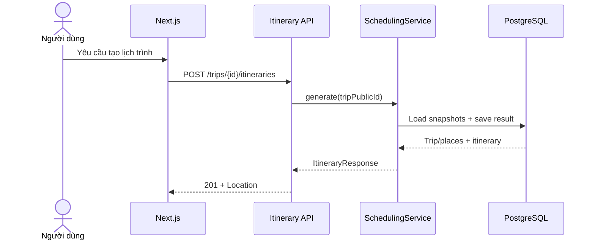

# FEAT-005 — Basic Itinerary Generation / Scheduling V1

> [!summary]
> Sinh và lưu một lịch trình khả thi cho Trip draft một ngày bằng thuật toán greedy deterministic trong Spring Boot. Scheduling V1 lọc active places theo category, environment và ngân sách; xét giờ mở cửa, thời lượng tham quan, khoảng cách Haversine và khung giờ còn lại; sau đó chọn từng địa điểm theo scoring/tie-breaker cố định. Kết quả gồm timeline, ước tính quãng đường/thời gian/chi phí, summary và warnings. Feature không gọi LLM, RAG, context hoặc routing API thật.

## 1. Trạng thái, ưu tiên và phê duyệt

| Thuộc tính | Giá trị |
| --- | --- |
| Trạng thái | `ready-for-review` |
| Độ ưu tiên | `P0 — năng lực cốt lõi của đồ án` |
| Người phụ trách | Nguyễn Bá Tân |
| Feature phụ thuộc | FEAT-001, FEAT-002 và FEAT-004 |
| Backend | Spring Boot modular monolith |
| Module sở hữu | `com.saigonplantravel.backend.scheduling` |
| Module được tham chiếu | `trip`, `place` qua read contracts |
| Database | PostgreSQL, Flyway migration-first |
| API mới | `POST /api/v1/trips/{tripPublicId}/itineraries`, `GET /api/v1/itineraries/{itineraryPublicId}` |
| Thuật toán | `GREEDY_V1` |
| Mốc liên quan | MVP có thể demo trước 30/08/2026 |

### 1.1. Vì sao đây là feature ưu tiên tiếp theo

- FEAT-004 đã chuẩn hóa đầu vào Trip; đây là bước tạo giá trị người dùng cốt lõi tiếp theo.
- Lập lịch theo constraints là phần nghiệp vụ chính phân biệt dự án với một danh mục địa điểm thông thường.
- Greedy deterministic đủ giải thích, kiểm thử và đánh giá trong phạm vi khóa luận; chưa cần tối ưu toán học phức tạp.
- Kết quả V1 tạo baseline để so sánh với routing thật, context động và re-planning trong các feature sau.

### 1.2. Cổng phê duyệt

- Không bắt đầu code nếu Trip draft, Place categories và OpeningHour semantics chưa ổn định.
- `ready-for-review` → `approved`: duyệt thuật toán, scoring, travel estimate, unknown-hours policy, schema và API contract.
- `approved` → `in-progress`: bắt đầu migration/code.
- `in-progress` → `done`: toàn bộ Definition of Done ở mục 19 đạt yêu cầu.
- Nếu quyết định dùng routing API thật ngay trong V1, phải sửa spec và phê duyệt external dependency/secret/cost trước khi triển khai.

## 2. Bối cảnh và vấn đề cần giải quyết

SaigonPlanTravel đã có các dữ liệu nền cần thiết:

- Trip date, time window, budget, origin, pace, environment và category preferences.
- Active place, coordinates, estimated visit duration và cost range.
- Category membership.
- Weekly opening hours với semantics `open`, `closed`, `unknown`.

Chưa có module biến dữ liệu này thành một timeline khả thi. Nếu chỉ sắp xếp theo điểm phù hợp mà không xét travel time, giờ mở cửa và thời lượng tham quan, kết quả có thể vượt khung giờ hoặc đưa người dùng đến nơi đã đóng cửa. Nếu giao toàn bộ quyết định cho LLM, kết quả khó lặp lại, khó kiểm thử và không bảo đảm constraints.

FEAT-005 tạo deterministic baseline trong backend. LLM/RAG chỉ được bổ sung để giải thích sau khi lịch trình đã được thuật toán và constraints kiểm tra.

## 3. Mục tiêu

### 3.1. Mục tiêu sản phẩm

1. Cho phép người dùng tạo một lịch trình từ Trip draft hợp lệ.
2. Trả timeline có thứ tự với thời gian di chuyển, chờ và tham quan.
3. Không vượt trip time window hoặc budget dựa trên minimum cost estimate.
4. Tôn trọng known opening hours và cảnh báo khi giờ mở cửa chưa biết.
5. Cho phép frontend mở lại kết quả qua itinerary `publicId`.
6. Cung cấp warnings minh bạch về giả định và giới hạn ước tính.

### 3.2. Mục tiêu kỹ thuật

- Tạo Scheduling Module riêng trong modular monolith, không microservice.
- Giữ thuật toán pure/deterministic và tách khỏi orchestration/persistence.
- Dùng module-facing DTO/read contracts; không truy cập repository/entity của Trip/Place từ Scheduling.
- Tạo schema Itinerary bằng Flyway và giữ Hibernate `ddl-auto=validate`.
- Snapshot output cần thiết để itinerary không thay đổi khi place/trip được chỉnh sửa sau đó.
- Sinh UUID public cho itinerary; giữ ID nội bộ trong database.
- Không gọi API ngoài hoặc AI trong transaction.
- Đo và lưu bằng chứng feasibility, query count và response time.

### 3.3. Kết quả mong đợi

`POST /api/v1/trips/{tripPublicId}/itineraries` trả `201 Created` nếu chọn được ít nhất một place. Kết quả có itinerary items theo thứ tự, summary, warnings và `Location`. Cùng một input snapshot, candidate data và config phải tạo cùng sequence/times/costs/scores; chỉ UUID và generated timestamp khác.

## 4. Phạm vi

### 4.1. Trong phạm vi

- Trip một ngày, không qua nửa đêm.
- Greedy scheduling `GREEDY_V1`.
- Lọc active places có ít nhất một preferred category.
- Environment eligibility: indoor/outdoor/mixed.
- Budget feasibility dùng `place.minCost`.
- Weekly opening hours theo ngày ISO của trip.
- Cho phép scheduled item có opening hours unknown nhưng phải warning.
- Adjust visit duration theo TravelPace.
- Haversine distance và configurable average speed/fixed transfer overhead.
- Recompute score/feasibility tại mỗi greedy iteration.
- Deterministic score và tie-breakers.
- Cho phép chờ nếu đến trước giờ mở cửa và visit vẫn khả thi.
- Lưu itinerary, items, warnings và generation summary.
- Mỗi lần POST tạo một immutable itinerary version mới.
- GET itinerary bằng UUID public.
- Tính `stale` khi Trip draft đã được cập nhật sau generation snapshot.
- Automated tests, smoke tests và evaluation evidence.
- Cập nhật Scheduling ERD, Itinerary API, algorithm note, development log và `PROJECT_CONTEXT.md`.

### 4.2. Ngoài phạm vi

- Google Routes/Route Matrix, OSRM, GraphHopper hoặc routing API ngoài.
- Dữ liệu giao thông real-time; travel time V1 chỉ là estimate.
- Bắt buộc quay về điểm xuất phát cuối ngày.
- Transport mode, walking/driving/transit selection.
- Multi-day hoặc overnight trip/opening hours.
- Nhiều opening intervals/ngày, lunch break hoặc special/holiday hours.
- Must-visit, blocked places hoặc manual drag-and-drop order.
- Weighted category preferences.
- Meal constraints, accessibility, number of travelers.
- Exact optimization, TSP/VRP, linear programming, genetic algorithm.
- Weather, crowd, event hoặc context score.
- RAG/LLM explanation.
- Re-planning hoặc sửa itinerary đã sinh.
- Confirm/start/complete lifecycle.
- List/pagination itinerary history.
- Delete/archive itinerary.
- Frontend/map polyline implementation.

> [!important]
> `estimatedTravelMinutes` không phải dữ liệu giao thông thật. API và UI phải trình bày đây là ước tính baseline. Không được dùng từ “thời gian di chuyển chính xác” trong demo hoặc báo cáo.

## 5. Tác nhân và user stories

### Tác nhân

- **Khách du lịch ẩn danh:** yêu cầu sinh và xem lịch trình.
- **Next.js frontend:** gọi generate/get API và render timeline/map markers.
- **Scheduling Module:** sở hữu thuật toán và Itinerary aggregate.
- **Trip Module:** cung cấp immutable trip snapshot qua read contract.
- **Place Module:** cung cấp batch place candidates và opening hours qua read contract.

### User stories

**US-001 — Sinh lịch trình**  
Là khách du lịch, tôi muốn tạo timeline từ draft để biết nên đi đâu và vào lúc nào.

**US-002 — Không vượt thời gian**  
Là khách du lịch, tôi muốn mọi địa điểm kết thúc trước giờ kết thúc chuyến đi.

**US-003 — Không vượt ngân sách**  
Là khách du lịch, tôi muốn tổng chi phí tối thiểu ước tính không vượt ngân sách đã nhập.

**US-004 — Xét giờ mở cửa**  
Là khách du lịch, tôi muốn hệ thống loại ngày đóng cửa và chỉ xếp visit nằm trọn trong known opening interval.

**US-005 — Biết giới hạn dữ liệu**  
Là khách du lịch, tôi muốn được cảnh báo khi giờ mở cửa chưa biết hoặc travel/cost chỉ là ước tính.

**US-006 — Mở lại kết quả**  
Là frontend, tôi muốn lấy itinerary đã lưu bằng public UUID để render lại mà không chạy thuật toán lần nữa.

## 6. Luồng người dùng và luồng hệ thống

### 6.1. Luồng chính — generate itinerary

1. Người dùng xác nhận Trip draft và nhấn tạo lịch trình.
2. Frontend gửi `POST /api/v1/trips/{tripPublicId}/itineraries` không có body.
3. Controller chuyển request sang `SchedulingService`.
4. Service lấy Trip snapshot qua Trip Module contract.
5. Service lấy batch place candidates qua Place Module contract.
6. `GreedyItineraryScheduler` lọc và chọn từng item theo policy ở mục 9.
7. Nếu có ít nhất một item, service tạo immutable Itinerary aggregate.
8. Repository lưu itinerary, items và warnings trong một transaction.
9. Mapper tạo response; controller trả `201 Created` và `Location`.



### 6.2. Luồng greedy iteration

1. Bắt đầu tại trip origin, `currentTime = trip.startTime`, `remainingBudget = trip.budget`.
2. Từ unscheduled candidates, tính travel estimate từ current location.
3. Tính arrival, waiting, visit duration và opening-hours feasibility.
4. Loại candidate vượt time/budget/known hours.
5. Tính score cho mọi candidate còn feasible.
6. Chọn candidate cao nhất theo score và tie-breakers.
7. Thêm item; cập nhật location, time, budget; lặp lại.
8. Dừng khi không còn candidate feasible.

### 6.3. Luồng không có itinerary khả thi

1. Không candidate nào có thể được xếp do không active/category mismatch/environment/budget/time/opening hours.
2. API trả `422 NO_FEASIBLE_ITINERARY` với rejection summary.
3. Không lưu empty itinerary.

### 6.4. Luồng partial itinerary

1. Ít nhất một place được xếp nhưng còn thời gian/budget do các candidate khác không khả thi.
2. API vẫn trả `201 Created`.
3. Response có warnings như `UNUSED_TIME_REMAINS` hoặc `LIMITED_CATEGORY_COVERAGE` khi áp dụng.

### 6.5. Luồng lấy itinerary

1. Frontend gọi `GET /api/v1/itineraries/{itineraryPublicId}`.
2. Service load aggregate đã lưu và current trip `updatedAt` qua batch/read contract.
3. Response trả `stale=true` nếu current trip mới hơn snapshot.
4. GET không chạy lại scheduler và không thay đổi output đã lưu.

## 7. Yêu cầu chức năng

| ID | Yêu cầu | Ưu tiên |
| --- | --- | --- |
| FR-001 | Schema itinerary phải được tạo bằng Flyway migrations mới. | Must |
| FR-002 | Hibernate phải validate thành công Itinerary entities với schema. | Must |
| FR-003 | `POST /api/v1/trips/{tripPublicId}/itineraries` phải sinh itinerary từ Trip draft tồn tại. | Must |
| FR-004 | Mỗi generate request thành công phải tạo immutable itinerary version mới. | Must |
| FR-005 | Create response phải trả 201 và `Location: /api/v1/itineraries/{publicId}`. | Must |
| FR-006 | `GET /api/v1/itineraries/{publicId}` phải trả snapshot đã lưu, không regenerate. | Must |
| FR-007 | Malformed UUID trả 400; valid missing Trip/Itinerary UUID trả 404 tương ứng. | Must |
| FR-008 | Scheduler chỉ nhận active place candidates qua Place Module contract. | Must |
| FR-009 | Place phải match ít nhất một preferred category. | Must |
| FR-010 | `INDOOR` chỉ nhận indoor places; `OUTDOOR` chỉ nhận outdoor; `MIXED` không loại theo field này. | Must |
| FR-011 | Candidate chỉ feasible khi `minCost <= remainingBudget`. | Must |
| FR-012 | Total estimated cost phải bằng tổng `minCost` snapshot và không vượt initial budget. | Must |
| FR-013 | Known closed day phải loại candidate. | Must |
| FR-014 | Known open day chỉ feasible nếu toàn bộ visit nằm trong open interval. | Must |
| FR-015 | Unknown opening hours có thể được xếp nhưng item phải có warning/status rõ ràng. | Must |
| FR-016 | Scheduler phải cho phép waiting khi đến trước open time nếu visit vẫn fit. | Must |
| FR-017 | Visit duration phải điều chỉnh theo TravelPace và round-up theo policy. | Must |
| FR-018 | Travel distance/time phải dùng deterministic Haversine estimator/config trong V1. | Must |
| FR-019 | Scheduler phải recompute feasibility/score từ location/time/budget hiện tại ở mỗi iteration. | Must |
| FR-020 | Candidate cao nhất được chọn theo score và deterministic tie-breakers. | Must |
| FR-021 | Không itinerary item nào được overlap hoặc kết thúc sau trip endTime. | Must |
| FR-022 | Sequence phải bắt đầu từ 1, liên tục và unique trong một itinerary. | Must |
| FR-023 | Nếu zero item feasible, API trả 422 và không lưu itinerary. | Must |
| FR-024 | Nếu có ít nhất một item, partial itinerary là thành công và có warnings khi cần. | Must |
| FR-025 | Response phải có items, summary, warnings, algorithmVersion và generatedAt. | Must |
| FR-026 | Itinerary phải snapshot các field place/output cần thiết; GET không phụ thuộc place hiện tại để tái tạo timeline. | Must |
| FR-027 | Response phải tính `stale` từ trip updatedAt hiện tại so với snapshot. | Must |
| FR-028 | Scheduling Module phải dùng Trip/Place read contracts, không truy cập repositories/entities của module khác. | Must |
| FR-029 | Generate operation và persistence phải atomic. | Must |
| FR-030 | Feature không được gọi LLM, RAG, Context hoặc external routing service. | Must |
| FR-031 | Contract FEAT-001–004 phải giữ nguyên. | Must |
| FR-032 | Cùng input/data/config phải tạo cùng sequence/times/costs/scores. | Must |
| FR-033 | Itinerary phải lưu và trả snapshot các tham số travel estimate đã dùng khi generation. | Must |

## 8. Quy tắc nghiệp vụ và giả định V1

| ID | Quy tắc |
| --- | --- |
| BR-001 | Scheduler chỉ hỗ trợ one-day trip, same-day LocalTime. |
| BR-002 | Preferred categories kết hợp OR: match ít nhất một category. |
| BR-003 | `MIXED` nghĩa là chấp nhận indoor và outdoor, không bảo đảm itinerary có cả hai loại. |
| BR-004 | Estimated cost của place bằng `minCost`, không phải giá chính xác. |
| BR-005 | Budget bằng 0 chỉ cho phép place có `minCost = 0`. |
| BR-006 | Missing opening-hours row = `UNKNOWN`, không phải `CLOSED`. |
| BR-007 | Unknown hours được phép để tránh loại sai do thiếu dữ liệu, nhưng có score thấp hơn và warning. |
| BR-008 | Không hỗ trợ visit qua midnight hoặc opening interval qua midnight. |
| BR-009 | Arrival trước open time tạo waiting; waiting tiêu thụ trip window. |
| BR-010 | Không bắt buộc quay lại origin; timeline kết thúc ở place cuối. |
| BR-011 | Haversine là straight-line distance, không phải route distance. |
| BR-012 | Travel estimator default dùng `18 km/h` và fixed overhead `5 phút/leg`; cả hai phải cấu hình được. |
| BR-013 | Travel minutes luôn round-up tới phút nguyên và tối thiểu fixed overhead. |
| BR-014 | Visit duration pace multiplier: RELAXED `1.25`, BALANCED `1.00`, FAST `0.80`. |
| BR-015 | Adjusted visit duration round-up lên bội số 5 phút. |
| BR-016 | Score chỉ dùng dữ liệu deterministic; không dùng random, LLM hoặc current traffic. |
| BR-017 | Item output immutable; generate lại tạo itinerary publicId mới. |
| BR-018 | `stale` chỉ báo Trip draft đã đổi, không tự vô hiệu hóa hoặc xóa itinerary. |

## 9. Đặc tả thuật toán `GREEDY_V1`

### 9.1. Candidate eligibility ban đầu

Place được đưa vào candidate pool khi:

1. `active = true`.
2. Có ít nhất một category giao với Trip preferences.
3. Thỏa environment rule.
4. Có tọa độ, visit duration và minCost hợp lệ theo schema.

Candidate query phải batch-load category IDs và opening hours cho trip day; không gọi detail API/repository một lần cho mỗi place.

### 9.2. Travel estimate

Haversine distance:

```text
a = sin²(Δlat/2) + cos(lat1) × cos(lat2) × sin²(Δlon/2)
c = 2 × atan2(√a, √(1−a))
distanceKm = 6371.0088 × c
```

Travel minutes:

```text
travelMinutes = ceil(distanceKm / averageSpeedKmh × 60 + fixedOverheadMinutes)
```

Default config:

```yaml
scheduling:
  algorithm-version: GREEDY_V1
  average-speed-kmh: 18
  fixed-transfer-minutes: 5
```

- Dùng full precision trong tính toán; chỉ round distance khi lưu/serialize.
- Config values phải `> 0` cho speed và `>= 0` cho overhead.

### 9.3. Adjusted visit duration

```text
raw = estimatedVisitMinutes × paceMultiplier
adjusted = ceil(raw / 5) × 5
```

| Pace | Multiplier |
| --- | --- |
| `RELAXED` | `1.25` |
| `BALANCED` | `1.00` |
| `FAST` | `0.80` |

### 9.4. Time feasibility

Cho current state và một candidate:

1. `arrival = currentTime + travelMinutes`.
2. Nếu known open và arrival trước open time: `visitStart = openTime`, waiting là chênh lệch.
3. Nếu known open và arrival sau/equal open time: `visitStart = arrival`.
4. Nếu unknown: `visitStart = arrival`.
5. `visitEnd = visitStart + adjustedVisitMinutes`.
6. Feasible khi `visitEnd <= trip.endTime` và, nếu known open, `visitEnd <= closeTime`.
7. Known closed luôn infeasible.

### 9.5. Scoring

Tính tại mỗi iteration cho candidate feasible:

```text
categoryScore = 50 × matchedPreferenceCount / totalPreferenceCount
distanceScore = 25 / (1 + distanceKm)

if remainingBudget = 0:
    costScore = 15 if minCost = 0 else 0
else:
    costScore = 15 × (1 − min(minCost / remainingBudget, 1))

openingScore = 10 if KNOWN_OPEN else 0
totalScore = categoryScore + distanceScore + costScore + openingScore
```

- Dùng `BigDecimal`/defined rounding hoặc numeric policy nhất quán cho score.
- Chuyển distance dùng cho scoring thành decimal scale 6 `HALF_UP`; tính từng component/total ở scale 8 `HALF_UP`.
- Comparison dùng total score scale 8; lưu/serialize score scale 4 `HALF_UP`.

### 9.6. Tie-breakers

Khi total score bằng nhau theo comparison policy:

1. Distance tăng dần.
2. `minCost` tăng dần.
3. Place name tăng dần bằng Java `String.compareTo` trên giá trị snapshot để không phụ thuộc database collation.
4. Place internal ID tăng dần.

### 9.7. State update và stop condition

Sau khi chọn candidate:

- `currentLocation = candidate.coordinates`.
- `currentTime = visitEnd`.
- `remainingBudget -= minCost`.
- Remove candidate khỏi unscheduled set.
- Lặp lại cho tới khi không còn feasible candidate.

Không có random shuffle. Candidate collection phải được canonical-sort trước khi evaluation để iteration order của `Set`/database không ảnh hưởng kết quả.

## 10. Warnings và rejection semantics

### 10.1. Warning codes

| Code | Cấp | Khi xuất hiện |
| --- | --- | --- |
| `TRAVEL_TIME_ESTIMATED` | Itinerary | Luôn có trong GREEDY_V1 vì không dùng routing thật |
| `COST_USES_MINIMUM_ESTIMATE` | Itinerary | Luôn có vì total dùng `minCost` |
| `OPENING_HOURS_UNKNOWN` | Item | Scheduled place không có opening-hours row cho trip day |
| `UNUSED_TIME_REMAINS` | Itinerary | Còn ít nhất 60 phút nhưng không có candidate feasible |
| `LIMITED_CATEGORY_COVERAGE` | Itinerary | Không phải mọi preferred category đều xuất hiện trong items |

Warnings là deterministic và không do LLM viết.

### 10.2. Zero-item rejection summary

`422 NO_FEASIBLE_ITINERARY` có thể trả counts:

- `candidatePoolSize`.
- `rejectedByEnvironment`.
- `rejectedByBudget`.
- `rejectedByOpeningHours`.
- `rejectedByTimeWindow`.

Một candidate có thể bị tính ở reason đầu tiên theo fixed validation order để tổng counts dễ giải thích; order phải được ghi trong code/test.

## 11. Đặc tả dữ liệu

### 11.1. Bảng `itineraries`

| Cột | Kiểu đề xuất | Null | Ràng buộc/Ghi chú |
| --- | --- | --- | --- |
| `id` | `BIGINT GENERATED BY DEFAULT AS IDENTITY` | No | Primary key nội bộ |
| `public_id` | `UUID` | No | Unique, sinh ở application |
| `trip_id` | `BIGINT` | No | FK → `trips(id)`, `ON DELETE RESTRICT` |
| `trip_updated_at_snapshot` | `TIMESTAMPTZ` | No | Dùng tính stale |
| `trip_date` | `DATE` | No | Snapshot |
| `window_start` | `TIME` | No | Snapshot |
| `window_end` | `TIME` | No | Snapshot |
| `origin_label` | `VARCHAR(255)` | No | Snapshot |
| `origin_latitude` | `NUMERIC(9,6)` | No | Snapshot |
| `origin_longitude` | `NUMERIC(10,6)` | No | Snapshot |
| `initial_budget` | `NUMERIC(12,2)` | No | Snapshot |
| `total_estimated_cost` | `NUMERIC(12,2)` | No | Sum item cost |
| `remaining_budget` | `NUMERIC(12,2)` | No | Initial − total |
| `total_travel_minutes` | `INTEGER` | No | Sum item travel |
| `total_visit_minutes` | `INTEGER` | No | Sum item visit |
| `total_waiting_minutes` | `INTEGER` | No | Sum item waiting |
| `remaining_minutes` | `INTEGER` | No | Trip end − last visit end |
| `candidate_count` | `INTEGER` | No | Candidate pool size |
| `scheduled_count` | `INTEGER` | No | Number of items |
| `algorithm_version` | `VARCHAR(40)` | No | `GREEDY_V1` |
| `average_speed_kmh` | `NUMERIC(6,2)` | No | Config snapshot, `> 0` |
| `fixed_transfer_minutes` | `INTEGER` | No | Config snapshot, `>= 0` |
| `generated_at` | `TIMESTAMPTZ` | No | Injected Clock |

Constraints:

- Numeric/minute/count fields không âm.
- `window_start < window_end`.
- `total_estimated_cost <= initial_budget`.
- `remaining_budget = initial_budget - total_estimated_cost` nếu check expression được giữ rõ.
- `scheduled_count > 0` và bằng item count được xác minh ở service/integration test.

### 11.2. Bảng `itinerary_items`

| Cột | Kiểu đề xuất | Null | Ràng buộc/Ghi chú |
| --- | --- | --- | --- |
| `id` | `BIGINT GENERATED BY DEFAULT AS IDENTITY` | No | Primary key |
| `itinerary_id` | `BIGINT` | No | FK → itineraries, `ON DELETE CASCADE` |
| `sequence_no` | `INTEGER` | No | Unique per itinerary, `> 0` |
| `place_id` | `BIGINT` | No | FK → places, `ON DELETE RESTRICT` |
| `place_name` | `VARCHAR(160)` | No | Snapshot |
| `place_slug` | `VARCHAR(180)` | No | Snapshot |
| `address` | `VARCHAR(255)` | No | Snapshot |
| `district` | `VARCHAR(100)` | No | Snapshot |
| `latitude` | `NUMERIC(9,6)` | No | Snapshot |
| `longitude` | `NUMERIC(10,6)` | No | Snapshot |
| `travel_minutes_from_previous` | `INTEGER` | No | `>= 0` |
| `distance_km_from_previous` | `NUMERIC(8,3)` | No | `>= 0` |
| `arrival_time` | `TIME` | No | Timeline |
| `waiting_minutes` | `INTEGER` | No | `>= 0` |
| `visit_start` | `TIME` | No | Timeline |
| `visit_end` | `TIME` | No | Timeline |
| `visit_minutes` | `INTEGER` | No | Adjusted duration |
| `estimated_cost` | `NUMERIC(12,2)` | No | Place minCost snapshot |
| `score` | `NUMERIC(10,4)` | No | Selection score |
| `opening_hours_status` | `VARCHAR(20)` | No | `KNOWN_OPEN`/`UNKNOWN` |

Constraints tối thiểu:

- Unique `(itinerary_id, sequence_no)`.
- Unique `(itinerary_id, place_id)` để một place không lặp trong itinerary.
- `arrival_time <= visit_start < visit_end`.
- Nonnegative numeric fields.

### 11.3. Bảng `itinerary_warnings`

| Cột | Kiểu đề xuất | Null | Ràng buộc/Ghi chú |
| --- | --- | --- | --- |
| `id` | `BIGINT GENERATED BY DEFAULT AS IDENTITY` | No | Primary key |
| `itinerary_id` | `BIGINT` | No | FK → itineraries, `ON DELETE CASCADE` |
| `itinerary_item_id` | `BIGINT` | Yes | FK → items, `ON DELETE CASCADE` |
| `code` | `VARCHAR(60)` | No | Check approved codes |
| `message` | `VARCHAR(500)` | No | Deterministic template text |

- Itinerary-level warning có `itinerary_item_id = NULL`.
- Item warning tham chiếu đúng item cùng itinerary; cross-parent integrity được bảo vệ ở service/test nếu schema check không đủ rõ.

### 11.4. Migration dự kiến

Nếu FEAT-004 kết thúc ở `V10__create_trip_category_preferences_table.sql`:

```text
V11__create_itineraries_table.sql
V12__create_itinerary_items_table.sql
V13__create_itinerary_warnings_table.sql
```

Kiểm tra version thực tế trước khi tạo. Không sửa migrations cũ và không seed itinerary giả trong production-like migration.

## 12. Module boundary và application contracts

### 12.1. Ownership

- Scheduling Module sở hữu Itinerary aggregate, algorithm và API.
- Trip Module sở hữu Trip aggregate và cung cấp `TripSchedulingSnapshot`.
- Place Module sở hữu Place/Category/OpeningHour và cung cấp `PlaceSchedulingCandidate` batch list.
- Scheduling không import Trip/Place JPA Entity hoặc repositories.
- Database FK giữa module tables được chấp nhận trong modular monolith.

### 12.2. Trip read contract đề xuất

```java
public interface TripSchedulingQuery {
    TripSchedulingSnapshot getByPublicId(UUID publicId);
    Instant getUpdatedAtByInternalId(Long tripId);
}
```

Snapshot gồm internal ID cho FK, publicId, date/window, budget, origin, pace, environment, preferred category IDs và updatedAt. Không trả Trip Entity.

### 12.3. Place read contract đề xuất

```java
public interface PlaceSchedulingQuery {
    List<PlaceSchedulingCandidate> findCandidates(
            Set<Long> preferredCategoryIds,
            LocalDate tripDate
    );
}
```

Candidate DTO gồm internal ID, public summary/snapshot fields, indoor, minCost, base visit minutes, matched category IDs và opening status/interval cho đúng trip day.

- Query phải batch-load và canonical-sort.
- Place Module chịu trách nhiệm diễn giải missing row thành `UNKNOWN`, không tự biến thành closed.
- Scheduling Module vẫn quyết định feasibility/scoring.

## 13. API contract

### 13.1. Generate itinerary

```http
POST /api/v1/trips/{tripPublicId}/itineraries
Accept: application/json
```

- Không request body trong V1.
- Không authentication trong anonymous demo MVP.
- Mỗi call thành công tạo itinerary version mới.

Response:

```http
HTTP/1.1 201 Created
Location: /api/v1/itineraries/76aab24a-1938-449f-a12c-0cd273710afa
Content-Type: application/json
```

### 13.2. Get itinerary

```http
GET /api/v1/itineraries/{itineraryPublicId}
Accept: application/json
```

GET trả snapshot đã lưu và computed `stale`; không chạy scheduler.

### 13.3. Response thành công

```json
{
  "publicId": "76aab24a-1938-449f-a12c-0cd273710afa",
  "tripPublicId": "7a674ef0-57c8-4d0e-b99b-dccfd342fc98",
  "algorithmVersion": "GREEDY_V1",
  "generatedAt": "2026-07-17T06:00:00Z",
  "stale": false,
  "assumptions": {
    "travelEstimator": "HAVERSINE",
    "averageSpeedKmh": 18.00,
    "fixedTransferMinutes": 5,
    "costBasis": "MIN_COST"
  },
  "tripWindow": {
    "tripDate": "2026-08-20",
    "startTime": "08:00",
    "endTime": "18:00"
  },
  "items": [
    {
      "sequence": 1,
      "place": {
        "id": 1,
        "name": "Địa điểm demo A",
        "slug": "dia-diem-demo-a",
        "address": "Địa chỉ demo, TP.HCM",
        "district": "Quận 1",
        "latitude": 10.776889,
        "longitude": 106.700806
      },
      "travel": {
        "estimatedMinutes": 12,
        "straightLineDistanceKm": 2.100
      },
      "arrivalTime": "08:12",
      "waitingMinutes": 0,
      "visitStart": "08:12",
      "visitEnd": "09:42",
      "visitMinutes": 90,
      "estimatedCost": 0.00,
      "score": 71.4286,
      "openingHoursStatus": "KNOWN_OPEN"
    }
  ],
  "summary": {
    "candidateCount": 12,
    "scheduledCount": 4,
    "totalEstimatedCost": 350000.00,
    "remainingBudget": 150000.00,
    "totalTravelMinutes": 75,
    "totalVisitMinutes": 330,
    "totalWaitingMinutes": 10,
    "remainingMinutes": 185
  },
  "warnings": [
    {
      "code": "TRAVEL_TIME_ESTIMATED",
      "message": "Travel time uses a straight-line distance estimate, not live routing.",
      "itemSequence": null
    },
    {
      "code": "OPENING_HOURS_UNKNOWN",
      "message": "Opening hours are not verified for this visit date.",
      "itemSequence": 3
    }
  ]
}
```

> [!note]
> Example dùng dữ liệu demo và contract minh họa; không phải itinerary thực đã được xác minh.

### 13.4. Response DTO outline

```java
public record ItineraryResponse(
        UUID publicId,
        UUID tripPublicId,
        String algorithmVersion,
        Instant generatedAt,
        boolean stale,
        SchedulingAssumptionsResponse assumptions,
        TripWindowResponse tripWindow,
        List<ItineraryItemResponse> items,
        ItinerarySummaryResponse summary,
        List<ItineraryWarningResponse> warnings
) {}
```

Không trả Entity hoặc Jackson serialization mặc định của aggregate.

### 13.5. Error responses

| Trường hợp | HTTP | Code |
| --- | --- | --- |
| Malformed UUID | 400 | `INVALID_REQUEST` |
| Trip không tồn tại | 404 | `TRIP_NOT_FOUND` |
| Itinerary không tồn tại | 404 | `ITINERARY_NOT_FOUND` |
| Trip/candidate data vi phạm invariant | 409 | `SCHEDULING_DATA_CONFLICT` |
| Không có item khả thi | 422 | `NO_FEASIBLE_ITINERARY` |
| Config scheduling invalid | 500/startup failure | Không chạy bằng default ẩn |

Ví dụ 422:

```json
{
  "status": 422,
  "code": "NO_FEASIBLE_ITINERARY",
  "message": "No place can be scheduled within the current constraints",
  "path": "/api/v1/trips/7a674ef0-57c8-4d0e-b99b-dccfd342fc98/itineraries",
  "details": {
    "candidatePoolSize": 8,
    "rejectedByBudget": 2,
    "rejectedByOpeningHours": 3,
    "rejectedByTimeWindow": 3
  }
}
```

Common error envelope hiện có được ưu tiên; tên fields trong example không buộc tạo contract cạnh tranh.

## 14. Yêu cầu phi chức năng

| ID | Yêu cầu |
| --- | --- |
| NFR-001 | Với tối đa 100 candidates, generate local không external I/O có mục tiêu dưới 1 giây sau warm-up; ghi môi trường/dataset. |
| NFR-002 | Candidate/trip data phải được batch-load; không N+1 theo số place/hour/category. |
| NFR-003 | Algorithm time complexity mục tiêu O(n²) tối đa cho greedy V1 với n ≤ 100. |
| NFR-004 | Cùng snapshots/config tạo output deterministic ngoài UUID/generatedAt. |
| NFR-005 | Generate persistence atomic; lỗi không để itinerary/items/warnings một phần. |
| NFR-006 | Không network/AI call trong generate transaction. |
| NFR-007 | Dùng BigDecimal cho cost/score policy cần chính xác; không cộng tiền bằng double. |
| NFR-008 | JSON không lộ internal itinerary/trip IDs, Entity, Hibernate proxy hoặc SQL. |
| NFR-009 | Logs ghi algorithm version, counts, duration và outcome; không log full origin/personal payload. |
| NFR-010 | PostgreSQL integration tests bao phủ constraints, ordering và aggregate persistence. |
| NFR-011 | `./mvnw test`, Flyway, Hibernate validate và smoke tests phải pass. |
| NFR-012 | Algorithm/config constants tập trung, có validation và được ghi vào algorithm note/report. |

## 15. Tiêu chí chấp nhận

### AC-001 — Migrations và startup

**Given** database đã có Place/Trip schema  
**When** backend khởi động với migrations mới  
**Then** ba scheduling tables được tạo đúng một lần và Hibernate validate thành công.

### AC-002 — Generate happy path

**Given** Trip hợp lệ và có nhiều candidates khả thi  
**When** gọi generate API  
**Then** API trả 201, Location và itinerary có ít nhất một item đúng contract.

### AC-003 — Active/category/environment eligibility

**Given** candidates gồm inactive, category mismatch, environment mismatch và matching places  
**When** generate  
**Then** chỉ matching active/environment-eligible places được xem xét/xếp.

### AC-004 — Budget constraint

**Given** candidates có minCost khác nhau và trip budget giới hạn  
**When** generate  
**Then** mỗi selection không vượt remaining budget và totalEstimatedCost không vượt initial budget.

### AC-005 — Zero budget

**Given** trip budget bằng 0 và có free/paid places  
**When** generate  
**Then** chỉ places có minCost bằng 0 được xếp.

### AC-006 — Known closed/open/unknown hours

**Given** ba places lần lượt closed, known open và unknown vào trip day  
**When** generate  
**Then** closed bị loại, known open phải fit interval, unknown có thể được xếp kèm warning.

### AC-007 — Waiting before opening

**Given** arrival trước open time và còn đủ thời gian visit  
**When** candidate được chọn  
**Then** visitStart bằng openTime, waitingMinutes đúng và timeline vẫn không overlap.

### AC-008 — Opening close/time-window feasibility

**Given** visit sẽ kết thúc sau closeTime hoặc trip endTime  
**When** evaluate candidate  
**Then** candidate bị loại tại iteration đó.

### AC-009 — Travel estimate

**Given** fixed origin/place coordinates và config 18 km/h + 5 phút  
**When** estimate travel  
**Then** distance/travel minutes khớp Haversine/formula/rounding đã định nghĩa.

### AC-010 — Pace adjustment

**Given** place có base duration cố định  
**When** schedule với RELAXED/BALANCED/FAST  
**Then** duration lần lượt áp dụng 1.25/1.00/0.80 và round-up 5 phút.

### AC-011 — Score và tie-breakers

**Given** candidate fixtures có score bằng/khác nhau  
**When** scheduler chọn item  
**Then** score formula và tie-breaker order cho kết quả đúng, không phụ thuộc insertion order.

### AC-012 — Recompute mỗi iteration

**Given** candidate gần origin nhưng xa place vừa chọn và candidate khác trở nên gần hơn  
**When** qua iteration tiếp theo  
**Then** distance/score/feasibility được tính lại từ current state trước khi chọn.

### AC-013 — Timeline invariants

**Given** itinerary sinh thành công  
**When** kiểm tra items  
**Then** sequence liên tục, không place lặp, không overlap và item cuối không vượt trip end.

### AC-014 — Zero feasible item

**Given** không candidate nào khả thi  
**When** generate  
**Then** API trả `422 NO_FEASIBLE_ITINERARY`, có rejection summary và không lưu aggregate.

### AC-015 — Partial itinerary warnings

**Given** ít nhất một item khả thi nhưng còn ≥60 phút và không candidate nào tiếp theo fit  
**When** generate  
**Then** API trả 201 với `UNUSED_TIME_REMAINS` cùng các warning bắt buộc khác.

### AC-016 — Immutable generation versions

**Given** cùng trip gọi generate hai lần  
**When** cả hai thành công  
**Then** tạo hai itinerary publicIds khác nhau; GET từng ID trả snapshot riêng.

### AC-017 — Determinism

**Given** cùng Trip/Place snapshots, config và Clock-equivalent generated context  
**When** chạy algorithm nhiều lần  
**Then** sequence, timeline, costs, scores và warnings giống nhau ngoài identity/timestamp.

### AC-018 — Stale detection

**Given** itinerary được sinh rồi Trip draft được PUT cập nhật  
**When** GET itinerary cũ  
**Then** output snapshot không đổi và `stale=true`.

### AC-019 — Module boundaries và batch loading

**Given** generate với tối đa 100 places  
**When** review imports/query logs  
**Then** Scheduling không dùng Trip/Place repositories/entities, candidate data được batch-load và không N+1.

### AC-020 — No AI/external side effects

**Given** generate thành công/thất bại  
**When** kiểm tra dependency calls  
**Then** không gọi LLM, RAG, context, weather, routing hoặc map services.

### AC-021 — Persistence constraints/atomicity

**Given** insert vi phạm UUID/sequence/place duplicate/time/cost hoặc transaction fail giữa aggregate  
**When** PostgreSQL/transaction xử lý  
**Then** constraint từ chối và không để partial records.

### AC-022 — Regression và full verification

**Given** FEAT-005 hoàn tất  
**When** chạy full suite, startup, generate/get smoke tests và regression FEAT-001–004  
**Then** mọi test pass và development log có bằng chứng.

### AC-023 — Algorithm config snapshot

**Given** itinerary đã được sinh với speed/overhead config xác định rồi application config thay đổi  
**When** GET itinerary cũ  
**Then** response vẫn trả assumptions snapshot ban đầu và output items không thay đổi.

## 16. Ma trận truy vết

| Nhóm yêu cầu | Acceptance criteria | Bằng chứng dự kiến |
| --- | --- | --- |
| FR-001–FR-007 | AC-001–AC-002, AC-016, AC-018 | Migration/API/persistence tests |
| FR-008–FR-017 | AC-003–AC-008, AC-010 | Eligibility/feasibility unit tests |
| FR-018–FR-020 | AC-009, AC-011–AC-012 | Estimator/scorer/determinism tests |
| FR-021–FR-027 | AC-013–AC-018 | Timeline/response/stale tests |
| FR-028–FR-033 | AC-019–AC-023 | Architecture, config snapshot, regression/full suite |

## 17. Kế hoạch triển khai file-by-file

> [!warning]
> Chỉ triển khai sau approval. Tên/version migration và file là dự kiến; phải inspect repository thật và không tạo abstraction trùng.

### Phase A — Preflight và contract approval

- [ ] Xác nhận FEAT-001/002/004 implementation và contracts thực tế đã ổn định.
- [ ] Đọc root `AGENTS.md`, `PROJECT_CONTEXT.md`, nearest `AGENTS.md`, specs, ERDs, API notes.
- [ ] Inspect migration versions, entities, Clock/config/error patterns và test infrastructure.
- [ ] Duyệt unknown-hours policy, Haversine config, score/tie-breakers, immutable versions và 422 behavior.
- [ ] Ghi/duyệt algorithm note trước code.
- [ ] Chuyển frontmatter `status` thành `approved`.

### Phase B — Flyway migrations

- [ ] Tạo `V11__create_itineraries_table.sql` hoặc next valid version.
- [ ] Tạo `V12__create_itinerary_items_table.sql` hoặc next valid version.
- [ ] Tạo `V13__create_itinerary_warnings_table.sql` hoặc next valid version.
- [ ] Thêm named constraints, FKs, unique indexes và delete actions.
- [ ] Chạy migrations trên database sạch và database có FEAT-001–004.
- [ ] Xác minh restart, checksums và Hibernate baseline.

### Phase C — Cross-module read contracts

- [ ] Tạo/tái sử dụng `trip/service/TripSchedulingQuery.java` và immutable snapshot DTO.
- [ ] Implement batch preferred-category snapshot without exposing Trip Entity.
- [ ] Tạo/tái sử dụng `place/service/PlaceSchedulingQuery.java` và candidate DTO.
- [ ] Implement one batch candidate query/load cho active places, categories và trip-day hours.
- [ ] Canonical-sort output; giữ `UNKNOWN` semantics.
- [ ] Test no Entity/repository leakage và query count.

### Phase D — Pure scheduling algorithm

- [ ] Tạo `scheduling/domain/GreedyItineraryScheduler.java`.
- [ ] Tạo `scheduling/domain/HaversineTravelEstimator.java`.
- [ ] Tạo `scheduling/domain/PlaceCandidateScorer.java`.
- [ ] Tạo `scheduling/domain/SchedulingPolicy.java`/config properties.
- [ ] Tạo input/output value records cho pure algorithm.
- [ ] Implement eligibility, time feasibility, pace, score, tie-breakers, warnings và rejection counts.
- [ ] Không dùng Spring/repository/clock/network trong algorithm core.

### Phase E — Itinerary aggregate và persistence

- [ ] Tạo `scheduling/entity/Itinerary.java`.
- [ ] Tạo `scheduling/entity/ItineraryItem.java`.
- [ ] Tạo `scheduling/entity/ItineraryWarning.java`.
- [ ] Tạo enums `OpeningHoursStatus`, `ItineraryWarningCode`, algorithm version constant.
- [ ] Aggregate factory bảo đảm item sequence/summary/warning invariants.
- [ ] Tạo `scheduling/repository/ItineraryRepository.java` lookup by publicId.
- [ ] Không dùng Lombok `@Data`, Entity serialization hoặc public setters toàn class.

### Phase F — DTO, mapper, service và controller

- [ ] Tạo response records cho itinerary header/window/item/place/travel/summary/warning.
- [ ] Tạo `scheduling/mapper/ItineraryMapper.java`.
- [ ] Tạo `scheduling/service/SchedulingService.java` cho orchestration/transaction.
- [ ] Generate load snapshots → run pure algorithm → persist atomically → map response.
- [ ] GET load aggregate + current trip updatedAt → compute stale → map snapshot.
- [ ] Tạo exceptions `ItineraryNotFoundException`, `NoFeasibleItineraryException`, data conflict nếu cần.
- [ ] Tạo `scheduling/controller/ItineraryController.java` với POST/GET routes.
- [ ] Tái sử dụng common error handler và constructor injection.

### Phase G — Automated tests

- [ ] Haversine estimator fixtures/rounding/config validation.
- [ ] Pace multiplier/round-up tests.
- [ ] Eligibility tests cho active/category/environment/budget.
- [ ] Opening known/closed/unknown/wait/close boundary tests.
- [ ] Score/tie-breaker/canonical order/determinism tests.
- [ ] Multi-iteration recompute và timeline invariant tests.
- [ ] Zero-feasible/partial warnings/rejection counts tests.
- [ ] Aggregate/mapper/service/transaction/stale tests.
- [ ] Controller tests cho 201/400/404/409/422 và JSON/Location.
- [ ] PostgreSQL migration/constraint/batch query integration tests.
- [ ] Regression tests FEAT-001–004.
- [ ] Chạy toàn bộ `./mvnw test` từ `backend/`.

### Phase H — Smoke test và evaluation evidence

- [ ] Chạy PostgreSQL theo `infra/compose.yaml` và start backend.
- [ ] Kiểm tra Flyway/Hibernate logs.
- [ ] Tạo Trip fixtures cho happy, zero-budget, closed, unknown-hours và no-feasible cases.
- [ ] POST generate, lưu Location, GET itinerary.
- [ ] PUT Trip rồi GET itinerary cũ để kiểm tra stale.
- [ ] Chạy cùng snapshot nhiều lần và diff normalized outputs.
- [ ] Ghi response time, candidate count, query count và algorithm config.
- [ ] Review `git diff`; không secret, migration cũ, network/AI dependency hoặc file ngoài scope.

### Phase I — Cập nhật tài liệu

- [ ] Tạo/cập nhật `docs/03-Database/Scheduling-Module-ERD.md`.
- [ ] Tạo/cập nhật `docs/04-API/Itinerary-API.md`.
- [ ] Tạo `docs/05-Algorithms/Greedy-Scheduling-V1.md` với formulas, pseudocode, complexity và assumptions.
- [ ] Cập nhật module-boundary/architecture note với Trip/Place read contracts.
- [ ] Thêm development log gồm decisions, failures, test/query/performance evidence.
- [ ] Cập nhật `PROJECT_CONTEXT.md`: FEAT-005 hoàn tất và feature kế tiếp.
- [ ] Liên kết spec ↔ ERD ↔ API ↔ algorithm note ↔ log.
- [ ] Đổi spec thành `status: done` khi DoD đạt.

## 18. Chiến lược kiểm thử và đánh giá

### 18.1. Pure unit tests

- Mỗi formula/rule với fixed fixtures.
- Boundary exact open/close/trip end.
- Decimal/rounding/tie behavior.
- Candidate insertion order permutations cho determinism.

### 18.2. Service/transaction tests

- Snapshot orchestration và module calls.
- Zero-feasible không persist.
- Failure giữa item/warning persistence rollback toàn bộ.
- New version per POST và stale detection.

### 18.3. Web slice tests

- Route, UUID parsing, status, Location và error envelope.
- JSON LocalTime/Instant/BigDecimal shapes.
- Snapshot response không lộ internal IDs.

### 18.4. PostgreSQL integration tests

- Flyway + Hibernate validate.
- All unique/check/FK constraints.
- Aggregate loading order và no N+1.
- Item/warning cascade behavior.

### 18.5. Evaluation dataset

Chuẩn bị ít nhất các scenarios có nhãn demo:

1. Nhiều candidate khả thi.
2. Budget bằng 0.
3. Place đóng cửa.
4. Place mở muộn cần waiting.
5. Opening hours unknown.
6. Khung giờ quá ngắn.
7. Candidate tie score.
8. RELAXED vs FAST.

Chỉ số ghi trong báo cáo:

- Constraint violation count phải bằng 0.
- Scheduled place count.
- Total/remaining time và budget.
- Runtime theo candidate count.
- Determinism across repeated runs.
- Warning coverage.

### 18.6. Smoke test

```bash
curl -i -X POST \
  http://localhost:8080/api/v1/trips/{tripPublicId}/itineraries

curl -i \
  http://localhost:8080/api/v1/itineraries/{itineraryPublicId}
```

## 19. Definition of Done

Feature chỉ được đánh dấu `done` khi:

- [ ] Dependency baseline và FEAT-005 spec/algorithm đã được phê duyệt.
- [ ] Implementation không vượt phạm vi mục 4.
- [ ] Flyway migrations chạy sạch/hiện có và không sửa migration cũ.
- [ ] Hibernate `ddl-auto=validate` pass.
- [ ] Generate/get API đúng contract, status và errors.
- [ ] Algorithm đúng eligibility, budget, hours, pace, travel, score và tie-breakers.
- [ ] Timeline không overlap/vượt trip end; total cost không vượt budget.
- [ ] Unknown hours và estimates có warnings đúng.
- [ ] Zero-feasible trả 422 và không persist; partial itinerary persist đúng.
- [ ] Output deterministic ngoài identity/timestamp.
- [ ] Algorithm/travel config snapshot được lưu và trả đúng.
- [ ] Immutable versions và stale detection đúng.
- [ ] Module boundaries/batch loading/no N+1 được xác minh.
- [ ] Không external routing, AI, context hoặc LLM call.
- [ ] PostgreSQL/automated/regression/smoke tests pass.
- [ ] Performance/evaluation evidence được ghi.
- [ ] `git diff` không secret, migration cũ hoặc thay đổi ngoài scope.
- [ ] ERD, API, algorithm note, development log và `PROJECT_CONTEXT.md` đã cập nhật.

## 20. Rủi ro và quyết định

### 20.1. Rủi ro và giảm thiểu

| Rủi ro | Tác động | Giảm thiểu |
| --- | --- | --- |
| Greedy bị kỳ vọng là tối ưu toàn cục | Đánh giá sai chất lượng | Gọi rõ baseline; đánh giá constraints/determinism, không tuyên bố optimal |
| Haversine khác route thực | Timeline lệch | Warning + config + routing integration feature sau |
| Dùng minCost quá lạc quan | Chi phí thực cao hơn | Warning `COST_USES_MINIMUM_ESTIMATE`; provenance/data improvement sau |
| Unknown hours được xếp | Có thể đến nơi đóng cửa | Penalty score + item warning; UI phải hiển thị |
| Unknown hours bị loại hết | Không tạo được lịch do thiếu data | Policy allow-with-warning đã chốt |
| Score bằng double không ổn định | Tie khác giữa runs | Defined numeric/rounding/comparison policy + tests |
| Cross-module Entity/repository coupling | Modular boundary suy yếu | Snapshot/read contracts và import review |
| Candidate query N+1 | Generate chậm | Batch query/load + query-count integration test |
| Transaction chứa external call | Lock lâu/thất bại khó kiểm soát | Không network/AI trong V1 |
| Scope kéo sang context/RAG/replan | Trễ core scheduling | Để feature riêng sau baseline |
| Nhiều generation versions tăng storage | Dữ liệu tích lũy | MVP nhỏ; retention/list/delete feature sau |

### 20.2. Quyết định đã chốt

| ID | Quyết định | Lý do |
| --- | --- | --- |
| DEC-001 | Greedy deterministic, không optimizer/LLM. | Dễ giải thích, test và phù hợp MVP. |
| DEC-002 | Haversine + 18 km/h + 5 phút, config được. | Không cần external dependency/secret cho baseline. |
| DEC-003 | TravelPace điều chỉnh visit duration. | Biến preference thành behavior định lượng rõ. |
| DEC-004 | Cost dùng minCost. | Có dữ liệu sẵn; output ghi rõ là minimum estimate. |
| DEC-005 | Unknown hours allowed with penalty/warning. | Không loại sai do dữ liệu thiếu. |
| DEC-006 | Closed/known interval là hard constraints. | Bảo đảm feasibility với dữ liệu đã biết. |
| DEC-007 | Preferred categories là OR eligibility. | Tăng candidate pool; score thưởng nhiều category match. |
| DEC-008 | MIXED không bảo đảm cân bằng indoor/outdoor. | Tránh thêm diversity optimizer vào V1. |
| DEC-009 | Mỗi POST tạo immutable version. | Giữ lịch sử và hỗ trợ stale/replan sau. |
| DEC-010 | Zero item trả 422; partial item trả 201. | Phân biệt không có giá trị với kết quả dùng được nhưng chưa đầy. |
| DEC-011 | Warnings là deterministic templates. | Không cần LLM và dễ test/localize sau. |
| DEC-012 | Không quay về origin. | Giảm route/time complexity; phải nêu rõ trong UI. |

## 21. Feature kế tiếp đề xuất

Sau FEAT-005, ưu tiên gần nhất:

**FEAT-006 — Itinerary Map & Routing Estimate Integration**

Candidate scope:

- Frontend render marker order và polyline.
- Tích hợp một routing provider được phê duyệt cho distance/travel time.
- Cache/fallback policy.
- So sánh Haversine baseline với route estimates.
- Không thay đổi scoring/scheduling contract âm thầm.

RAG explanation, weather/context và dynamic re-planning tiếp tục là feature riêng sau khi itinerary baseline chạy ổn định.

## 22. Liên kết với prototype và báo cáo khóa luận

### Prototype mobile-first

- Nút tạo lịch gọi generate API.
- Timeline dùng `travel`, `arrival`, `waiting`, `visitStart/End`.
- Map dùng item coordinates và sequence; polyline route thật chưa thuộc feature.
- Warnings phải hiển thị rõ, đặc biệt unknown hours/travel/cost estimates.
- Nếu `stale=true`, UI yêu cầu generate lại thay vì tự sửa output.

### Báo cáo khóa luận

- **Chương 3 — Phân tích và thiết kế:** Scheduling Module, constraints, state, schema và module contracts.
- **Chương 3 — Thuật toán:** pseudocode greedy, Haversine, scoring, complexity O(n²), deterministic tie-breakers.
- **Chương 3 — Cài đặt:** pure algorithm + orchestration + aggregate persistence.
- **Chương 4 — Thực nghiệm:** 8 scenario dataset, constraint violations, runtime, determinism và limitations so với route thực.

Không mô tả GREEDY_V1 là thuật toán tối ưu. Dùng cụm “heuristic baseline tạo lịch khả thi theo các ràng buộc đã biết”.

## 23. Lịch sử thay đổi

| Ngày | Phiên bản | Thay đổi |
| --- | --- | --- |
| 2026-07-17 | 0.1 | Tạo đặc tả FEAT-005 cho Greedy Scheduling V1 deterministic, không external routing/AI. |
