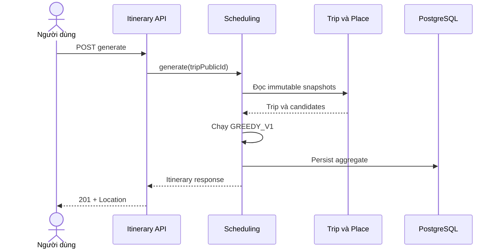

# FEAT-005 — Basic Itinerary Generation & Scheduling V1

> [!summary]
> Xây dựng năng lực cốt lõi của SaigonPlanTravel: đọc một Trip hợp lệ từ
> FEAT-004, lấy các địa điểm ứng viên từ Place Module và sinh một timeline khả
> thi trong ngày bằng heuristic `GREEDY_V1` deterministic. Thuật toán xét sở
> thích category, môi trường, ngân sách, giờ mở cửa, thời lượng tham quan và
> ước tính di chuyển Haversine. Kết quả được lưu thành một itinerary bất biến,
> có timeline, tổng quãng đường, thời gian, chi phí và cảnh báo. Feature này
> không gọi routing provider, weather, RAG, LLM hoặc AI service.

## 1. Baseline và điều kiện bắt đầu

Tài liệu này thay thế hoàn toàn FEAT-005 phiên bản ngày 2026-07-17. Nó được
đối chiếu với FEAT-001–003 đã hoàn thành, FEAT-004 phiên bản viết lại ngày
2026-07-24 và các contract đầu vào mà FEAT-006–009 dự kiến cần.

| Hạng mục | Baseline dùng cho đặc tả ngày 2026-08-01 |
| --- | --- |
| FEAT-001 | Place có tọa độ, `estimatedVisitMinutes`, `minCost`, `maxCost`, `indoor`, `active` |
| FEAT-002 | Category many-to-many; mỗi place tối đa một opening interval/ngày; thiếu row là `UNKNOWN` |
| FEAT-003 | Place catalog/search contract ổn định; migration mới nhất trước Trip Module là V9 |
| FEAT-004 | Dùng V11 cho `trips` và V12 cho `trip_category_preferences`; Trip có owner `user_id` |
| Trip input | `TripSchedulingSnapshot` là contract duy nhất FEAT-005 được đọc |
| Error contract | Spring `ProblemDetail` với extension `code`, và `fieldErrors` khi phù hợp |
| Persistence | PostgreSQL, Flyway, Hibernate `ddl-auto=validate` |
| Kiến trúc | Modular monolith, package-by-feature, DTO record, không serialize Entity |
| FEAT-005 migration | Bắt đầu từ V13 nếu repository thực tế kết thúc ở V12 |

> [!warning]
> FEAT-004 hiện ở trạng thái `ready-for-review`. FEAT-005 có thể được duyệt về
> mặt tài liệu nhưng **không được code** trước khi FEAT-004 được duyệt, triển
> khai và xác minh. Khi bắt đầu FEAT-005 phải kiểm tra lại source, migration
> history và test baseline thực tế; không được coi số version trong tài liệu là
> bằng chứng thay cho repository.

### 1.1. Những điểm đã sửa so với FEAT-005 cũ

- Migration FEAT-005 bắt đầu từ `V13`, nối tiếp FEAT-004 kết thúc ở V12.
- Chỉ dùng dữ liệu thật sự có trong `TripSchedulingSnapshot`; không giả định có
  `originLabel`.
- Tọa độ snapshot dùng precision tương thích `NUMERIC(10,7)` của Place/Trip.
- API lỗi dùng đúng `ProblemDetail`, không tạo envelope `message/path/details`
  cạnh tranh.
- Response có `totalStraightLineDistanceKm` để hỗ trợ summary như prototype
  “3 điểm đến · 6,2 km”.
- Itinerary item lưu `indoor`, base duration và opening interval snapshot để
  FEAT-008/009 không phải suy đoán lại dữ liệu lịch sử.
- Itinerary lưu snapshot pace, environment và preferred categories.
- Place candidate loading yêu cầu **số batch query hữu hạn**, không ép một SQL
  query duy nhất dễ tạo Cartesian product hoặc N+1 trá hình.
- Scoring có time-efficiency component để không bỏ qua waiting/travel cost.
- Kế hoạch triển khai được chia thành micro-step nhỏ với approval gate.

### 1.2. Contract phải bảo vệ

- Không sửa migrations V1–V12 đã được áp dụng.
- Không đổi request/response của FEAT-001–004.
- Không truy cập `TripRepository`, `PlaceRepository`, Trip Entity hoặc Place
  Entity từ Scheduling Module.
- Không trả internal numeric Trip/Itinerary/User ID qua public API.
- Generate/GET bắt buộc authentication; Trip/Itinerary của người khác được xử lý như không tồn tại.
- Place `id` tiếp tục được phép xuất hiện vì đây đã là field công khai của
  Place API FEAT-001.
- Không thay đổi ý nghĩa `MIXED` thành `ANY`.
- Không biến missing opening-hours row thành closed.

## 2. Bối cảnh và vấn đề

FEAT-004 chỉ lưu các ràng buộc người dùng. Hệ thống vẫn chưa trả lời được:

- nên chọn địa điểm nào;
- đi theo thứ tự nào;
- tới nơi lúc mấy giờ;
- có phải chờ địa điểm mở cửa không;
- có vượt thời gian hoặc ngân sách không;
- tổng quãng đường và thời gian di chuyển ước tính là bao nhiêu.

Chỉ sắp xếp địa điểm theo điểm yêu thích sẽ dễ tạo timeline không khả thi. Giao
toàn bộ việc lập lịch cho LLM cũng không bảo đảm constraints, khó lặp lại và
khó kiểm thử. FEAT-005 vì vậy tạo một baseline deterministic trong Spring Boot:
LLM/RAG ở feature sau chỉ giải thích kết quả, không quyết định hoặc sửa lịch.

## 3. Mục tiêu

### 3.1. Mục tiêu sản phẩm

1. Sinh một lịch trình trong ngày từ Trip hợp lệ.
2. Chọn các địa điểm phù hợp category và environment preference.
3. Bảo đảm timeline không overlap và không vượt trip window.
4. Không vượt ngân sách dựa trên `minCost` snapshot.
5. Tôn trọng known opening hours và hiển thị rõ dữ liệu unknown.
6. Trả timeline, tổng số điểm đến, tổng quãng đường, thời gian và chi phí.
7. Cho phép mở lại itinerary đã lưu bằng public UUID.
8. Cảnh báo minh bạch rằng travel time và cost chỉ là estimate.

### 3.2. Mục tiêu kỹ thuật

- Tạo Scheduling Module trong Spring Boot modular monolith hiện tại.
- Tách pure scheduling domain khỏi controller, JPA và orchestration.
- Dùng `TripSchedulingQuery` của FEAT-004 làm đầu vào Trip duy nhất.
- Tạo `PlaceSchedulingQuery` trả immutable candidate DTO theo batch.
- Dùng heuristic `GREEDY_V1` có formula, rounding và tie-breaker cố định.
- Tạo schema bằng Flyway V13–V14 và giữ Hibernate validate.
- Lưu immutable itinerary snapshot; mỗi lần generate thành công tạo version mới.
- Dùng UUID công khai và khóa `BIGINT` nội bộ.
- Giữ output đủ cho FEAT-006 map/routing, FEAT-007 explanation, FEAT-008
  weather risk và FEAT-009 re-planning.
- Giữ toàn bộ regression tests FEAT-001–004.

### 3.3. Kết quả mong đợi

`POST /api/v1/trips/{tripPublicId}/itineraries`:

- trả `201 Created` và `Location` nếu xếp được ít nhất một place;
- trả `422 NO_FEASIBLE_ITINERARY` và không lưu dữ liệu nếu không xếp được place
  nào;
- cùng input snapshots và algorithm configuration tạo cùng sequence, timeline,
  score, totals và warning codes; chỉ UUID/timestamp được phép khác.

## 4. Phạm vi

### 4.1. Trong phạm vi

- Trip một ngày, không qua nửa đêm.
- Tối đa 100 candidate places cho một lần generate.
- Active place có ít nhất một preferred category.
- Environment eligibility theo `INDOOR`, `OUTDOOR`, `MIXED`.
- Budget feasibility dùng `place.minCost`.
- One weekly opening interval theo ngày ISO của trip.
- Missing opening-hours row được phép với warning.
- Waiting khi đến trước giờ mở cửa.
- Visit duration điều chỉnh theo `TravelPace`.
- Straight-line distance bằng Haversine.
- Travel time bằng average speed và fixed transfer overhead cấu hình.
- Greedy score và tie-breakers deterministic.
- Lưu itinerary, preferred category snapshot, items và warnings.
- Mỗi generate thành công tạo một immutable itinerary mới.
- Generate API và GET-by-public-ID API.
- `stale` khi Trip hiện tại mới hơn Trip snapshot đã dùng.
- Unit, web, service và PostgreSQL integration tests.
- Evaluation dataset và bằng chứng determinism/constraint feasibility.
- Cập nhật ERD, API note, algorithm note, development log và PROJECT_CONTEXT.

### 4.2. Ngoài phạm vi

- OSRM, Google Routes, GraphHopper hoặc routing API thật.
- Traffic, weather, crowd, events hoặc time-series.
- RAG/LLM explanation.
- Re-planning, reorder thủ công hoặc sửa itinerary đã sinh.
- Tối ưu toàn cục, TSP/VRP, linear programming hoặc genetic algorithm.
- Return-to-origin cuối ngày.
- Multi-day, overnight hoặc opening interval qua nửa đêm.
- Nhiều opening intervals trong cùng một ngày hoặc ngày lễ đặc biệt.
- Transport mode; V1 dùng một travel estimator chung.
- Must-visit, avoid-list hoặc category weight do người dùng nhập.
- Meal, accessibility, số người đi hoặc dietary constraints.
- Chia sẻ itinerary, cộng tác nhiều người dùng hoặc phân quyền role nâng cao.
- List/delete/archive itinerary.
- Frontend map/polyline; thuộc FEAT-006.
- Tự động gọi FEAT-006/007/008/009 sau khi generate.

> [!important]
> Haversine là khoảng cách đường chim bay và `minCost` là mức chi phí tối
> thiểu. UI/báo cáo không được mô tả các giá trị này là tuyến đường, ETA hoặc
> tổng chi phí thực tế chính xác.

## 5. Tác nhân và user stories

### 5.1. Tác nhân

- **Người dùng đã đăng nhập:** yêu cầu sinh và xem itinerary thuộc Trip của chính mình.
- **Next.js frontend:** gọi generate/get API và render timeline/summary.
- **Scheduling Module:** sở hữu algorithm và Itinerary aggregate.
- **Trip Module:** cung cấp `TripSchedulingSnapshot`.
- **Place Module:** cung cấp `PlaceSchedulingCandidate` theo batch.
- **PostgreSQL:** lưu immutable itinerary snapshots.

### 5.2. User stories

**US-001 — Sinh lịch trình**
Là người dùng đã đăng nhập, tôi muốn hệ thống tạo một timeline từ Trip để biết nên đi
đâu và vào lúc nào.

**US-002 — Bảo vệ constraints**
Là khách du lịch, tôi muốn lịch không vượt thời gian hoặc ngân sách đã nhập.

**US-003 — Xét giờ mở cửa**
Là khách du lịch, tôi muốn tránh địa điểm được biết là đóng cửa và biết khi dữ
liệu giờ mở cửa còn thiếu.

**US-004 — Hiểu travel estimate**
Là khách du lịch, tôi muốn thấy thời gian/quãng đường di chuyển ước tính giữa
các điểm.

**US-005 — Mở lại kết quả**
Là frontend, tôi muốn lấy lại đúng snapshot đã sinh mà không chạy thuật toán
lần nữa.

**US-006 — Nhận biết stale**
Là người dùng, tôi muốn biết Trip preferences đã đổi sau khi itinerary được
sinh để chủ động tạo lại lịch.

## 6. Luồng hệ thống

### 6.1. Generate thành công

1. Frontend gửi `POST /api/v1/trips/{tripPublicId}/itineraries`.
2. Controller parse UUID và gọi `SchedulingService`.
3. Service gọi `TripSchedulingQuery#getByPublicId(tripPublicId, userId)` để kiểm tra ownership.
4. Service gọi `PlaceSchedulingQuery#findCandidates` với preferred category IDs
   và trip date.
5. Place Module trả immutable candidate list theo thứ tự canonical.
6. `GreedyItineraryScheduler` chạy bằng pure input records.
7. Nếu có item, service tạo Itinerary aggregate từ algorithm result.
8. Itinerary, category snapshot, items và warnings được lưu trong một
   transaction.
9. Controller trả `201 Created`, `Location` và `ItineraryResponse`.



### 6.2. Không có kết quả khả thi

1. Candidate pool rỗng hoặc mọi candidate đều không thỏa constraints.
2. Algorithm trả typed `NoFeasibleScheduleResult` cùng rejection summary.
3. API trả `422 NO_FEASIBLE_ITINERARY`.
4. Không tạo itinerary hoặc child rows.

### 6.3. Partial itinerary

1. Algorithm xếp được ít nhất một place.
2. Sau một iteration, không còn candidate nào khả thi.
3. API vẫn trả `201 Created`.
4. Warning phản ánh unused time/category coverage khi điều kiện tương ứng đúng.

### 6.4. Lấy itinerary

1. Frontend gọi `GET /api/v1/itineraries/{itineraryPublicId}`.
2. Service load aggregate cùng items/categories/warnings.
3. Service gọi `TripSchedulingQuery#getByPublicId(tripPublicIdSnapshot, userId)` để kiểm tra ownership và đọc Trip hiện tại.
4. `stale=true` khi current Trip `updatedAt` lớn hơn
   `tripUpdatedAtSnapshot`.
5. GET không regenerate, không sửa aggregate và không gọi external service.

## 7. Quyết định cần owner duyệt

Các quyết định dưới đây là baseline đề xuất. Chúng chỉ trở thành quyết định
triển khai sau khi owner duyệt đặc tả.

| ID | Baseline đề xuất | Lý do |
| --- | --- | --- |
| DEC-001 | Greedy deterministic thay vì optimizer/LLM. | Phù hợp MVP, dễ giải thích và kiểm thử. |
| DEC-002 | Category dùng OR eligibility; match nhiều category được cộng điểm. | Candidate pool đủ rộng nhưng vẫn cá nhân hóa. |
| DEC-003 | `MIXED` chấp nhận cả indoor/outdoor, không bắt buộc phải có cả hai. | Tránh diversity optimizer trong V1. |
| DEC-004 | Unknown opening hours được phép với penalty/warning. | Không loại sai do dữ liệu chưa đủ. |
| DEC-005 | Known closed và visit vượt known close là hard rejection. | Bảo vệ feasibility với dữ liệu đã biết. |
| DEC-006 | Cost dùng `minCost`. | Có sẵn trong Place; phải cảnh báo là estimate. |
| DEC-007 | Haversine, 18 km/h và 5 phút overhead mỗi leg. | Baseline không cần network/secret; tham số có config. |
| DEC-008 | Pace multiplier: RELAXED 1.25, BALANCED 1.00, FAST 0.80. | Biến preference thành hành vi định lượng. |
| DEC-009 | Score tối đa 100 với 5 components ở mục 10. | Minh bạch và có penalty gián tiếp cho travel/waiting. |
| DEC-010 | Zero item trả 422; từ một item trở lên trả 201. | Phân biệt failure với partial usable result. |
| DEC-011 | Mỗi POST tạo immutable version mới. | Audit, stale detection và re-planning sau này. |
| DEC-012 | Không return-to-origin. | Giảm scope/time complexity; cần ghi rõ trên UI. |
| DEC-013 | Chỉ V13–V14 cho FEAT-005. | Nối tiếp FEAT-004 và giữ FEAT-006 bắt đầu ở V15. |
| DEC-014 | Không thêm origin label vào Scheduling snapshot. | Tôn trọng contract FEAT-004 đã khóa. |

### 7.1. Approval gate

Trước khi code:

1. Hoàn tất preflight với source thực tế.
2. Chạy `$grill-with-docs` trên FEAT-004, FEAT-005, source, migration history và
   downstream contracts.
3. Giải quyết toàn bộ BLOCKER.
4. Owner duyệt DEC-001–DEC-014 hoặc ghi rõ quyết định thay thế.
5. Chuyển FEAT-005 sang `approved`.
6. Owner duyệt đúng một micro-step trước mỗi lần sửa source.

`ready-for-review` không phải quyền bắt đầu migration hoặc code.

## 8. Yêu cầu chức năng

| ID | Yêu cầu | Ưu tiên |
| --- | --- | --- |
| FR-001 | Tạo schema FEAT-005 bằng next Flyway versions; dự kiến V13–V14. | Must |
| FR-002 | Hibernate `ddl-auto=validate` phải pass. | Must |
| FR-003 | POST generate từ một Trip tồn tại và thuộc người dùng hiện tại. | Must |
| FR-004 | POST thành công trả 201 và `Location`. | Must |
| FR-005 | GET itinerary trả snapshot đã lưu, không regenerate. | Must |
| FR-006 | Public API dùng UUID; không lộ internal Trip/Itinerary/User IDs. | Must |
| FR-007 | Mỗi POST thành công tạo một immutable itinerary mới. | Must |
| FR-008 | Scheduler chỉ đọc Trip qua `TripSchedulingQuery`. | Must |
| FR-009 | Scheduler chỉ đọc place qua `PlaceSchedulingQuery`. | Must |
| FR-010 | Candidate pool chỉ gồm active places match ít nhất một preferred category. | Must |
| FR-011 | Environment preference phải được áp dụng đúng ba enum FEAT-004. | Must |
| FR-012 | Candidate chỉ feasible khi `minCost <= remainingBudget`. | Must |
| FR-013 | Total estimated cost không vượt initial budget. | Must |
| FR-014 | Known closed bị loại; known open phải fit interval. | Must |
| FR-015 | Unknown hours có thể được chọn nhưng phải có item warning. | Must |
| FR-016 | Arrival trước opening time được phép waiting nếu visit vẫn fit. | Must |
| FR-017 | Visit duration áp dụng pace multiplier và rounding policy. | Must |
| FR-018 | Travel estimate dùng Haversine/config deterministic. | Must |
| FR-019 | Feasibility và score được tính lại từ state hiện tại mỗi iteration. | Must |
| FR-020 | Chọn candidate bằng score và tie-breakers cố định. | Must |
| FR-021 | Items có sequence liên tục, không trùng place, không overlap. | Must |
| FR-022 | Không item nào kết thúc sau trip end hoặc known close. | Must |
| FR-023 | Zero feasible trả 422 và không persist. | Must |
| FR-024 | Partial itinerary là thành công và có warning đúng policy. | Must |
| FR-025 | Response có origin, trip window, items, summary, assumptions và warnings. | Must |
| FR-026 | Summary có scheduled count và total straight-line distance cho prototype. | Must |
| FR-027 | Item snapshot có place facts, indoor, timeline, opening facts, cost và score. | Must |
| FR-028 | Itinerary snapshot có pace/environment/preferred category IDs. | Must |
| FR-029 | GET tính `stale` từ current Trip `updatedAt`. | Must |
| FR-030 | Candidate loading dùng bounded batch queries, không N+1. | Must |
| FR-031 | Generate persistence của aggregate phải atomic. | Must |
| FR-032 | Cùng snapshots/config tạo cùng business output. | Must |
| FR-033 | Feature không gọi routing/weather/RAG/LLM/AI service. | Must |
| FR-034 | FEAT-001–004 contracts và tests không bị phá vỡ. | Must |
| FR-035 | Generate/GET yêu cầu người dùng đã xác thực; `userId` lấy từ `UserPrincipal`. | Must |
| FR-036 | Trip và Itinerary lookup phải kèm ownership; cross-user access trả 404. | Must |

## 9. Quy tắc nghiệp vụ

| ID | Quy tắc |
| --- | --- |
| BR-001 | Scheduler chỉ hỗ trợ one-day Trip và cùng local date TP.HCM. |
| BR-002 | Preferred categories kết hợp OR. |
| BR-003 | `INDOOR` chỉ nhận `indoor=true`; `OUTDOOR` chỉ nhận `false`; `MIXED` nhận cả hai. |
| BR-004 | Budget dùng VND decimal; không dùng floating point để cộng tiền. |
| BR-005 | Budget bằng 0 chỉ cho place có `minCost=0`. |
| BR-006 | Missing opening row là `UNKNOWN`, không phải `CLOSED`. |
| BR-007 | Unknown hours không tạo artificial open/close interval. |
| BR-008 | Known open chỉ hợp lệ khi toàn bộ visit thuộc `[openTime, closeTime]`. |
| BR-009 | Arrival sớm tạo waiting; waiting tiêu thụ trip window. |
| BR-010 | Không quay về origin sau item cuối. |
| BR-011 | Distance Haversine không phải road distance. |
| BR-012 | Travel minutes round-up tới phút nguyên. |
| BR-013 | Adjusted visit duration round-up lên bội số 5 phút. |
| BR-014 | Candidate được remove sau khi chọn; một place không lặp. |
| BR-015 | Scheduler dừng khi không còn candidate feasible ở current state. |
| BR-016 | Không random/shuffle; mọi collection đầu vào phải canonicalize. |
| BR-017 | `stale` chỉ là cảnh báo; itinerary cũ vẫn đọc được và không tự đổi. |
| BR-018 | Warning code/message được tạo từ deterministic templates. |
| BR-019 | Trip/place data thay đổi sau generation không sửa snapshot cũ. |
| BR-020 | UUID/timestamp không tham gia so sánh determinism business output. |
| BR-021 | Dữ liệu demo/mô phỏng phải tiếp tục được ghi nhãn đúng trong UI/báo cáo. |
| BR-022 | Chỉ owner của Trip được generate; chỉ owner snapshot của Itinerary được GET. Sai owner trả 404 để không lộ UUID hợp lệ. |

## 10. Đặc tả thuật toán `GREEDY_V1`

### 10.1. Input canonical

```java
public record SchedulingInput(
        TripSchedulingSnapshot trip,
        List<PlaceSchedulingCandidate> candidates,
        SchedulingPolicy policy,
        OffsetDateTime generatedAt
) {}
```

Trước khi chạy:

- preferred category IDs được copy thành immutable sorted set;
- candidates được sort theo `placeId ASC`;
- collection từ JPA/Set không được dùng trực tiếp làm iteration order;
- policy được validate;
- algorithm core không gọi repository, Clock, Spring hoặc network.

### 10.2. Candidate contract từ Place Module

```java
public interface PlaceSchedulingQuery {
    List<PlaceSchedulingCandidate> findCandidates(
            Set<Long> preferredCategoryIds,
            LocalDate tripDate
    );
}
```

```java
public record PlaceSchedulingCandidate(
        Long placeId,
        String name,
        String slug,
        String address,
        String administrativeUnitName,
        AdministrativeUnitType administrativeUnitType,
        BigDecimal latitude,
        BigDecimal longitude,
        int baseVisitMinutes,
        BigDecimal minCost,
        boolean indoor,
        Set<Long> matchedPreferredCategoryIds,
        OpeningHoursSnapshot openingHours
) {}
```

```java
public record OpeningHoursSnapshot(
        OpeningHoursStatus status,
        LocalTime openTime,
        LocalTime closeTime
) {}
```

`OpeningHoursStatus` cho candidate input gồm:

- `KNOWN_OPEN`;
- `CLOSED`;
- `UNKNOWN`.

Place Module chịu trách nhiệm:

- chỉ trả active places có category intersection;
- load place/category/opening data bằng số batch query hữu hạn không phụ thuộc
  tuyến tính vào số place;
- map missing row thành `UNKNOWN`;
- trả matched preferred category IDs;
- không trả Entity hoặc lazy collection.

Scheduling Module chịu trách nhiệm environment, budget, duration, travel,
time feasibility, score và selection.

Nếu candidate pool vượt `maxCandidates`, service trả
`409 SCHEDULING_DATA_CONFLICT`; không cắt ngầm theo 100 bản ghi đầu vì việc đó
có thể làm thay đổi kết quả theo query/order implementation.

### 10.3. Khởi tạo state

```text
currentLocation = trip origin
currentTime = trip.startTime
remainingBudget = trip.budget
unscheduled = canonical candidate list
scheduledItems = []
```

### 10.4. Travel estimate

Haversine:

```text
a = sin²(Δlat/2) + cos(lat1) × cos(lat2) × sin²(Δlon/2)
c = 2 × atan2(√a, √(1−a))
distanceKm = 6371.0088 × c
```

Travel minutes:

```text
travelMinutes =
    ceil(distanceKm / averageSpeedKmh × 60 + fixedTransferMinutes)
```

Baseline config:

```yaml
scheduling:
  algorithm-version: GREEDY_V1
  average-speed-kmh: 18.00
  fixed-transfer-minutes: 5
  max-candidates: 100
```

Validation:

- `averageSpeedKmh > 0`;
- `fixedTransferMinutes >= 0`;
- `maxCandidates` thuộc `1..100`;
- tính distance bằng `double` cho hàm lượng giác;
- money không dùng `double`;
- distance chỉ round khi tạo snapshot/response.

### 10.5. Visit duration

```text
rawVisitMinutes = baseVisitMinutes × paceMultiplier
adjustedVisitMinutes = ceil(rawVisitMinutes / 5) × 5
```

| Pace | Multiplier |
| --- | --- |
| `RELAXED` | 1.25 |
| `BALANCED` | 1.00 |
| `FAST` | 0.80 |

### 10.6. Feasibility theo thứ tự cố định

Mỗi candidate được kiểm tra theo order:

1. Environment.
2. Remaining budget.
3. Opening status `CLOSED`.
4. Travel arrival.
5. Waiting/opening start.
6. Trip end.
7. Known closing time.

Tính timeline:

```text
arrival = currentTime + travelMinutes

if KNOWN_OPEN and arrival < openTime:
    visitStart = openTime
    waitingMinutes = minutes(openTime - arrival)
else:
    visitStart = arrival
    waitingMinutes = 0

visitEnd = visitStart + adjustedVisitMinutes
```

Feasible khi:

- environment hợp lệ;
- `minCost <= remainingBudget`;
- status khác `CLOSED`;
- `visitEnd <= trip.endTime`;
- nếu `KNOWN_OPEN`, `visitStart >= openTime` và `visitEnd <= closeTime`.

### 10.7. Scoring

Chỉ candidate feasible mới được tính score:

```text
preferenceScore =
    40 × matchedPreferredCategoryCount / totalPreferredCategoryCount

distanceScore =
    25 / (1 + distanceKm)

if remainingBudget = 0:
    costScore = 15
else:
    costScore =
        15 × (1 − min(minCost / remainingBudget, 1))

openingConfidenceScore =
    10 if KNOWN_OPEN else 0

timeEfficiencyScore =
    10 × adjustedVisitMinutes
       / (travelMinutes + waitingMinutes + adjustedVisitMinutes)

totalScore =
    preferenceScore
    + distanceScore
    + costScore
    + openingConfidenceScore
    + timeEfficiencyScore
```

Ý nghĩa:

- preference là thành phần lớn nhất;
- distance và time-efficiency giảm lợi thế của candidate tốn nhiều transfer hoặc
  waiting;
- cost ưu tiên phương án còn dư ngân sách;
- known hours có confidence bonus, nhưng unknown vẫn có thể được chọn.

Numeric policy:

- ratio/score tính ở scale 8, `RoundingMode.HALF_UP`;
- distance dùng trong score được chuyển sang decimal scale 6;
- comparison dùng total score scale 8;
- snapshot/JSON `selectionScore` dùng scale 4;
- không so score bằng epsilon tùy ý.

### 10.8. Tie-breakers

Khi total score bằng nhau:

1. `waitingMinutes` tăng dần.
2. Distance tăng dần.
3. `minCost` tăng dần.
4. `name` tăng dần bằng Java `String.compareTo`.
5. `placeId` tăng dần.

Database collation và input insertion order không được quyết định kết quả.

### 10.9. State update

Sau khi chọn candidate:

```text
sequence += 1
currentLocation = candidate coordinates
currentTime = visitEnd
remainingBudget = remainingBudget - minCost
remove candidate from unscheduled
append scheduled item
```

Sau đó recompute travel, feasibility và score cho toàn bộ unscheduled
candidates từ state mới. Complexity tối đa `O(n²)` với `n <= 100`.

### 10.10. Stop condition

Scheduler dừng khi:

- unscheduled rỗng; hoặc
- không còn candidate feasible ở current state.

Nếu `scheduledItems` rỗng, trả typed no-feasible result. Nếu có ít nhất một
item, trả success result và warning phù hợp.

### 10.11. Warning policy

| Code | Scope | Điều kiện |
| --- | --- | --- |
| `TRAVEL_TIME_ESTIMATED` | Itinerary | Luôn có với GREEDY_V1 |
| `COST_USES_MINIMUM_ESTIMATE` | Itinerary | Luôn có với GREEDY_V1 |
| `OPENING_HOURS_UNKNOWN` | Item | Item được xếp với hours unknown |
| `UNUSED_TIME_REMAINS` | Itinerary | Còn ít nhất 60 phút và còn candidate đã qua environment nhưng không thể xếp do budget/hours/time |
| `LIMITED_CATEGORY_COVERAGE` | Itinerary | Union matched categories của items không phủ hết preferences |

Warning order cố định:

1. itinerary-level theo enum order;
2. item warnings theo `itemSequence ASC`, rồi enum order.

### 10.12. Zero-item rejection summary

Chỉ dùng khi không xếp được item nào:

```java
public record RejectionSummary(
        int candidatePoolSize,
        int rejectedByEnvironment,
        int rejectedByBudget,
        int rejectedByClosedHours,
        int rejectedByTripWindow,
        int rejectedByClosingTime
) {}
```

Mỗi candidate được đếm ở **reason đầu tiên** theo order mục 10.6 để các counts
không trùng và tổng có thể giải thích.

## 11. API contract

### 11.1. Generate

Mọi request yêu cầu JWT hợp lệ. `userId` lấy từ `UserPrincipal`, không nhận từ path hoặc body. Trip không tồn tại hoặc không thuộc người dùng hiện tại đều trả `404 TRIP_NOT_FOUND`.

```http
POST /api/v1/trips/{tripPublicId}/itineraries
Accept: application/json
```

- Không có request body trong V1.
- Mỗi request thành công tạo public itinerary UUID mới.

```http
HTTP/1.1 201 Created
Location: /api/v1/itineraries/76aab24a-1938-449f-a12c-0cd273710afa
Content-Type: application/json
```

### 11.2. Get

```http
GET /api/v1/itineraries/{itineraryPublicId}
Accept: application/json
```

GET trả stored snapshot và computed `stale`; không chạy scheduler. Itinerary không tồn tại hoặc không thuộc người dùng hiện tại đều trả `404 ITINERARY_NOT_FOUND`.

### 11.3. Response thành công

```json
{
  "publicId": "76aab24a-1938-449f-a12c-0cd273710afa",
  "tripPublicId": "7a674ef0-57c8-4d0e-b99b-dccfd342fc98",
  "algorithmVersion": "GREEDY_V1",
  "generatedAt": "2026-07-24T15:00:00+07:00",
  "stale": false,
  "assumptions": {
    "travelEstimator": "HAVERSINE",
    "averageSpeedKmh": 18.00,
    "fixedTransferMinutes": 5,
    "costBasis": "MIN_COST",
    "returnToOrigin": false
  },
  "tripWindow": {
    "tripDate": "2026-08-20",
    "startTime": "08:00",
    "endTime": "18:00"
  },
  "preferencesSnapshot": {
    "travelPace": "BALANCED",
    "environmentPreference": "MIXED",
    "preferredCategoryIds": [1, 3]
  },
  "origin": {
    "latitude": 10.7726400,
    "longitude": 106.6980500
  },
  "items": [
    {
      "sequence": 1,
      "place": {
        "id": 1,
        "name": "Địa điểm demo A",
        "slug": "dia-diem-demo-a",
        "address": "Địa chỉ demo, TP.HCM",
        "administrativeUnitName": "Bến Nghé",
        "administrativeUnitType": "WARD",
        "latitude": 10.7768890,
        "longitude": 106.7008060,
        "indoor": false
      },
      "travel": {
        "estimatedMinutes": 7,
        "straightLineDistanceKm": 0.510
      },
      "arrivalTime": "08:07",
      "waitingMinutes": 0,
      "visitStart": "08:07",
      "visitEnd": "09:37",
      "baseVisitMinutes": 90,
      "visitMinutes": 90,
      "estimatedCost": 0.00,
      "selectionScore": 90.8346,
      "openingHours": {
        "status": "KNOWN_OPEN",
        "openTime": "08:00",
        "closeTime": "17:00"
      }
    }
  ],
  "summary": {
    "candidateCount": 12,
    "scheduledCount": 1,
    "totalStraightLineDistanceKm": 0.510,
    "totalEstimatedCost": 0.00,
    "remainingBudget": 500000.00,
    "totalTravelMinutes": 7,
    "totalVisitMinutes": 90,
    "totalWaitingMinutes": 0,
    "remainingMinutes": 503
  },
  "warnings": [
    {
      "code": "TRAVEL_TIME_ESTIMATED",
      "message": "Thời gian di chuyển đang dùng ước tính đường thẳng, chưa phải dữ liệu tuyến đường thực tế.",
      "itemSequence": null
    },
    {
      "code": "COST_USES_MINIMUM_ESTIMATE",
      "message": "Chi phí lịch trình được ước tính từ mức chi phí tối thiểu của từng địa điểm.",
      "itemSequence": null
    }
  ]
}
```

Ví dụ chỉ minh họa contract và dùng dữ liệu demo.

### 11.4. DTO outline

```java
public record ItineraryResponse(
        UUID publicId,
        UUID tripPublicId,
        String algorithmVersion,
        OffsetDateTime generatedAt,
        boolean stale,
        SchedulingAssumptionsResponse assumptions,
        TripWindowResponse tripWindow,
        PreferencesSnapshotResponse preferencesSnapshot,
        CoordinateResponse origin,
        List<ItineraryItemResponse> items,
        ItinerarySummaryResponse summary,
        List<ItineraryWarningResponse> warnings
) {}
```

Không serialize aggregate/Entity trực tiếp.

### 11.5. Error contract

| Trường hợp | HTTP | `code` |
| --- | --- | --- |
| Malformed Trip/Itinerary UUID | 400 | `INVALID_REQUEST` |
| Trip không tồn tại hoặc không thuộc người dùng hiện tại | 404 | `TRIP_NOT_FOUND` |
| Itinerary không tồn tại hoặc không thuộc người dùng hiện tại | 404 | `ITINERARY_NOT_FOUND` |
| Trip/place snapshot vi phạm invariant | 409 | `SCHEDULING_DATA_CONFLICT` |
| Không có item khả thi | 422 | `NO_FEASIBLE_ITINERARY` |
| Config invalid | Startup failure | Không chạy bằng hidden fallback |

Ví dụ 422 theo Spring `ProblemDetail`:

```json
{
  "type": "about:blank",
  "title": "No feasible itinerary",
  "status": 422,
  "detail": "No place can be scheduled within the current trip constraints",
  "instance": "/api/v1/trips/7a674ef0-57c8-4d0e-b99b-dccfd342fc98/itineraries",
  "code": "NO_FEASIBLE_ITINERARY",
  "rejectionSummary": {
    "candidatePoolSize": 8,
    "rejectedByEnvironment": 1,
    "rejectedByBudget": 2,
    "rejectedByClosedHours": 2,
    "rejectedByTripWindow": 2,
    "rejectedByClosingTime": 1
  }
}
```

Không tạo `message`, `path` hoặc `details` root fields cạnh tranh với
`ProblemDetail`.

## 12. Đặc tả dữ liệu

### 12.1. Migration plan

Nếu FEAT-004 thực tế kết thúc ở V12:

```text
V13__create_itineraries_and_preference_snapshots.sql
V14__create_itinerary_items_and_warnings.sql
```

- V13 tạo parent aggregate và preferred-category snapshot.
- V14 tạo ordered items và warnings.
- Không seed itinerary trong Flyway.
- Nếu migration history khác, dùng next versions thực tế và cập nhật toàn bộ
  tài liệu downstream trước khi code.

### 12.2. Bảng `itineraries`

| Cột | Kiểu | Null | Ràng buộc/Ghi chú |
| --- | --- | --- | --- |
| `id` | `BIGINT GENERATED BY DEFAULT AS IDENTITY` | No | Primary key nội bộ |
| `public_id` | `UUID` | No | Unique, application generated |
| `user_id` | `BIGINT` | No | FK → `users(id)`, owner snapshot để lookup an toàn |
| `trip_id` | `BIGINT` | No | FK → `trips(id)`, `ON DELETE RESTRICT` |
| `trip_public_id_snapshot` | `UUID` | No | Dùng GET/stale mà không lộ internal ID |
| `trip_updated_at_snapshot` | `TIMESTAMPTZ` | No | Version snapshot |
| `trip_date` | `DATE` | No | One-day snapshot |
| `window_start` | `TIME` | No | Snapshot |
| `window_end` | `TIME` | No | Snapshot |
| `origin_latitude` | `NUMERIC(10,7)` | No | Snapshot |
| `origin_longitude` | `NUMERIC(10,7)` | No | Snapshot |
| `travel_pace` | `VARCHAR(20)` | No | Approved FEAT-004 enum |
| `environment_preference` | `VARCHAR(20)` | No | `INDOOR/OUTDOOR/MIXED` |
| `initial_budget` | `NUMERIC(12,2)` | No | Trip budget snapshot |
| `total_estimated_cost` | `NUMERIC(12,2)` | No | Sum item cost |
| `remaining_budget` | `NUMERIC(12,2)` | No | Initial − total |
| `total_distance_km` | `NUMERIC(10,3)` | No | Sum Haversine legs |
| `total_travel_minutes` | `INTEGER` | No | Sum travel |
| `total_visit_minutes` | `INTEGER` | No | Sum adjusted visit |
| `total_waiting_minutes` | `INTEGER` | No | Sum waiting |
| `remaining_minutes` | `INTEGER` | No | End − last visit end |
| `candidate_count` | `INTEGER` | No | Candidate pool size |
| `scheduled_count` | `INTEGER` | No | `> 0` |
| `algorithm_version` | `VARCHAR(40)` | No | `GREEDY_V1` |
| `average_speed_kmh` | `NUMERIC(6,2)` | No | `> 0` |
| `fixed_transfer_minutes` | `INTEGER` | No | `>= 0` |
| `generated_at` | `TIMESTAMPTZ` | No | Injected Clock |

Named constraints tối thiểu:

- public UUID unique;
- FK `user_id → users(id)` với `ON DELETE RESTRICT`;
- index `(user_id, public_id)` hoặc lookup tương đương cho ownership;
- `window_start < window_end`;
- coordinate ranges;
- approved pace/environment/algorithm values;
- money/totals/counts/minutes/distance không âm;
- `total_estimated_cost <= initial_budget`;
- `remaining_budget = initial_budget - total_estimated_cost`;
- `scheduled_count > 0`.

Aggregate/service và integration tests xác minh stored summary bằng child rows;
PostgreSQL không thể dùng check constraint để đếm child rows.

### 12.3. Bảng `itinerary_preferred_categories`

| Cột | Kiểu | Null | Ràng buộc/Ghi chú |
| --- | --- | --- | --- |
| `itinerary_id` | `BIGINT` | No | FK → itineraries, `ON DELETE CASCADE` |
| `category_id` | `BIGINT` | No | FK → categories, `ON DELETE RESTRICT` |

- Primary key `(itinerary_id, category_id)`.
- Lưu exact category set dùng khi generation.
- JPA có thể map bằng `@ElementCollection<Set<Long>>`; không import Category
  Entity vào Scheduling Module.

### 12.4. Bảng `itinerary_items`

| Cột | Kiểu | Null | Ràng buộc/Ghi chú |
| --- | --- | --- | --- |
| `id` | `BIGINT GENERATED BY DEFAULT AS IDENTITY` | No | Primary key |
| `itinerary_id` | `BIGINT` | No | FK → itineraries, `ON DELETE CASCADE` |
| `sequence_no` | `INTEGER` | No | `> 0`, unique per itinerary |
| `place_id` | `BIGINT` | No | FK → places, `ON DELETE RESTRICT` |
| `place_name` | `VARCHAR(150)` | No | Snapshot |
| `place_slug` | `VARCHAR(180)` | No | Snapshot |
| `place_address` | `VARCHAR(255)` | No | Snapshot |
| `place_administrative_unit_name` | `VARCHAR(150)` | No | Snapshot |
| `place_administrative_unit_type` | `VARCHAR(30)` | No | `WARD/COMMUNE/SPECIAL_ZONE` snapshot |
| `latitude` | `NUMERIC(10,7)` | No | Snapshot |
| `longitude` | `NUMERIC(10,7)` | No | Snapshot |
| `indoor` | `BOOLEAN` | No | Snapshot cho context/replan |
| `base_visit_minutes` | `INTEGER` | No | Place value trước pace |
| `travel_minutes_from_previous` | `INTEGER` | No | `>= 0` |
| `distance_km_from_previous` | `NUMERIC(10,3)` | No | `>= 0` |
| `arrival_time` | `TIME` | No | Timeline |
| `waiting_minutes` | `INTEGER` | No | `>= 0` |
| `visit_start` | `TIME` | No | Timeline |
| `visit_end` | `TIME` | No | Timeline |
| `visit_minutes` | `INTEGER` | No | Adjusted duration |
| `estimated_cost` | `NUMERIC(12,2)` | No | `minCost` snapshot |
| `selection_score` | `NUMERIC(10,4)` | No | GREEDY_V1 score |
| `opening_hours_status` | `VARCHAR(20)` | No | `KNOWN_OPEN/UNKNOWN` |
| `opening_time` | `TIME` | Yes | Required với known open |
| `closing_time` | `TIME` | Yes | Required với known open |

Constraints tối thiểu:

- unique `(itinerary_id, sequence_no)`;
- unique `(itinerary_id, place_id)`;
- coordinate ranges;
- numeric/minute fields không âm và visit duration `> 0`;
- `arrival_time <= visit_start < visit_end`;
- known-open phải có `opening_time < closing_time`;
- unknown phải có opening/closing time null;
- stored known-open visit nằm trong interval.

### 12.5. Bảng `itinerary_warnings`

| Cột | Kiểu | Null | Ràng buộc/Ghi chú |
| --- | --- | --- | --- |
| `id` | `BIGINT GENERATED BY DEFAULT AS IDENTITY` | No | Primary key |
| `itinerary_id` | `BIGINT` | No | FK → itineraries, `ON DELETE CASCADE` |
| `item_sequence` | `INTEGER` | Yes | Null = itinerary-level |
| `code` | `VARCHAR(60)` | No | Approved warning code |
| `message` | `VARCHAR(500)` | No | Deterministic snapshot |
| `sort_order` | `INTEGER` | No | Stable response order |

- `item_sequence` nếu có phải `> 0`.
- `sort_order >= 0` và unique trong một itinerary.
- Application/aggregate xác minh item sequence thật sự tồn tại.
- Không cần FK trực tiếp tới `itinerary_items` chỉ để render item sequence.

### 12.6. JPA aggregate rules

- `Itinerary` là aggregate root.
- Items, category IDs và warnings không có repository công khai riêng.
- Child collections được thay bằng immutable/copy-on-create semantics.
- GET fetch aggregate bằng entity graph/query phù hợp; repository lookup dùng `publicId + userId`; không dựa vào Open
  Session in View.
- Không dùng Lombok `@Data`, public all-fields setter hoặc Entity serialization.
- Aggregate factory xác minh timeline, sequence, totals và warning invariants
  trước persist.

## 13. Kiến trúc và module boundary

### 13.1. Package đề xuất

Ownership contract bắt buộc:

```java
public interface TripSchedulingQuery {
    TripSchedulingSnapshot getByPublicId(UUID publicId, Long userId);
}
```

`userId` lấy từ `UserPrincipal`; Scheduling Module không nhận owner từ request body.

```text
com.saigonplantravel.backend
├── place
│   └── service
│       ├── PlaceSchedulingQuery.java
│       ├── PlaceSchedulingCandidate.java
│       └── OpeningHoursSnapshot.java
├── trip
│   └── service
│       ├── TripSchedulingQuery.java
│       └── TripSchedulingSnapshot.java
└── scheduling
    ├── controller
    │   └── ItineraryController.java
    ├── domain
    │   ├── GreedyItineraryScheduler.java
    │   ├── HaversineTravelEstimator.java
    │   ├── PaceDurationPolicy.java
    │   ├── CandidateFeasibilityPolicy.java
    │   ├── CandidateScorer.java
    │   ├── SchedulingInput.java
    │   └── SchedulingResult.java
    ├── config
    │   └── SchedulingProperties.java
    ├── dto
    │   └── itinerary response records
    ├── entity
    │   ├── Itinerary.java
    │   ├── ItineraryItem.java
    │   └── ItineraryWarning.java
    ├── exception
    │   ├── ItineraryNotFoundException.java
    │   ├── NoFeasibleItineraryException.java
    │   └── SchedulingDataConflictException.java
    ├── mapper
    │   └── ItineraryMapper.java
    ├── repository
    │   └── ItineraryRepository.java
    └── service
        └── SchedulingService.java
```

Tên package/file có thể điều chỉnh theo repository thật, nhưng dependency
direction không đổi.

### 13.2. Dependency rules

- Scheduling → Trip contract, không → Trip Entity/Repository.
- Scheduling → Place contract, không → Place/Category/OpeningHour
  Entity/Repository.
- Place Module implement candidate query vì nó sở hữu Place schema.
- Trip Module implement trip snapshot vì nó sở hữu Trip schema.
- Scheduling sở hữu itinerary tables, algorithm, API và mapper.
- Database FK giữa modules được chấp nhận trong modular monolith.

### 13.3. Candidate loading

Không đặt yêu cầu “đúng một SQL query”. Yêu cầu đúng là:

- số query bị chặn trên, không tăng theo từng candidate;
- không gọi place detail trong loop;
- category intersection và active filter thực hiện ở Place Module;
- category IDs/opening row cho đúng weekday được batch load;
- output canonical sort;
- query-count integration test dùng dataset nhiều categories/hours.

### 13.4. Transaction boundaries

- `generate`: một local database write transaction cho read snapshots, pure
  compute và persist aggregate; không external I/O.
- `get`: read-only transaction, load aggregate và current Trip snapshot.
- Zero-feasible exception xảy ra trước persist.
- Persistence failure rollback itinerary và toàn bộ children.
- Không dùng lock/optimistic version cho Trip ở V1; concurrent Trip update có
  thể làm itinerary mới lập tức `stale`, nhưng không làm snapshot bị mutate.

## 14. Yêu cầu phi chức năng

| ID | Yêu cầu |
| --- | --- |
| NFR-001 | Với tối đa 100 candidates, local generate mục tiêu dưới 1 giây sau warm-up; phải ghi môi trường đo. |
| NFR-002 | Pure algorithm complexity tối đa O(n²). |
| NFR-003 | Candidate loading không N+1. |
| NFR-004 | Output deterministic ngoài UUID/generatedAt. |
| NFR-005 | Money dùng BigDecimal; không cộng/so sánh tiền bằng double. |
| NFR-006 | Generate aggregate persistence atomic. |
| NFR-007 | Không network/AI call trong generate/get. |
| NFR-008 | API không lộ Entity, proxy, internal Trip/Itinerary/User IDs, SQL hoặc stack trace. |
| NFR-009 | Không log origin coordinates, full Trip snapshot hoặc location payload. |
| NFR-010 | Log chỉ chứa algorithm version, trip/itinerary public ID phù hợp, counts, duration và outcome. |
| NFR-011 | Clock/timezone injected; tests không phụ thuộc system time. |
| NFR-012 | PostgreSQL/Testcontainers bao phủ migrations, constraints và aggregate persistence. |
| NFR-013 | Configuration fail-fast; không dùng hidden default khi config invalid. |
| NFR-014 | `./mvnw clean test` và `./mvnw clean verify` phải pass từ repository đầy đủ. |
| NFR-015 | Không thêm dependency mới nếu JDK/Spring hiện tại đủ đáp ứng. |

## 15. Tiêu chí chấp nhận

### AC-001 — Migration nối tiếp

**Given** database đã có V1–V12
**When** backend khởi động
**Then** V13–V14 chạy đúng một lần, Hibernate validate pass và migration cũ
không bị sửa.

### AC-002 — Generate happy path

**Given** Trip hợp lệ và có nhiều candidates khả thi
**When** gọi POST generate
**Then** trả 201, Location và ít nhất một ordered item đúng contract.

### AC-003 — GET immutable snapshot

**Given** itinerary đã sinh
**When** gọi GET bằng public UUID
**Then** trả snapshot đã lưu, không gọi scheduler và không phụ thuộc dữ liệu
Place hiện tại để tái tạo item.

### AC-004 — Public identity

**Given** POST/GET response
**When** kiểm tra JSON
**Then** có Trip/Itinerary public UUID và public Place ID nhưng không có internal
Trip/Itinerary IDs.

### AC-005 — Candidate eligibility

**Given** inactive, category mismatch, environment mismatch và matching places
**When** generate
**Then** chỉ active, category-matching và environment-eligible places được xếp.

### AC-006 — Budget

**Given** budget giới hạn và candidates có minCost khác nhau
**When** generate
**Then** từng selection không vượt remaining budget và total không vượt initial
budget.

### AC-007 — Zero budget

**Given** budget bằng 0 và có free/paid places
**When** generate
**Then** chỉ free place được xếp.

### AC-008 — Opening semantics

**Given** known-open, closed và unknown candidates
**When** generate
**Then** closed bị loại; known-open phải fit interval; unknown có thể được xếp
với warning.

### AC-009 — Waiting

**Given** arrival trước open time và còn đủ trip/closing time
**When** candidate được chọn
**Then** visitStart bằng openTime, waiting đúng và timeline không overlap.

### AC-010 — Time boundary

**Given** visit kết thúc đúng/vượt trip end hoặc closing time
**When** evaluate
**Then** exact boundary hợp lệ; vượt một phút bị loại.

### AC-011 — Pace duration

**Given** fixed base duration
**When** dùng RELAXED/BALANCED/FAST
**Then** áp dụng 1.25/1.00/0.80 và round-up bội số 5 đúng policy.

### AC-012 — Haversine estimate

**Given** fixed coordinates/config
**When** estimate
**Then** distance/travel minutes đúng formula và rounding đã duyệt.

### AC-013 — Score và tie-breakers

**Given** fixtures có score bằng/khác nhau
**When** rank
**Then** components, precision và tie-breaker order cho kết quả đúng, không phụ
thuộc input order.

### AC-014 — Recompute mỗi iteration

**Given** relative distance thay đổi sau item đầu
**When** iteration tiếp theo chạy
**Then** travel, time, feasibility và score được tính lại từ current state.

### AC-015 — Timeline invariants

**Given** generate thành công
**When** kiểm tra aggregate
**Then** sequence bắt đầu 1/liên tục, không duplicate place, không overlap và
item cuối không vượt trip end.

### AC-016 — Zero feasible

**Given** không place nào khả thi
**When** POST generate
**Then** trả 422 ProblemDetail với rejection summary và không có row itinerary.

### AC-017 — Partial và warnings

**Given** ít nhất một place khả thi nhưng loop dừng sớm
**When** generate
**Then** trả 201 và warning codes/order đúng mục 10.11.

### AC-018 — Prototype summary

**Given** itinerary ba items
**When** đọc response
**Then** `scheduledCount=3`, total straight-line distance bằng tổng item legs và
timeline đủ để render danh sách như prototype.

### AC-019 — Snapshot đầy đủ

**Given** itinerary đã lưu
**When** đọc database/response
**Then** pace, environment, preferred categories, origin, config, item indoor,
opening facts, duration, cost và timeline đều là generation snapshots.

### AC-020 — Immutable versions

**Given** cùng Trip gọi POST hai lần
**When** cả hai thành công
**Then** có hai UUID khác nhau và GET từng UUID trả snapshot riêng.

### AC-021 — Stale

**Given** itinerary đã sinh rồi Trip được PUT
**When** GET itinerary cũ
**Then** snapshot không đổi và `stale=true`.

### AC-022 — Module boundary và batching

**Given** tối đa 100 candidates
**When** review imports/query count
**Then** Scheduling không import cross-module Entity/Repository và query count
không tăng theo từng place.

### AC-023 — Atomicity

**Given** lỗi persistence giữa parent/child writes
**When** transaction rollback
**Then** không còn partial itinerary/category/item/warning rows.

### AC-024 — Determinism

**Given** cùng immutable snapshots/config
**When** chạy algorithm nhiều lần và hoán vị input order
**Then** sequence/times/costs/scores/totals/warnings giống nhau.

### AC-025 — Error contract

**Given** malformed/missing UUID, data conflict và no-feasible
**When** gọi API
**Then** status/code/ProblemDetail đúng mục 11.5, không có 500 ngoài dự kiến.

### AC-026 — Không side effect ngoài phạm vi

**Given** POST/GET thành công hoặc thất bại
**When** kiểm tra dependencies
**Then** không gọi route, weather, context, RAG, LLM hoặc AI service.

### AC-027 — Authentication và ownership

**Given** Trip và Itinerary thuộc người dùng A
**When** A generate/GET và người dùng B gọi cùng public UUID
**Then** A thao tác thành công; B nhận `404 TRIP_NOT_FOUND` hoặc `404 ITINERARY_NOT_FOUND`; không có `userId` trong request/response.

### AC-028 — Regression và full verification

**Given** FEAT-005 hoàn tất
**When** chạy clean test, clean verify, migration/startup và smoke tests
**Then** FEAT-001–004 cùng tests mới pass và evidence được ghi.

## 16. Ma trận truy vết

| Nhóm | Acceptance criteria | Bằng chứng |
| --- | --- | --- |
| Schema/persistence | AC-001, AC-019, AC-023 | Flyway/Hibernate/PostgreSQL tests |
| API/identity | AC-002–AC-004, AC-016, AC-020–AC-021, AC-025, AC-027 | Web/service tests, curl |
| Eligibility/constraints | AC-005–AC-010, AC-015 | Pure/service tests |
| Algorithm | AC-011–AC-014, AC-017–AC-018, AC-024 | Unit/golden tests |
| Architecture/scope | AC-022, AC-026 | Import/query/dependency verification |
| Regression | AC-028 | Full suite/startup/smoke log |

## 17. Kế hoạch triển khai theo micro-step

> [!important]
> Mỗi lượt Codex chỉ triển khai **một micro-step đã được owner duyệt**, giải
> thích source và dừng. Không coi toàn bộ migration/domain/service/controller
> là một lượt code.

### A — Preflight và phê duyệt

| Mã | Phạm vi | Kết quả |
| --- | --- | --- |
| A0 | Read-only: AGENTS, PROJECT_CONTEXT, FEAT-001–005, source, migrations, tests, git status | Baseline và conflict report; không sửa file |
| A1 | Chạy `$grill-with-docs` và owner trả lời BLOCKER | Decision log |
| A2 | Chỉ cập nhật spec/algorithm note theo quyết định đã duyệt | FEAT-005 `approved` |

### B — Flyway

| Mã | Phạm vi nhỏ | Files dự kiến | Test trực tiếp |
| --- | --- | --- | --- |
| B1 | Parent itinerary + category snapshot | `V13__...sql` | Clean/upgrade migration + constraints |
| B2 | Items + warnings | `V14__...sql` | Child FK/unique/check constraints |
| B3 | Migration restart/checksum checkpoint | Không thêm production code | Clean/upgrade/restart Flyway |

### C — Place read contract

| Mã | Phạm vi nhỏ | Files dự kiến | Test trực tiếp |
| --- | --- | --- | --- |
| C1 | Immutable candidate/opening records + interface | 2–3 Place service/contract files | Contract/unit validation |
| C2 | Active/category candidate batch query | Repository/query projection files | PostgreSQL query tests |
| C3 | Opening-hour batch mapping/canonical order | Place scheduling query implementation | Open/closed/unknown + query-count tests |

### D — Pure scheduling domain

| Mã | Phạm vi nhỏ | Files dự kiến | Test trực tiếp |
| --- | --- | --- | --- |
| D1 | `SchedulingProperties` validation | Config + properties | Boundary/startup tests |
| D2 | Pure input/output records/enums | Domain records | Construction/invariant tests |
| D3 | Haversine estimator | Estimator | Fixed coordinate/rounding tests |
| D4 | Pace duration policy | Pace policy | Multiplier/round-up tests |
| D5 | Time/opening feasibility | Feasibility policy | Open/closed/unknown/wait boundaries |
| D6 | Score và tie-breakers | Scorer/ranker | Precision/order permutation tests |
| D7 | Greedy iteration/state update | Scheduler | Multi-iteration/recompute tests |
| D8 | Warning/rejection aggregation | Domain result/warning code | Zero/partial/warning order tests |

### E — Itinerary persistence

| Mã | Phạm vi nhỏ | Files dự kiến | Test trực tiếp |
| --- | --- | --- | --- |
| E1 | Itinerary parent + preferred category mapping | Parent Entity | Persistence/constraint test |
| E2 | Ordered item mapping | Item Entity + parent relation | Insert/load/order/duplicate test |
| E3 | Warning mapping | Warning Entity + parent relation | Stable order/scope test |
| E4 | Aggregate factory invariants | Aggregate methods/factory | Timeline/totals/warnings unit tests |
| E5 | Repository lookup/fetch | `ItineraryRepository` | Public UUID + no lazy failure test |

### F — Application/API

| Mã | Phạm vi nhỏ | Files dự kiến | Test trực tiếp |
| --- | --- | --- | --- |
| F1 | Assumption/window/preference/origin DTOs | 1–3 DTO files | Serialization contract test |
| F2 | Item/travel/opening DTOs | 1–3 DTO files | Item JSON contract test |
| F3 | Root/summary/warning DTOs | 1–3 DTO files | Full response shape test |
| F4 | Mapper | `ItineraryMapper` | Exact model/no internal IDs |
| F5 | Generate orchestration | `SchedulingService#generate` | Calls, zero-feasible, atomicity |
| F6 | GET và stale | `SchedulingService#get` | Immutable/stale tests |
| F7 | POST endpoint | Controller method | 201/Location/400/404/409/422 |
| F8 | GET endpoint | Controller method | 200/400/404 |
| F9 | Scheduling ProblemDetail mappings | Exceptions + common handler | Exact code/envelope regression |

### G — Checkpoints

| Mã | Phạm vi | Xác minh |
| --- | --- | --- |
| G1 | PostgreSQL aggregate checkpoint | V1–V14, Hibernate, constraints, query count, rollback |
| G2 | FEAT-001–004 regression | Full existing tests và API contracts |
| G3 | Determinism/evaluation | Golden scenarios, permutation, repeated runs, runtime |
| G4 | Runtime smoke | POST/GET/422/stale bằng ứng dụng chạy thật |

### H — Tài liệu và đóng feature

| Mã | Phạm vi | Kết quả |
| --- | --- | --- |
| H1 | ERD + Itinerary API note | Tài liệu schema/API |
| H2 | Greedy algorithm note | Formula, pseudocode, complexity, limitations |
| H3 | Development log + PROJECT_CONTEXT | Bằng chứng tests/performance/decisions |
| H4 | Final diff audit và DoD | Chuyển `done` khi mọi điều kiện đạt |

### 17.1. Approval phrase

Owner duyệt mỗi lượt bằng câu rõ ràng:

```text
TÔI DUYỆT MICRO-STEP D3.
Hãy chỉ triển khai đúng D3 theo phạm vi đã đề xuất.
Sau khi hoàn thành, giải thích source và dừng chờ tôi review.
```

“Tiếp tục”, “ổn” hoặc một câu hỏi kỹ thuật không tự động là phê duyệt bước kế
tiếp.

### 17.2. Báo cáo bắt buộc sau mỗi micro-step

Codex phải trả:

1. Kết quả và acceptance criteria liên quan.
2. Files đã thay đổi và vai trò từng file.
3. Luồng code thật sau bước đó.
4. Kiến thức Java/Spring/JPA/Flyway cần nắm.
5. Lệnh test đã chạy và kết quả thật.
6. Diff audit/file ngoài phạm vi.
7. Cách owner tự đọc/chạy/kiểm tra.
8. Đề xuất đúng một micro-step tiếp theo.
9. Dừng ở trạng thái chờ duyệt.

## 18. Chiến lược kiểm thử và đánh giá

### 18.1. Pure unit tests

- Haversine fixed fixtures và coordinate edge cases.
- Pace multiplier/5-minute rounding.
- Environment/budget/opening/time feasibility.
- Waiting và exact close/trip-end boundaries.
- Score components, scale/rounding và ties.
- Candidate input permutations.
- Multi-iteration state recompute.
- Warnings và rejection counts.
- Aggregate sequence/timeline/totals invariants.

### 18.2. Service tests

- Trip/Place contracts được gọi đúng một lần mỗi hướng orchestration.
- Không truy cập cross-module repositories.
- Zero feasible không gọi save.
- Generate success persist đúng snapshot.
- Persistence failure rollback.
- GET không gọi scheduler.
- Stale false/true.
- Không gọi downstream feature dependencies.

### 18.3. Web tests

- POST 201 + Location.
- GET 200.
- Malformed UUID 400.
- Missing Trip/Itinerary 404.
- Data conflict 409.
- No feasible 422.
- Exact `application/problem+json`, `code` và rejection extension.
- Exact time/decimal/UUID field shapes.
- Không có internal IDs.

### 18.4. PostgreSQL integration

- Clean V1→V14 migration.
- Upgrade V12→V14.
- Restart/checksum và Hibernate validate.
- Named constraints của bốn tables.
- `@ElementCollection` category snapshot.
- Ordered child loading.
- Aggregate rollback.
- Bounded candidate query count với 30–100 places.

### 18.5. Golden evaluation dataset

Tối thiểu 10 scenarios:

1. Nhiều candidate khả thi.
2. Không có category match.
3. Indoor/outdoor mismatch.
4. Budget bằng 0.
5. Candidate vượt ngân sách.
6. Known closed.
7. Mở muộn cần waiting.
8. Unknown hours.
9. Khung giờ quá ngắn.
10. Score tie và input permutation.
11. RELAXED vs FAST.
12. Multi-iteration thay đổi candidate gần nhất.

Chỉ số ghi trong báo cáo:

- scheduled count;
- constraint violation count, mục tiêu bằng 0;
- total/remaining time và budget;
- total straight-line distance;
- warning coverage;
- repeated-run determinism;
- runtime theo candidate count;
- bounded query count.

Không dùng các chỉ số này để tuyên bố greedy là tối ưu toàn cục.

### 18.6. Smoke flow

1. Tạo Trip hợp lệ bằng FEAT-004.
2. Đăng nhập, POST generate bằng owner của Trip và lấy `Location`.
3. GET itinerary bằng đúng owner; kiểm tra cross-user GET trả 404.
4. Kiểm tra timeline, totals và warnings.
5. PUT Trip rồi GET itinerary cũ để kiểm tra stale.
6. Tạo no-feasible Trip để kiểm tra 422.
7. Kiểm tra không có external/network/AI call.

## 19. Definition of Done

- [ ] FEAT-004 đã `done`; FEAT-005 decisions/spec đã được owner duyệt.
- [ ] Implementation không vượt phạm vi mục 4.
- [ ] V13–V14 chạy trên clean DB và existing V12 DB; migrations cũ không đổi.
- [ ] Hibernate validate pass.
- [ ] POST/GET đúng status, Location, JSON và ProblemDetail.
- [ ] Candidate eligibility/category/environment đúng.
- [ ] Budget/opening/waiting/time constraints đúng.
- [ ] Haversine/pace/score/tie-breakers đúng policy.
- [ ] Timeline không overlap/vượt trip end/known close.
- [ ] Zero feasible 422 không persist; partial itinerary persist đúng.
- [ ] Summary khớp child items và hỗ trợ prototype.
- [ ] Snapshot đủ cho FEAT-006–009 theo mục 20.
- [ ] Mỗi POST tạo immutable version; stale detection đúng.
- [ ] Candidate loading không N+1.
- [ ] Module boundaries không bị vi phạm.
- [ ] Generate/GET yêu cầu authentication; ownership đúng và cross-user access trả 404.
- [ ] Không routing/weather/RAG/LLM/AI side effect.
- [ ] Pure/service/web/PostgreSQL/regression tests pass.
- [ ] Determinism/runtime/query-count evidence đã ghi.
- [ ] `./mvnw clean test` và `./mvnw clean verify` pass.
- [ ] Runtime startup/smoke pass.
- [ ] Không log vị trí nhạy cảm hoặc lộ secret/internal errors.
- [ ] ERD, API, algorithm note, development log và PROJECT_CONTEXT đã cập nhật.
- [ ] Final diff audit không có file ngoài phạm vi hoặc migration cũ bị sửa.

## 20. Bàn giao cho feature sau

### 20.1. FEAT-006 — Map và routing

FEAT-005 cung cấp:

- origin coordinates;
- ordered item coordinates/sequence;
- baseline distance/travel minutes từng leg;
- total baseline distance/travel minutes;
- remaining minutes;
- immutable itinerary public ID.

FEAT-006 chỉ enrich route; không sửa order/timeline FEAT-005.

### 20.2. FEAT-007 — RAG explanation

FEAT-005 cung cấp:

- itinerary/item public-facing snapshot;
- place IDs/slugs/names;
- selected order, timeline, cost và algorithm version.

RAG giải thích sau quyết định; không chọn hoặc reorder place.

### 20.3. FEAT-008 — Weather context

FEAT-005 cung cấp:

- item internal reference qua owning read contract;
- place coordinates;
- `indoor`;
- trip date và visit start/end;
- immutable target snapshot.

Weather assessment không sửa itinerary.

### 20.4. FEAT-009 — Re-planning

FEAT-005 cung cấp:

- immutable base itinerary/items;
- Trip/config/preferred-category snapshots;
- base/adjusted duration;
- origin, timeline, travel and cost snapshots;
- reusable Haversine/duration/feasibility policies qua explicit contracts.

Lineage, derived itinerary writer và matched-category snapshot chi tiết hơn có
thể được bổ sung bằng forward migration trong FEAT-009; không kéo proposal
lifecycle vào FEAT-005.

## 21. Liên kết prototype và báo cáo khóa luận

### 21.1. Prototype

Từ response FEAT-005:

- timeline card dùng `sequence`, `place.name`, `visitStart`, `visitEnd`;
- marker dùng `sequence` và coordinates;
- summary “3 điểm đến” dùng `scheduledCount`;
- summary “6,2 km” dùng `totalStraightLineDistanceKm`;
- warning phải nói rõ đây là khoảng cách/thời gian đường thẳng;
- route polyline, zoom controls và routed distance thật thuộc FEAT-006.

### 21.2. Báo cáo khóa luận

**Chương Cơ sở lý thuyết**

- Bài toán lập lịch có ràng buộc.
- Heuristic/greedy algorithm.
- Haversine distance.
- Determinism và tie-breaking.

**Chương Phân tích và thiết kế hệ thống**

- Input constraints từ Trip Module.
- Candidate facts từ Place Module.
- Scheduling Module boundary.
- Itinerary aggregate/ERD/API.
- Hard constraints, soft score và warning semantics.

**Chương Cài đặt và triển khai**

- Pure domain algorithm.
- Cross-module immutable read contracts.
- Flyway migration-first và JPA snapshot persistence.
- Transaction, error handling và Clock/config injection.

**Chương Thực nghiệm và đánh giá**

- Golden scenarios.
- Constraint violations.
- Determinism.
- Runtime/query count theo candidate size.
- So sánh baseline Haversine với routed estimate ở FEAT-006.
- Giới hạn của greedy, minCost và unknown hours.

Văn phong cần dùng:

> `GREEDY_V1` là heuristic baseline tạo lịch trình khả thi theo các ràng buộc đã
> biết.

Không dùng:

> `GREEDY_V1` tìm lịch trình tối ưu.

## 22. Gợi ý ghi chú Obsidian

```text
docs/
├── 01-Requirements/Features/
│   └── FEAT-005-basic-itinerary-generation-scheduling-v1.md
├── 03-Database/
│   └── Scheduling-Module-ERD.md
├── 04-API/
│   └── Itinerary-API-v1.md
├── 05-Algorithms/
│   └── Greedy-Scheduling-V1.md
├── 05-Technical-Knowledge/
│   ├── Haversine-Distance.md
│   ├── Greedy-Heuristic.md
│   ├── BigDecimal-Rounding.md
│   └── Deterministic-Tie-Breaking.md
└── 09-Development-Log/
    └── YYYY-MM-DD-FEAT-005-implementation.md
```

Liên kết:

- FEAT-005 ↔ FEAT-004.
- FEAT-005 ↔ Scheduling ERD.
- FEAT-005 ↔ Itinerary API.
- FEAT-005 ↔ Greedy algorithm note.
- FEAT-005 ↔ FEAT-006/008/009.
- Mỗi development log ↔ micro-step và test evidence tương ứng.

## 23. Lịch sử thay đổi

| Ngày | Phiên bản | Thay đổi |
| --- | --- | --- |
| 2026-07-17 | 0.1 | Đặc tả FEAT-005 ban đầu. |
| 2026-07-24 | 1.0 | Viết lại theo FEAT-004 và downstream contracts: ProblemDetail, snapshot schema/precision, scoring có time efficiency, bounded batch queries và approval-gated micro-steps. |
| 2026-08-01 | 1.1 | Chuẩn hóa đầu vào thành `Trip` hợp lệ, cập nhật ownership theo người dùng đã đăng nhập, migration V13–V14 và thuật ngữ `administrativeUnit`. |
