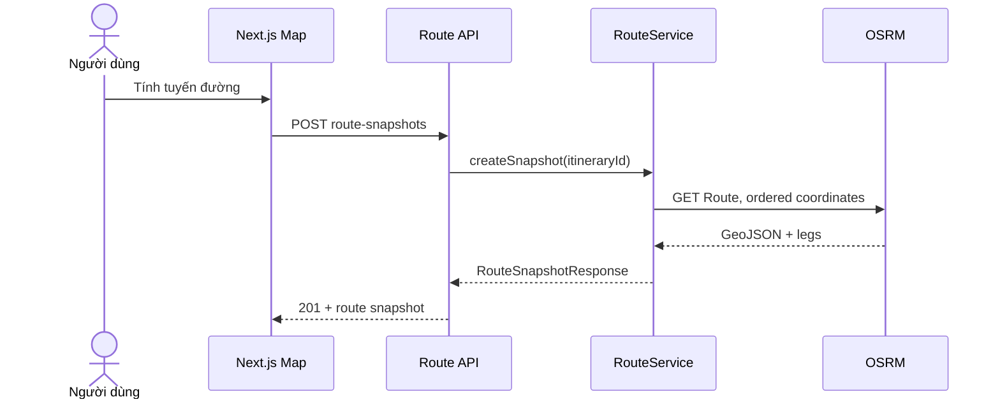

# FEAT-006 — Itinerary Map & Routing Estimate Integration

> [!summary]
> Bổ sung route enrichment và màn hình bản đồ mobile-first cho itinerary đã sinh. Backend gửi origin cùng các stops theo đúng sequence tới OSRM Route service, lưu immutable route snapshot gồm GeoJSON, legs, distance/duration và so sánh với Haversine baseline. Nếu provider lỗi, hệ thống lưu fallback snapshot đường thẳng với warning rõ ràng. Frontend dùng React Leaflet + OpenStreetMap tiles để đồng bộ marker, timeline và route; feature không đổi thứ tự hoặc timeline của FEAT-005.

## 1. Trạng thái, ưu tiên và phê duyệt

| Thuộc tính | Giá trị |
| --- | --- |
| Trạng thái | `ready-for-review` |
| Độ ưu tiên | `P0 — trực quan hóa itinerary MVP` |
| Người phụ trách | Nguyễn Bá Tân |
| Feature phụ thuộc | FEAT-005 |
| Backend | Spring Boot modular monolith |
| Frontend | Next.js + TypeScript, mobile-first |
| Map | React Leaflet + OpenStreetMap raster tiles |
| Routing adapter | OSRM Route service, profile `driving` |
| Fallback | Haversine/straight-line snapshot từ FEAT-005 |
| Module sở hữu backend | `com.saigonplantravel.backend.scheduling` |
| API mới | Route snapshot POST/GET/latest |
| Mốc liên quan | MVP có thể demo trước 30/08/2026 |

### 1.1. Vì sao đây là feature ưu tiên tiếp theo

- FEAT-005 đã sinh sequence/timeline nhưng Haversine không phản ánh mạng đường thực.
- Bản đồ và route là đầu ra bắt buộc của MVP trong `PROJECT_CONTEXT.md`.
- So sánh routed estimate với baseline tạo dữ liệu thực nghiệm hữu ích cho khóa luận.
- Route enrichment tách khỏi scheduler giúp external failure không làm mất itinerary đã sinh.
- Marker/timeline sync giúp prototype chuyển từ mockup thành luồng demo có dữ liệu backend.

### 1.2. Cổng phê duyệt

- Không bắt đầu nếu Itinerary response/coordinates/sequence của FEAT-005 chưa ổn định.
- `ready-for-review` → `approved`: duyệt OSRM demo adapter, fallback policy, route snapshot schema/API và OSM tile compliance.
- `approved` → `in-progress`: bắt đầu migration/backend/frontend.
- `in-progress` → `done`: toàn bộ Definition of Done ở mục 19 đạt yêu cầu.
- OSRM/OSM public services là best-effort cho academic demo; production deployment phải phê duyệt provider/SLA riêng.

## 2. Bối cảnh và vấn đề cần giải quyết

GREEDY_V1 lưu:

- Origin coordinates.
- Place sequence và coordinates.
- Straight-line distance.
- Travel minutes dựa trên average speed + fixed overhead.
- Remaining time buffer.

Dữ liệu này đủ tạo timeline baseline nhưng chưa đủ để:

- Vẽ polyline theo mạng đường.
- Hiển thị routed distance/duration cho từng leg.
- Đánh giá baseline chênh bao nhiêu so với route estimate.
- Cho người dùng tương tác marker ↔ timeline.
- Cảnh báo khi routed duration vượt buffer còn lại.

Không nên cho OSRM tự tối ưu thứ tự bằng Trip service vì thứ tự FEAT-005 là kết quả của category/budget/opening-hours constraints. FEAT-006 chỉ gọi Route service để tìm route qua các coordinates **theo thứ tự được cung cấp**.

## 3. Mục tiêu

### 3.1. Mục tiêu sản phẩm

1. Hiển thị origin và itinerary stops trên bản đồ theo sequence.
2. Hiển thị route polyline và routed estimates khi provider thành công.
3. Vẫn hiển thị được straight-line fallback nếu routing không khả dụng.
4. Đồng bộ lựa chọn timeline item với marker/map focus.
5. Cho người dùng thấy rõ route source, fallback state và schedule risk.
6. Không làm mất/thay đổi itinerary khi external provider thất bại.

### 3.2. Mục tiêu kỹ thuật

- Tạo routing port/adapter trong Scheduling Module.
- External HTTP call nằm ngoài database transaction.
- Validate OSRM response trước khi persistence.
- Lưu immutable route snapshots và legs để GET không gọi provider lại.
- Trả GeoJSON `LineString` trực tiếp cho Leaflet.
- Giữ route provider/config ở backend; frontend chỉ gọi project API.
- Tách map component khỏi SSR bằng client-only/dynamic loading theo Next.js convention.
- Tuân thủ attribution, tile URL, caching và no-prefetch requirements của OSM tile policy.
- Không thay đổi FEAT-005 algorithm, item sequence hoặc stored timeline.

### 3.3. Kết quả mong đợi

Người dùng mở itinerary, xem baseline straight line và chủ động bấm “Tính tuyến đường”. Backend tạo route snapshot. Frontend sau đó hiển thị OSRM GeoJSON, từng leg estimate, delta với baseline và warning nếu routed travel vượt remaining buffer. Khi OSRM lỗi, UI vẫn hoạt động với fallback snapshot.

## 4. Phạm vi

### 4.1. Trong phạm vi

- OSRM adapter gọi Route service với coordinates theo itinerary order.
- Chỉ profile `driving` trong MVP.
- Request `alternatives=false`, `steps=false`, `geometries=geojson`, `overview=full`.
- Backend route port độc lập provider.
- Một external attempt/request; timeout thì fallback, không retry loop.
- Straight-line fallback geometry qua origin + stops.
- Immutable route snapshot mới cho mỗi POST.
- GET route snapshot bằng public UUID.
- GET latest route snapshot của một itinerary.
- Route totals và per-leg distance/duration.
- Baseline vs routed deltas.
- Schedule risk dựa trên remaining buffer.
- Route warning codes deterministic.
- React Leaflet itinerary map.
- OSM raster tile layer và attribution luôn hiển thị.
- Origin marker, numbered stop markers, GeoJSON polyline.
- Marker/timeline selection sync và fit bounds.
- Loading, no-route, provider-fallback và error UI states.
- Mobile-first map/timeline layout.
- Backend/frontend tests, smoke tests và comparison evidence.
- Cập nhật ERD, API, UI, integration, development log và `PROJECT_CONTEXT.md`.

### 4.2. Ngoài phạm vi

- Thay đổi sequence, score hoặc timeline FEAT-005.
- Dùng OSRM Trip service/TSP reorder.
- Sinh lại itinerary bằng routed duration.
- Revalidate opening hours sau route enrichment.
- Dynamic re-planning.
- Live traffic, incidents hoặc congestion-aware ETA.
- Walking/cycling/transit profiles.
- Turn-by-turn instructions; `steps=false`.
- Navigation mode hoặc GPS tracking.
- Route alternatives.
- Return-to-origin route.
- Route matrix dùng trong greedy selection.
- Offline maps/tile download/prefetch.
- Tile proxy/CDN hoặc self-hosted tiles.
- OSRM self-hosting.
- Paid routing provider/API key.
- Geocoding/search address.
- Map editing/drag stops.
- Sharing/public permission/auth.
- RAG explanation hoặc context/weather overlay.

> [!important]
> Route snapshot là enrichment của itinerary, không phải itinerary mới. Nếu routed time cho thấy rủi ro, FEAT-006 chỉ cảnh báo; không âm thầm dịch chuyển visit times hoặc bỏ địa điểm.

## 5. Tác nhân và user stories

### Tác nhân

- **Khách du lịch ẩn danh:** xem route và tương tác bản đồ.
- **Next.js frontend:** tải itinerary/latest route và render map/timeline.
- **Scheduling Module:** sở hữu route snapshot aggregate và API.
- **OSRM adapter:** gọi public demo endpoint qua port.
- **OSRM Route service:** external best-effort provider.
- **OpenStreetMap tile service:** cung cấp raster tiles cho browser theo policy.

### User stories

**US-001 — Xem địa điểm trên bản đồ**  
Là khách du lịch, tôi muốn thấy origin và các stop được đánh số để hiểu thứ tự hành trình.

**US-002 — Xem tuyến đường**  
Là khách du lịch, tôi muốn xem polyline theo mạng đường thay vì chỉ đường thẳng giữa các điểm.

**US-003 — So sánh ước tính**  
Là người dùng, tôi muốn biết routed distance/time khác baseline bao nhiêu để hiểu độ tin cậy của timeline.

**US-004 — Hoạt động khi provider lỗi**  
Là người dùng, tôi muốn bản đồ vẫn hiển thị đường thẳng và cảnh báo thay vì trang bị lỗi hoàn toàn.

**US-005 — Đồng bộ timeline và marker**  
Là người dùng mobile, tôi muốn chạm một timeline card để map focus đúng marker và ngược lại.

**US-006 — Xem lại snapshot**  
Là frontend, tôi muốn lấy route đã lưu mà không gọi OSRM mỗi lần render/reload.

## 6. Luồng người dùng và luồng hệ thống

### 6.1. Luồng mở trang itinerary

1. Frontend gọi GET itinerary FEAT-005.
2. Frontend gọi `GET .../route-snapshots/latest`.
3. Nếu có snapshot, render route/fallback và metadata.
4. Nếu 404, render baseline straight line từ itinerary data và nút “Tính tuyến đường”.
5. Không tự động POST route trên mỗi page load.

### 6.2. Luồng tạo route snapshot thành công

1. Người dùng bấm “Tính tuyến đường” hoặc “Làm mới tuyến”.
2. Frontend gửi POST route snapshot.
3. Service lấy immutable itinerary routing input trong read-only transaction ngắn.
4. Transaction kết thúc; adapter gọi OSRM ngoài transaction.
5. Adapter validate response `code=Ok`, geometry và số legs.
6. Service tính totals, deltas, risk/warnings.
7. Một write transaction ngắn lưu snapshot + legs.
8. API trả `201 Created` + Location; frontend render GeoJSON.



### 6.3. Luồng provider failure/fallback

1. OSRM timeout, HTTP error, `NoRoute` hoặc invalid response.
2. Adapter trả typed failure, không ném raw provider payload ra controller.
3. Service tạo straight-line GeoJSON và baseline legs từ itinerary snapshot.
4. Lưu route snapshot với `provider=HAVERSINE_FALLBACK`, `fallback=true`, `failureReason` và warning.
5. API vẫn trả `201 Created`; frontend hiển thị dashed fallback line.

### 6.4. Luồng route risk

1. OSRM routed travel minutes lớn hơn Haversine baseline.
2. Nếu positive delta vượt `itinerary.remainingMinutes`, snapshot có `scheduleRisk=EXCEEDS_TRIP_WINDOW` và warning.
3. Nếu không vượt buffer, `scheduleRisk=WITHIN_REMAINING_BUFFER`.
4. Policy này không xác minh lại từng opening interval và phải có disclaimer.

### 6.5. Luồng tương tác map/timeline

1. Click marker → chọn timeline item tương ứng, scroll card vào view.
2. Click timeline card → focus/pan map, mở popup marker.
3. Click leg summary → highlight leg/segment nếu geometry mapping hỗ trợ; tối thiểu focus two endpoints.
4. Selection state nằm trong frontend feature state, không ghi backend.

## 7. Yêu cầu chức năng

| ID | Yêu cầu | Ưu tiên |
| --- | --- | --- |
| FR-001 | Tạo schema route snapshot bằng Flyway migrations mới. | Must |
| FR-002 | Hibernate phải validate thành công route entities với schema. | Must |
| FR-003 | `POST /api/v1/itineraries/{id}/route-snapshots` tạo immutable snapshot mới. | Must |
| FR-004 | POST thành công trả 201 và Location tới snapshot public UUID. | Must |
| FR-005 | `GET /api/v1/route-snapshots/{id}` trả snapshot đã lưu, không gọi provider. | Must |
| FR-006 | `GET /api/v1/itineraries/{id}/route-snapshots/latest` trả snapshot mới nhất hoặc 404. | Must |
| FR-007 | Route input phải là origin rồi items theo sequence FEAT-005. | Must |
| FR-008 | OSRM call phải dùng Route service, không dùng Trip service/reorder. | Must |
| FR-009 | OSRM request phải dùng `driving`, no alternatives/steps, GeoJSON full overview. | Must |
| FR-010 | External call phải xảy ra ngoài database transaction. | Must |
| FR-011 | Response provider chỉ hợp lệ khi code Ok, một route, valid LineString và legs count đúng. | Must |
| FR-012 | Provider success phải lưu OSRM geometry, total và per-leg distance/duration. | Must |
| FR-013 | Provider failure phải tạo fallback snapshot, không làm mất itinerary. | Must |
| FR-014 | Fallback geometry phải nối origin/stops theo đúng sequence. | Must |
| FR-015 | Snapshot phải lưu provider/profile/fallback/failure reason/timestamps. | Must |
| FR-016 | Snapshot phải lưu baseline totals và routed/fallback totals. | Must |
| FR-017 | Hệ thống phải tính distance/duration delta với defined zero-baseline behavior. | Must |
| FR-018 | Routed travel minutes phải bằng tổng `ceil(leg.durationSeconds / 60)`. | Must |
| FR-019 | Schedule risk phải so positive routed-minute delta với itinerary remaining minutes. | Must |
| FR-020 | Route enrichment không được sửa itinerary/items/timeline/order. | Must |
| FR-021 | Malformed UUID trả 400; missing itinerary/snapshot trả 404. | Must |
| FR-022 | Frontend phải hiển thị origin, numbered markers và ordered route geometry. | Must |
| FR-023 | Frontend phải luôn hiển thị OSM attribution trên map. | Must |
| FR-024 | Frontend phải tuân thủ HTTPS tile URL, không prefetch/offline và không bypass cache. | Must |
| FR-025 | Marker và timeline selection phải đồng bộ hai chiều. | Must |
| FR-026 | Frontend phải có loading, no snapshot, OSRM success, fallback và error states. | Must |
| FR-027 | Fallback line phải có style/label khác route line thật. | Must |
| FR-028 | UI phải hiển thị provider, route estimate disclaimer và schedule risk. | Must |
| FR-029 | Page load không tự tạo route snapshot; POST chỉ do explicit user action. | Must |
| FR-030 | Backend/frontend không được log hoặc expose raw provider error body. | Must |
| FR-031 | Provider base URL/timeouts/User-Agent phải cấu hình bằng environment/properties. | Must |
| FR-032 | Contract FEAT-001–005 phải giữ nguyên. | Must |

## 8. Quy tắc nghiệp vụ và integration policy

| ID | Quy tắc |
| --- | --- |
| BR-001 | FEAT-006 giữ nguyên itinerary order; OSRM chỉ route qua ordered waypoints. |
| BR-002 | Chỉ `DRIVING` được hỗ trợ vì Trip chưa có transport mode. |
| BR-003 | OSRM duration là estimate từ routing profile, không phải live traffic ETA. |
| BR-004 | Mỗi POST tạo snapshot mới; latest chọn `createdAt DESC, id DESC`. |
| BR-005 | GET snapshot/latest không gọi external provider. |
| BR-006 | Provider failure là degraded success nếu fallback tạo được. |
| BR-007 | Nếu itinerary không có item hoặc coordinates invalid, trả data conflict thay vì gọi provider. |
| BR-008 | Coordinate serialization tới OSRM dùng `longitude,latitude`. |
| BR-009 | Fallback GeoJSON cũng dùng `[longitude, latitude]`. |
| BR-010 | Distance/duration percent delta là null khi baseline bằng 0, không chia cho 0. |
| BR-011 | Routed leg minutes round-up từng leg trước khi sum để so với scheduled integer minutes. |
| BR-012 | `EXCEEDS_TRIP_WINDOW` chỉ là risk indicator; không chứng minh/reject toàn bộ opening-hours feasibility. |
| BR-013 | Fallback snapshot có `scheduleRisk=UNKNOWN_FALLBACK`. |
| BR-014 | Route geometry và provider values được snapshot; GET không bị đổi khi provider data đổi. |
| BR-015 | Không tự retry trong MVP; một attempt rồi fallback để tránh tải public service. |
| BR-016 | UI không gọi OSRM trực tiếp; mọi routing request đi qua backend adapter. |
| BR-017 | Tile requests đi trực tiếp từ browser theo normal interactive viewing; backend không proxy/prefetch tiles. |
| BR-018 | Attribution không được che bởi bottom sheet, modal hoặc safe-area overlay. |

## 9. OSRM adapter contract

### 9.1. Request

```http
GET {baseUrl}/route/v1/driving/{lon1},{lat1};{lon2},{lat2};...
    ?alternatives=false
    &steps=false
    &geometries=geojson
    &overview=full
```

Coordinates gồm origin và từng itinerary item theo sequence. OSRM Route service giữ thứ tự waypoints được cung cấp; adapter không gọi OSRM Trip service.

### 9.2. Config đề xuất

```yaml
routing:
  provider: osrm
  osrm:
    base-url: ${ROUTING_OSRM_BASE_URL:https://router.project-osrm.org}
    profile: driving
    connect-timeout: 2s
    response-timeout: 5s
    user-agent: ${ROUTING_USER_AGENT:SaigonPlanTravel/0.1}
```

- Không hard-code secret; OSRM demo adapter không cần API key.
- Base URL phải dùng HTTPS trong cấu hình deploy.
- Dùng HTTP client đã có trong project; ưu tiên Spring `RestClient` nếu version hỗ trợ, không thêm WebFlux chỉ cho một call.

### 9.3. Response validation

Provider response chỉ được chấp nhận khi:

- HTTP 2xx.
- `code == "Ok"`.
- `routes` có đúng ít nhất một phần tử; dùng route đầu tiên.
- Geometry là GeoJSON `LineString` có ít nhất hai coordinate pairs hợp lệ.
- `legs.size == inputCoordinates.size - 1`.
- Total/leg distance và duration hữu hạn, không âm.

Raw JSON/provider body không lưu hoặc trả cho client ngoài fields đã map.

### 9.4. Typed failure reasons

| Failure reason | Nguồn |
| --- | --- |
| `TIMEOUT` | Connect/response timeout |
| `HTTP_ERROR` | Non-2xx |
| `NO_ROUTE` | OSRM `NoRoute`/empty routes |
| `INVALID_RESPONSE` | Shape/count/value không hợp lệ |
| `CLIENT_ERROR` | Request construction/internal adapter validation |

## 10. Route comparison và warnings

### 10.1. Tổng và delta

```text
baselineDistanceMeters = sum(item.straightLineDistanceKm × 1000)
baselineTravelMinutes = sum(item.estimatedTravelMinutes)
routedTravelMinutes = sum(ceil(leg.durationSeconds / 60))

distanceDeltaPercent =
  (routeDistanceMeters - baselineDistanceMeters)
  / baselineDistanceMeters × 100

durationDeltaPercent =
  (routedTravelMinutes - baselineTravelMinutes)
  / baselineTravelMinutes × 100
```

Nếu denominator bằng 0, delta percent là `null`.

### 10.2. Schedule risk

| Risk | Điều kiện |
| --- | --- |
| `WITHIN_REMAINING_BUFFER` | OSRM success và positive minute delta ≤ itinerary remaining minutes |
| `EXCEEDS_TRIP_WINDOW` | OSRM success và positive minute delta > remaining minutes |
| `UNKNOWN_FALLBACK` | Snapshot dùng fallback |

### 10.3. Warning codes

| Code | Khi xuất hiện |
| --- | --- |
| `ROUTE_ESTIMATE_NOT_LIVE_TRAFFIC` | Mọi OSRM success snapshot |
| `ROUTING_PROVIDER_UNAVAILABLE` | Fallback do provider failure |
| `STRAIGHT_LINE_FALLBACK` | Fallback geometry/duration |
| `ROUTED_DURATION_EXCEEDS_BUFFER` | Risk `EXCEEDS_TRIP_WINDOW` |
| `ROUTE_DOES_NOT_REVALIDATE_OPENING_HOURS` | Mọi OSRM success snapshot |

Warnings dùng deterministic template, không do provider/LLM viết.

## 11. Đặc tả dữ liệu

### 11.1. Bảng `itinerary_route_snapshots`

| Cột | Kiểu đề xuất | Null | Ràng buộc/Ghi chú |
| --- | --- | --- | --- |
| `id` | `BIGINT GENERATED BY DEFAULT AS IDENTITY` | No | Primary key nội bộ |
| `public_id` | `UUID` | No | Unique, application generated |
| `itinerary_id` | `BIGINT` | No | FK → itineraries, `ON DELETE CASCADE` |
| `provider` | `VARCHAR(30)` | No | `OSRM`/`HAVERSINE_FALLBACK` |
| `profile` | `VARCHAR(20)` | No | `DRIVING` |
| `fallback` | `BOOLEAN` | No | Provider degradation flag |
| `failure_reason` | `VARCHAR(30)` | Yes | Typed reason; required khi fallback |
| `provider_code` | `VARCHAR(40)` | Yes | Sanitized code, không raw body |
| `geometry` | `JSONB` | No | GeoJSON LineString |
| `route_distance_meters` | `NUMERIC(14,2)` | No | `>= 0` |
| `route_duration_seconds` | `NUMERIC(14,2)` | No | `>= 0` |
| `routed_travel_minutes` | `INTEGER` | No | Sum rounded legs |
| `baseline_distance_meters` | `NUMERIC(14,2)` | No | FEAT-005 snapshot sum |
| `baseline_travel_minutes` | `INTEGER` | No | FEAT-005 sum |
| `distance_delta_percent` | `NUMERIC(10,2)` | Yes | Null nếu baseline 0 |
| `duration_delta_percent` | `NUMERIC(10,2)` | Yes | Null nếu baseline 0 |
| `schedule_risk` | `VARCHAR(40)` | No | Approved enum |
| `requested_at` | `TIMESTAMPTZ` | No | Before provider call |
| `completed_at` | `TIMESTAMPTZ` | No | After mapping/fallback |
| `created_at` | `TIMESTAMPTZ` | No | Persistence time |

Constraints:

- Provider/fallback/failure-reason consistency.
- Nonnegative totals.
- `completed_at >= requested_at`.
- Geometry JSON shape vẫn phải validate ở application; database chỉ bảo đảm JSONB/non-null.
- Index `(itinerary_id, created_at DESC, id DESC)` cho latest lookup.

### 11.2. Bảng `itinerary_route_legs`

| Cột | Kiểu đề xuất | Null | Ràng buộc/Ghi chú |
| --- | --- | --- | --- |
| `id` | `BIGINT GENERATED BY DEFAULT AS IDENTITY` | No | Primary key |
| `route_snapshot_id` | `BIGINT` | No | FK → snapshots, `ON DELETE CASCADE` |
| `sequence_no` | `INTEGER` | No | `1..itemCount` |
| `to_itinerary_item_id` | `BIGINT` | No | FK → itinerary_items, `ON DELETE CASCADE` |
| `distance_meters` | `NUMERIC(14,2)` | No | Routed/fallback leg |
| `duration_seconds` | `NUMERIC(14,2)` | No | Routed/fallback leg |
| `duration_minutes` | `INTEGER` | No | Ceil seconds/60 |
| `baseline_distance_meters` | `NUMERIC(14,2)` | No | FEAT-005 item baseline |
| `baseline_duration_minutes` | `INTEGER` | No | FEAT-005 item baseline |
| `distance_delta_percent` | `NUMERIC(10,2)` | Yes | Null nếu baseline 0 |
| `duration_delta_percent` | `NUMERIC(10,2)` | Yes | Null nếu baseline 0 |

- Unique `(route_snapshot_id, sequence_no)`.
- Unique `(route_snapshot_id, to_itinerary_item_id)`.
- Values không âm.

### 11.3. JSONB mapping

- Dùng Jackson `JsonNode` hoặc typed GeoJSON DTO với Hibernate 6 JSON mapping nếu project version hỗ trợ.
- Không lưu provider response nguyên khối.
- Mapper trả đúng GeoJSON order `[longitude, latitude]`.
- Nếu repository conventions chưa hỗ trợ JSONB mapping, lưu geometry canonical JSON `TEXT` chỉ sau khi spec/API note được cập nhật; không tự đổi type.

### 11.4. Migration dự kiến

Nếu FEAT-005 kết thúc ở `V13__create_itinerary_warnings_table.sql`:

```text
V14__create_itinerary_route_snapshots_table.sql
V15__create_itinerary_route_legs_table.sql
```

Luôn kiểm tra migration version thực tế. Không sửa migration cũ và không seed external route snapshots.

## 12. Backend architecture

### 12.1. Port/adapter

```java
public interface RoutingProvider {
    RoutingResult route(OrderedWaypoints waypoints, RoutingProfile profile);
}
```

Implementations:

- `OsrmRoutingProvider`: external HTTP adapter.
- `StraightLineFallbackFactory`: local deterministic fallback; không giả làm provider success.

### 12.2. Transaction boundaries

```text
Read itinerary snapshot (read-only transaction)
→ close transaction
→ call OSRM
→ validate/map or create fallback
→ persist route aggregate (short write transaction)
```

Không annotate toàn bộ method chứa external call bằng một write transaction dài. Có thể tách `ItineraryRoutingInputQuery` và `RouteSnapshotPersistenceService` để proxy transaction hoạt động đúng; tránh self-invocation khiến annotation vô hiệu.

### 12.3. Aggregate ownership

- Route snapshot/legs thuộc Scheduling Module và tham chiếu Itinerary aggregate.
- Adapter không chứa repository/business risk logic.
- Controller không gọi OSRM trực tiếp.
- Frontend không biết provider URL/API response shape.

## 13. API contract

### 13.1. Create snapshot

```http
POST /api/v1/itineraries/{itineraryPublicId}/route-snapshots
Accept: application/json
```

- Không request body; profile cố định DRIVING.
- Success/fallback đều trả `201 Created` nếu snapshot được lưu.

```http
Location: /api/v1/route-snapshots/{routeSnapshotPublicId}
```

### 13.2. Get snapshot

```http
GET /api/v1/route-snapshots/{routeSnapshotPublicId}
```

### 13.3. Get latest

```http
GET /api/v1/itineraries/{itineraryPublicId}/route-snapshots/latest
```

Nếu itinerary tồn tại nhưng chưa có snapshot, trả `404 ROUTE_SNAPSHOT_NOT_FOUND`.

### 13.4. Response thành công

```json
{
  "publicId": "8ce82762-b3ca-43ec-b010-89fa620f2966",
  "itineraryPublicId": "76aab24a-1938-449f-a12c-0cd273710afa",
  "provider": "OSRM",
  "profile": "DRIVING",
  "fallback": false,
  "failureReason": null,
  "requestedAt": "2026-07-17T06:20:00Z",
  "completedAt": "2026-07-17T06:20:01Z",
  "geometry": {
    "type": "LineString",
    "coordinates": [
      [106.698050, 10.772640],
      [106.700806, 10.776889]
    ]
  },
  "totals": {
    "distanceMeters": 4200.00,
    "durationSeconds": 1080.00,
    "routedTravelMinutes": 18,
    "baselineDistanceMeters": 2100.00,
    "baselineTravelMinutes": 12,
    "distanceDeltaPercent": 100.00,
    "durationDeltaPercent": 50.00
  },
  "scheduleRisk": "WITHIN_REMAINING_BUFFER",
  "legs": [
    {
      "sequence": 1,
      "toItemSequence": 1,
      "distanceMeters": 4200.00,
      "durationSeconds": 1080.00,
      "durationMinutes": 18,
      "baselineDistanceMeters": 2100.00,
      "baselineDurationMinutes": 12,
      "distanceDeltaPercent": 100.00,
      "durationDeltaPercent": 50.00
    }
  ],
  "warnings": [
    {
      "code": "ROUTE_ESTIMATE_NOT_LIVE_TRAFFIC",
      "message": "Route duration is an estimate and does not use live traffic."
    },
    {
      "code": "ROUTE_DOES_NOT_REVALIDATE_OPENING_HOURS",
      "message": "The enriched route does not recalculate visit times or opening-hour feasibility."
    }
  ]
}
```

### 13.5. Error contract

| Trường hợp | HTTP | Code |
| --- | --- | --- |
| Malformed UUID | 400 | `INVALID_REQUEST` |
| Itinerary không tồn tại | 404 | `ITINERARY_NOT_FOUND` |
| Route snapshot không tồn tại | 404 | `ROUTE_SNAPSHOT_NOT_FOUND` |
| Itinerary zero item/invalid coordinates | 409 | `ROUTING_DATA_CONFLICT` |
| Persistence/internal failure | 500 | Common error contract |

OSRM timeout/NoRoute/invalid response không trả 502 trong MVP nếu fallback tạo được. Nếu fallback cũng không thể tạo do internal invalid data, dùng 409/500 tùy nguyên nhân đã phân loại.

## 14. Frontend UX/UI specification

### 14.1. Screen structure

```text
Itinerary page
├── Header: trip date, time, budget, stale badge
├── Map region
│   ├── OSM tiles + attribution
│   ├── Origin marker
│   ├── Numbered stop markers
│   ├── OSRM/fallback polyline
│   └── Provider/risk legend
├── Route action/status
│   ├── Tính tuyến đường / Làm mới tuyến
│   └── Loading/fallback/risk message
└── Timeline list/bottom sheet
    ├── Travel leg summary
    └── Visit item cards
```

### 14.2. Mobile-first layout

- Map chiếm khoảng 40–50% viewport phía trên ở mobile.
- Timeline là scrollable section/bottom sheet phía dưới; không che attribution.
- Primary action đủ lớn cho touch; route refresh không nằm sát destructive action.
- Desktop có thể dùng split view map + timeline.
- Dùng CSS/safe-area để attribution và controls không bị browser chrome/bottom navigation che.

### 14.3. Map interactions

- Initial fit bounds gồm origin và tất cả stops; nếu chỉ một coordinate dùng sensible default zoom.
- Origin marker khác màu/icon và không có sequence.
- Stop marker hiển thị số sequence.
- Selected marker/card có visual state nhất quán.
- Popup có place name, visit time, route leg estimate và link/CTA xem detail nếu route đã có.
- Fallback polyline dashed/amber; OSRM line solid/brand color.
- Nếu map JS load lỗi, timeline vẫn sử dụng được và hiển thị fallback message.

### 14.4. OSM tile compliance

- Tile URL cấu hình được, default chính xác `https://tile.openstreetmap.org/{z}/{x}/{y}.png`.
- Attribution visible: `© OpenStreetMap contributors` với link phù hợp.
- Không ẩn attribution sau bottom sheet/toggle.
- Không đặt no-cache headers hoặc ép reload tiles.
- Không tile prefetch, offline download, headless viewport scanning hoặc bulk requests.
- Browser giữ Referer mặc định; không đặt restrictive Referrer-Policy cho tile requests.
- Production/commercial scale phải chuyển provider/self-host phù hợp thay vì dựa vào best-effort standard tile service.

## 15. Yêu cầu phi chức năng

| ID | Yêu cầu |
| --- | --- |
| NFR-001 | OSRM connect timeout mục tiêu 2 giây, response timeout 5 giây; timeout dẫn tới fallback. |
| NFR-002 | Không database transaction nào mở trong external HTTP call. |
| NFR-003 | Snapshot persistence atomic; legs không được lưu một phần. |
| NFR-004 | GET snapshot/latest không external I/O và local mục tiêu dưới 500 ms sau warm-up. |
| NFR-005 | POST route hoàn tất trong provider timeout + local overhead; ghi provider/result duration. |
| NFR-006 | HTTP client không log full URL coordinates ở production-like level. |
| NFR-007 | Không trả raw provider body, exception hoặc internal IDs. |
| NFR-008 | Route response/geometry có size guard; từ chối payload vượt configurable maximum. |
| NFR-009 | Frontend map không chặn SSR/page shell; client-only chunk có loading fallback. |
| NFR-010 | Timeline vẫn truy cập được khi map/tile/route lỗi. |
| NFR-011 | OSM attribution đáp ứng visible/compliance requirement ở mọi breakpoint. |
| NFR-012 | Backend integration tests dùng stub server; không gọi public OSRM trong automated suite. |
| NFR-013 | `./mvnw test`, frontend lint/test/build, Flyway/Hibernate và smoke tests phải pass. |
| NFR-014 | Route adapter/provider có interface để thay thế mà không đổi API/domain snapshot contract. |

## 16. Tiêu chí chấp nhận

### AC-001 — Migrations và startup

**Given** database đã có FEAT-005 schema  
**When** backend khởi động  
**Then** route snapshot/leg tables được tạo đúng một lần và Hibernate validate thành công.

### AC-002 — OSRM success

**Given** itinerary hợp lệ và stub OSRM trả code Ok, GeoJSON, đúng số legs  
**When** POST snapshot  
**Then** API trả 201/Location và lưu provider OSRM cùng mapped values.

### AC-003 — Ordered coordinates, không reorder

**Given** origin và ba itinerary items  
**When** adapter tạo request  
**Then** URL coordinates là origin → item 1 → item 2 → item 3 theo lon,lat và dùng Route service.

### AC-004 — Response validation

**Given** OSRM trả invalid code/geometry/negative values hoặc legs count sai  
**When** adapter validate  
**Then** response không được lưu như OSRM success và fallback policy chạy.

### AC-005 — Timeout/HTTP/NoRoute fallback

**Given** từng failure type  
**When** POST snapshot  
**Then** API vẫn trả 201 nếu fallback tạo được, với provider/failure reason/warnings đúng.

### AC-006 — Fallback geometry/legs

**Given** itinerary có origin và N items  
**When** fallback được tạo  
**Then** LineString có N+1 ordered points, N legs và values khớp baseline FEAT-005.

### AC-007 — External call ngoài transaction

**Given** provider response bị trì hoãn  
**When** POST snapshot  
**Then** test/transaction instrumentation chứng minh không giữ write transaction/database lock trong lúc chờ.

### AC-008 — Delta và rounding

**Given** fixed provider/baseline leg fixtures  
**When** map totals  
**Then** leg minutes round-up, totals và percent deltas đúng; baseline zero trả null percent.

### AC-009 — Schedule risk

**Given** routed delta nhỏ hơn/bằng hoặc lớn hơn remainingMinutes  
**When** snapshot được tạo  
**Then** risk lần lượt WITHIN_REMAINING_BUFFER hoặc EXCEEDS_TRIP_WINDOW; fallback là UNKNOWN_FALLBACK.

### AC-010 — Itinerary immutable

**Given** itinerary trước POST  
**When** route success/fallback được lưu  
**Then** itinerary items, sequence, visit times, scores và summaries không đổi.

### AC-011 — Snapshot GET không gọi provider

**Given** route snapshot tồn tại  
**When** gọi GET by ID/latest nhiều lần  
**Then** response giống snapshot và OSRM stub nhận zero request mới.

### AC-012 — Latest deterministic

**Given** itinerary có nhiều snapshots, một số cùng timestamp  
**When** GET latest  
**Then** chọn `createdAt DESC, id DESC` ổn định.

### AC-013 — API errors

**Given** malformed UUID, missing itinerary/snapshot và zero-item itinerary  
**When** gọi API tương ứng  
**Then** trả 400/404/409 đúng common error envelope, không 500 ngoài dự kiến.

### AC-014 — Map initial render

**Given** itinerary loaded và chưa có route snapshot  
**When** page render  
**Then** map có origin/stops/straight baseline, fit bounds và CTA tạo route; không tự POST.

### AC-015 — Marker/timeline sync

**Given** map/timeline có nhiều items  
**When** chọn marker hoặc card  
**Then** selected state, focus và scroll tương ứng cập nhật hai chiều.

### AC-016 — OSRM/fallback styles

**Given** success snapshot hoặc fallback snapshot  
**When** render  
**Then** solid route hoặc dashed fallback hiển thị khác nhau cùng provider/warning label.

### AC-017 — Attribution mọi breakpoint

**Given** mobile/desktop và bottom sheet đóng/mở  
**When** map hiển thị  
**Then** `© OpenStreetMap contributors` luôn nhìn thấy và không bị che.

### AC-018 — No offline/prefetch/cache bypass

**Given** frontend build/runtime  
**When** review network/config/code  
**Then** không có tile prefetch/offline/bulk code, no-cache override hoặc restrictive Referer policy.

### AC-019 — Progressive failure

**Given** Leaflet chunk/tile request/API route lỗi  
**When** page render  
**Then** timeline vẫn dùng được, có message/retry phù hợp và không blank toàn trang.

### AC-020 — Provider data privacy/logging

**Given** adapter success/failure  
**When** kiểm tra response/logs  
**Then** không raw body/full coordinate URL/internal ID/stack trace bị lộ.

### AC-021 — Automated verification không gọi public OSRM

**Given** backend test suite  
**When** chạy tests  
**Then** mọi provider scenario dùng local stub/mock server và public endpoint nhận zero test traffic.

### AC-022 — Regression/full verification

**Given** FEAT-006 hoàn tất  
**When** chạy backend/frontend tests, builds, startup, smoke và regression FEAT-001–005  
**Then** tất cả pass và docs/log có evidence.

## 17. Ma trận truy vết

| Nhóm yêu cầu | Acceptance criteria | Bằng chứng dự kiến |
| --- | --- | --- |
| FR-001–FR-006 | AC-001–AC-002, AC-011–AC-013 | Migration/API/repository tests |
| FR-007–FR-015 | AC-003–AC-007 | Adapter/stub/fallback tests |
| FR-016–FR-021 | AC-008–AC-013 | Calculation/risk/immutability tests |
| FR-022–FR-029 | AC-014–AC-019 | Component/E2E/accessibility/network review |
| FR-030–FR-032 | AC-020–AC-022 | Security/config/regression/full suite |

## 18. Kế hoạch triển khai file-by-file

> [!warning]
> Chỉ triển khai sau approval. Paths/version là dự kiến; inspect repository/frontend conventions trước và không ghi đè user work.

### Phase A — Preflight và contract approval

- [ ] Xác nhận FEAT-005 implementation/API/schema thực tế.
- [ ] Đọc AGENTS, PROJECT_CONTEXT, relevant specs, ERD/API/UI docs.
- [ ] Inspect migration versions, HTTP client dependencies, JSONB mapping, frontend route/feature structure.
- [ ] Duyệt public OSRM demo use, timeout/no-retry/fallback, GeoJSON schema, UI flow và OSM compliance.
- [ ] Chuyển status thành `approved`.

### Phase B — Flyway migrations/persistence

- [ ] Tạo `V14__create_itinerary_route_snapshots_table.sql` hoặc next valid.
- [ ] Tạo `V15__create_itinerary_route_legs_table.sql` hoặc next valid.
- [ ] Thêm named constraints/FKs/latest index.
- [ ] Tạo route snapshot/leg entities/enums trong `scheduling/entity`.
- [ ] Tạo repository lookup publicId/latest.
- [ ] Chạy clean/existing DB, restart và Hibernate validate.

### Phase C — Routing port/OSRM adapter

- [ ] Tạo `scheduling/routing/RoutingProvider.java` và domain result/failure records.
- [ ] Tạo config properties có validation.
- [ ] Tạo `scheduling/routing/osrm/OsrmRoutingProvider.java`.
- [ ] Tạo private OSRM response DTOs; map chỉ fields cần.
- [ ] Build URL safely, lon/lat order, required query options và User-Agent.
- [ ] Implement timeouts, response size guard, shape/value/leg validation.
- [ ] Không log full URL/raw body.

### Phase D — Route domain/service

- [ ] Tạo `ItineraryRoutingInputQuery` trả immutable origin/items/baselines/buffer.
- [ ] Tạo `StraightLineFallbackFactory`.
- [ ] Tạo delta/risk/warning calculator pure functions.
- [ ] Tạo route aggregate factory bảo đảm totals/legs invariants.
- [ ] Tách read transaction, external call và write transaction đúng proxy boundaries.
- [ ] Tạo `RouteSnapshotService` create/get/latest.

### Phase E — Backend DTO/API/error

- [ ] Tạo route response DTO records gồm GeoJSON/totals/legs/warnings.
- [ ] Tạo mapper không trả provider/raw/entity data.
- [ ] Tạo exceptions/mappings `RouteSnapshotNotFound`, `RoutingDataConflict`.
- [ ] Tạo/mở rộng Itinerary routing controller với ba endpoints.
- [ ] POST trả 201/Location cho success và fallback.
- [ ] GET không external call.

### Phase F — Backend tests

- [ ] Flyway/constraint/JSONB/repository latest integration tests.
- [ ] Stub server OSRM success, timeout, HTTP error, NoRoute, invalid JSON/geometry/legs/values.
- [ ] Ordered URL/query options/lon-lat tests.
- [ ] Fallback/delta/rounding/risk/warning tests.
- [ ] Transaction boundary/atomicity/immutability tests.
- [ ] Controller status/JSON/Location/error tests.
- [ ] Verify public OSRM is never used in automated tests.
- [ ] Run `./mvnw test`.

### Phase G — Frontend data layer/state

- [ ] Inspect existing generated/manual API client conventions.
- [ ] Add TypeScript types matching Itinerary/RouteSnapshot contracts.
- [ ] Add fetch functions get itinerary/latest route/create route.
- [ ] Model states: initial/loading/noSnapshot/generating/success/fallback/error.
- [ ] Keep route action explicit; no POST in mount effect.
- [ ] Add retry/refresh action with duplicate-click protection.

### Phase H — Frontend map/timeline UI

- [ ] Add/verify `leaflet` + `react-leaflet` dependencies only if not present.
- [ ] Add Leaflet CSS/icon setup according to current Next.js version.
- [ ] Create client-only `ItineraryMap` dynamic component.
- [ ] Create origin/numbered markers, GeoJSON/fallback polylines, fit bounds.
- [ ] Implement marker/card sync and accessible non-map timeline fallback.
- [ ] Add provider/risk/warnings/legend/action UI.
- [ ] Ensure attribution visible and safe-area/bottom-sheet layout.
- [ ] Validate no tile prefetch/offline/no-cache code.

### Phase I — Frontend tests/build/visual QA

- [ ] Unit/component tests for state reducer, geometry mapping, marker/card selection.
- [ ] Mock API tests for no snapshot, success, fallback, errors.
- [ ] Accessibility checks for action, cards, warnings and timeline without map.
- [ ] Responsive visual QA at common mobile/desktop widths.
- [ ] Network inspection for tile URL/attribution/no auto POST.
- [ ] Run frontend lint/test/build commands from repository.

### Phase J — Smoke, evidence và documentation

- [ ] Start PostgreSQL/backend/frontend.
- [ ] Generate itinerary, open map, create OSRM snapshot and reload latest.
- [ ] Simulate provider failure config/stub and verify fallback UI.
- [ ] Capture baseline vs route comparison for demo dataset.
- [ ] Review full diff; no secret/migration rewrite/out-of-scope edits.
- [ ] Update Scheduling ERD, Itinerary API, Integration/OSRM note, UI note, development log và PROJECT_CONTEXT.
- [ ] Ghi official-source URLs/access date và report/thesis material.
- [ ] Đổi spec thành `done` sau DoD.

## 19. Definition of Done

- [ ] Dependency baseline/spec/external service policy đã được phê duyệt.
- [ ] Implementation không vượt phạm vi mục 4.
- [ ] Flyway/Hibernate validate trên clean/existing DB; không sửa migration cũ.
- [ ] POST/GET/latest route APIs đúng contract.
- [ ] OSRM adapter dùng ordered Route service request và validate response.
- [ ] External call ngoài transaction; persistence atomic.
- [ ] Fallback luôn minh bạch, không làm mất itinerary.
- [ ] Delta/rounding/risk/warnings đúng và có tests.
- [ ] Itinerary FEAT-005 không bị mutate.
- [ ] Frontend map/markers/polyline/timeline sync hoạt động mobile-first.
- [ ] OSM attribution/compliance đạt mọi breakpoint.
- [ ] Timeline dùng được khi map/provider/tile lỗi.
- [ ] Automated tests không gọi public OSRM.
- [ ] Backend/frontend test/lint/build/startup/smoke/regression pass.
- [ ] Logs/response không lộ raw provider data/full coordinate URL/secret/internal IDs.
- [ ] Baseline-vs-route evidence đã ghi cho báo cáo.
- [ ] ERD, API, Integration, UI, development log và PROJECT_CONTEXT đã cập nhật.

## 20. Rủi ro và quyết định

### 20.1. Rủi ro và giảm thiểu

| Rủi ro | Tác động | Giảm thiểu |
| --- | --- | --- |
| Public OSRM không ổn định/no SLA | Route action lỗi | Timeout nhanh + deterministic fallback + provider port |
| OSM tiles bị block do policy | Bản đồ trống | Attribution/URL/cache/referer/no-prefetch compliance; provider configurable |
| Route duration làm timeline không khả thi | Demo gây hiểu nhầm | Risk warning, không mutate; re-scheduling feature sau |
| OSRM Trip service reorder | Phá constraints scheduler | Chỉ Route service, ordered-coordinate tests |
| External call trong transaction | Lock lâu, pool exhaustion | Split read/call/write boundaries |
| Raw provider payload quá lớn/xấu | Memory/log/security | Size guard, private DTO, validation, no raw logging |
| GeoJSON lon/lat bị đảo | Route sai vị trí | Contract/tests `[longitude, latitude]` |
| Page reload gọi POST liên tục | Tải provider/rác DB | Explicit action; GET latest on load |
| Map SSR/hydration lỗi | Page không render | Dynamic client-only map + timeline fallback |
| Attribution bị bottom sheet che | Vi phạm policy | Layout/visual acceptance test |
| Driving profile không hợp mọi người | Estimate không phù hợp | Ghi rõ MVP; transport-mode feature sau |

### 20.2. Quyết định đã chốt

| ID | Quyết định | Lý do |
| --- | --- | --- |
| DEC-001 | OSRM Route service, không Trip service. | Giữ order từ constraint-aware scheduler. |
| DEC-002 | OSRM public endpoint chỉ dùng academic demo. | Không key/cost, nhưng phải có fallback/provider port. |
| DEC-003 | One attempt, no retry loop. | Giảm tải public service và latency. |
| DEC-004 | Provider failure lưu fallback snapshot và trả 201. | Trải nghiệm vẫn dùng được, failure minh bạch. |
| DEC-005 | Immutable snapshots; GET/latest không external call. | Reproducible và tránh gọi lại mỗi render. |
| DEC-006 | Route không mutate itinerary/timeline. | Giữ FEAT-005 contract và tránh revalidation nửa vời. |
| DEC-007 | Risk dựa trên remaining buffer. | Cảnh báo đơn giản, deterministic; không tuyên bố full feasibility. |
| DEC-008 | GeoJSON full LineString. | React Leaflet render trực tiếp, không cần polyline decoder. |
| DEC-009 | Profile chỉ DRIVING. | Trip chưa có transport mode; giảm scope. |
| DEC-010 | React Leaflet + OSM raster tiles. | Khớp kiến trúc hiện tại và prototype. |
| DEC-011 | Không auto POST on page load. | Tránh external load/duplicate snapshots. |
| DEC-012 | Timeline vẫn là primary accessible fallback. | Map lỗi không chặn thông tin itinerary. |

## 21. Feature kế tiếp đề xuất

Sau FEAT-006, ưu tiên gần nhất:

**FEAT-007 — RAG-backed Place & Itinerary Explanation MVP**

Candidate scope:

- Chuẩn bị/có provenance place documents.
- Chunk + embedding + pgvector retrieval.
- Truy xuất context theo itinerary items.
- AI service sinh giải thích từ retrieved evidence.
- Citation/source references và refusal khi context thiếu.
- LLM chỉ giải thích itinerary đã được backend quyết định.

Weather/context và dynamic re-planning tiếp tục là feature riêng sau khi scheduling/map/RAG baseline ổn định.

## 22. Liên kết với báo cáo khóa luận

- **Chương 3 — Kiến trúc:** provider port, OSRM adapter, transaction boundaries và frontend/backend data flow.
- **Chương 3 — Cài đặt:** GeoJSON persistence, React Leaflet, fallback và warning policy.
- **Chương 4 — Thực nghiệm:** so sánh Haversine/routed distance-duration, provider success/fallback latency, schedule-risk cases.
- **Giới hạn:** OSRM demo estimate không live traffic; standard OSM tiles best-effort/no SLA.

Không gọi routed duration là “thời gian thực”. Dùng “ước tính theo mạng đường từ routing profile”.

## 23. Nguồn kỹ thuật chính thức

- [OSRM API v5.24 — Route service](https://project-osrm.org/docs/v5.24.0/api/) — truy cập 2026-07-17. Route service hỗ trợ ordered coordinates, GeoJSON geometry, overview và per-leg distance/duration.
- [OpenStreetMap Tile Usage Policy](https://operations.osmfoundation.org/policies/tiles/) — truy cập 2026-07-17. Quy định HTTPS tile URL, attribution, caching, Referer/User-Agent và cấm bulk/offline prefetch.

Các chính sách dịch vụ có thể thay đổi; kiểm tra lại nguồn chính thức trước khi deploy public.

## 24. Lịch sử thay đổi

| Ngày | Phiên bản | Thay đổi |
| --- | --- | --- |
| 2026-07-17 | 0.1 | Tạo đặc tả FEAT-006 cho OSRM route snapshots và React Leaflet itinerary map có fallback. |
