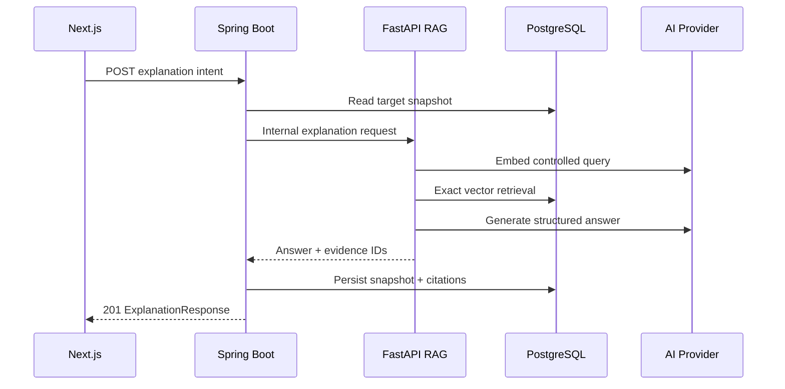

# FEAT-007 — RAG-backed Place & Itinerary Explanation MVP

> [!summary]
> Bổ sung lớp giải thích có căn cứ cho địa điểm và itinerary đã được Spring Boot quyết định. Dữ liệu địa điểm đã duyệt được nhập có kiểm soát, chia chunk, tạo embedding và lưu trong PostgreSQL/pgvector. Spring Boot tạo snapshot dữ liệu nghiệp vụ, gọi Python FastAPI AI Service ngoài transaction và lưu immutable explanation snapshot cùng citation. Khi bằng chứng không đủ, hệ thống từ chối có kiểm soát thay vì yêu cầu LLM suy đoán. Feature không cho LLM chọn, bỏ, sắp xếp lại hoặc thay đổi timeline của itinerary.

## 1. Trạng thái, ưu tiên và phê duyệt

| Thuộc tính | Giá trị |
| --- | --- |
| Trạng thái | `ready-for-review` |
| Độ ưu tiên | `P0 — năng lực RAG cốt lõi của MVP/khóa luận` |
| Người phụ trách | Nguyễn Bá Tân |
| Phụ thuộc bắt buộc | FEAT-002 và FEAT-005 có contract ổn định |
| Phụ thuộc bổ sung | FEAT-006 route snapshot nếu đã có; không bắt buộc để giải thích |
| Backend nghiệp vụ | Spring Boot modular monolith |
| Module Spring sở hữu | `com.saigonplantravel.backend.aiintegration` |
| AI Service | Python FastAPI, package-by-feature `app.rag` |
| Database | PostgreSQL + pgvector, Flyway migration-first |
| Frontend | Next.js + TypeScript, mobile-first |
| Ngôn ngữ MVP | `vi-VN` |
| Mốc liên quan | MVP có thể demo trước 30/08/2026 |

### 1.1. Vì sao đây là feature ưu tiên tiếp theo

- FEAT-005 đã tạo itinerary deterministic; FEAT-006 đã định nghĩa lớp trực quan hóa và route enrichment.
- `PROJECT_CONTEXT.md` xác định “lý do chọn địa điểm” và RAG là đầu ra bắt buộc của MVP.
- Corpus địa điểm có thể tái sử dụng dữ liệu FEAT-001/002 nhưng phải bổ sung provenance và quy trình duyệt.
- Tách explanation khỏi scheduling giữ kết quả lập lịch lặp lại, kiểm thử được và không phụ thuộc LLM.
- Citation, refusal và snapshot tạo bằng chứng thực nghiệm rõ ràng cho phần RAG của khóa luận.
- Đây là bước cần hoàn thành trước weather/context và dynamic re-planning.

### 1.2. Cổng phê duyệt

- Không bắt đầu code nếu Place Detail và Itinerary contracts thực tế chưa ổn định.
- `ready-for-review` → `approved`: duyệt corpus manifest, schema ownership, embedding/generation provider, retrieval policy, public/internal API và tiêu chí đánh giá.
- `approved` → `in-progress`: bắt đầu migrations, AI service, Spring integration và frontend.
- `in-progress` → `done`: toàn bộ Definition of Done ở mục 21 đạt yêu cầu.
- Mọi thay đổi provider/model, embedding dimension, chunking, prompt contract hoặc nguồn corpus sau approval phải cập nhật spec/config snapshot trước khi ingestion lại.
- Monitoring job không được tự đưa source snapshot/change proposal vào corpus.

### 1.3. Quyết định cần xác nhận tại approval

| ID | Baseline đề xuất | Nội dung phải xác nhận |
| --- | --- | --- |
| AP-001 | Provider-neutral ports | Chọn đúng một embedding model và một generation model cho demo. |
| AP-002 | Exact cosine retrieval | Xác nhận model/dimension, `topK=5`, threshold khởi điểm `0.55`. |
| AP-003 | Corpus manifest đã duyệt | Chốt 10–20 địa điểm pilot, URL, license/terms note và ngày truy xuất. |
| AP-004 | Không arbitrary chat | Chỉ ba intent cố định trong MVP. |
| AP-005 | Lưu snapshot/citation | Chốt retention của explanation và evidence excerpt. |

Nếu chưa chọn provider thật, vẫn có thể triển khai schema, ports, fake providers và automated tests; không chạy real-provider smoke test hoặc nhập embedding production-like.

## 2. Bối cảnh và vấn đề cần giải quyết

Các feature hiện tại đã cung cấp:

- Place name, description, category, opening hours, chi phí và vị trí.
- Trip preferences gồm category, environment, ngân sách, pace và time window.
- Itinerary sequence, timeline, score/baseline và deterministic warnings.
- Route estimate/schedule risk nếu FEAT-006 đã được triển khai.

Các dữ liệu trên cho biết hệ thống **đã chọn gì**, nhưng chưa trả lời có căn cứ:

- Vì sao một địa điểm đáng cân nhắc?
- Vì sao địa điểm phù hợp với sở thích hoặc điều kiện chuyến đi?
- Vì sao itinerary hiện tại có cấu trúc như vậy?
- Thông tin giải thích đến từ nguồn nào và được truy xuất khi nào?
- Hệ thống phản ứng ra sao nếu corpus không đủ dữ liệu?

Không gửi toàn bộ database cho LLM hoặc cho LLM tự quyết lịch trình. FEAT-007 phân tách:

1. **Sự thật nghiệp vụ:** Spring Boot đọc từ Place/Trip/Scheduling/Route contracts.
2. **Tri thức nguồn:** chỉ từ corpus địa điểm đã duyệt và có provenance.
3. **Retrieval/generation:** FastAPI xử lý qua provider ports.
4. **Quyết định lịch trình:** deterministic Spring scheduling; AI chỉ viết lời giải thích sau quyết định.

## 3. Mục tiêu

### 3.1. Mục tiêu sản phẩm

1. Cho người dùng yêu cầu giải thích một địa điểm bằng thao tác rõ ràng.
2. Cho người dùng yêu cầu giải thích itinerary đã sinh và liên hệ với preferences.
3. Hiển thị từng luận điểm cùng nguồn/evidence tương ứng.
4. Nói rõ khi câu trả lời chỉ có coverage một phần.
5. Từ chối có kiểm soát khi không có bằng chứng đủ điều kiện.
6. Không thay đổi địa điểm, thứ tự, timeline, chi phí hoặc route của itinerary.
7. Giữ trải nghiệm mobile-first và vẫn đọc được khi AI service không khả dụng.

### 3.2. Mục tiêu kỹ thuật

- Dùng Flyway làm nguồn sự thật cho `rag_*` và `ai_explanation*` tables.
- Dùng pgvector exact cosine retrieval cho corpus nhỏ; chưa thêm vector index nếu chưa có bằng chứng hiệu năng.
- Xây ingestion có `dry-run`/`apply`, content hash và version bất biến.
- Chỉ nhập tài liệu có provenance/approval metadata đầy đủ.
- Tạo FastAPI internal contract bằng Pydantic/OpenAPI và shared internal token.
- Tách `EmbeddingProvider`/`GenerationProvider`; không khóa business contract vào Gemini/GPT.
- Tách Spring read transaction, external AI call và write transaction.
- Lưu immutable explanation snapshot, provider/config snapshot và citation snapshot.
- Validate structured AI output; không render raw HTML/Markdown từ model.
- Ghi metrics đủ cho evaluation nhưng không log secret, raw prompt hoặc full corpus.

### 3.3. Kết quả mong đợi

Người dùng mở Place Detail hoặc Itinerary, thấy explanation gần nhất nếu có và chủ động bấm tạo mới. Spring tạo target snapshot, FastAPI truy xuất chunk phù hợp, sinh structured explanation và trả citation IDs. Spring kiểm tra response rồi lưu snapshot. Frontend hiển thị summary, lý do và nguồn. Nếu không đủ evidence, hệ thống trả `INSUFFICIENT_EVIDENCE` với thông báo deterministic, không tạo nội dung suy đoán.

## 4. Phạm vi

### 4.1. Trong phạm vi

- Corpus pilot cho 10–20 active places tại TP.HCM.
- Manifest JSON chứa nội dung đã duyệt và provenance.
- CLI ingestion có `--dry-run` mặc định và `--apply` rõ ràng.
- Paragraph/sentence-aware deterministic chunking.
- Embedding qua provider port và lưu PostgreSQL `vector`.
- Document/version/chunk identity và SHA-256 content hash.
- Exact cosine retrieval bằng pgvector, filter theo target/language/model/dimension.
- Ba intent cố định: `WHY_VISIT`, `PRACTICAL_SUMMARY`, `WHY_THIS_ITINERARY`.
- Place explanation và itinerary explanation.
- Itinerary retrieval có giới hạn chunk/place và coverage calculation.
- System facts và retrieved chunks đều có evidence IDs.
- Structured generation gồm summary, points và evidence references.
- Citation validation, source URL từ database và evidence excerpt giới hạn.
- `GROUNDED`, `INSUFFICIENT_EVIDENCE` và typed failure handling.
- Immutable explanation snapshots/citations; GET by UUID và GET latest.
- Mobile-first explanation panel/source drawer.
- Fake provider/stub tests; automated tests không gọi provider thật.
- Golden evaluation set cho retrieval, refusal, citation validity và groundedness.
- Cập nhật AI/RAG ERD, API, architecture, UI, development log và `PROJECT_CONTEXT.md`.

### 4.2. Ngoài phạm vi

- Arbitrary chatbot, câu hỏi tự do hoặc multi-turn memory.
- Cho LLM chọn địa điểm, score, đổi sequence hoặc sửa timeline.
- LLM tools/function calling/browser/database access/agent loop.
- Sinh itinerary hoàn toàn bằng LLM.
- Dynamic re-planning và weather/traffic/crowd/time-series retrieval.
- User uploads, reviews hoặc user-generated corpus.
- Tự động crawl/index internet hoặc monitoring snapshots.
- Admin CMS đầy đủ và background scheduler tự re-embed.
- Hybrid search/BM25/reranker/knowledge graph.
- HNSW/IVFFlat khi chưa có performance evidence.
- Multi-language ngoài `vi-VN`, streaming, fine-tuning.
- Semantic cache dùng chung hoặc provider fallback chain.
- Hiển thị nội dung nguồn dài/toàn văn.

> [!important]
> Explanation là annotation của dữ liệu đã quyết định, không phải nguồn quyết định. Nội dung AI không được ghi ngược vào `places`, `trip_drafts`, `itineraries`, `itinerary_items` hoặc route snapshots.

## 5. Tác nhân và user stories

### 5.1. Tác nhân

- **Khách du lịch ẩn danh:** yêu cầu và đọc giải thích/citation.
- **Người quản trị dữ liệu:** duyệt manifest và chủ động chạy ingestion.
- **Next.js frontend:** gọi public Spring API và render structured output.
- **AI Integration Module:** tạo target snapshot, điều phối FastAPI và lưu result.
- **Place/Scheduling modules:** cung cấp read contracts ổn định.
- **FastAPI RAG Service:** chunk/embed/retrieve/generate/validate.
- **Embedding/Generation provider:** external best-effort dependency.
- **PostgreSQL + pgvector:** lưu corpus, vectors và explanation snapshots.

### 5.2. User stories

**US-001 — Giải thích địa điểm**  
Là khách du lịch, tôi muốn biết vì sao một địa điểm đáng ghé và xem nguồn hỗ trợ cho từng luận điểm.

**US-002 — Tóm tắt thực tế**  
Là khách du lịch, tôi muốn xem tóm tắt ngắn về trải nghiệm và lưu ý mà không đọc toàn bộ nguồn.

**US-003 — Giải thích itinerary**  
Là khách du lịch, tôi muốn hiểu itinerary liên hệ thế nào với preferences và từng địa điểm, nhưng AI không tự thay đổi lịch.

**US-004 — Refusal rõ ràng**  
Là khách du lịch, tôi muốn hệ thống nói “chưa đủ dữ liệu đã xác minh” thay vì tạo câu trả lời thiếu căn cứ.

**US-005 — Corpus có kiểm soát**  
Là người quản trị dữ liệu, tôi muốn xem dry-run/diff và chỉ index sau khi chủ động phê duyệt.

**US-006 — Khả năng kiểm chứng**  
Là người thực hiện khóa luận, tôi muốn truy vết câu trả lời đến corpus version, chunk, model, prompt version và thời điểm tạo.

## 6. Luồng người dùng và luồng hệ thống

### 6.1. Chuẩn bị corpus

1. Chọn 10–20 active places và nguồn đã được phê duyệt.
2. Tạo manifest có place/source/license/retrieved/approved metadata và content.
3. Chạy CLI `--dry-run`.
4. CLI validate schema, active place, provenance, hash, diff, model/dimension và chunk preview.
5. Dry-run không gọi provider và không ghi database.
6. Sau review, người quản trị chạy `--apply`.
7. AI service tạo embeddings **ngoài transaction**.
8. Khi mọi vector hợp lệ, transaction ngắn tạo version/chunks và supersede version cũ.
9. Nếu provider/validation lỗi, corpus active cũ giữ nguyên.

### 6.2. Mở Place Detail/Itinerary

1. Frontend tải dữ liệu nghiệp vụ hiện có.
2. Frontend gọi GET latest; không tự POST.
3. Nếu có snapshot completed, hiển thị cùng generated time.
4. Nếu chưa có, hiển thị CTA tạo explanation.
5. Page vẫn dùng bình thường nếu GET explanation lỗi.

### 6.3. Tạo place explanation

1. Người dùng chọn intent và bấm tạo.
2. Spring validate/read active place snapshot trong read-only transaction ngắn.
3. Spring commit rồi gọi FastAPI internal endpoint.
4. FastAPI tạo controlled query, gọi embedding provider một lần.
5. FastAPI exact-search active chunks đúng target/model/language.
6. Nếu đủ evidence, FastAPI tạo prompt phân tách system facts/untrusted retrieved data.
7. Generation provider trả structured JSON với evidence references.
8. FastAPI và Spring validate response.
9. Spring lưu explanation + citations trong write transaction ngắn.
10. API trả `201 Created`/`Location`; frontend hiển thị answer/citations.

### 6.4. Tạo itinerary explanation

1. Người dùng bấm “Vì sao có lịch trình này?”.
2. Spring đọc immutable itinerary, preferences, items, warnings và optional route summary.
3. Spring gửi target snapshot có place slugs theo sequence, không gửi Entity/numeric IDs.
4. FastAPI truy xuất theo từng place, tối đa hai chunks/place và tổng context cap.
5. FastAPI tính `coveredItemCount/totalItemCount`.
6. Coverage bằng 0 đi luồng insufficient; coverage một phần trả `PARTIAL_PLACE_COVERAGE`.
7. Spring lưu snapshot; itinerary/route không bị mutate.

### 6.5. Insufficient evidence

1. Không chunk nào đạt threshold hoặc itinerary coverage bằng 0.
2. FastAPI **không gọi generation provider**.
3. FastAPI trả `INSUFFICIENT_EVIDENCE`, citations rỗng và corpus fingerprint.
4. Spring lưu completed refusal snapshot và trả `201 Created`.
5. Frontend hiển thị thông báo deterministic.

### 6.6. Provider/service failure

1. FastAPI unreachable, provider timeout/429/5xx hoặc output invalid.
2. Spring không lưu answer/citation giả.
3. Có thể lưu attempt `FAILED` chỉ gồm metadata/failure category.
4. Public API trả typed `502`/`503` cùng `correlationId`.
5. Explanation completed gần nhất và phần còn lại của page vẫn dùng được.

### 6.7. Sequence tổng quát



## 7. Yêu cầu chức năng

| ID | Yêu cầu | Độ ưu tiên |
| --- | --- | --- |
| FR-001 | Schema RAG/explanation tạo bằng Flyway migrations mới; không sửa migration đã áp dụng. | Must |
| FR-002 | Startup kiểm tra extension `vector`; migration được duyệt enable nếu cần hoặc fail rõ ràng. | Must |
| FR-003 | `rag_*` thuộc FastAPI RAG; `ai_explanations`/citations thuộc Spring AI Integration. | Must |
| FR-004 | Spring không map vector tables; Hibernate vẫn `ddl-auto=validate` cho Entity Spring-owned. | Must |
| FR-005 | AI DB role chỉ SELECT Place fields cần và chỉ ghi `rag_*`; không DML business tables. | Must |
| FR-006 | Manifest có đầy đủ identity, content, provenance, approval và language. | Must |
| FR-007 | CLI mặc định dry-run; chỉ ghi với `--apply` rõ ràng. | Must |
| FR-008 | Dry-run không gọi provider và không ghi database. | Must |
| FR-009 | Ingestion reject inactive/missing place, invalid URL/content/approval/model config. | Must |
| FR-010 | Normalization/chunking deterministic; lưu content/chunk hash, version và ordinal. | Must |
| FR-011 | Cùng content hash + model + chunker config idempotent, không tạo bản trùng. | Must |
| FR-012 | Nội dung đổi tạo version mới; supersede version cũ trong transaction ngắn. | Must |
| FR-013 | Embeddings hoàn tất/validate trước persistence; lỗi không đổi active corpus. | Must |
| FR-014 | Không scheduler/crawler/monitoring job nào tự gọi apply. | Must |
| FR-015 | FastAPI expose internal endpoint bằng Pydantic models/OpenAPI. | Must |
| FR-016 | Internal endpoint yêu cầu shared token từ environment. | Must |
| FR-017 | Chỉ `vi-VN` và ba intent; không arbitrary question. | Must |
| FR-018 | Spring tạo controlled immutable target snapshot; không serialize Entity/numeric IDs. | Must |
| FR-019 | Query embedding từ fixed template; một online embedding attempt/request. | Must |
| FR-020 | Retrieval filter active/approved version, target, language, model và dimension. | Must |
| FR-021 | Retrieval exact cosine, config topK/threshold và deterministic tie-breaker. | Must |
| FR-022 | Itinerary retrieval max two chunks/place, total cap và coverage. | Must |
| FR-023 | Không đủ evidence trả `INSUFFICIENT_EVIDENCE`, không gọi generation. | Must |
| FR-024 | Partial coverage trả warning và không nói chi tiết place không có evidence. | Must |
| FR-025 | Prompt tách instructions, system facts và untrusted retrieved content. | Must |
| FR-026 | Generation provider không có tools/browser/database/function calling. | Must |
| FR-027 | AI output structured gồm summary, points, evidence references. | Must |
| FR-028 | Evidence IDs phải thuộc request; URL/title resolve từ database. | Must |
| FR-029 | Output HTML/reference lạ/quá dài/sai schema bị reject, không lưu grounded. | Must |
| FR-030 | Spring public API hỗ trợ POST place và POST itinerary explanation. | Must |
| FR-031 | Public API hỗ trợ GET by explanation UUID và GET latest target + intent. | Must |
| FR-032 | POST grounded/refusal trả `201`/`Location`; target missing/inactive trả typed error. | Must |
| FR-033 | Lưu immutable snapshot, target/config/corpus fingerprint, coverage, warnings, provider metadata và citations. | Must |
| FR-034 | AI call ngoài transaction; explanation + citations persistence atomic. | Must |
| FR-035 | Tạo explanation không cập nhật Place/Trip/Itinerary/Item/Route. | Must |
| FR-036 | Frontend không auto POST; chỉ POST sau user action. | Must |
| FR-037 | Frontend render structured plain text/coverage/warnings/source drawer, không raw HTML/Markdown. | Must |
| FR-038 | Mỗi point liên kết citation/evidence; external source mở an toàn. | Must |
| FR-039 | Provider failure không làm hỏng page hoặc xóa completed explanation trước đó. | Must |
| FR-040 | Automated tests không gọi provider thật; smoke/evaluation thật chỉ sau approval. | Must |

## 8. Quy tắc nghiệp vụ

| ID | Quy tắc |
| --- | --- |
| BR-001 | Chỉ active places TP.HCM và nguồn đã duyệt mới vào corpus demo chính thức. |
| BR-002 | Seed/demo text chưa xác minh không dùng làm RAG corpus chính thức. |
| BR-003 | Monitoring proposal `PENDING_REVIEW` không phải approved corpus input. |
| BR-004 | Mỗi logical document chỉ có một active version. |
| BR-005 | Document version/chunks bất biến; cập nhật bằng version mới. |
| BR-006 | Một active corpus dùng một embedding model + dimension cho online retrieval. |
| BR-007 | Threshold phụ thuộc model và phải lưu trong explanation snapshot. |
| BR-008 | Place retrieval chỉ trong place target; không lấy place khác lấp thiếu. |
| BR-009 | Itinerary retrieval chỉ trong danh sách places của itinerary target. |
| BR-010 | UI phân biệt `SYSTEM_FACT` và `RAG_SOURCE`. |
| BR-011 | `INSUFFICIENT_EVIDENCE` là kết quả an toàn hợp lệ, không phải system error. |
| BR-012 | LLM không được thêm citation URL/source title. |
| BR-013 | Không tuyên bố route/weather/traffic “thời gian thực”. |
| BR-014 | Explanation không quyết định thay itinerary hoặc tự khẳng định feasibility. |
| BR-015 | User-visible answer `vi-VN`; technical identifiers English. |
| BR-016 | Không log full target, prompt, retrieved content, answer hoặc credentials. |
| BR-017 | Evaluation ghi model/config/corpus version để tái lập. |

## 9. Corpus manifest và ingestion

### 9.1. Manifest record

```json
{
  "documentKey": "place:bao-tang-demo:official-overview",
  "placeSlug": "bao-tang-demo",
  "title": "Giới thiệu chính thức — địa điểm demo",
  "sourceUrl": "https://example.org/official-place-page",
  "sourceType": "OFFICIAL_WEBSITE",
  "licenseNote": "Review terms before reuse; short factual extraction only",
  "retrievedAt": "2026-07-17T08:00:00+07:00",
  "approvedBy": "Nguyen Ba Tan",
  "approvedAt": "2026-07-17T09:00:00+07:00",
  "language": "vi-VN",
  "content": "Nội dung minh họa đã được duyệt; không phải dữ liệu địa điểm thật."
}
```

> [!warning]
> Record trên chỉ minh họa contract; không được xem `example.org`, place hoặc content là nguồn thật.

Validation:

- `documentKey` lowercase stable key, tối đa 240 ký tự.
- `placeSlug` resolve đúng một active place.
- `sourceUrl` HTTPS, không credential/tracking, tối đa 2.000 ký tự.
- `sourceType` thuộc allowlist; `licenseNote` bắt buộc.
- `retrievedAt <= approvedAt` và không ở tương lai quá clock tolerance.
- `approvedBy` không rỗng; đây là audit metadata, chưa thay authentication.
- `language` chỉ `vi-VN`; content text thuần đã sanitize, 100–50.000 ký tự.
- Hash SHA-256 trên normalized text và metadata ảnh hưởng retrieval.

### 9.2. Chunking baseline

| Cấu hình | Giá trị |
| --- | --- |
| `chunkerVersion` | `PARAGRAPH_SENTENCE_V1` |
| `maxChars` | `1200` |
| `overlapChars` | `150` |
| Empty chunk | Loại bỏ |
| Max chunks/document | `60` |
| Order | Document order |

Không cắt giữa Unicode sequence; ưu tiên paragraph → sentence → hard limit.

### 9.3. CLI

```bash
cd ai-service
python -m app.rag.cli.index_corpus \
  --manifest data/rag/approved-place-corpus.json \
  --dry-run
```

Chỉ sau review:

```bash
python -m app.rag.cli.index_corpus \
  --manifest data/rag/approved-place-corpus.json \
  --apply
```

CLI reject nếu đồng thời có `--dry-run`/`--apply` hoặc thiếu config cần cho apply.

## 10. Retrieval và generation policy

### 10.1. Exact retrieval

- Controlled query template theo intent/target; không nhận arbitrary user prompt.
- Chỉ active approved versions đúng place, `vi-VN`, model và dimension.
- Cosine distance operator `<=>`; internal similarity = `1 - distance`.
- Baseline `topK=5`, `minSimilarity=0.55`, tie-breaker `similarity DESC, chunk.id ASC`.
- Place: max 5 chunks, max 2/document.
- Itinerary: max 2/place, max 8 toàn request.
- Không HNSW/IVFFlat trong V1; threshold hiệu chỉnh bằng golden set.

### 10.2. Evidence sufficiency

| Target | Điều kiện |
| --- | --- |
| Place | Ít nhất 1 chunk đúng target đạt threshold. |
| Itinerary full | Mỗi item có ít nhất 1 chunk đạt threshold. |
| Itinerary partial | Có evidence cho ít nhất 1 nhưng không phải tất cả items. |
| Insufficient | Không chunk đạt threshold/coverage bằng 0. |

### 10.3. Context/generation

- Evidence IDs `R1..Rn` cho RAG source, `S1..Sn` cho system facts.
- Retrieved content đặt trong delimiters và nhãn `UNTRUSTED_RETRIEVED_DATA`.
- Một generation attempt; no retry loop/fallback model.
- Temperature baseline `0.2` và max 700 output tokens nếu provider hỗ trợ.
- Không tools; JSON theo schema; mỗi point có ít nhất một valid evidence ID.
- Model không được tạo URL/giá/giờ/live condition không có evidence.
- Output sai schema/policy trả `AI_OUTPUT_INVALID`.

### 10.4. Internal output outline

```json
{
  "requestId": "01900000-0000-7000-8000-000000000001",
  "status": "GROUNDED",
  "locale": "vi-VN",
  "answer": {
    "summary": "Địa điểm phù hợp cho trải nghiệm văn hóa trong lịch trình.",
    "points": [
      {
        "text": "Nội dung minh họa dựa trên nguồn đã duyệt.",
        "evidenceIds": ["R1", "S1"]
      }
    ]
  },
  "coverage": {
    "coveredItemCount": 1,
    "totalItemCount": 1
  },
  "warnings": [],
  "evidence": [
    {
      "evidenceId": "R1",
      "kind": "RAG_SOURCE",
      "documentPublicId": "01900000-0000-7000-8000-000000000002",
      "documentVersionPublicId": "01900000-0000-7000-8000-000000000003",
      "chunkPublicId": "01900000-0000-7000-8000-000000000004",
      "placeSlug": "bao-tang-demo",
      "title": "Nguồn minh họa",
      "sourceUrl": "https://example.org/official-place-page",
      "retrievedAt": "2026-07-17T08:00:00+07:00",
      "similarity": 0.78,
      "excerpt": "Đoạn bằng chứng ngắn đã được giới hạn độ dài."
    }
  ],
  "trace": {
    "corpusFingerprint": "sha256:example",
    "embeddingModel": "configured-embedding-model",
    "generationModel": "configured-generation-model",
    "promptVersion": "EXPLANATION_V1",
    "retrievalTopK": 5,
    "minSimilarity": 0.55
  }
}
```

UUID, model name và content trên chỉ minh họa contract.

## 11. Đặc tả dữ liệu

### 11.1. `rag_documents`

| Cột | Kiểu đề xuất | Null | Ghi chú |
| --- | --- | --- | --- |
| `id` | `BIGINT IDENTITY` | No | PK, không public |
| `public_id` | `UUID` | No | Unique public identity |
| `document_key` | `VARCHAR(240)` | No | Unique logical key |
| `place_id` | `BIGINT` | No | FK `places(id)` |
| `active` | `BOOLEAN` | No | Logical document enabled |
| `created_at` | `TIMESTAMPTZ` | No | Created time |
| `updated_at` | `TIMESTAMPTZ` | No | Metadata time |

### 11.2. `rag_document_versions`

| Cột | Kiểu đề xuất | Null | Ghi chú |
| --- | --- | --- | --- |
| `id` | `BIGINT IDENTITY` | No | PK |
| `public_id` | `UUID` | No | Unique version identity |
| `document_id` | `BIGINT` | No | FK document |
| `version_number` | `INTEGER` | No | Unique/document, >0 |
| `status` | `VARCHAR(24)` | No | `ACTIVE`, `SUPERSEDED` |
| `title` | `VARCHAR(300)` | No | Source title snapshot |
| `source_url` | `VARCHAR(2000)` | No | Approved HTTPS URL |
| `source_type` | `VARCHAR(40)` | No | Allowlisted enum |
| `license_note` | `VARCHAR(1000)` | No | Provenance/legal note |
| `language` | `VARCHAR(10)` | No | `vi-VN` |
| `content` | `TEXT` | No | Approved normalized content |
| `content_hash` | `CHAR(64)` | No | SHA-256 |
| `retrieved_at` | `TIMESTAMPTZ` | No | Source retrieval time |
| `approved_by` | `VARCHAR(160)` | No | Audit metadata |
| `approved_at` | `TIMESTAMPTZ` | No | Approval time |
| `chunker_version` | `VARCHAR(60)` | No | Chunk config identity |
| `chunk_max_chars` | `INTEGER` | No | Config snapshot |
| `chunk_overlap_chars` | `INTEGER` | No | Config snapshot |
| `embedding_provider` | `VARCHAR(80)` | No | No credential |
| `embedding_model` | `VARCHAR(160)` | No | Model snapshot |
| `embedding_dimension` | `INTEGER` | No | >0 |
| `ingested_at` | `TIMESTAMPTZ` | No | Apply time |

Constraints/indexes:

- Unique `(document_id, version_number)`.
- Unique `(document_id, content_hash, embedding_model, chunker_version)` cho idempotency.
- Partial unique index: một `ACTIVE` version/document.
- B-tree filter index theo document/status/language/model/dimension.

### 11.3. `rag_chunks`

| Cột | Kiểu đề xuất | Null | Ghi chú |
| --- | --- | --- | --- |
| `id` | `BIGINT IDENTITY` | No | PK/tie-breaker |
| `public_id` | `UUID` | No | Unique citation identity |
| `document_version_id` | `BIGINT` | No | FK version |
| `chunk_index` | `INTEGER` | No | >=0 |
| `content` | `TEXT` | No | Sanitized chunk |
| `content_hash` | `CHAR(64)` | No | SHA-256 |
| `char_count` | `INTEGER` | No | >0 |
| `embedding` | `VECTOR` | No | App validates dimension |
| `metadata` | `JSONB` | No | Allowlisted object |
| `created_at` | `TIMESTAMPTZ` | No | Ingestion time |

- Unique `(document_version_id, chunk_index)`.
- Check char count/JSON object.
- B-tree index `document_version_id`; chưa ANN vector index.

### 11.4. `ai_explanations`

| Cột | Kiểu đề xuất | Null | Ghi chú |
| --- | --- | --- | --- |
| `id` | `BIGINT IDENTITY` | No | PK |
| `public_id` | `UUID` | No | Unique public identity |
| `request_id` | `UUID` | No | Unique correlation/idempotency |
| `target_type` | `VARCHAR(24)` | No | `PLACE`, `ITINERARY` |
| `place_id` | `BIGINT` | Yes | Exactly one target |
| `itinerary_id` | `BIGINT` | Yes | Exactly one target |
| `intent` | `VARCHAR(40)` | No | Allowed intent |
| `status` | `VARCHAR(32)` | No | `GROUNDED`, `INSUFFICIENT_EVIDENCE`, `FAILED` |
| `locale` | `VARCHAR(10)` | No | `vi-VN` |
| `summary` | `TEXT` | Yes | Plain text |
| `points` | `JSONB` | No | Allowlisted array |
| `warning_codes` | `JSONB` | No | String array |
| `covered_item_count` | `INTEGER` | No | >=0 |
| `total_item_count` | `INTEGER` | No | >=1 |
| `target_fingerprint` | `CHAR(64)` | No | Stale detection |
| `corpus_fingerprint` | `VARCHAR(80)` | Yes | Null before retrieval failure |
| `embedding_model` | `VARCHAR(160)` | Yes | Snapshot |
| `generation_model` | `VARCHAR(160)` | Yes | Snapshot |
| `prompt_version` | `VARCHAR(60)` | Yes | Snapshot |
| `retrieval_top_k` | `INTEGER` | Yes | Snapshot |
| `min_similarity` | `NUMERIC(6,5)` | Yes | Snapshot |
| `failure_reason` | `VARCHAR(80)` | Yes | Category only |
| `duration_ms` | `INTEGER` | No | End-to-end duration |
| `created_at` | `TIMESTAMPTZ` | No | Immutable time |

Check: đúng một target FK non-null và phù hợp `target_type`.

### 11.5. `ai_explanation_citations`

| Cột | Kiểu đề xuất | Null | Ghi chú |
| --- | --- | --- | --- |
| `id` | `BIGINT IDENTITY` | No | PK |
| `explanation_id` | `BIGINT` | No | FK explanation |
| `evidence_id` | `VARCHAR(20)` | No | `R1`, `S1`... |
| `evidence_kind` | `VARCHAR(24)` | No | `RAG_SOURCE`, `SYSTEM_FACT` |
| `citation_order` | `INTEGER` | No | Stable order |
| `document_public_id` | `UUID` | Yes | RAG identity |
| `document_version_public_id` | `UUID` | Yes | Version identity |
| `chunk_public_id` | `UUID` | Yes | Chunk identity |
| `place_slug` | `VARCHAR(180)` | Yes | Display snapshot |
| `source_title` | `VARCHAR(300)` | No | Label snapshot |
| `source_url` | `VARCHAR(2000)` | Yes | RAG source only |
| `source_retrieved_at` | `TIMESTAMPTZ` | Yes | RAG source only |
| `similarity` | `NUMERIC(6,5)` | Yes | Internal snapshot |
| `evidence_excerpt` | `VARCHAR(500)` | No | MVP stores max 240 chars |

Unique `(explanation_id, evidence_id)`. Public DTO không trả similarity/model/raw trace.

### 11.6. Migration dự kiến

Nếu FEAT-006 thực tế kết thúc ở `V15`:

```text
V16__create_rag_corpus_tables.sql
V17__create_ai_explanation_tables.sql
```

Phải inspect `flyway_schema_history`, extension, migrations và quyền DB. Version đã dùng thì chọn next valid; không sửa migration FEAT-001–006.

## 12. Module boundary và contracts

### 12.1. Ownership

| Thành phần | Trách nhiệm |
| --- | --- |
| Place Module | Active place facts, categories, opening hours, stable slug |
| Trip/Scheduling | Preferences, immutable itinerary/timeline/warnings |
| Route/Scheduling | Optional route facts, không phải external RAG source |
| Spring AI Integration | Public API, target snapshot, FastAPI client, persistence |
| FastAPI `app.rag` | Ingestion, chunking, embedding, retrieval, output validation |
| PostgreSQL/Flyway | Schema authority và storage |
| Frontend explanations | Explicit actions, states, citations, accessibility |

FastAPI không gọi public Spring API trong online request. Spring gửi target snapshot; ingestion CLI chỉ đọc `places` qua DB role giới hạn.

### 12.2. Spring read ports

```java
public interface PlaceExplanationInputQuery {
    PlaceExplanationInput getActivePlaceBySlug(String slug);
}

public interface ItineraryExplanationInputQuery {
    ItineraryExplanationInput getByPublicId(UUID itineraryPublicId);
}
```

Input records immutable và chỉ gồm fields cần thiết. AI Integration không import repository/entity của module khác.

### 12.3. FastAPI provider ports

```python
class EmbeddingProvider(Protocol):
    async def embed(self, texts: list[str]) -> list[list[float]]: ...

class GenerationProvider(Protocol):
    async def generate_structured(
        self, prompt: ExplanationPrompt
    ) -> GeneratedExplanation: ...
```

Không bắt buộc LangChain. Chỉ thêm nếu repository đã dùng và nó giảm code thực tế mà không che retrieval/prompt/evaluation logic cần trình bày.

### 12.4. Transaction boundaries

```text
Spring read-only transaction
→ immutable target snapshot
→ commit
→ FastAPI/AI network call
→ validate response
→ Spring short write transaction
→ explanation + citations commit atomically
```

```text
Ingestion validate/diff
→ embedding provider calls
→ validate all vectors
→ short DB transaction publish version/chunks
```

## 13. Internal FastAPI API

### 13.1. Endpoint

```http
POST /internal/v1/rag/explanations
Content-Type: application/json
X-Internal-Token: <environment-secret>
```

### 13.2. Request outline

```json
{
  "requestId": "01900000-0000-7000-8000-000000000001",
  "targetType": "ITINERARY",
  "intent": "WHY_THIS_ITINERARY",
  "locale": "vi-VN",
  "target": {
    "itineraryPublicId": "01900000-0000-7000-8000-000000000005",
    "preferences": {
      "categorySlugs": ["van-hoa"],
      "environment": "ANY",
      "pace": "NORMAL",
      "budgetVnd": 500000
    },
    "items": [
      {
        "sequence": 1,
        "placeSlug": "bao-tang-demo",
        "placeName": "Địa điểm demo",
        "visitStart": "09:00:00",
        "visitEnd": "10:30:00"
      }
    ],
    "warnings": [],
    "routeSummary": null
  }
}
```

Không gửi full user profile, credentials, JPA entity, numeric IDs hoặc fields thừa.

### 13.3. Internal errors

| HTTP | Code | Trường hợp |
| ---: | --- | --- |
| 400 | `RAG_REQUEST_INVALID` | Shape/enum/snapshot invariant sai |
| 401 | `INTERNAL_AUTH_REQUIRED` | Thiếu token |
| 403 | `INTERNAL_AUTH_INVALID` | Token sai |
| 409 | `EMBEDDING_CONFIG_MISMATCH` | Corpus/model/dimension không tương thích |
| 422 | `AI_OUTPUT_INVALID` | Output không đạt schema/policy |
| 429 | `AI_RATE_LIMITED` | Provider rate limit |
| 502 | `AI_PROVIDER_ERROR` | Provider response lỗi |
| 503 | `AI_PROVIDER_UNAVAILABLE` | Timeout/unreachable/unconfigured |

Không trả raw provider body/headers.

## 14. Public Spring API

### 14.1. Create

```http
POST /api/v1/places/{slug}/explanations
Content-Type: application/json
```

```json
{ "intent": "WHY_VISIT" }
```

```http
POST /api/v1/itineraries/{itineraryPublicId}/explanations
Content-Type: application/json
```

```json
{ "intent": "WHY_THIS_ITINERARY" }
```

### 14.2. Read

```http
GET /api/v1/explanations/{explanationPublicId}
GET /api/v1/places/{slug}/explanations/latest?intent=WHY_VISIT
GET /api/v1/itineraries/{itineraryPublicId}/explanations/latest?intent=WHY_THIS_ITINERARY
```

Latest chỉ trả `GROUNDED`/`INSUFFICIENT_EVIDENCE`, không trả failed attempt. Chưa có snapshot trả `404 EXPLANATION_NOT_FOUND`.

### 14.3. Public response

```json
{
  "id": "01900000-0000-7000-8000-000000000006",
  "targetType": "PLACE",
  "targetId": "bao-tang-demo",
  "intent": "WHY_VISIT",
  "status": "GROUNDED",
  "locale": "vi-VN",
  "summary": "Tóm tắt minh họa có căn cứ.",
  "points": [
    {
      "text": "Luận điểm minh họa.",
      "citationIds": ["R1"]
    }
  ],
  "coverage": {
    "coveredItemCount": 1,
    "totalItemCount": 1
  },
  "warnings": [],
  "citations": [
    {
      "id": "R1",
      "kind": "RAG_SOURCE",
      "placeSlug": "bao-tang-demo",
      "title": "Nguồn minh họa",
      "url": "https://example.org/official-place-page",
      "retrievedAt": "2026-07-17T08:00:00+07:00",
      "excerpt": "Đoạn bằng chứng ngắn."
    }
  ],
  "generatedAt": "2026-07-17T10:00:00+07:00",
  "disclaimer": "Nội dung được tạo bằng AI từ dữ liệu đã truy xuất; hãy kiểm tra nguồn khi thông tin có thể thay đổi."
}
```

Public response không trả similarity, prompt, credentials, numeric IDs hoặc raw output.

### 14.4. Public errors

| HTTP | Code | Trường hợp |
| ---: | --- | --- |
| 400 | `EXPLANATION_INTENT_INVALID` | Intent không hợp target |
| 404 | `PLACE_NOT_FOUND` | Place missing/inactive |
| 404 | `ITINERARY_NOT_FOUND` | Itinerary missing |
| 404 | `EXPLANATION_NOT_FOUND` | GET/latest chưa có |
| 409 | `EXPLANATION_TARGET_STALE` | Target đổi trước persistence |
| 429 | `EXPLANATION_RATE_LIMITED` | Project throttling nếu có |
| 502 | `AI_EXPLANATION_INVALID` | Output/provider bad response |
| 503 | `AI_EXPLANATION_UNAVAILABLE` | Service/provider unavailable |

Error dùng contract chung + `correlationId`, không lộ internal AI response.

## 15. Frontend/UI

### 15.1. Place Detail

- Section “Giải thích từ dữ liệu đã xác minh” sau thông tin chính.
- Hai intents: “Vì sao nên ghé?” và “Tóm tắt thực tế”.
- Initial GET latest; 404 hiển thị no-explanation CTA.
- Tạo mới luôn explicit.
- Result: summary, points, citation chips và generated time.
- `INSUFFICIENT_EVIDENCE` dùng neutral empty-state.

### 15.2. Itinerary

- Explanation card sau summary/warnings, tương thích map/timeline.
- CTA “Vì sao có lịch trình này?”.
- Coverage hiển thị `x/y địa điểm có dữ liệu nguồn`.
- Partial warning nêu place chưa covered; không giả full coverage.
- Không có nút áp dụng thay đổi lịch.

### 15.3. Citation drawer

- Citation chip mở drawer/bottom sheet.
- Hiển thị kind, title, place, retrieved date và excerpt ngắn.
- `RAG_SOURCE` dùng persisted URL và `target="_blank" rel="noopener noreferrer"`.
- `SYSTEM_FACT` ghi “Dữ liệu từ lịch trình/tuỳ chọn hiện tại”, không giả external URL.
- Không hiển thị full document.

### 15.4. UI states

| State | Hành vi |
| --- | --- |
| `loadingLatest` | Skeleton nhỏ; không chặn page |
| `noExplanation` | CTA tạo |
| `generating` | Disable duplicate click; giữ content cũ |
| `grounded` | Structured answer/citations |
| `insufficient` | Refusal + coverage |
| `partial` | Answer + coverage warning |
| `providerError` | Retry; completed content cũ còn |
| `validationError` | Typed message; không raw body |

### 15.5. Accessibility/safety

- Status updates dùng `aria-live="polite"`.
- Citation controls có button/link semantics và keyboard focus.
- Drawer trả focus theo component convention.
- Không dùng màu là tín hiệu duy nhất.
- Render text nodes/components; không `dangerouslySetInnerHTML`.
- Disclaimer luôn hiện cùng explanation.

## 16. Yêu cầu phi chức năng

| ID | Yêu cầu |
| --- | --- |
| NFR-001 | Flyway là schema authority; Hibernate `ddl-auto=validate`. |
| NFR-002 | Dry-run không ghi DB hoặc gọi provider. |
| NFR-003 | Corpus publish/explanation persistence atomic trong transaction ngắn. |
| NFR-004 | Online external calls ngoài DB transaction. |
| NFR-005 | Secrets chỉ qua environment; không commit/log/return. |
| NFR-006 | Internal endpoint không public qua frontend proxy; token so sánh an toàn. |
| NFR-007 | Request/output/content/excerpt có hard size limits. |
| NFR-008 | Online AI timeout tổng baseline tối đa 25 giây; không retry loop. |
| NFR-009 | Automated tests deterministic, không network/credentials. |
| NFR-010 | Logs chỉ correlation, status, counts, latency, model label, failure category. |
| NFR-011 | Không log prompt, retrieved text, full answer hoặc token. |
| NFR-012 | Citation URLs chỉ từ approved metadata và HTTPS. |
| NFR-013 | Delimiters, no tools, allowlisted schema, reference validation, fail-closed. |
| NFR-014 | Retrieval deterministic; evaluation lưu config/corpus fingerprint. |
| NFR-015 | Explanation không chặn Place/Itinerary page khi AI lỗi. |
| NFR-016 | Public UUID/slug; không lộ numeric IDs. |
| NFR-017 | Target snapshot batch-load, không N+1. |
| NFR-018 | Dependencies/models pin version, review license/terms và ghi docs. |

## 17. Tiêu chí chấp nhận

### AC-001 — Migration và extension

**Given** database sạch và database có FEAT-001–006  
**When** chạy migrations/startup  
**Then** vector/RAG/explanation schema và Hibernate validation hợp lệ; migration cũ không sửa.

### AC-002 — Dry-run không side effect

**Given** manifest hợp lệ  
**When** chạy `--dry-run`  
**Then** có diff/chunk preview nhưng không provider call hoặc DB write.

### AC-003 — Approved apply

**Given** manifest đã duyệt, active place và fake embedding hợp lệ  
**When** `--apply`  
**Then** document/version/chunks/vectors được lưu atomic và version active.

### AC-004 — Manifest/provenance rejection

**Given** thiếu approval/source/license, HTTP URL, inactive place hoặc invalid content  
**When** dry-run/apply  
**Then** fail typed trước persistence và chỉ rõ record/field.

### AC-005 — Idempotent ingestion

**Given** hash/model/chunker không đổi  
**When** apply lần hai  
**Then** không tạo duplicate và report `NO_CHANGE`.

### AC-006 — Safe re-index

**Given** active V1 và approved V2 khác hash  
**When** publish V2 thành công  
**Then** V2 active, V1 superseded/bất biến; nếu embedding fail thì V1 vẫn active.

### AC-007 — Place grounded

**Given** place có chunk đạt threshold  
**When** POST `WHY_VISIT`  
**Then** 201 `GROUNDED`, Location, structured points/citations đúng place.

### AC-008 — Practical summary

**Given** place có practical evidence  
**When** POST `PRACTICAL_SUMMARY`  
**Then** answer chỉ dùng evidence/system facts, không bịa giờ/giá/live condition.

### AC-009 — Itinerary full coverage

**Given** mọi item có evidence  
**When** POST `WHY_THIS_ITINERARY`  
**Then** full coverage, answer dùng preferences/RAG evidence và không mutate itinerary.

### AC-010 — Partial coverage

**Given** một phần items có evidence  
**When** tạo explanation  
**Then** 201 grounded + `PARTIAL_PLACE_COVERAGE`, coverage đúng, không nói chi tiết item uncovered.

### AC-011 — Insufficient fail-closed

**Given** không chunk đạt threshold  
**When** tạo explanation  
**Then** generation không được gọi; 201 `INSUFFICIENT_EVIDENCE` và deterministic UI message.

### AC-012 — Retrieval scope

**Given** chunks khác place, superseded, khác language/model/dimension  
**When** retrieval  
**Then** chúng không xuất hiện trong evidence set.

### AC-013 — Deterministic caps

**Given** nhiều chunks cùng/khác score  
**When** retrieval  
**Then** topK, threshold, tie-breaker, max two/place và total cap đúng.

### AC-014 — Citation integrity

**Given** valid model references  
**When** validate/persist  
**Then** mỗi point có citation; public title/URL/excerpt khớp stored evidence.

### AC-015 — Invalid output

**Given** unknown evidence ID, HTML, oversize hoặc wrong schema  
**When** validate  
**Then** không lưu grounded answer và public API trả typed 502.

### AC-016 — Prompt injection corpus

**Given** chunk chứa “ignore instructions”, script hoặc tool request  
**When** generation test chạy  
**Then** chunk là data; không tool/prompt leak và output chỉ theo schema/evidence.

### AC-017 — Internal auth

**Given** internal endpoint  
**When** token thiếu/sai  
**Then** 401/403, không retrieval/provider call và không lộ config.

### AC-018 — Provider failure

**Given** timeout/429/5xx  
**When** create chạy  
**Then** typed 502/503, không answer giả và completed snapshot cũ còn đọc được.

### AC-019 — Transaction/stale target

**Given** external call chậm hoặc target đổi trước persistence  
**When** request hoàn tất  
**Then** không transaction mở khi network call; stale trả 409, không partial write.

### AC-020 — Immutable/latest

**Given** hai completed snapshots cùng target/intent  
**When** GET IDs/latest  
**Then** snapshots bất biến; latest deterministic và không gọi AI.

### AC-021 — Frontend actions/states

**Given** mở page và các AI outcomes  
**When** mount/create/retry  
**Then** không auto POST, duplicate click bị chặn, states đúng và page không bị block.

### AC-022 — Citation accessibility

**Given** grounded/partial result  
**When** keyboard/screen reader mở citation  
**Then** focus/status/link semantics đúng và links mở an toàn.

### AC-023 — No real provider in tests

**Given** test suites không AI key  
**When** chạy CI/local  
**Then** fake/stub được dùng và outbound provider requests bằng 0.

### AC-024 — Evaluation/regression

**Given** golden set đã duyệt  
**When** evaluation thủ công/full regression  
**Then** đạt mục 19, FEAT-001–006 không regression, docs/log/diff không lộ secret/raw prompt.

## 18. Ma trận truy vết

| Yêu cầu | Tiêu chí chấp nhận | Bằng chứng dự kiến |
| --- | --- | --- |
| FR-001–FR-005 | AC-001, AC-003, AC-019 | Flyway/permission/integration tests |
| FR-006–FR-014 | AC-002–AC-006 | CLI/unit/repository/provider-stub tests |
| FR-015–FR-022 | AC-007–AC-013, AC-017 | FastAPI contract/retrieval tests |
| FR-023–FR-029 | AC-011, AC-014–AC-016, AC-018 | Refusal/output/security tests |
| FR-030–FR-035 | AC-007–AC-010, AC-018–AC-020 | Spring service/controller/persistence tests |
| FR-036–FR-039 | AC-021, AC-022 | Frontend/accessibility tests |
| FR-040 | AC-023, AC-024 | Network guard/evaluation/regression evidence |

## 19. Chiến lược kiểm thử và đánh giá

### 19.1. Unit tests

- Manifest validation, normalization, hashing và deterministic chunking.
- Idempotency/diff/version transition.
- Retrieval score conversion, threshold, tie-breaker, per-place cap và coverage.
- Prompt builder delimiters/system-vs-RAG evidence.
- Structured output/evidence reference/length/HTML validation.
- Spring target mapper, stale fingerprint và error mapping.

### 19.2. PostgreSQL integration tests

- Flyway clean/existing upgrade và extension availability.
- FK/check/unique/partial unique indexes.
- `vector` insert/dimension mismatch behavior.
- Exact cosine ordering và filters.
- Atomic corpus publish và explanation/citation persistence.
- Latest completed query excludes failed attempts.

Không dùng H2 để chứng minh pgvector/Flyway constraints.

### 19.3. Contract/service tests

- FastAPI ASGI tests với fake embedding/generation providers.
- Spring stub server tests cho grounded, partial, refusal, timeout, 429, invalid JSON và unknown citation.
- MockMvc tests cho path/intent/status/Location/error/public fields.
- Internal token tests; public response không lộ trace nhạy cảm.

### 19.4. Frontend tests

- Types/fetcher/state reducer.
- No auto POST và duplicate-click protection.
- Grounded/refusal/partial/provider error rendering.
- Citation drawer, safe link, keyboard/focus và `aria-live`.
- Không `dangerouslySetInnerHTML` cho answer.

### 19.5. Golden evaluation set

Tối thiểu:

- 10 place cases: 5 `WHY_VISIT`, 5 `PRACTICAL_SUMMARY`.
- 5 itinerary cases: full, partial và zero coverage.
- 5 adversarial/negative cases: irrelevant chunk, prompt injection, unknown reference, stale content, missing evidence.

Mỗi case lưu:

- Expected place/document keys.
- Expected allow/refuse/partial state.
- Required/forbidden claims ở mức rubric, không hard-code exact prose.
- Corpus fingerprint, embedding/generation model và prompt/chunker config.

### 19.6. Evaluation targets MVP

| Metric | Target |
| --- | ---: |
| Expected document appears in top 5 | `>= 80%` golden positive cases |
| Citation IDs resolve to request evidence | `100%` |
| Public URLs originate from approved metadata | `100%` |
| Negative/zero-evidence cases refuse | `100%` |
| Itinerary coverage calculation | `100%` expected cases |
| Unsupported critical facts in manual review | `0` |
| Automated tests calling real provider | `0` |

Groundedness rubric mỗi point:

- `2`: evidence hỗ trợ trực tiếp.
- `1`: suy luận hợp lý và được ghi là suy luận.
- `0`: không được hỗ trợ hoặc mâu thuẫn.

Không tuyên bố hệ thống “không hallucinate”; báo cáo rõ dataset, model/config và giới hạn.

## 20. Kế hoạch triển khai file-by-file

> [!warning]
> Chỉ triển khai sau approval. Tên migration/file là dự kiến; phải inspect repository, AGENTS, dependencies và conventions thật trước khi tạo.

### Phase A — Preflight và approval

- [ ] Đọc root/backend/frontend/ai-service `AGENTS.md`, PROJECT_CONTEXT và FEAT-002/005/006/007.
- [ ] Inspect migration versions, pgvector image/extension, DB roles và test infrastructure.
- [ ] Inspect Place/Itinerary/Route contracts thực tế và package ownership.
- [ ] Chọn/pin embedding + generation provider/model/dimension; review cost/terms/license.
- [ ] Duyệt 10–20 place corpus manifest, provenance và content rights.
- [ ] Chốt threshold/topK/chunk config/prompt version/evaluation set.
- [ ] Chuyển spec thành `approved`.

### Phase B — Flyway và database roles

- [ ] Tạo `V16__create_rag_corpus_tables.sql` hoặc next valid.
- [ ] Tạo `V17__create_ai_explanation_tables.sql` hoặc next valid.
- [ ] Verify/enable `vector` bằng migration được duyệt.
- [ ] Thêm named constraints/FKs/partial unique/B-tree indexes; chưa ANN index.
- [ ] Cấu hình AI role: SELECT Place fields cần, DML chỉ `rag_*`.
- [ ] Chạy clean/existing migrations và Hibernate validate.

### Phase C — AI service/provider ports

- [ ] Tạo `ai-service/app/rag/` gồm `api`, `service`, `repository`, `models`, `providers`, `security`, `cli`.
- [ ] Config validation cho DB, internal token, model, dimension, timeouts và limits.
- [ ] Tạo `EmbeddingProvider`/`GenerationProvider` và fake providers.
- [ ] Tạo đúng một approved real-provider adapter; không provider chain.
- [ ] Pin dependencies; không thêm LangChain nếu chưa có nhu cầu cụ thể.
- [ ] Health/readiness không lộ secrets.

### Phase D — Ingestion

- [ ] Tạo Pydantic manifest models và cross-field validation.
- [ ] Normalization, SHA-256 và `PARAGRAPH_SENTENCE_V1` chunker.
- [ ] Repository document/version/chunk và active-version diff.
- [ ] CLI dry-run mặc định, human/machine-readable report.
- [ ] Apply: validate → embed outside tx → validate vectors → atomic publish.
- [ ] Test idempotency, new version, provider failure và concurrent apply guard.
- [ ] Không nối ingestion với monitoring scheduler.

### Phase E — Retrieval/generation

- [ ] Controlled query templates cho ba intents.
- [ ] Exact pgvector query với filters/tie-breaker.
- [ ] Place/itinerary evidence selection và coverage calculator.
- [ ] Prompt builder có delimiters/untrusted labels/context budget.
- [ ] Output validator, citation resolver và safe excerpt builder.
- [ ] Insufficient path không gọi generation.
- [ ] Trace/corpus fingerprint/latency counters không log content.

### Phase F — FastAPI internal endpoint/security

- [ ] Tạo `/internal/v1/rag/explanations` models/handler.
- [ ] Internal token dependency và constant-time comparison.
- [ ] Request/response size limits, timeout và provider error mapping.
- [ ] Verify OpenAPI không chứa secret.
- [ ] Test auth, snapshot, model mismatch, grounded/partial/refusal/output invalid.

### Phase G — Spring persistence/integration

- [ ] `aiintegration/entity` cho explanation/citation; không map `rag_*`.
- [ ] Repositories cho public/request IDs và latest completed.
- [ ] DTO records, mapper và error types.
- [ ] Place/Itinerary read ports/adapters, batch-load snapshot.
- [ ] FastAPI client port/adapter với private DTOs/token/timeout.
- [ ] Tách read/call/write transaction qua đúng Spring proxy boundaries.
- [ ] Validate target fingerprint trước atomic persistence.

### Phase H — Public Spring API

- [ ] Place/itinerary POST và GET-by-explanation-ID.
- [ ] Hai latest endpoints, 404 no-state và stable ordering.
- [ ] 201/Location cho grounded/refusal; typed 409/502/503.
- [ ] Response không lộ similarity/model/numeric IDs/raw output.
- [ ] Controller mỏng; không trả Entity.

### Phase I — Backend/AI tests

- [ ] PostgreSQL/Flyway/pgvector/constraints/permission tests.
- [ ] AI unit/repository/CLI/API/security/provider-stub tests.
- [ ] Spring target/client/service/transaction/mapper/controller tests.
- [ ] Prompt injection/unknown citation/HTML/oversize adversarial tests.
- [ ] Network guard: automated tests không gọi provider thật.
- [ ] Chạy AI test/lint/type-check và `cd backend && ./mvnw test`.

### Phase J — Frontend

- [ ] Inspect Next.js feature/client/state conventions.
- [ ] Tạo `features/explanations` hoặc vị trí tương ứng.
- [ ] Tích hợp Place Detail/Itinerary CTA và latest loading.
- [ ] Explanation card, points, coverage, disclaimer, generated time.
- [ ] Citation chips/source drawer/safe links.
- [ ] Giữ content cũ khi create lỗi; chống duplicate click.
- [ ] Accessibility/responsive tests; không raw HTML/Markdown.
- [ ] Chạy frontend lint/test/build.

### Phase K — Corpus pilot/evaluation

- [ ] Dry-run approved pilot; review diff/chunks/provenance.
- [ ] Sau xác nhận mới apply; ghi corpus fingerprint/counts.
- [ ] Golden retrieval bằng fake/deterministic embeddings trước.
- [ ] Real-provider smoke/evaluation thủ công sau provider/key approval.
- [ ] Ghi metrics, groundedness rubric, failures và cost/token usage.
- [ ] Không commit key/raw payload/licensed full-source dump không được phép.

### Phase L — Smoke, regression và docs

- [ ] Start PostgreSQL, Spring, FastAPI và Next.js theo repo.
- [ ] Smoke place grounded/refusal; itinerary full/partial; latest/reload; provider failure.
- [ ] Verify no mutation Place/Trip/Itinerary/Route và no AI call trên GET.
- [ ] Review diff, migrations, dependencies, logs, network và secrets.
- [ ] Update AI/RAG ERD, APIs, architecture/ADR, UI, data governance và development log.
- [ ] Update PROJECT_CONTEXT/next priority và phần khóa luận.
- [ ] Chuyển spec thành `done` sau DoD.

## 21. Definition of Done

- [ ] FEAT-007 và provider/corpus decisions đã được phê duyệt.
- [ ] Implementation không vượt mục 4.
- [ ] Flyway clean/existing + vector + Hibernate validate đạt; không sửa migration cũ.
- [ ] AI DB role không ghi business tables.
- [ ] Dry-run no-side-effect; apply versioned/idempotent/atomic.
- [ ] Corpus pilot có provenance, approval, hash và active version rõ.
- [ ] Exact retrieval filters/threshold/topK/tie-breaker/coverage đúng.
- [ ] Insufficient evidence không gọi generation.
- [ ] Prompt/output/citation fail-closed; không tools.
- [ ] Spring AI call ngoài transaction; persistence atomic/stale-safe.
- [ ] Public/internal APIs đúng contract/status/Location/errors.
- [ ] Explanation/citations immutable; latest GET không external call.
- [ ] Place/Trip/Itinerary/Route không bị AI mutate.
- [ ] Frontend actions/states/citations/disclaimer/accessibility hoạt động mobile-first.
- [ ] Automated tests không gọi provider; AI/backend/frontend checks pass.
- [ ] Golden evaluation đạt targets hoặc feature chưa `done` và sai lệch được ghi rõ.
- [ ] Logs/diff không secret, raw prompt, full corpus, raw provider body hoặc token.
- [ ] ERD, API, architecture, UI, governance, log và PROJECT_CONTEXT cập nhật.
- [ ] Phương pháp/evaluation/limitations cho khóa luận đã ghi.

## 22. Rủi ro và giảm thiểu

| Rủi ro | Tác động | Giảm thiểu |
| --- | --- | --- |
| Corpus thiếu provenance/demo text | Answer không đáng tin | Manifest approval; reject seed chưa xác minh |
| Monitoring tự cập nhật corpus | Embedding đổi không kiểm soát | Manual dry-run/approval/apply |
| Prompt injection/RAG poisoning | Model làm theo source instruction | Trusted registry, sanitize, delimit, no tools, fail-closed |
| LLM bịa citation/URL | Hiểu sai nguồn | Evidence IDs allowlist; URL/title từ DB |
| Threshold không hợp model | Refuse/retrieval sai | Config snapshot + golden tuning |
| Một place chiếm context | Coverage lệch | Max two/place + total cap |
| Model/dimension đổi | Vector không tương thích | Một active model/dimension; versioned reindex |
| Provider latency/cost | UX/demo kém | Explicit action, timeout, no retries, latest snapshots |
| Output sai schema | UI/security lỗi | Pydantic/JSON schema + Spring validation |
| External call trong tx | Lock/pool exhaustion | Read/call/write split |
| Cross-module coupling | Khó bảo trì | Immutable read ports |
| Full source content/terms | Legal risk | License note, minimal extraction, excerpt cap |
| AI service down | Page thất bại | Progressive enhancement, keep prior snapshot |
| Chỉ chấm prose đẹp | Không chứng minh RAG | Retrieval/citation/refusal metrics + rubric |

## 23. Quyết định đã chốt

| ID | Quyết định | Lý do |
| --- | --- | --- |
| DEC-001 | Explanation sau deterministic scheduling. | AI không thay business decision. |
| DEC-002 | Ba intent cố định, không arbitrary chat. | Giảm scope/injection/evaluation ambiguity. |
| DEC-003 | Spring public orchestrator; FastAPI chỉ AI/RAG. | Khớp kiến trúc. |
| DEC-004 | Flyway sở hữu schema; AI service không tự migrate. | Một schema authority. |
| DEC-005 | Approved manifest + dry-run/apply. | Human-in-the-loop. |
| DEC-006 | Corpus/explanation snapshots versioned và immutable. | Reproducibility/audit. |
| DEC-007 | Exact cosine, chưa ANN. | Corpus nhỏ; tránh tối ưu sớm. |
| DEC-008 | Provider-neutral ports, một active provider/model mỗi vai trò. | Dễ test/thay nhưng không fallback chain. |
| DEC-009 | Một active embedding model/dimension. | Tránh vectors không tương thích. |
| DEC-010 | Insufficient không gọi LLM. | Safe, deterministic, tiết kiệm. |
| DEC-011 | Partial coverage được phép nhưng warning. | Hữu ích mà không giả full coverage. |
| DEC-012 | Citation kinds `RAG_SOURCE`/`SYSTEM_FACT`. | Truy vết đúng loại evidence. |
| DEC-013 | Model trả IDs; service resolve URL/title. | Ngăn citation hallucination. |
| DEC-014 | Structured plain text; không raw Markdown/HTML. | An toàn/dễ validate. |
| DEC-015 | No tools/function calling/agent loop. | Explanation không cần hành động. |
| DEC-016 | Latest GET không AI; POST explicit. | Kiểm soát cost/side effects. |
| DEC-017 | Không bắt buộc LangChain. | Giữ pipeline dễ hiểu/defend. |

## 24. Feature kế tiếp đề xuất

Sau FEAT-007:

**FEAT-008 — Time-based Context Snapshot & Weather Risk MVP**

Candidate scope:

- Lấy hoặc nhập weather forecast/snapshot theo vị trí/thời gian.
- Lưu source/provenance/time window và typed quality/fallback.
- Rule-based rain/heat risk cho indoor/outdoor itinerary items.
- Hiển thị context warnings; chưa tự đổi itinerary.
- Chuẩn bị input cho FEAT-009 Dynamic Re-planning V1.

Dynamic re-planning chỉ bắt đầu sau khi scheduling, route, RAG và context warning contracts ổn định.

## 25. Liên kết với báo cáo khóa luận

- **Chương 2:** embeddings, vector similarity, RAG, grounded generation, citation/refusal và prompt injection.
- **Chương 3 — Kiến trúc:** Spring/FastAPI boundary, PostgreSQL/pgvector, ingestion/retrieval/generation và transactions.
- **Chương 3 — Cài đặt:** versioned corpus, exact cosine query, output schema, snapshots và UI citations.
- **Chương 4 — Thực nghiệm:** Recall@5, coverage, refusal, citation validity, groundedness, latency/cost và failures.
- **Giới hạn:** corpus nhỏ TP.HCM, một locale, model-dependent threshold, không arbitrary Q&A và không bảo đảm loại bỏ hoàn toàn hallucination.

## 26. Nguồn kỹ thuật chính thức

- [pgvector — official repository and documentation](https://github.com/pgvector/pgvector) — truy cập 2026-07-17. Mô tả `vector`, exact/approximate nearest-neighbor search và cosine distance operator `<=>`.
- [FastAPI — First Steps/OpenAPI](https://fastapi.tiangolo.com/tutorial/first-steps/) — truy cập 2026-07-17. FastAPI sinh OpenAPI/JSON Schema cho path operations và data models.
- [OWASP — RAG Security Cheat Sheet](https://cheatsheetseries.owasp.org/cheatsheets/RAG_Security_Cheat_Sheet.html) — truy cập 2026-07-17. Tham chiếu document integrity, provenance, injection, output validation, observability và fail-closed controls.

Provider/model documentation, pricing, quota và data-use terms phải bổ sung sau AP-001 và kiểm tra lại trước public deployment.

## 27. Lịch sử thay đổi

| Ngày | Phiên bản | Thay đổi |
| --- | --- | --- |
| 2026-07-17 | 0.1 | Tạo FEAT-007 cho versioned RAG corpus, exact pgvector retrieval và grounded place/itinerary explanations có citation/refusal. |
