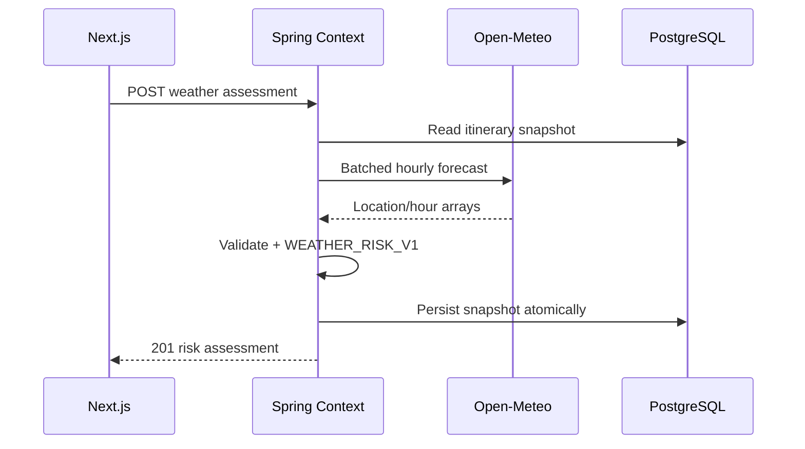

# FEAT-008 — Time-based Context Snapshot & Weather Risk MVP

> [!summary]
> Bổ sung dữ liệu bối cảnh thời tiết theo giờ cho itinerary một ngày tại TP.HCM. Spring Boot gọi Open-Meteo Forecast API qua provider port bằng danh sách tọa độ các điểm dừng, lưu immutable forecast snapshot và đánh giá rule-based mức mưa/nhiệt độ cảm nhận cho từng itinerary item. Frontend hiển thị thời điểm lấy dữ liệu, coverage, cảnh báo và attribution. Feature chỉ đánh dấu item có rủi ro hoặc ứng viên cần replan; không tự đổi địa điểm, thứ tự, timeline hay gọi LLM/FastAPI.

## 1. Trạng thái, ưu tiên và phê duyệt

| Thuộc tính | Giá trị |
| --- | --- |
| Trạng thái | `ready-for-review` |
| Độ ưu tiên | `P0 — context/time-based input cho dynamic replanning` |
| Người phụ trách | Nguyễn Bá Tân |
| Phụ thuộc bắt buộc | FEAT-005 Itinerary contract ổn định |
| Phụ thuộc bổ sung | FEAT-006 route/latest chỉ để cùng hiển thị; không ảnh hưởng weather rule |
| Backend | Spring Boot modular monolith |
| Module sở hữu | `com.saigonplantravel.backend.context` |
| AI Service | Không tham gia FEAT-008 |
| Weather provider | Open-Meteo Forecast API qua provider port |
| Database | PostgreSQL, Flyway migration-first |
| Frontend | Next.js + TypeScript, mobile-first |
| Timezone | `Asia/Ho_Chi_Minh` |
| Mốc liên quan | MVP có thể demo trước 30/08/2026 |

### 1.1. Vì sao đây là feature ưu tiên tiếp theo

- FEAT-005 đã tạo itinerary/timeline; FEAT-006 bổ sung route; FEAT-007 bổ sung explanation.
- Context thời tiết là dữ liệu động nhỏ nhất có thể kiểm thử trước dynamic re-planning.
- Mưa là một trong ba tình huống replan bắt buộc của MVP; cần snapshot/risk contract trước khi đề xuất thay đổi.
- Time-indexed forecast giúp báo cáo so sánh itinerary tĩnh với itinerary có context mà không cần tự huấn luyện mô hình dự báo.
- Rule deterministic trong Spring Boot phù hợp kiến trúc và dễ bảo vệ hơn việc giao quyết định cho LLM.
- Explicit refresh + immutable snapshots giữ external failure tách khỏi itinerary đã sinh.

### 1.2. Cổng phê duyệt

- Không code nếu FEAT-005 date/timeline/item coordinates/indoor contract chưa ổn định.
- `ready-for-review` → `approved`: duyệt provider/terms, variables, batching, schema/API, threshold rules, attribution và failure policy.
- `approved` → `in-progress`: bắt đầu migrations, backend adapter/rules và frontend.
- `in-progress` → `done`: toàn bộ Definition of Done ở mục 20 đạt.
- Thay provider, variables, units, threshold, ruleset, date horizon hoặc attribution sau approval phải cập nhật spec/config snapshot trước code.
- Free API chỉ dùng cho demo/giáo dục phi thương mại; production/commercial use cần duyệt lại terms/provider.

### 1.3. Baseline cần xác nhận

| ID | Baseline đề xuất | Nội dung xác nhận |
| --- | --- | --- |
| AP-001 | Open-Meteo free non-commercial API | Chấp nhận no-SLA/rate limits/CC BY attribution. |
| AP-002 | Hourly forecast, max 10 locations/request | Chốt danh sách variables và batching. |
| AP-003 | `WEATHER_RISK_V1` | Chốt rain/heat thresholds ở mục 10. |
| AP-004 | Explicit user refresh | Không background scheduler/auto POST trong MVP. |
| AP-005 | No provider fallback | Provider lỗi giữ snapshot cũ, không tạo forecast giả. |

## 2. Bối cảnh và vấn đề

Itinerary hiện có:

- `trip_date`, local start/end time theo TP.HCM.
- Item sequence, visit start/end và place coordinates.
- Place `indoor` flag.
- Deterministic scheduling warnings.
- Optional routed estimate/risk.

Chưa có contract để:

- Lấy forecast đúng ngày, vị trí và khung giờ từng stop.
- Lưu forecast version có provenance/fetched time.
- Phân biệt dữ liệu mới, cũ, thiếu hoặc mô phỏng.
- Đánh giá outdoor item có rủi ro mưa/nhiệt độ cảm nhận hay không.
- Hiển thị risk mà không làm mất itinerary khi provider lỗi.
- Tạo input ổn định cho re-planning proposal sau này.

FEAT-008 dùng forecast từ external provider như **ước tính**, không phải quan trắc thời gian thực. Hệ thống không tự dự báo bằng ML và không gọi FastAPI/LLM.

## 3. Mục tiêu

### 3.1. Mục tiêu sản phẩm

1. Cho người dùng chủ động cập nhật thời tiết cho itinerary.
2. Hiển thị forecast theo các khung giờ ghé từng địa điểm.
3. Cảnh báo mưa và nhiệt độ cảm nhận cao theo rule minh bạch.
4. Cho biết place indoor/outdoor ảnh hưởng mức tác động thế nào.
5. Đánh dấu item là `REPLAN_CANDIDATE` nhưng không tự thay đổi lịch.
6. Hiển thị coverage, fetched time, freshness, source và attribution.
7. Giữ page/timeline/snapshot cũ dùng được khi provider lỗi.

### 3.2. Mục tiêu kỹ thuật

- Tạo Context Module theo package-by-feature.
- Dùng Flyway migration-first; Hibernate `ddl-auto=validate`.
- Tạo `WeatherForecastProvider` port và `OpenMeteoWeatherProvider` adapter.
- Gửi coordinates theo itinerary item order trong một batched request, tối đa 10 locations.
- External call ngoài transaction; persistence atomic trong transaction ngắn.
- Validate provider arrays, units, timezone, coordinates, numeric ranges và WMO codes.
- Lưu immutable assessment/location/hour/item-risk snapshots.
- Dùng pure deterministic functions cho time alignment, rain/heat hazard và exposure impact.
- GET by ID/latest không gọi provider.
- Dùng injected `Clock` và `Asia/Ho_Chi_Minh` cho date/freshness.
- Không gửi user origin hoặc dữ liệu nhận dạng tới weather provider.

### 3.3. Kết quả mong đợi

Người dùng mở itinerary, xem assessment gần nhất hoặc bấm “Cập nhật thời tiết”. Spring đọc itinerary snapshot, gọi Open-Meteo cho coordinates của các stops, lưu hourly series rồi tính risk từng item. UI hiển thị rain probability, precipitation, apparent temperature, weather code, impact/warnings và attribution. High-risk outdoor item chỉ được gắn nhãn ứng viên replan; FEAT-008 không sinh hoặc áp dụng lịch mới.

## 4. Phạm vi

### 4.1. Trong phạm vi

- Itinerary một ngày tại TP.HCM, ngày hiện tại hoặc tương lai trong provider horizon.
- Unique place locations theo itinerary order, tối đa 10.
- Batched Open-Meteo request qua backend.
- Hourly variables:
  - `temperature_2m`
  - `apparent_temperature`
  - `precipitation_probability`
  - `precipitation`
  - `weather_code`
  - `wind_speed_10m`
  - `wind_gusts_10m`
- Explicit `timezone=Asia/Ho_Chi_Minh`, Celsius, millimeter, km/h.
- `start_date=end_date=tripDate`.
- Provider best-match model; không khóa model cụ thể.
- Immutable assessment, locations, hourly points và item risks.
- Complete/partial coverage.
- Rain hazard, apparent-heat hazard, indoor/outdoor exposure adjustment.
- Typed warnings, data quality, freshness và replan-candidate flag.
- POST create, GET by public UUID, GET latest.
- Mobile-first risk summary/item details/source attribution.
- Test fixture provider trong test/local profile, luôn gắn `SIMULATED`.
- Backend/frontend automated tests và evaluation dataset.
- Cập nhật ERD/API/integration/UI/log/PROJECT_CONTEXT/thesis notes.

### 4.2. Ngoài phạm vi

- Tự sửa/reorder/remove/add itinerary items.
- Sinh phương án thay thế hoặc re-planning proposal.
- Background polling/scheduler/push notifications.
- Current GPS/user origin weather.
- Weather outside itinerary stop coordinates.
- Historical weather hoặc trip đã kết thúc.
- 15-minutely data tại TP.HCM; hourly only.
- Live radar, flood, air quality, UV, lightning nowcast.
- Traffic/crowd/event context.
- Custom ML/ARIMA/Prophet/LSTM weather forecasting.
- LLM/RAG weather explanation.
- Multiple weather providers, retry chain hoặc paid API.
- Provider response cache dùng chung giữa itineraries.
- Raw provider JSON persistence.
- Medical/health advice hoặc emergency alert replacement.
- Production/commercial Open-Meteo use.
- Automatic use of `SIMULATED` data as real forecast.

> [!important]
> Risk là cảnh báo rule-based từ forecast, không phải kết luận an toàn. `REPLAN_CANDIDATE` chỉ là input cho feature sau; không tạo side effect trên itinerary.

## 5. Tác nhân và user stories

### 5.1. Tác nhân

- **Khách du lịch ẩn danh:** xem/refesh weather risk.
- **Next.js frontend:** gọi Spring API, render states/attribution.
- **Context Module:** sở hữu assessment aggregate/risk rules.
- **Scheduling Module:** cung cấp immutable itinerary input.
- **Place Module:** cung cấp coordinates/indoor facts qua read contract.
- **Open-Meteo adapter:** chuyển internal request sang external API.
- **Open-Meteo Forecast API:** external best-effort provider.
- **PostgreSQL:** lưu immutable snapshots.

### 5.2. User stories

**US-001 — Cập nhật thời tiết**  
Là khách du lịch, tôi muốn chủ động cập nhật dự báo cho lịch trình để biết điều kiện theo từng stop.

**US-002 — Hiểu rủi ro**  
Là khách du lịch, tôi muốn thấy vì sao item bị đánh dấu low/medium/high và dữ liệu giờ nào được dùng.

**US-003 — Coverage/freshness**  
Là khách du lịch, tôi muốn biết dữ liệu được lấy lúc nào, có thiếu stop/hour nào không và đã cũ chưa.

**US-004 — Không phá itinerary**  
Là khách du lịch, tôi muốn cảnh báo thời tiết không âm thầm sửa lịch trình.

**US-005 — Provider failure**  
Là khách du lịch, tôi muốn vẫn xem được itinerary/assessment cũ khi dịch vụ thời tiết lỗi.

**US-006 — Reproducibility**  
Là người làm khóa luận, tôi muốn lưu provider, variables, ruleset, thresholds và forecast points dùng cho mỗi kết quả.

## 6. Luồng người dùng và hệ thống

### 6.1. Mở itinerary

1. Frontend tải itinerary/latest route/explanation theo các feature trước.
2. Frontend gọi `GET latest weather assessment`; không tự POST.
3. Nếu 404, hiển thị CTA “Cập nhật thời tiết”.
4. Nếu có, hiển thị risk summary, fetched time, freshness và per-item badges.
5. Weather section lỗi không chặn timeline/map.

### 6.2. Tạo assessment thành công

1. Người dùng bấm “Cập nhật thời tiết”.
2. Spring validate itinerary date/horizon/status.
3. Read-only transaction tạo immutable snapshot gồm target fingerprint, items, times, coordinates và indoor flags.
4. Spring commit, deduplicate coordinates và gọi provider ngoài transaction.
5. Adapter gửi một batched request theo stable location order.
6. Provider response được validate/map sang normalized hourly forecast.
7. Pure rules align hourly points với từng visit interval và tính hazards/impact.
8. Spring recheck target fingerprint.
9. Write transaction lưu assessment, locations, hours và item risks atomically.
10. API trả `201 Created`/`Location`; UI cập nhật.

### 6.3. Partial coverage

1. Provider trả hợp lệ cho ít nhất một nhưng không phải mọi location/hour cần thiết.
2. Service chỉ đánh giá item có đủ minimum points.
3. Item thiếu data có `riskLevel=UNKNOWN` và reason `WEATHER_DATA_GAP`.
4. Assessment trả `PARTIAL_COVERAGE`, coverage count và warning.
5. Partial data không tự kích hoạt replan.

### 6.4. Date ngoài forecast horizon

1. Trip date đã qua hoặc xa hơn configured provider horizon.
2. Spring không gọi provider.
3. API trả `422 WEATHER_DATE_OUT_OF_RANGE` với available date range.
4. Existing assessment, nếu có, không bị xóa.

### 6.5. Provider failure

1. Timeout, 429, 4xx/5xx, invalid body hoặc zero usable locations.
2. Không persistence fake/empty assessment.
3. API trả typed `502`/`503` và correlation ID.
4. Latest completed assessment vẫn đọc được; UI hiển thị retry.
5. Không automatic retry loop.

### 6.6. Dữ liệu cũ

1. GET latest tính freshness từ `fetchedAt` bằng injected Clock.
2. `FRESH <= 3h`, `AGING >3h..6h`, `STALE >6h`.
3. STALE chỉ cảnh báo và mời refresh; không thay đổi stored snapshot.
4. Nếu trip đã kết thúc, UI chỉ đọc historical snapshot đã lưu, không refresh.

### 6.7. Sequence tổng quát



## 7. Yêu cầu chức năng

| ID | Yêu cầu | Độ ưu tiên |
| --- | --- | --- |
| FR-001 | Context schema tạo bằng Flyway migrations mới; không sửa migration đã áp dụng. | Must |
| FR-002 | Hibernate validate Spring-owned Context entities với schema Flyway. | Must |
| FR-003 | Context Module sở hữu weather aggregate/API/rules; không đặt logic trong Scheduling controller. | Must |
| FR-004 | `WeatherForecastProvider` port tách khỏi `OpenMeteoWeatherProvider` adapter. | Must |
| FR-005 | Chỉ itinerary tồn tại, có item và ngày hợp lệ trong forecast horizon được refresh. | Must |
| FR-006 | Spring tạo immutable input bằng read contracts, không import repository/entity module khác. | Must |
| FR-007 | Request chỉ gửi unique place coordinates, không gửi user origin/identity. | Must |
| FR-008 | Batched request giữ stable mapping giữa location index và place/item, tối đa 10 locations. | Must |
| FR-009 | Request dùng `start_date=end_date`, `Asia/Ho_Chi_Minh` và allowlisted hourly variables/units. | Must |
| FR-010 | Online request chỉ một provider attempt; không retry/fallback chain. | Must |
| FR-011 | External call phải ngoài database transaction và có timeout/response-size guard. | Must |
| FR-012 | Response phải validate HTTP/JSON, arrays, lengths, units, timezone, ranges, grid coordinates và WMO code. | Must |
| FR-013 | Provider response phải map sang internal DTO; không lưu raw JSON. | Must |
| FR-014 | Dữ liệu hợp lệ phải lưu immutable assessment/location/hour snapshots. | Must |
| FR-015 | Assessment phải lưu provider, fetched time, target/config/ruleset fingerprints và attribution snapshot. | Must |
| FR-016 | Hour points phải lưu valid time và bảy variables đã duyệt. | Must |
| FR-017 | Risk evaluator phải align hourly values với visit intervals theo semantics mục 10. | Must |
| FR-018 | Rain/heat hazards và indoor/outdoor impact phải dùng `WEATHER_RISK_V1` deterministic. | Must |
| FR-019 | Mỗi item trả risk level, reason codes, values used và `replanCandidate`. | Must |
| FR-020 | Item đã kết thúc trong trip hôm nay phải `NOT_APPLICABLE`; không là replan candidate. | Must |
| FR-021 | Missing minimum data trả item `UNKNOWN`; không suy diễn/fill bằng LLM. | Must |
| FR-022 | Assessment có usable subset phải `PARTIAL_COVERAGE`; zero usable coverage là provider error. | Must |
| FR-023 | Overall risk là max impact của applicable known items; mọi item unknown thì overall `UNKNOWN`. | Must |
| FR-024 | `replanCandidate` chỉ là flag; không gọi Replanning Module hoặc mutate itinerary. | Must |
| FR-025 | POST create assessment trả 201/Location cho complete/partial valid snapshots. | Must |
| FR-026 | GET by public UUID và GET latest không gọi provider. | Must |
| FR-027 | Date ngoài range trả 422 trước provider call; missing itinerary trả 404. | Must |
| FR-028 | Target đổi trong external call trả 409, không persist stale assessment. | Must |
| FR-029 | Provider failure giữ completed snapshot cũ và trả typed 502/503. | Must |
| FR-030 | Freshness được tính khi đọc bằng Clock, không cập nhật stored rows. | Must |
| FR-031 | Frontend không auto POST; refresh chỉ sau user action và chống duplicate click. | Must |
| FR-032 | UI hiển thị overall/item risk, coverage, freshness, fetched time và values/reasons. | Must |
| FR-033 | UI phân biệt forecast thật và `SIMULATED` fixture; simulated không dùng ngoài local/test. | Must |
| FR-034 | Attribution Open-Meteo/link/licence phải hiển thị cạnh weather data ở mọi breakpoint. | Must |
| FR-035 | Weather failure không chặn itinerary/map/timeline/explanation. | Must |
| FR-036 | Automated tests không gọi public Open-Meteo endpoint. | Must |
| FR-037 | Metrics lưu/ghi count, status, latency, coverage/risk distribution mà không log full coordinate URL/body. | Should |
| FR-038 | Feature không gọi FastAPI, LLM, RAG hoặc custom forecasting model. | Must |

## 8. Quy tắc nghiệp vụ

| ID | Quy tắc |
| --- | --- |
| BR-001 | Timezone nghiệp vụ luôn `Asia/Ho_Chi_Minh`. |
| BR-002 | Trip đã kết thúc không được refresh; stored snapshots vẫn GET được. |
| BR-003 | Forecast là ước tính theo mô hình, không gọi là real-time observation. |
| BR-004 | Một POST luôn tạo assessment mới; snapshots trước bất biến. |
| BR-005 | Latest ordering: `fetched_at DESC, id DESC`. |
| BR-006 | Provider grid coordinate có thể khác request coordinate; phải lưu cả hai và distance. |
| BR-007 | Grid distance vượt configured max làm location invalid/partial. |
| BR-008 | Unknown/unsupported weather code không gây 500; item risk `UNKNOWN` + warning. |
| BR-009 | Provider null/mismatched array không được silently fill. |
| BR-010 | Weather risk chỉ dùng forecast points, itinerary time và indoor flag; không dùng LLM. |
| BR-011 | Indoor adjustment giảm exposure impact, không thay đổi weather hazard gốc. |
| BR-012 | Thunderstorm high hazard không được hạ thấp dưới MEDIUM impact chỉ vì indoor. |
| BR-013 | Replan candidate chỉ dành cho future/ongoing outdoor HIGH impact hoặc thunderstorm condition. |
| BR-014 | Partial/unknown data không tự trở thành replan candidate. |
| BR-015 | Route risk và weather risk hiển thị riêng; không gộp thành “feasibility” tổng. |
| BR-016 | `SIMULATED` chỉ qua explicit profile/fixture và phải visible ở API/UI/log. |
| BR-017 | Không gửi arbitrary coordinates từ client; coordinates lấy từ stored itinerary/place snapshot. |
| BR-018 | Threshold/config/ruleset phải snapshot để evaluation tái lập. |

## 9. Open-Meteo adapter contract

### 9.1. Request

```http
GET https://api.open-meteo.com/v1/forecast
  ?latitude={lat1},{lat2}
  &longitude={lon1},{lon2}
  &hourly=temperature_2m,apparent_temperature,precipitation_probability,precipitation,weather_code,wind_speed_10m,wind_gusts_10m
  &temperature_unit=celsius
  &precipitation_unit=mm
  &wind_speed_unit=kmh
  &timezone=Asia%2FHo_Chi_Minh
  &start_date=2026-07-20
  &end_date=2026-07-20
```

- Build URI bằng HTTP client builder; không string-concatenate/log full URL.
- Coordinates lấy từ stored place snapshot và validate finite/range.
- Multiple-location response phải map đúng request order.
- Không gửi API key trên free non-commercial endpoint.

### 9.2. Config đề xuất

```yaml
app:
  context:
    weather:
      provider: open-meteo
      base-url: https://api.open-meteo.com
      connect-timeout: 2s
      read-timeout: 8s
      max-response-bytes: 1048576
      max-locations: 10
      max-forecast-days: 16
      max-grid-distance-km: 50
      ruleset-version: WEATHER_RISK_V1
```

Config provider URL/timeouts/limits từ environment/profile; không hard-code secret. Free endpoint no key.

### 9.3. Typed failures

| Failure | Public mapping |
| --- | --- |
| `PROVIDER_TIMEOUT` | 503 `WEATHER_PROVIDER_UNAVAILABLE` |
| `PROVIDER_RATE_LIMITED` | 503 `WEATHER_PROVIDER_RATE_LIMITED` |
| `PROVIDER_HTTP_ERROR` | 502 `WEATHER_PROVIDER_ERROR` |
| `PROVIDER_RESPONSE_TOO_LARGE` | 502 `WEATHER_DATA_INVALID` |
| `PROVIDER_JSON_INVALID` | 502 `WEATHER_DATA_INVALID` |
| `PROVIDER_SHAPE_INVALID` | 502 `WEATHER_DATA_INVALID` |
| `ZERO_USABLE_LOCATIONS` | 502 `WEATHER_DATA_UNAVAILABLE` |

Không trả raw reason/body/provider URL ra public API.

## 10. Time alignment và `WEATHER_RISK_V1`

### 10.1. Provider time semantics

- Provider timestamp/`weather_code`/temperature là instant tại giờ chỉ định.
- `precipitation` và `precipitation_probability` mô tả giờ liền trước theo provider documentation.
- Service normalize local provider timestamp thành `OffsetDateTime +07:00`.
- Với precipitation value tại `t`, interval hợp lệ là `(t-1h, t]`.
- Với instant value, dùng points nằm trong visit interval; nếu không có exact point, dùng nearest boundary trong tối đa 60 phút.
- Minimum usable item: ít nhất một precipitation interval giao visit interval và một apparent-temperature point hợp lệ.
- Boundary logic là pure function có fixed-Clock/timezone tests.

### 10.2. Rain hazard

Lấy max probability, tổng precipitation trên các intervals giao nhau và severe code:

| Level | Điều kiện bất kỳ |
| --- | --- |
| `HIGH` | probability >= 70%; hoặc precipitation interval >= 5 mm; hoặc code ∈ {65, 82, 95, 96, 99} |
| `MEDIUM` | probability >= 40%; hoặc precipitation interval >= 1 mm; hoặc code ∈ {51,53,55,61,63,65,80,81,82,95,96,99} |
| `LOW` | Có đủ data và không đạt MEDIUM/HIGH |
| `UNKNOWN` | Thiếu minimum data/code không hỗ trợ |

### 10.3. Apparent-heat hazard

Đây là rule về **mức bất tiện khi tham quan**, không phải tư vấn y tế:

| Level | Max apparent temperature |
| --- | ---: |
| `HIGH` | >= 38°C |
| `MEDIUM` | >= 34°C và < 38°C |
| `LOW` | < 34°C |
| `UNKNOWN` | Thiếu data |

### 10.4. Exposure impact

1. Base hazard = max(rain hazard, heat hazard), với `UNKNOWN` xử lý riêng.
2. Outdoor item: impact = base hazard.
3. Indoor item: HIGH → MEDIUM; MEDIUM → LOW; LOW giữ LOW.
4. Thunderstorm codes {95,96,99}: indoor impact tối thiểu MEDIUM do travel exposure.
5. Unknown minimum data: impact `UNKNOWN`.
6. `replanCandidate=true` khi item future/ongoing, outdoor, impact HIGH; hoặc thunderstorm làm impact HIGH.

### 10.5. Reason/warning codes

| Code | Scope |
| --- | --- |
| `RAIN_PROBABILITY_ELEVATED` | Item |
| `HEAVY_PRECIPITATION_FORECAST` | Item |
| `THUNDERSTORM_FORECAST` | Item |
| `HIGH_APPARENT_TEMPERATURE` | Item |
| `INDOOR_EXPOSURE_REDUCED` | Item |
| `WEATHER_DATA_GAP` | Item/assessment |
| `UNKNOWN_WEATHER_CODE` | Item/assessment |
| `PARTIAL_LOCATION_COVERAGE` | Assessment |
| `FORECAST_AGING` | Read response |
| `FORECAST_STALE` | Read response |
| `SIMULATED_WEATHER_DATA` | Assessment/UI |

## 11. Đặc tả dữ liệu

### 11.1. `itinerary_weather_assessments`

| Cột | Kiểu đề xuất | Null | Ghi chú |
| --- | --- | --- | --- |
| `id` | `BIGINT IDENTITY` | No | PK |
| `public_id` | `UUID` | No | Unique public identity |
| `itinerary_id` | `BIGINT` | No | FK immutable itinerary |
| `target_fingerprint` | `CHAR(64)` | No | Detect stale target |
| `status` | `VARCHAR(32)` | No | `COMPLETE`, `PARTIAL_COVERAGE` |
| `provider` | `VARCHAR(40)` | No | `OPEN_METEO`, `FIXTURE` |
| `data_quality` | `VARCHAR(24)` | No | `FORECAST`, `SIMULATED` |
| `trip_date` | `DATE` | No | Target date |
| `timezone` | `VARCHAR(60)` | No | HCMC |
| `requested_at` | `TIMESTAMPTZ` | No | Before provider call |
| `fetched_at` | `TIMESTAMPTZ` | No | Provider response accepted |
| `provider_latency_ms` | `INTEGER` | No | >=0 |
| `requested_location_count` | `INTEGER` | No | 1..10 |
| `covered_location_count` | `INTEGER` | No | 1..requested |
| `ruleset_version` | `VARCHAR(60)` | No | `WEATHER_RISK_V1` |
| `rule_config` | `JSONB` | No | Threshold snapshot |
| `request_fingerprint` | `CHAR(64)` | No | Variables/units/date/coords hash |
| `overall_risk` | `VARCHAR(16)` | No | LOW/MEDIUM/HIGH/UNKNOWN |
| `replan_candidate_count` | `INTEGER` | No | >=0 |
| `warning_codes` | `JSONB` | No | String array |
| `attribution_name` | `VARCHAR(160)` | No | Snapshot |
| `attribution_url` | `VARCHAR(2000)` | No | HTTPS |
| `licence_url` | `VARCHAR(2000)` | No | HTTPS |
| `created_at` | `TIMESTAMPTZ` | No | Immutable creation |

Indexes: `(itinerary_id, fetched_at DESC, id DESC)` và unique `public_id`.

### 11.2. `weather_forecast_locations`

| Cột | Kiểu đề xuất | Null | Ghi chú |
| --- | --- | --- | --- |
| `id` | `BIGINT IDENTITY` | No | PK |
| `assessment_id` | `BIGINT` | No | FK assessment |
| `location_index` | `INTEGER` | No | Stable request index |
| `place_id` | `BIGINT` | No | FK place |
| `place_slug_snapshot` | `VARCHAR(180)` | No | Display/audit |
| `requested_latitude` | `NUMERIC(9,6)` | No | Stored place coord |
| `requested_longitude` | `NUMERIC(10,6)` | No | Stored place coord |
| `resolved_latitude` | `NUMERIC(9,6)` | Yes | Provider grid |
| `resolved_longitude` | `NUMERIC(10,6)` | Yes | Provider grid |
| `elevation_meters` | `NUMERIC(8,2)` | Yes | Provider metadata |
| `grid_distance_km` | `NUMERIC(8,3)` | Yes | Haversine |
| `coverage_status` | `VARCHAR(24)` | No | `COVERED`, `INVALID`, `MISSING` |
| `failure_reason` | `VARCHAR(80)` | Yes | Typed category |

Unique `(assessment_id, location_index)` và `(assessment_id, place_id)`.

### 11.3. `weather_forecast_hours`

| Cột | Kiểu đề xuất | Null | Ghi chú |
| --- | --- | --- | --- |
| `id` | `BIGINT IDENTITY` | No | PK |
| `location_id` | `BIGINT` | No | FK location |
| `valid_at` | `TIMESTAMPTZ` | No | Provider local hour normalized +07 |
| `temperature_c` | `NUMERIC(5,2)` | Yes | Valid range checked |
| `apparent_temperature_c` | `NUMERIC(5,2)` | Yes | Valid range checked |
| `precipitation_probability_pct` | `SMALLINT` | Yes | 0..100 |
| `precipitation_mm` | `NUMERIC(8,3)` | Yes | >=0 |
| `weather_code` | `SMALLINT` | Yes | WMO allowlist/unknown warning |
| `wind_speed_kmh` | `NUMERIC(7,2)` | Yes | >=0 |
| `wind_gusts_kmh` | `NUMERIC(7,2)` | Yes | >=0 |

Unique `(location_id, valid_at)`. Không lưu raw JSON.

### 11.4. `itinerary_weather_item_risks`

| Cột | Kiểu đề xuất | Null | Ghi chú |
| --- | --- | --- | --- |
| `id` | `BIGINT IDENTITY` | No | PK |
| `assessment_id` | `BIGINT` | No | FK assessment |
| `itinerary_item_id` | `BIGINT` | No | FK item |
| `place_id` | `BIGINT` | No | FK place |
| `sequence_number` | `INTEGER` | No | Snapshot |
| `visit_start` | `TIMESTAMPTZ` | No | HCMC instant |
| `visit_end` | `TIMESTAMPTZ` | No | HCMC instant |
| `exposure` | `VARCHAR(16)` | No | `INDOOR`, `OUTDOOR` |
| `evaluation_status` | `VARCHAR(24)` | No | `ASSESSED`, `UNKNOWN`, `NOT_APPLICABLE` |
| `rain_hazard` | `VARCHAR(16)` | No | LOW/MEDIUM/HIGH/UNKNOWN |
| `heat_hazard` | `VARCHAR(16)` | No | LOW/MEDIUM/HIGH/UNKNOWN |
| `impact_level` | `VARCHAR(16)` | No | LOW/MEDIUM/HIGH/UNKNOWN |
| `max_precipitation_probability` | `SMALLINT` | Yes | Evidence value |
| `max_hourly_precipitation_mm` | `NUMERIC(8,3)` | Yes | Evidence value |
| `max_apparent_temperature_c` | `NUMERIC(5,2)` | Yes | Evidence value |
| `weather_codes` | `JSONB` | No | Sorted unique integer array |
| `reason_codes` | `JSONB` | No | Sorted unique string array |
| `replan_candidate` | `BOOLEAN` | No | No side effect |

Unique `(assessment_id, itinerary_item_id)`.

### 11.5. Migration dự kiến

Nếu FEAT-007 thực tế kết thúc ở `V17`:

```text
V18__create_weather_assessment_tables.sql
V19__create_weather_hour_and_item_risk_tables.sql
```

Inspect history trước khi tạo. Không sửa applied migrations và không seed forecast “thật” bằng migration.

## 12. Module boundary và transaction

### 12.1. Package đề xuất

```text
com.saigonplantravel.backend.context
├── controller/
├── service/
├── repository/
├── entity/
├── dto/
├── mapper/
├── weather/
│   ├── WeatherForecastProvider.java
│   ├── WeatherRiskEvaluator.java
│   ├── WeatherTimeAligner.java
│   └── openmeteo/
└── exception/
```

Không tạo root-level `controller/service/repository` chung. Provider adapter không chứa JPA repository hoặc risk rules.

### 12.2. Scheduling read contract

```java
public interface ItineraryContextInputQuery {
    ItineraryContextInput getByPublicId(UUID itineraryPublicId);
}
```

Input gồm itinerary internal reference dùng nội bộ, public ID, date, version/fingerprint và immutable item records với item ID, sequence, place ID/slug, coordinates, indoor, visit start/end.

### 12.3. Provider port

```java
public interface WeatherForecastProvider {
    WeatherForecastResult fetch(WeatherForecastRequest request);
}
```

`WeatherForecastResult` không chứa provider raw DTO. Open-Meteo response DTOs private trong adapter package.

### 12.4. Transaction boundary

```text
read-only transaction
→ immutable itinerary context input
→ commit
→ provider HTTP call
→ normalize + pure risk evaluation
→ re-read target fingerprint
→ short write transaction
→ assessment/locations/hours/item-risks commit atomically
```

Nếu persistence fail, toàn aggregate rollback; provider call không retry.

## 13. API contract

### 13.1. Create

```http
POST /api/v1/itineraries/{itineraryPublicId}/weather-assessments
Accept: application/json
```

Không request body trong MVP; client không được chọn coordinates/provider/threshold.

### 13.2. Read

```http
GET /api/v1/weather-assessments/{assessmentPublicId}
GET /api/v1/itineraries/{itineraryPublicId}/weather-assessments/latest
```

Latest chưa có snapshot trả `404 WEATHER_ASSESSMENT_NOT_FOUND`. GET không gọi provider.

### 13.3. Success response

```json
{
  "id": "01900000-0000-7000-8000-000000000801",
  "itineraryId": "01900000-0000-7000-8000-000000000501",
  "status": "COMPLETE",
  "dataQuality": "FORECAST",
  "tripDate": "2026-07-20",
  "timezone": "Asia/Ho_Chi_Minh",
  "fetchedAt": "2026-07-17T11:00:00+07:00",
  "freshness": "FRESH",
  "coverage": {
    "coveredLocationCount": 3,
    "requestedLocationCount": 3
  },
  "summary": {
    "overallRisk": "HIGH",
    "replanCandidateCount": 1,
    "warnings": []
  },
  "items": [
    {
      "sequence": 1,
      "placeSlug": "dia-diem-demo-ngoai-troi",
      "placeName": "Địa điểm demo ngoài trời",
      "visitStart": "2026-07-20T09:00:00+07:00",
      "visitEnd": "2026-07-20T10:30:00+07:00",
      "exposure": "OUTDOOR",
      "evaluationStatus": "ASSESSED",
      "rainHazard": "HIGH",
      "heatHazard": "LOW",
      "impactLevel": "HIGH",
      "maxPrecipitationProbability": 80,
      "maxHourlyPrecipitationMm": 3.2,
      "maxApparentTemperatureC": 31.4,
      "weatherCodes": [63, 80],
      "reasons": ["RAIN_PROBABILITY_ELEVATED"],
      "replanCandidate": true
    }
  ],
  "attribution": {
    "name": "Weather data by Open-Meteo.com",
    "url": "https://open-meteo.com/",
    "licenceUrl": "https://creativecommons.org/licenses/by/4.0/"
  },
  "disclaimer": "Dự báo và mức rủi ro chỉ là ước tính hỗ trợ lập kế hoạch, không phải cảnh báo khẩn cấp."
}
```

Payload chỉ minh họa contract; values/place là demo.

### 13.4. Errors

| HTTP | Code | Trường hợp |
| ---: | --- | --- |
| 404 | `ITINERARY_NOT_FOUND` | Missing target |
| 404 | `WEATHER_ASSESSMENT_NOT_FOUND` | GET/latest chưa có |
| 409 | `ITINERARY_CONTEXT_STALE` | Target đổi trước persistence |
| 409 | `WEATHER_ASSESSMENT_IN_PROGRESS` | Optional same-target duplicate guard |
| 422 | `WEATHER_DATE_OUT_OF_RANGE` | Past/outside horizon |
| 422 | `WEATHER_LOCATION_LIMIT_EXCEEDED` | >10 unique stops |
| 502 | `WEATHER_PROVIDER_ERROR` | Provider/response invalid |
| 502 | `WEATHER_DATA_UNAVAILABLE` | Zero usable coverage |
| 503 | `WEATHER_PROVIDER_UNAVAILABLE` | Timeout/unreachable/rate-limited |

Error theo common contract và có `correlationId`; không lộ raw body/full URL.

## 14. Frontend/UI

### 14.1. Vị trí

- Weather summary card trong Itinerary page, gần route risk/warnings.
- Không che map attribution hoặc timeline controls.
- Mobile: compact card + expandable per-item detail/bottom sheet.
- Desktop: summary panel cạnh timeline/map theo layout hiện có.

### 14.2. Nội dung

- Source, forecast label, fetched time và freshness badge.
- Coverage `x/y stops`.
- Overall risk và số replan candidates.
- Mỗi item: time, weather icon từ local WMO mapping, rain probability, precipitation, apparent temperature, exposure, impact và reasons.
- Disclaimer và Open-Meteo attribution/link.
- `SIMULATED` banner nổi bật nếu test/local fixture.

### 14.3. Actions/states

| State | Hành vi |
| --- | --- |
| `loadingLatest` | Skeleton nhỏ, không chặn page |
| `noAssessment` | CTA “Cập nhật thời tiết” |
| `refreshing` | Disable duplicate click, giữ snapshot cũ |
| `complete` | Summary + item details |
| `partial` | Coverage warning + unknown item rows |
| `stale` | Snapshot vẫn hiện + CTA refresh |
| `outOfRange` | Giải thích provider horizon |
| `providerError` | Retry; giữ snapshot cũ |
| `simulated` | Visible non-production label |

### 14.4. Accessibility/compliance

- `aria-live="polite"` cho refresh result.
- Risk icon luôn có text label.
- Không dùng màu là tín hiệu duy nhất.
- Expand/collapse keyboard accessible.
- Attribution link hiển thị cạnh weather data ở mọi breakpoint, dùng safe external-link attributes.
- Không render provider raw HTML.

## 15. Yêu cầu phi chức năng

| ID | Yêu cầu |
| --- | --- |
| NFR-001 | Flyway schema authority; Hibernate `ddl-auto=validate`. |
| NFR-002 | External call ngoài transaction; aggregate write atomic. |
| NFR-003 | Provider connect/read timeout và max response bytes cấu hình. |
| NFR-004 | Một request/attempt; không retry loop hoặc fallback provider. |
| NFR-005 | GET latest/by-ID không network side effect. |
| NFR-006 | Clock/timezone injected; tests không phụ thuộc system time. |
| NFR-007 | URI build an toàn; không log full coordinate URL/raw body. |
| NFR-008 | Không gửi user origin, identity hoặc arbitrary client coordinates. |
| NFR-009 | Provider DTO private; public DTO stable/provider-neutral. |
| NFR-010 | Deterministic risk/time alignment và stable ordering. |
| NFR-011 | Automated tests dùng stub/fixture, không public network. |
| NFR-012 | Attribution/licence visible và snapshot trong database. |
| NFR-013 | Provider terms/quota/no-SLA được review trước public deployment. |
| NFR-014 | Frontend progressive enhancement; weather lỗi không chặn page. |
| NFR-015 | No N+1 khi đọc itinerary items/places; batch snapshot query. |
| NFR-016 | Logs/metrics không chứa secrets/raw coordinates beyond approved debug profile. |

## 16. Tiêu chí chấp nhận

### AC-001 — Migrations/startup

**Given** clean DB và DB có FEAT-001–007  
**When** chạy migrations/startup  
**Then** Context tables/constraints/indexes và Hibernate validate pass; migration cũ không sửa.

### AC-002 — Valid batched provider request

**Given** itinerary có ba unique stops  
**When** create assessment  
**Then** adapter gửi đúng stable coordinate order, variables/units/date/timezone và một provider request.

### AC-003 — No user-origin leakage

**Given** Trip có custom origin  
**When** provider request được tạo  
**Then** chỉ stored stop coordinates được gửi, không origin/user fields.

### AC-004 — Provider success persistence

**Given** valid complete stub response  
**When** POST  
**Then** assessment/locations/hours/risks commit atomic và trả 201/Location.

### AC-005 — Response validation

**Given** wrong timezone/unit/array length/range/grid distance/JSON  
**When** adapter parse  
**Then** invalid location/whole response được xử lý typed, không silently fill.

### AC-006 — Exact time alignment

**Given** visit interval cắt qua hourly precipitation/instant points  
**When** evaluate  
**Then** overlap, preceding-hour semantics và nearest-boundary rule đúng `WEATHER_RISK_V1`.

### AC-007 — Rain thresholds

**Given** fixed hourly inputs quanh các ngưỡng 40/70%, 1/5 mm và severe WMO codes  
**When** evaluate  
**Then** LOW/MEDIUM/HIGH đúng boundary table.

### AC-008 — Apparent-heat thresholds

**Given** 33.99°C, 34°C, 37.99°C và 38°C  
**When** evaluate  
**Then** LOW/MEDIUM/MEDIUM/HIGH.

### AC-009 — Indoor exposure adjustment

**Given** cùng HIGH base hazard cho indoor/outdoor và thunderstorm case  
**When** calculate impact  
**Then** outdoor HIGH, indoor MEDIUM; thunderstorm indoor không dưới MEDIUM.

### AC-010 — Replan candidate

**Given** future outdoor HIGH, indoor HIGH-base, partial unknown và past item  
**When** evaluate  
**Then** chỉ trường hợp đủ điều kiện ở BR-013 có candidate; không Replanning call.

### AC-011 — Partial coverage

**Given** ít nhất một usable và một missing/invalid location  
**When** persist  
**Then** 201 `PARTIAL_COVERAGE`, counts/warnings đúng, missing items UNKNOWN.

### AC-012 — Zero coverage

**Given** provider response không có usable location  
**When** POST  
**Then** 502, không lưu empty assessment và snapshot cũ giữ nguyên.

### AC-013 — Date horizon

**Given** past date hoặc date vượt configured 16-day horizon  
**When** POST  
**Then** 422 trước provider call và trả available date range.

### AC-014 — Provider timeout/429/5xx

**Given** external failure  
**When** POST  
**Then** one attempt, typed 502/503, no partial write/retry và latest cũ còn đọc.

### AC-015 — External call outside transaction

**Given** slow stub server  
**When** POST chạy  
**Then** không DB transaction giữ mở trong HTTP call; persistence transaction ngắn.

### AC-016 — Stale target

**Given** itinerary fingerprint đổi trong provider call  
**When** trước persistence recheck  
**Then** 409 và không lưu assessment stale.

### AC-017 — Immutable/latest

**Given** hai completed assessments  
**When** GET by IDs/latest  
**Then** snapshots không đổi, latest deterministic và không external call.

### AC-018 — Freshness

**Given** fixed Clock và fetched ages 3h, >3h..6h, >6h  
**When** GET  
**Then** FRESH/AGING/STALE đúng, stored rows không update.

### AC-019 — Simulated data isolation

**Given** fixture provider enabled trong test/local  
**When** response render  
**Then** data quality/warning/banner `SIMULATED`; production profile không enable fixture.

### AC-020 — Frontend explicit action/states

**Given** mount, refresh, partial, stale, out-of-range và provider error  
**When** user tương tác  
**Then** không auto POST, duplicate click chặn và page core vẫn dùng được.

### AC-021 — Attribution/accessibility

**Given** weather data hiển thị ở mobile/desktop  
**When** visual/keyboard/screen-reader check  
**Then** attribution/licence, text risk labels, focus và live status hợp lệ.

### AC-022 — Privacy/logging

**Given** success/failure requests  
**When** inspect logs/public JSON  
**Then** không full URL/raw body/user origin/secret/internal IDs.

### AC-023 — No public provider in tests

**Given** test suites/CI  
**When** chạy không network/key  
**Then** stub/fixture được dùng và public Open-Meteo calls bằng 0.

### AC-024 — Regression/evaluation/docs

**Given** fixed weather dataset và FEAT-001–007 regression  
**When** full verify  
**Then** rules đạt expected matrix, prior features pass và docs/evidence được cập nhật.

## 17. Ma trận truy vết

| Yêu cầu | Tiêu chí chấp nhận | Bằng chứng dự kiến |
| --- | --- | --- |
| FR-001–FR-004 | AC-001, AC-004, AC-015 | Flyway/module/adapter tests |
| FR-005–FR-011 | AC-002, AC-003, AC-013–AC-015 | Service/client/transaction tests |
| FR-012–FR-016 | AC-004, AC-005, AC-011, AC-012 | Adapter/persistence integration tests |
| FR-017–FR-024 | AC-006–AC-011, AC-018, AC-019 | Pure rule/time-alignment tests |
| FR-025–FR-030 | AC-012–AC-018 | Controller/latest/error/stale tests |
| FR-031–FR-035 | AC-020, AC-021 | Frontend/a11y/visual tests |
| FR-036–FR-038 | AC-022–AC-024 | Network guard/log/regression evidence |

## 18. Chiến lược kiểm thử và đánh giá

### 18.1. Pure unit tests

- Date horizon và HCMC timezone với fixed `Clock`.
- Coordinate deduplication/stable index/order/limit.
- Array/unit/timezone/range/WMO/grid-distance validation.
- Precipitation preceding-hour overlap và instant nearest boundary.
- Rain/heat threshold boundaries.
- Indoor exposure/thunderstorm/replan-candidate rules.
- Overall risk, partial coverage, warning sorting và freshness.

### 18.2. Provider stub tests

- Complete multi-location response.
- Partial/missing location và null hourly values.
- Mismatched array lengths.
- HTTP 400/429/500, timeout, malformed JSON, oversized body.
- Unexpected timezone/units/grid coordinates/weather code.
- Assert request variables/units/date/timezone/order và exactly one attempt.

### 18.3. PostgreSQL integration tests

- Clean/existing Flyway migrations và Hibernate validate.
- FK/check/unique/JSONB constraints.
- Atomic aggregate rollback.
- Latest ordering và immutable snapshots.
- Hour/item-risk query count; no N+1.
- Target fingerprint stale guard.

PostgreSQL/Testcontainers hoặc project-equivalent được ưu tiên; H2 không chứng minh migration/JSONB constraints.

### 18.4. Web/frontend tests

- MockMvc status/Location/field names/errors/no raw provider data.
- Latest 404/no-state và no external call.
- Frontend state reducer/fetchers and no-auto-POST.
- Complete/partial/stale/simulated/error rendering.
- Attribution, safe link, keyboard/focus/`aria-live`.
- Responsive QA cùng itinerary map/timeline.

### 18.5. Evaluation dataset

Tối thiểu 12 deterministic scenarios:

1. Clear/comfortable outdoor.
2. Probability 39.99/40/69.99/70.
3. Precipitation 0.99/1/4.99/5 mm.
4. Moderate/heavy rain codes.
5. Thunderstorm code.
6. Apparent temperature 33.99/34/37.99/38.
7. Same hazard indoor/outdoor.
8. Visit interval on exact hour boundary.
9. Visit spanning multiple hours.
10. Partial location/hour coverage.
11. Past item within today.
12. Stale/latest/fingerprint change.

Expected output lưu risk levels, reasons, values, coverage, candidates và ruleset version; không phụ thuộc exact prose.

### 18.6. Evaluation targets

| Metric | Target |
| --- | ---: |
| Rule matrix matches expected | `100%` deterministic cases |
| Time-boundary cases correct | `100%` |
| Coverage/candidate counts correct | `100%` |
| Provider invalid shapes rejected | `100%` defined cases |
| Public provider calls in automated tests | `0` |
| Attribution on tested breakpoints | `100%` |

Real-provider smoke result được ghi riêng với request time, fetched date, location count, latency và provider terms date; không dùng làm deterministic pass/fail duy nhất.

## 19. Kế hoạch triển khai file-by-file

> [!warning]
> Chỉ triển khai sau approval. Tên/version/file là dự kiến; phải inspect repository và nearest AGENTS trước khi tạo.

### Phase A — Preflight/approval

- [ ] Đọc root/backend/frontend `AGENTS.md`, PROJECT_CONTEXT và FEAT-005/006/008.
- [ ] Inspect migrations, itinerary entities/API, coordinates/indoor snapshot, Clock/error/HTTP client conventions.
- [ ] Verify current Open-Meteo docs/terms/licence/rate limits/no-SLA.
- [ ] Duyệt variables, units, batch limit, horizon, time semantics, thresholds, attribution và no-fallback.
- [ ] Chuyển spec thành `approved`.

### Phase B — Flyway/persistence

- [ ] Tạo `V18__create_weather_assessment_tables.sql` hoặc next valid.
- [ ] Tạo `V19__create_weather_hour_and_item_risk_tables.sql` hoặc next valid.
- [ ] Named FKs/checks/unique/JSONB/indexes.
- [ ] Tạo Context entities/enums/repositories; không trả Entity public.
- [ ] Chạy migrations trên clean/existing DB và Hibernate validate.

### Phase C — Cross-module input

- [ ] Tạo `ItineraryContextInputQuery` và immutable records.
- [ ] Scheduling adapter batch-load itinerary/items/place facts.
- [ ] Tạo target fingerprint từ immutable fields.
- [ ] Test missing/empty/past/horizon/duplicate locations/N+1.

### Phase D — Provider port/Open-Meteo adapter

- [ ] Tạo `WeatherForecastProvider` request/result/failure contracts.
- [ ] Config properties có validation.
- [ ] Private Open-Meteo DTOs và URI builder.
- [ ] Multi-location response mapping theo stable index.
- [ ] Timeout/size/HTTP/JSON/shape/unit/timezone/range/grid/WMO validation.
- [ ] Không log full coordinate URL/raw body.
- [ ] Fixture provider chỉ test/local profile, `SIMULATED` visible.

### Phase E — Pure normalization/risk domain

- [ ] Tạo `WeatherTimeAligner` pure functions.
- [ ] Tạo `WeatherRiskEvaluator` với `WEATHER_RISK_V1` config snapshot.
- [ ] Rain/heat/indoor/thunderstorm/candidate rules.
- [ ] Partial/unknown/past item/overall aggregation.
- [ ] Freshness calculator và warning/reason deterministic ordering.
- [ ] Full boundary/adversarial unit tests.

### Phase F — Application service/transactions

- [ ] Tạo create/get/latest services.
- [ ] Split read/provider/write qua đúng Spring proxy boundaries.
- [ ] Recheck target fingerprint trước write.
- [ ] Aggregate factory bảo đảm count/risk/location/hour invariants.
- [ ] Atomic persistence và typed provider/domain errors.
- [ ] Optional duplicate in-progress guard nếu existing infra hỗ trợ; không thêm lock phức tạp mặc định.

### Phase G — DTO/API

- [ ] Request-free POST, GET by ID/latest controllers.
- [ ] Response records/mappers gồm coverage/freshness/items/attribution/disclaimer.
- [ ] Error mapping 404/409/422/502/503.
- [ ] POST 201/Location; GET no network.
- [ ] Public response không provider internals/numeric IDs/full URLs with coordinates.

### Phase H — Backend tests/verification

- [ ] Flyway/repository/constraint integration tests.
- [ ] Stub-server client success/partial/failure/one-attempt tests.
- [ ] Service/transaction/stale/atomicity/immutability tests.
- [ ] Controller JSON/status/Location/error tests.
- [ ] Network guard: automated tests never call Open-Meteo.
- [ ] Chạy `cd backend && ./mvnw test` và startup smoke.

### Phase I — Frontend data/UI

- [ ] Inspect current itinerary/map/explanation feature conventions.
- [ ] Tạo weather assessment types/fetchers/state.
- [ ] GET latest on mount; no POST until explicit refresh.
- [ ] Summary/item risk/coverage/freshness/reasons UI.
- [ ] Stale/partial/simulated/out-of-range/provider-error states.
- [ ] Attribution/disclaimer/safe link at all breakpoints.
- [ ] Accessibility/component/mock API tests.
- [ ] Run frontend lint/test/build.

### Phase J — Real-provider smoke/evaluation

- [ ] Chỉ sau approval, gọi Open-Meteo cho 1–3 demo itineraries trong quota.
- [ ] Verify batched response/timezone/grid distance/hourly mapping.
- [ ] Capture complete/partial/failure evidence without raw user origin.
- [ ] Run deterministic evaluation dataset and record results.
- [ ] Inspect logs/metrics/provider call count/attribution.

### Phase K — Regression/docs

- [ ] Start PostgreSQL/backend/frontend và run full user flow.
- [ ] Verify itinerary/route/explanation unchanged.
- [ ] Review diff: no secret, old migration, auto scheduler, AI dependency hoặc out-of-scope replan.
- [ ] Update Context ERD, API, Open-Meteo integration, UI, ADR if needed, development log.
- [ ] Update PROJECT_CONTEXT status/next feature.
- [ ] Ghi thesis architecture/rules/time-series/evaluation/limitations.
- [ ] Chuyển spec thành `done` sau DoD.

## 20. Definition of Done

- [ ] FEAT-008/provider/terms/rules đã approved.
- [ ] Implementation không vượt mục 4.
- [ ] Flyway clean/existing và Hibernate validate pass; migration cũ không sửa.
- [ ] Context Module/package/read boundaries đúng.
- [ ] Provider adapter request/response validation, timeout, size guard, one attempt có tests.
- [ ] External call ngoài transaction; aggregate persistence atomic/stale-safe.
- [ ] Immutable assessments/locations/hours/item risks và latest query đúng.
- [ ] Time alignment/rain/heat/exposure/candidate rules đạt 100% deterministic matrix.
- [ ] Partial/zero/out-of-range/provider failure/freshness semantics đúng.
- [ ] Không mutate/call Replanning; không FastAPI/LLM/custom forecast.
- [ ] Public API status/Location/errors/DTO privacy đúng.
- [ ] Frontend explicit refresh, all states, attribution, disclaimer, a11y/mobile-first đạt.
- [ ] `SIMULATED` isolated/test-local và visible.
- [ ] Automated tests không gọi public provider.
- [ ] Backend/frontend test/lint/build/startup/smoke/regression pass.
- [ ] Logs/diff không full coordinate URL/raw body/secret/internal IDs.
- [ ] ERD/API/integration/UI/log/PROJECT_CONTEXT/thesis notes cập nhật.

## 21. Rủi ro và giảm thiểu

| Rủi ro | Tác động | Giảm thiểu |
| --- | --- | --- |
| Free API no SLA/rate limit | Refresh lỗi | Explicit action, one call, timeout, keep latest snapshot |
| Forecast không chính xác | User hiểu sai | Disclaimer, fetched time, no auto change |
| Provider terms đổi | Compliance | Approval + docs access date + review before deploy |
| Thiếu attribution | Vi phạm CC BY | Persist/display attribution; UI acceptance tests |
| Multi-location response map sai | Risk gắn nhầm place | Stable index contract + adapter tests |
| Hour semantics lệch | Risk sai khung giờ | Explicit preceding-hour rule + boundary tests |
| Grid cell xa coordinate | Forecast kém phù hợp | Store grid coord/distance; max threshold/partial |
| Threshold tùy ý | Khó bảo vệ | Version/config snapshot + transparent matrix/evaluation |
| Indoor adjustment che hazard | Cảnh báo quá nhẹ | Preserve hazard riêng; thunderstorm floor |
| Partial data bị coi là safe | False confidence | UNKNOWN/partial warning; no candidate inference |
| External call trong transaction | Pool/lock lâu | Read/call/write split |
| Auto refresh quá nhiều | Provider abuse | No auto POST/background scheduler |
| Simulated data bị hiểu là thật | Báo cáo sai | Explicit profile/quality/banner/warning |
| Scope trượt sang replan/ML | Chậm MVP | Candidate flag only; FEAT-009 separate |

## 22. Quyết định đã chốt

| ID | Quyết định | Lý do |
| --- | --- | --- |
| DEC-001 | FEAT-008 chỉ context snapshot/risk, không replan. | Tách input khỏi decision/action. |
| DEC-002 | Spring Context Module sở hữu integration/rules. | Weather không cần Python AI service. |
| DEC-003 | Open-Meteo free API cho academic non-commercial demo. | No key, hourly variables phù hợp; có terms/attribution. |
| DEC-004 | Provider port + một adapter, no fallback chain. | Testable và giới hạn scope. |
| DEC-005 | Explicit refresh; latest GET no network. | Kiểm soát quota/side effects. |
| DEC-006 | Batched stops, không user origin. | Giảm calls và privacy exposure. |
| DEC-007 | Hourly only, best-match model. | TP.HCM 15-minute data chủ yếu nội suy; MVP đủ dùng. |
| DEC-008 | Immutable forecast/assessment snapshots. | Reproducibility/evaluation. |
| DEC-009 | `WEATHER_RISK_V1` deterministic rain/heat rules. | Dễ test/giải thích; không ML. |
| DEC-010 | Hazard và exposure impact tách riêng. | Indoor không làm biến mất weather condition. |
| DEC-011 | Partial giữ UNKNOWN, không fill. | Fail-safe và minh bạch. |
| DEC-012 | Provider failure không tạo fake forecast. | Tránh false confidence. |
| DEC-013 | Fixture chỉ test/local và `SIMULATED` visible. | Demo/test reproducible mà không giả dữ liệu thật. |
| DEC-014 | Candidate flag không gọi Replanning Module. | Người dùng phải duyệt proposal ở feature sau. |
| DEC-015 | Attribution luôn cạnh weather UI. | CC BY compliance. |

## 23. Feature kế tiếp đề xuất

Sau FEAT-008:

**FEAT-009 — Dynamic Re-planning Proposal V1**

Candidate scope:

- Ba trigger MVP: mưa/high weather risk, địa điểm đóng cửa, ngân sách thay đổi.
- Rule-based constraint checker và lựa chọn thay thế trong Spring Boot.
- Minimal disruption: giữ item không bị ảnh hưởng, chỉ thay/đổi phần cần thiết.
- Tạo immutable proposal/diff, không tự áp dụng.
- Người dùng xem, chấp nhận hoặc từ chối proposal.
- Apply được duyệt tạo itinerary version mới; lịch cũ bất biến.
- RAG/LLM chỉ giải thích proposal sau deterministic validation nếu cần.

## 24. Liên kết với báo cáo khóa luận

- **Chương 2:** dữ liệu theo thời gian, forecast snapshot, risk rules và context-aware planning.
- **Chương 3 — Kiến trúc:** Context Module, provider port, transaction boundaries và data flow.
- **Chương 3 — Database/API:** immutable assessment/hour/item-risk model và public contract.
- **Chương 3 — Cài đặt:** Open-Meteo adapter, time alignment, rain/heat/exposure evaluator.
- **Chương 4 — Thực nghiệm:** deterministic boundary matrix, coverage, provider latency/failures và snapshot comparison.
- **Giới hạn:** forecast model-dependent, hourly approximation, no SLA, no emergency alert, no custom forecast/replan.

Không gọi forecast là “thời tiết thời gian thực”. Dùng “dự báo theo giờ được lấy lúc …”.

## 25. Nguồn kỹ thuật chính thức

- [Open-Meteo Weather Forecast API](https://open-meteo.com/en/docs) — truy cập 2026-07-17. Tài liệu nêu hourly variables, timezone/date parameters, units, response arrays và WMO weather codes.
- [Open-Meteo Terms](https://open-meteo.com/en/terms) — truy cập 2026-07-17. Free API dành cho non-commercial use, có rate limits và không bảo đảm độ chính xác/tính sẵn sàng.
- [Open-Meteo Licence](https://open-meteo.com/en/licence) — truy cập 2026-07-17. API data theo CC BY 4.0 và yêu cầu attribution/link cạnh dữ liệu hiển thị.

Terms, quotas, pricing và provider behavior có thể thay đổi; kiểm tra lại trước implementation/public deployment.

## 26. Lịch sử thay đổi

| Ngày | Phiên bản | Thay đổi |
| --- | --- | --- |
| 2026-07-17 | 0.1 | Tạo FEAT-008 cho Open-Meteo hourly snapshots, deterministic rain/heat risks và replan-candidate flags không mutate itinerary. |
