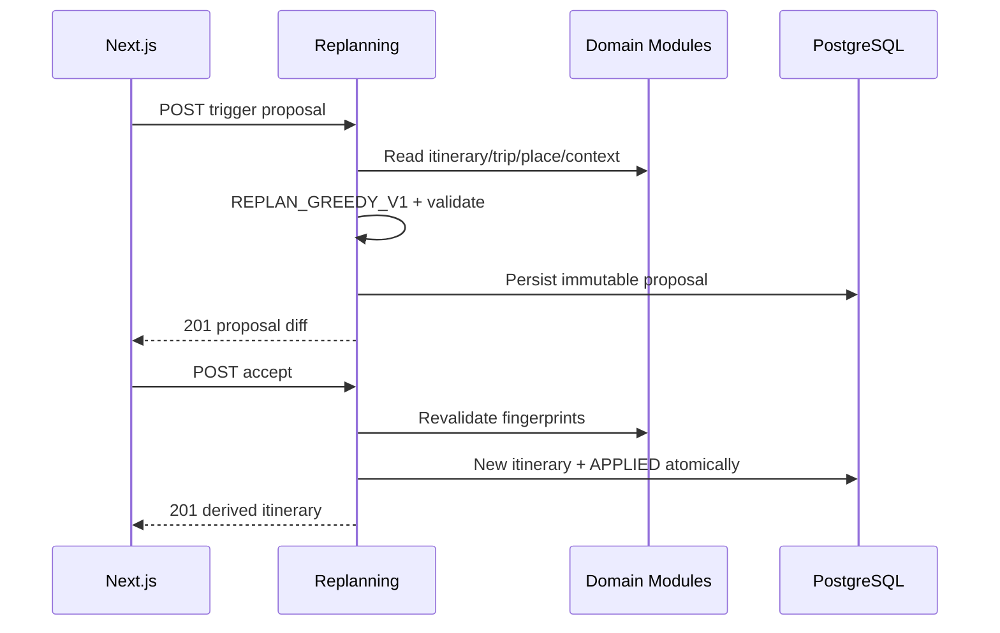
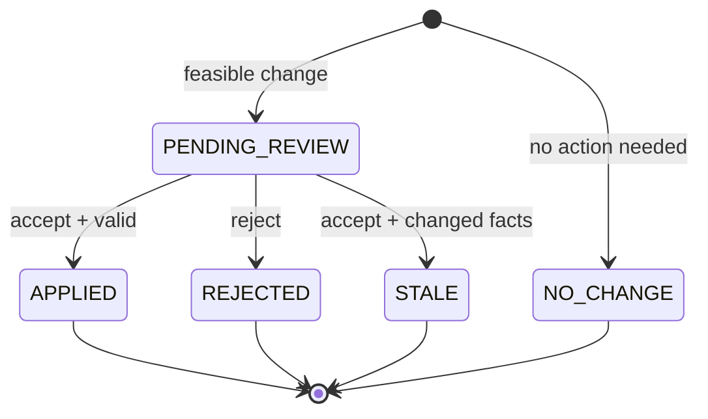

# FEAT-009 — Dynamic Re-planning Proposal V1

> [!summary]
> Tạo đề xuất tái lập lịch deterministic cho ba tình huống MVP: weather risk do mưa, địa điểm không thể ghé và ngân sách Trip draft thay đổi. Spring Boot giữ tối đa các item/timeslot cũ, ưu tiên replacement trong slot hiện tại, chỉ drop khi không có phương án hợp lệ, và không tự thêm/reorder item. Kết quả được lưu thành immutable proposal/diff để người dùng xem, chấp nhận hoặc từ chối. Chỉ thao tác chấp nhận mới tạo một itinerary version mới; itinerary gốc luôn bất biến. Feature không gọi LLM/FastAPI hoặc external provider.

## 1. Trạng thái, ưu tiên và phê duyệt

| Thuộc tính | Giá trị |
| --- | --- |
| Trạng thái | `ready-for-review` |
| Độ ưu tiên | `P0 — năng lực khác biệt cốt lõi của đề tài` |
| Người phụ trách | Nguyễn Bá Tân |
| Phụ thuộc bắt buộc | FEAT-002, FEAT-004, FEAT-005 |
| Weather trigger | FEAT-008 completed assessment |
| Phụ thuộc bổ sung | FEAT-006/007 chỉ enrich UI; không dùng trong quyết định V1 |
| Backend | Spring Boot modular monolith |
| Module sở hữu | `com.saigonplantravel.backend.replanning` |
| Database | PostgreSQL, Flyway migration-first |
| Frontend | Next.js + TypeScript, mobile-first |
| Algorithm | `REPLAN_GREEDY_V1` deterministic, slot-preserving |
| AI Service | Không tham gia decision/apply |
| Mốc liên quan | MVP có thể demo trước 30/08/2026 |

### 1.1. Vì sao đây là feature ưu tiên tiếp theo

- FEAT-005 tạo immutable itinerary baseline.
- FEAT-008 đã tạo weather-risk snapshot và `replanCandidate` nhưng chưa thay đổi lịch.
- Ba tình huống mưa, địa điểm đóng cửa/không thể ghé và thay đổi ngân sách là phạm vi replan tối thiểu đã chốt.
- Proposal-first giúp người dùng giữ quyền kiểm soát, tránh hệ thống tự viết lại toàn bộ trip.
- Itinerary lineage + diff tạo bằng chứng rõ cho “minimal disruption” trong khóa luận.
- Rule-based Spring implementation tận dụng scheduler/constraints hiện có và dễ kiểm thử hơn LLM planning.

### 1.2. Cổng phê duyệt

- Không code nếu FEAT-005 itinerary/item schema/algorithm contracts thực tế chưa ổn định.
- Weather trigger không triển khai nếu FEAT-008 assessment/item-risk contract chưa ổn định.
- `ready-for-review` → `approved`: duyệt trigger contracts, replacement eligibility/ranking, minimal-disruption rules, proposal schema/API và accept/reject lifecycle.
- `approved` → `in-progress`: bắt đầu migrations/backend/frontend.
- `in-progress` → `done`: Definition of Done ở mục 21 đạt.
- Mọi thay đổi action/ranking/disruption metric/apply semantics sau approval phải cập nhật spec trước code.

### 1.3. Baseline cần xác nhận

| ID | Baseline đề xuất | Nội dung xác nhận |
| --- | --- | --- |
| AP-001 | Slot-preserving, no reorder/add | Chấp nhận gap/shorter replacement thay vì rebuild toàn suffix. |
| AP-002 | Replacement phải `KNOWN_OPEN` | Không đề xuất place có giờ mở cửa unknown trong V1. |
| AP-003 | Place unavailable có user confirmation | Không cập nhật `places`; chỉ loại item trong proposal. |
| AP-004 | Budget change lấy từ current Trip draft | Người dùng sửa budget trước, proposal không nhận arbitrary budget. |
| AP-005 | Accept tạo itinerary mới atomically | Reject không thay itinerary; proposal content bất biến. |

## 2. Bối cảnh và vấn đề

Itinerary V1 là immutable snapshot được sinh từ Trip/Place constraints tại một thời điểm. Sau đó có thể phát sinh:

1. Outdoor item gặp weather risk HIGH.
2. Một địa điểm đóng cửa, inactive hoặc người dùng xác nhận không thể ghé.
3. Budget hiện tại của Trip draft thấp hơn budget snapshot của itinerary.

Nếu chạy lại `GREEDY_V1` từ đầu, toàn bộ sequence/timeline có thể đổi dù chỉ một item bị ảnh hưởng. Nếu tự áp dụng, người dùng mất quyền kiểm soát và khó so sánh trước/sau. Nếu cho LLM quyết định, constraints/determinism khó bảo đảm.

FEAT-009 tách thành hai bước:

- **Propose:** đọc immutable snapshots/current facts, tạo một proposal/diff không side effect.
- **Accept:** revalidate proposal, tạo derived itinerary mới trong transaction và giữ bản gốc.

## 3. Mục tiêu

### 3.1. Mục tiêu sản phẩm

1. Hỗ trợ ba trigger MVP bằng một review flow thống nhất.
2. Giữ tối đa item không bị ảnh hưởng và thứ tự/timeslot hiện tại.
3. Hiển thị rõ KEEP/REPLACE/DROP, lý do và before/after cost.
4. Cho người dùng chấp nhận hoặc từ chối; không auto-apply.
5. Sau accept, điều hướng tới itinerary mới và vẫn truy cập được bản gốc.
6. Cảnh báo route/weather/RAG snapshots của itinerary cũ không tự chuyển sang bản mới.
7. Trả no-change result khi không cần hoặc không được mở rộng lịch.

### 3.2. Mục tiêu kỹ thuật

- Tạo Replanning Module package-by-feature.
- Dùng Flyway migration-first và itinerary lineage.
- Tái sử dụng FEAT-005 travel/duration/money/constraint policies qua explicit domain contracts, không copy formula lệch.
- Tạo `REPLAN_GREEDY_V1` pure deterministic planner/validator.
- Lưu immutable proposal content và controlled lifecycle state.
- Snapshot trigger/base/current trip/candidate/config fingerprints.
- Proposal generation không external call và chỉ read transactions.
- Accept revalidates fingerprints/validity, locks/claims pending proposal và persists derived itinerary atomically.
- Reject là terminal state transition, không tạo itinerary.
- Dùng public UUID; không trả Entity/internal numeric IDs.
- Đo preserved ratio, changed/replaced/dropped counts và disruption cost.

### 3.3. Kết quả mong đợi

Người dùng chọn trigger từ itinerary. Backend tạo proposal gồm summary và action trên từng item. User xem diff; nếu reject, lịch giữ nguyên. Nếu accept, backend không chạy lại algorithm mà revalidate rồi materialize chính proposal đã duyệt thành itinerary version mới, liên kết với bản gốc. Route, weather assessment và RAG explanation cần refresh cho itinerary mới.

## 4. Phạm vi

### 4.1. Trong phạm vi

- One-day itinerary, tối đa item count theo FEAT-005.
- Ba trigger:
  - `WEATHER_RISK`
  - `PLACE_UNAVAILABLE`
  - `BUDGET_CHANGED`
- Trigger-specific validation và immutable context snapshot.
- `REPLAN_GREEDY_V1` slot-preserving.
- Actions `KEEP`, `REPLACE`, `DROP`.
- Weather: xử lý items `replanCandidate=true` từ completed FEAT-008 assessment.
- Place unavailable: system-validated inactive/closed hoặc explicit user confirmation.
- Budget: dùng current Trip draft snapshot; hỗ trợ budget decrease, no-change cho sufficient/increase.
- Replacement candidates từ active places, categories/preferences, environment, cost, known opening hours, duration và travel feasibility.
- Không duplicate place trong proposed itinerary.
- Full proposed-itinerary constraint check.
- Immutable proposals/items/warnings.
- Proposal statuses `PENDING_REVIEW`, `NO_CHANGE`, `APPLIED`, `REJECTED`, `STALE`.
- GET proposal/latest; accept/reject actions.
- Accept tạo derived itinerary mới và lineage.
- Mobile-first trigger sheet, proposal diff/review và decision states.
- Deterministic scenario/evaluation dataset.
- Cập nhật ERD/API/architecture/UI/log/PROJECT_CONTEXT/thesis notes.

### 4.2. Ngoài phạm vi

- Auto-detect/polling/background trigger.
- Auto-apply hoặc push notification.
- Arbitrary natural-language replanning.
- Multi-trigger trong cùng proposal.
- Reorder/move existing items trong V1.
- Add item để lấp gap hoặc tận dụng budget tăng.
- Shift times của KEEP items.
- Full suffix/global rescheduling.
- Route-aware replacement bằng OSRM matrix/live traffic.
- Weather provider call khi tạo proposal; chỉ dùng stored assessment.
- Crowd, traffic, event, flood hoặc air quality triggers.
- Multi-day/overnight itinerary.
- User drag/drop manual editing.
- Multiple alternative proposals/optimization algorithms.
- LLM/RAG quyết định replacement.
- RAG explanation cho proposal.
- Tự cập nhật Place operational status hoặc Trip budget.
- Copy route/weather/explanation snapshot từ itinerary gốc sang bản mới.
- Undo applied itinerary hoặc merge concurrent proposals.

> [!important]
> “Dynamic” nghĩa là proposal dùng context/current facts sau khi itinerary được tạo. V1 vẫn là user-triggered, deterministic và approval-first; không phải autonomous agent.

## 5. Tác nhân và user stories

### 5.1. Tác nhân

- **Khách du lịch ẩn danh:** chọn trigger, review, accept/reject.
- **Next.js frontend:** render trigger inputs/diff/lifecycle/lineage.
- **Replanning Module:** sở hữu proposal lifecycle/algorithm/API.
- **Scheduling Module:** cung cấp base itinerary và materialize derived itinerary qua contract.
- **Trip Module:** cung cấp current Trip snapshot/budget.
- **Place Module:** cung cấp active candidates/categories/opening hours.
- **Context Module:** cung cấp stored weather assessment/risks.
- **PostgreSQL:** lưu proposals, decisions và itinerary lineage.

### 5.2. User stories

**US-001 — Replan do mưa**  
Là khách du lịch, tôi muốn thay outdoor item rủi ro cao bằng indoor alternative mà giữ phần còn lại.

**US-002 — Địa điểm không thể ghé**  
Là khách du lịch, tôi muốn xác nhận một stop không khả dụng và nhận replacement/drop proposal.

**US-003 — Ngân sách thay đổi**  
Là khách du lịch, sau khi giảm budget Trip draft, tôi muốn proposal giảm chi phí với ít thay đổi nhất.

**US-004 — Xem diff**  
Là khách du lịch, tôi muốn thấy chính xác item nào giữ, thay hoặc bỏ và vì sao.

**US-005 — Quyết định rõ ràng**  
Là khách du lịch, tôi muốn accept/reject bằng thao tác riêng và không lo page load tự áp dụng.

**US-006 — Lineage**  
Là người làm khóa luận, tôi muốn đo preserved ratio/disruption và truy vết itinerary mới về base/proposal.

## 6. Trigger contracts

### 6.1. `WEATHER_RISK`

Request cung cấp `weatherAssessmentId`. Hợp lệ khi:

- Assessment tồn tại, target đúng base itinerary.
- Status `COMPLETE` hoặc `PARTIAL_COVERAGE`.
- `dataQuality=FORECAST` trong non-test profile.
- Không `STALE` tại proposal time.
- Có ít nhất một applicable item `replanCandidate=true`.
- Affected set là đúng các candidate items; partial/unknown không tự affected.

Không gọi Open-Meteo trong proposal. `validUntil` của proposal không vượt `assessment.fetchedAt + 6h`.

### 6.2. `PLACE_UNAVAILABLE`

Request cung cấp `itemSequence` và `confirmationSource`:

- `SYSTEM_VALIDATED`: place hiện `active=false` hoặc current opening hours là known closed/không phủ visit interval.
- `USER_CONFIRMED`: user chủ động xác nhận place không thể ghé; không đổi `places`.

Nếu chọn `SYSTEM_VALIDATED` nhưng facts không chứng minh conflict, trả `422 TRIGGER_NOT_CONFIRMED`. Chỉ một base item affected trong V1.

### 6.3. `BUDGET_CHANGED`

- Request không nhận budget.
- Service đọc current Trip draft liên kết base itinerary.
- Current budget phải khác `baseItinerary.initialBudget` và vẫn trong `0..100000000` VND.
- Current Trip `updatedAt`/budget được snapshot.
- Nếu current budget >= base total estimated cost, tạo terminal `NO_CHANGE`.
- Nếu budget tăng, không tự thêm item và warning `BUDGET_INCREASE_NOT_EXPANDED`.
- Nếu current budget thấp hơn total, planner giảm cost đến <= current budget hoặc trả proposal với drops; nếu không thể có item nào thì zero-item derived itinerary bị cấm và proposal outcome typed failure.

### 6.4. Invalid/multiple trigger

- Body phải đúng one-of schema của trigger.
- Field của trigger khác bị reject.
- Một proposal chỉ có một trigger type.
- Cùng base + trigger fingerprint có pending proposal thì trả `409 PENDING_PROPOSAL_EXISTS` kèm `existingProposalId` trong error params; không tạo bản ghi mới.

## 7. Luồng người dùng và hệ thống

### 7.1. Tạo weather proposal

1. User mở FEAT-008 assessment và bấm “Xem phương án điều chỉnh”.
2. Frontend POST trigger/base/assessment IDs.
3. Replanning service đọc base itinerary, current Trip/Place facts và stored assessment qua read contracts.
4. Planner đánh dấu affected outdoor HIGH items.
5. Cho mỗi affected slot, planner tìm/rank indoor replacements; nếu không có thì DROP.
6. Constraint checker validate toàn proposed plan.
7. Proposal/items/warnings lưu atomically, không tạo itinerary.
8. API trả 201/Location; UI mở review.

### 7.2. Place unavailable proposal

1. User chọn item và lý do “Địa điểm không thể ghé”.
2. User chọn/đồng ý confirmation source.
3. Backend validate item/current facts/confirmation.
4. Planner tìm same-slot replacement theo trip environment/categories; nếu không có, DROP.
5. Proposal lưu và trả review diff; `places` không đổi.

### 7.3. Budget changed proposal

1. User sửa budget bằng Trip API FEAT-004.
2. Base itinerary hiển thị stale.
3. User chọn “Điều chỉnh theo ngân sách mới”.
4. Backend đọc current Trip budget, không tin budget từ client.
5. Nếu budget đủ/tăng, tạo `NO_CHANGE`.
6. Nếu thiếu, planner chọn replacement/drop operations có cost reduction lớn nhất với số thay đổi ít.
7. Giữ times/order của items còn lại và validate total cost.

### 7.4. Review

1. Frontend GET proposal.
2. Hiển thị before/after summary và chỉ highlight changes.
3. User xem KEEP/REPLACE/DROP, reason, cost delta, preserved ratio, gaps và warnings.
4. `NO_CHANGE` không có accept action.
5. Pending proposal có hai actions “Áp dụng” và “Giữ lịch cũ”.

### 7.5. Accept/apply

1. User bấm “Áp dụng phương án”.
2. Backend atomically claim pending proposal/optimistic version.
3. Re-read base/current Trip/Place/weather fingerprints và `validUntil`.
4. Nếu stale, chuyển `STALE`, trả 409; không tạo itinerary.
5. Nếu valid, materialize stored proposed items thành itinerary mới; không rerun planner.
6. Set parent lineage, algorithm/reason, new public ID; persist itinerary/items/warnings atomically.
7. Proposal chuyển `APPLIED` và liên kết new itinerary trong cùng transaction.
8. API trả 201/Location new itinerary; UI điều hướng và nhắc refresh route/weather/explanation.

### 7.6. Reject

1. User bấm “Giữ lịch cũ”.
2. Conditional transition `PENDING_REVIEW → REJECTED`.
3. Không tạo/update itinerary.
4. Base itinerary tiếp tục dùng được; proposal audit vẫn GET được.

### 7.7. Failure/concurrency

- Hai accept/reject đồng thời: chỉ một transition thắng; request còn lại 409.
- Persistence lỗi: proposal vẫn pending hoặc transaction rollback toàn bộ; không half-applied itinerary.
- Candidate/Trip/weather thay đổi sau proposal: mark stale, không tự regenerate.
- User phải chủ động tạo proposal mới.

### 7.8. Sequence



## 8. Yêu cầu chức năng

| ID | Yêu cầu | Độ ưu tiên |
| --- | --- | --- |
| FR-001 | Schema proposal/lineage tạo bằng Flyway migrations mới; không sửa migration cũ. | Must |
| FR-002 | Hibernate validate Replanning entities và altered Itinerary schema. | Must |
| FR-003 | Replanning Module sở hữu proposal lifecycle/algorithm/API. | Must |
| FR-004 | Dùng Trip/Place/Scheduling/Context read contracts, không import cross-module repositories/entities. | Must |
| FR-005 | Chỉ hỗ trợ ba trigger enum và one-of trigger body. | Must |
| FR-006 | Weather trigger phải dùng completed non-stale assessment đúng base itinerary. | Must |
| FR-007 | Weather affected set chỉ gồm applicable `replanCandidate=true` items. | Must |
| FR-008 | Place unavailable phải system-validated hoặc user-confirmed; không mutate Place. | Must |
| FR-009 | Budget trigger phải đọc current Trip budget; không nhận arbitrary budget từ client. | Must |
| FR-010 | Budget giữ nguyên/sufficient/increase phải trả deterministic `NO_CHANGE` semantics. | Must |
| FR-011 | Proposal input phải snapshot target/trigger/trip/place/context/config fingerprints. | Must |
| FR-012 | `REPLAN_GREEDY_V1` không gọi external provider, FastAPI, LLM hoặc RAG. | Must |
| FR-013 | Planner không reorder, add hoặc shift KEEP items. | Must |
| FR-014 | Unaffected feasible items phải KEEP; affected item ưu tiên REPLACE, sau đó DROP. | Must |
| FR-015 | Replacement phải fit original slot và travel feasibility với adjacent kept items. | Must |
| FR-016 | Replacement phải active, unique, tọa độ hợp lệ, category-compatible và `KNOWN_OPEN`. | Must |
| FR-017 | Weather replacement phải indoor; trip environment relaxation phải warning rõ. | Must |
| FR-018 | Non-weather replacement phải tôn trọng Trip environment. | Must |
| FR-019 | Replacement cost/duration phải fit effective budget/original slot. | Must |
| FR-020 | Replacement ranking/tie-breakers phải deterministic theo mục 10. | Must |
| FR-021 | Budget planner phải ưu tiên ít changed items, replacement trước drop khi đạt cùng reduction. | Must |
| FR-022 | Proposed plan phải qua full time/budget/active/opening/duplicate constraint check. | Must |
| FR-023 | Zero-item proposed itinerary phải bị reject; base itinerary giữ nguyên. | Must |
| FR-024 | Proposal content/items/warnings phải immutable sau create. | Must |
| FR-025 | Proposal lifecycle chỉ cho phép valid transitions được định nghĩa. | Must |
| FR-026 | Create trả 201/Location cho pending/no-change proposal. | Must |
| FR-027 | GET by proposal UUID và GET latest không chạy planner/side effect. | Must |
| FR-028 | Response phải có before/after, actions, reasons, cost delta, preserved ratio và disruption cost. | Must |
| FR-029 | Accept phải revalidate fingerprints/weather validity trước apply. | Must |
| FR-030 | Accept phải materialize stored proposal, không rerun algorithm. | Must |
| FR-031 | Accept tạo immutable itinerary mới với parent lineage/algorithm/reason. | Must |
| FR-032 | Derived itinerary/items/warnings và proposal `APPLIED` commit atomically. | Must |
| FR-033 | Reject chỉ đổi proposal state; không update/create itinerary. | Must |
| FR-034 | Accept/reject concurrency phải có single-winner guard và typed 409. | Must |
| FR-035 | Stale proposal chuyển `STALE` và không apply/regenerate tự động. | Must |
| FR-036 | Derived itinerary không copy route/weather/explanation snapshots. | Must |
| FR-037 | Frontend không auto-create/accept/reject; mọi mutation do explicit user action. | Must |
| FR-038 | UI phải hiển thị trigger, diff, changes/gaps/warnings và lineage. | Must |
| FR-039 | UI `NO_CHANGE`/`STALE`/`APPLIED`/`REJECTED` có states/actions phù hợp. | Must |
| FR-040 | Automated tests không gọi weather/routing/AI provider thật. | Must |
| FR-041 | Metrics ghi trigger/outcome/counts/disruption/duration nhưng không full preference/origin payload. | Should |
| FR-042 | FEAT-001–008 public contracts phải giữ nguyên ngoài additive itinerary lineage fields. | Must |

## 9. Quy tắc nghiệp vụ

| ID | Quy tắc |
| --- | --- |
| BR-001 | Base itinerary là immutable; create/reject proposal không được sửa itinerary hoặc items của nó. |
| BR-002 | Mỗi proposal tham chiếu đúng một base itinerary và đúng một trigger. |
| BR-003 | Proposal snapshot toàn bộ nội dung cần để review/apply; thay đổi facts sau đó chỉ làm proposal stale. |
| BR-004 | `PENDING_REVIEW` chỉ chuyển sang `APPLIED`, `REJECTED` hoặc `STALE`. |
| BR-005 | `NO_CHANGE`, `APPLIED`, `REJECTED` và `STALE` là terminal. |
| BR-006 | `NO_CHANGE` không tạo derived itinerary và không có accept/reject action. |
| BR-007 | Mỗi base item có đúng một proposal action: `KEEP`, `REPLACE` hoặc `DROP`. |
| BR-008 | `KEEP` giữ nguyên place, sequence, start, end, duration và estimated cost snapshot. |
| BR-009 | `REPLACE` giữ sequence/start của slot; end có thể sớm hơn nhưng không được muộn hơn end cũ. |
| BR-010 | `DROP` giữ một gap; V1 không kéo item sau lên để lấp gap. |
| BR-011 | V1 không tạo item mới ngoài replacement một-một cho base item. |
| BR-012 | Một place chỉ xuất hiện tối đa một lần trong proposed itinerary. |
| BR-013 | Replacement có opening-hours unknown bị loại; không chỉ cảnh báo rồi vẫn chọn. |
| BR-014 | Weather trigger chỉ thay/drop affected items; item không affected phải KEEP nếu base snapshot còn tự nhất quán. |
| BR-015 | Place-unavailable trigger chỉ thay/drop item được chỉ định. |
| BR-016 | Budget trigger có thể thay/drop nhiều items nhưng không thay item nếu không tạo positive cost saving. |
| BR-017 | Budget increase/sufficient budget không được dùng để mở rộng lịch trong V1. |
| BR-018 | Tiền lưu bằng VND integer/minor-unit policy thống nhất FEAT-005; không dùng floating point. |
| BR-019 | Time dùng timezone `Asia/Ho_Chi_Minh` và cùng date của base one-day itinerary. |
| BR-020 | Accept dùng stored actions; nếu không còn hợp lệ thì stale, không âm thầm sinh phương án khác. |
| BR-021 | Chỉ một quyết định terminal được thắng khi concurrent accept/reject. |
| BR-022 | Derived itinerary có public UUID mới, parent/proposal lineage và là immutable snapshot độc lập. |
| BR-023 | Route, weather assessment và explanation của parent không có hiệu lực cho derived itinerary. |
| BR-024 | User-confirmed unavailability chỉ là context của proposal, không phải moderation/update Place Catalog. |
| BR-025 | Public API không lộ database IDs, provider payload hoặc internal exception. |

## 10. Thuật toán `REPLAN_GREEDY_V1`

### 10.1. Canonical input

Planner nhận một immutable input object, không nhận Entity:

- Base itinerary snapshot và ordered item snapshots.
- Trip snapshot hiện tại: date, start/end, budget, categories, environment và origin.
- Candidate Place snapshots từ Place read contract.
- Trigger context tương ứng.
- Exact FEAT-005 policies/config: duration, money, travel-time estimator, opening-hours semantics và timezone.
- `generatedAt` cố định do application service truyền vào; pure planner không gọi clock.

Input được canonicalize trước khi hash: sorted keys/collections, UTC instant chuẩn, money integer và coordinate precision thống nhất. Hash dùng SHA-256 cho:

- `baseFingerprint`
- `tripFingerprint`
- `placeCatalogFingerprint`
- `contextFingerprint` nếu có
- `plannerConfigFingerprint`
- `triggerFingerprint` tổng hợp các fingerprint và trigger parameters

### 10.2. Xác định affected set

| Trigger | Affected set |
| --- | --- |
| `WEATHER_RISK` | Tất cả base items có matching assessment risk và `replanCandidate=true`, theo sequence tăng dần. |
| `PLACE_UNAVAILABLE` | Đúng item có `itemSequence` trong request sau khi confirmation hợp lệ. |
| `BUDGET_CHANGED` | Ban đầu rỗng; mỗi operation được greedy budget loop chọn sẽ biến item đó thành affected. |

Nếu weather/place trigger không còn affected item hợp lệ, trả `422 NO_APPLICABLE_ITEM`. Budget sufficient/increase tạo `NO_CHANGE` thay vì lỗi.

### 10.3. Replacement eligibility

Candidate cho một slot chỉ hợp lệ khi đồng thời:

1. Place `active=true` và có tọa độ hợp lệ trong supported TP.HCM boundary của Place Module.
2. Không phải place bị thay, không trùng place của bất kỳ `KEEP`/`REPLACE` action khác.
3. Có ít nhất một category giao với category snapshot của base item; nếu snapshot không có thì giao với Trip preferred categories.
4. Environment:
   - weather trigger: bắt buộc `INDOOR`;
   - trigger khác: theo Trip environment policy của FEAT-005;
   - `ANY` cho phép cả indoor/outdoor.
5. Opening-hours evaluator trả `KNOWN_OPEN` cho toàn candidate visit interval.
6. Candidate recommended duration không vượt original slot duration và thỏa minimum visit duration.
7. Candidate start bằng original start; end bằng start cộng recommended/effective duration và không vượt original end.
8. Candidate estimated cost không làm proposed total vượt effective budget.
9. Travel feasibility với previous/next non-dropped item đạt mục 10.4.
10. Candidate snapshot vượt qua các validation chung của FEAT-005.

Không có category fallback tùy ý trong V1. Nếu requirement “indoor” xung đột Trip `OUTDOOR` do weather trigger, safety/weather rule thắng và proposal thêm warning `ENVIRONMENT_RELAXED_TO_INDOOR`.

### 10.4. Time và travel feasibility

Replanning dùng đúng `TravelTimeEstimator`/rounding/config của FEAT-005, dựa trên Haversine; không gọi OSRM. Với proposed ordered non-dropped items:

- `previous.end + estimate(previous, current) <= current.start`
- `current.end + estimate(current, next) <= next.start`
- item đầu/cuối tiếp tục thỏa origin/start/end window theo FEAT-005.

Khi một item bị drop, gap của slot vẫn tồn tại. Full checker tính lại adjacency giữa hai item non-dropped gần nhất; không giả định drop luôn hợp lệ.

### 10.5. Candidate ranking

Eligible candidates được sort ổn định theo thứ tự:

1. Số category match giảm dần.
2. Weather suitability giảm dần; indoor là điều kiện bắt buộc cho weather.
3. Tổng adjacent detour minutes tăng dần.
4. Estimated cost tăng dần.
5. Effective duration tăng dần.
6. Normalized place name theo `String.compareTo` tăng dần.
7. Internal Place ID tăng dần chỉ làm tie-break cuối, không trả ra API.

`adjacentDetourMinutes` là tổng travel mới tới/đi khỏi slot trừ baseline adjacent travel tương ứng. Cùng input/config phải luôn sinh cùng candidate/action order.

### 10.6. Weather/place-unavailable loop

Với từng affected item theo sequence:

1. Giữ toàn bộ unaffected actions ở `KEEP`.
2. Build eligible candidate list dựa trên plan đang hình thành.
3. Chọn candidate đứng đầu làm `REPLACE`.
4. Nếu không có candidate, thử `DROP`.
5. Chạy incremental adjacency/duplicate/budget checks.
6. Sau toàn bộ items, chạy full checker.
7. Nếu selected replacement gây conflict toàn cục, thử candidate kế tiếp theo rank; hết candidate thì thử drop.
8. Nếu mọi phương án dẫn đến zero-item hoặc constraint violation, trả `422 NO_FEASIBLE_REPLAN` và không lưu proposal.

Search/backtracking chỉ đi qua affected slots và ranked alternatives; đặt hard cap bằng config. Vượt cap trả typed failure, không trả plan chưa validate.

### 10.7. Budget loop

`deficit = baseTotalEstimatedCost - currentTripBudget`.

- Nếu `deficit <= 0`: tạo `NO_CHANGE`.
- Với mỗi base item, build các positive-saving operations:
  - best feasible cheaper `REPLACE` theo ranking;
  - `DROP` với saving bằng estimated cost item.
- Không chọn operation làm zero-item plan.
- Nếu một operation đơn lẻ cover deficit, chọn theo:
  1. `REPLACE` trước `DROP`;
  2. excess saving nhỏ hơn;
  3. disruption cost thấp hơn;
  4. item sequence tăng dần;
  5. candidate rank.
- Nếu không có single operation, lặp:
  1. chọn operation có saving lớn nhất trên một item chưa đổi;
  2. cùng saving ưu tiên `REPLACE`, disruption thấp hơn, sequence và candidate rank;
  3. apply vào provisional plan, recompute feasible actions/adjacency;
  4. dừng khi total cost <= budget.
- Mỗi lần full checker fail, bỏ operation/candidate cuối và thử lựa chọn kế tiếp theo deterministic order.
- Hết operations mà vẫn vượt budget: trả `422 BUDGET_REPLAN_NOT_FEASIBLE`.

Đây là minimal-disruption heuristic, không tuyên bố global optimum. Evaluation phải báo cả số changes và savings để luận văn mô tả đúng giới hạn V1.

### 10.8. Full proposed-itinerary checker

Trước khi persist proposal, checker phải xác nhận:

- Có ít nhất một item.
- Sequence unique, tăng dần và giữ relative order.
- `KEEP` snapshot byte-for-byte/canonical-value bằng before snapshot.
- Start/end không overlap, cùng trip date/timezone và trong Trip window.
- Travel feasible cho mọi pair non-dropped liền kề và origin edges.
- Place active/coordinate/category/environment/opening/duration hợp lệ.
- Không duplicate Place.
- Total cost bằng tổng after item costs và không vượt effective budget.
- Trigger-specific constraints đạt.
- Metrics/action counts khớp stored proposal.

Checker được gọi lại ở accept với current facts và stored after snapshots. Failure tại accept làm proposal `STALE`.

### 10.9. Minimal-disruption metrics

| Metric | Công thức |
| --- | --- |
| `keptItemCount` | Số action `KEEP` |
| `replacementCount` | Số action `REPLACE` |
| `droppedItemCount` | Số action `DROP` |
| `changedItemCount` | replacement + dropped |
| `preservedItemRatio` | kept / base item count, scale 4 |
| `disruptionCost` | replacement × 2 + dropped × 3 |
| `costDelta` | after total − before total |
| `savedCost` | max(0, before total − after total) |

Metric không cộng penalty cho gap vì V1 cố ý giữ timeslot; gap vẫn hiển thị riêng trên UI. Không dùng metric này để quảng bá “optimal”.

### 10.10. Determinism contract

Cùng canonical inputs, trigger, config, algorithm version và generated timestamp phải cho:

- cùng ordered actions/candidates/reason codes;
- cùng money/time/metrics;
- cùng warning codes;
- cùng proposal content hash.

Public UUID, database timestamps và row IDs không thuộc content hash. Golden fixtures phải chứng minh repeatability qua ít nhất 100 lần chạy.

## 11. Reason và warning taxonomy

### 11.1. Action reason codes

| Code | Áp dụng | Ý nghĩa |
| --- | --- | --- |
| `WEATHER_HIGH_RISK` | Replace/Drop | Item là FEAT-008 replan candidate do mưa. |
| `PLACE_SYSTEM_UNAVAILABLE` | Replace/Drop | Current facts xác nhận inactive/closed. |
| `PLACE_USER_CONFIRMED` | Replace/Drop | Người dùng xác nhận không thể ghé. |
| `BUDGET_REDUCTION` | Replace/Drop | Operation giảm cost để đạt budget mới. |
| `NO_COMPATIBLE_REPLACEMENT` | Drop | Không còn candidate vượt mọi constraint. |
| `UNCHANGED` | Keep | Item được giữ nguyên. |

### 11.2. Proposal warning codes

| Code | Khi phát sinh |
| --- | --- |
| `ENVIRONMENT_RELAXED_TO_INDOOR` | Weather safety thắng Trip outdoor preference. |
| `GAP_LEFT_IN_TIMELINE` | Replacement ngắn hơn hoặc item bị drop. |
| `PARTIAL_WEATHER_COVERAGE` | Assessment có partial coverage; unknown items không tự đổi. |
| `BUDGET_INCREASE_NOT_EXPANDED` | Budget mới cao hơn nhưng V1 không thêm stop. |
| `ROUTE_REFRESH_REQUIRED` | Derived itinerary cần FEAT-006 route mới. |
| `WEATHER_REFRESH_REQUIRED` | Derived itinerary cần FEAT-008 assessment mới. |
| `EXPLANATION_REFRESH_REQUIRED` | Derived itinerary cần FEAT-007 explanation mới. |
| `HEURISTIC_NOT_GLOBAL_OPTIMUM` | Budget proposal dùng deterministic heuristic V1. |

API trả code + structured params; frontend sở hữu localized message. Không persist provider/internal error text.

## 12. Dữ liệu và Flyway

### 12.1. Migration plan

Sau version Flyway cuối cùng của FEAT-008 tại thời điểm triển khai, dùng ba version kế tiếp; tên dự kiến nếu baseline hiện tại kết thúc ở `V19`:

1. `V20__create_replanning_proposals_table.sql`
2. `V21__create_replanning_proposal_items_and_warnings.sql`
3. `V22__add_itinerary_replanning_lineage.sql`

Nếu repository có version cao hơn, giữ semantic names và đổi số thành ba số kế tiếp. Không rename/sửa migration đã apply.

### 12.2. `replanning_proposals`

| Cột | Kiểu/constraint | Mục đích |
| --- | --- | --- |
| `id` | `BIGSERIAL PK` | Internal key. |
| `public_id` | `UUID NOT NULL UNIQUE` | Public identifier. |
| `base_itinerary_id` | `BIGINT NOT NULL FK` | Immutable base. |
| `derived_itinerary_id` | `BIGINT NULL UNIQUE FK` | Set khi applied. |
| `trigger_type` | `VARCHAR(32) NOT NULL CHECK` | Ba trigger enum. |
| `status` | `VARCHAR(32) NOT NULL CHECK` | Lifecycle enum. |
| `algorithm_version` | `VARCHAR(32) NOT NULL` | `REPLAN_GREEDY_V1`. |
| `weather_assessment_public_id` | `UUID NULL` | Weather trigger reference snapshot. |
| `affected_item_sequence` | `INTEGER NULL` | Place-unavailable target. |
| `confirmation_source` | `VARCHAR(32) NULL CHECK` | System/user confirmation. |
| `budget_before_vnd` | `BIGINT NOT NULL CHECK >= 0` | Base budget snapshot. |
| `budget_after_vnd` | `BIGINT NOT NULL CHECK >= 0` | Current/effective budget. |
| `before_total_cost_vnd` | `BIGINT NOT NULL CHECK >= 0` | Before summary. |
| `after_total_cost_vnd` | `BIGINT NOT NULL CHECK >= 0` | Proposed summary. |
| `kept_item_count` | `INTEGER NOT NULL CHECK >= 0` | Metric. |
| `replacement_count` | `INTEGER NOT NULL CHECK >= 0` | Metric. |
| `dropped_item_count` | `INTEGER NOT NULL CHECK >= 0` | Metric. |
| `preserved_item_ratio` | `NUMERIC(5,4) NOT NULL CHECK 0..1` | Metric. |
| `disruption_cost` | `INTEGER NOT NULL CHECK >= 0` | Metric. |
| `base_fingerprint` | `CHAR(64) NOT NULL` | Stale detection. |
| `trip_fingerprint` | `CHAR(64) NOT NULL` | Stale detection. |
| `place_catalog_fingerprint` | `CHAR(64) NOT NULL` | Stale detection. |
| `context_fingerprint` | `CHAR(64) NULL` | Weather/current context. |
| `config_fingerprint` | `CHAR(64) NOT NULL` | Planner config. |
| `trigger_fingerprint` | `CHAR(64) NOT NULL` | Idempotency key. |
| `content_hash` | `CHAR(64) NOT NULL` | Immutable proposal content. |
| `valid_until` | `TIMESTAMPTZ NULL` | Weather validity/optional expiry. |
| `created_at` | `TIMESTAMPTZ NOT NULL` | Audit. |
| `decided_at` | `TIMESTAMPTZ NULL` | Terminal decision time. |
| `version` | `BIGINT NOT NULL DEFAULT 0` | Optimistic locking. |

Trigger-specific database checks đảm bảo nullable columns đúng trigger. `NO_CHANGE` phải có zero changed items; `APPLIED` phải có derived itinerary; các transition còn được enforce ở domain/service.

### 12.3. `replanning_proposal_items`

| Cột nhóm | Nội dung |
| --- | --- |
| Identity | `id`, `proposal_id FK`, `item_sequence`, `action`, `reason_code`, `candidate_rank` nullable. |
| Before snapshot | Source itinerary-item reference, Place public ID/name/categories/environment/coordinates, start/end, duration, cost. |
| After snapshot | Place internal/public ID/name/categories/environment/coordinates nullable cho DROP, start/end/duration/cost nullable cho DROP. |
| Diff | `cost_delta_vnd`, `travel_detour_minutes`, `gap_minutes`. |
| Integrity | Unique (`proposal_id`, `item_sequence`), action-specific CHECK, non-negative money/duration. |

After snapshot chứa đủ field mà Scheduling contract cần để materialize, nhưng accept vẫn xác nhận referenced Place đang hợp lệ. API mapper chỉ trả public IDs/snapshots.

### 12.4. `replanning_proposal_warnings`

| Cột | Nội dung |
| --- | --- |
| `id`, `proposal_id` | PK/FK cascade theo proposal retention policy. |
| `warning_sequence` | Stable response order. |
| `code` | Enum-like CHECK/application allowlist. |
| `params_json` | Structured non-sensitive params, mặc định `{}`. |

Unique (`proposal_id`, `warning_sequence`). JSON không chứa full Trip preferences, origin coordinate hoặc provider payload.

### 12.5. Itinerary lineage

`itineraries` thêm:

- `parent_itinerary_id BIGINT NULL FK itineraries(id)`
- `generation_reason VARCHAR(32) NOT NULL DEFAULT 'INITIAL'` với `INITIAL|REPLANNING`
- `generation_proposal_id BIGINT NULL UNIQUE FK replanning_proposals(id)`

Existing rows được backfill `generation_reason='INITIAL'`. Replanned rows bắt buộc đủ parent/proposal và reuse existing `algorithm_version` field với `REPLAN_GREEDY_V1`. Không tạo recursive cascade delete.

### 12.6. Index và integrity

- Index (`base_itinerary_id`, `created_at DESC`) cho latest.
- Partial/index strategy cho pending theo base + trigger fingerprint.
- Index `status` chỉ nếu query plan/volume chứng minh cần.
- Unique `content_hash` không bắt buộc vì cùng content có thể được audit ở thời điểm khác; idempotency dựa trigger fingerprint + pending policy.
- FK delete mặc định `RESTRICT` cho itinerary/proposal lineage.
- Timestamps do application UTC instant; database lưu `TIMESTAMPTZ`.
- Flyway migration test phải chạy từ empty DB và upgrade từ FEAT-008 schema.

## 13. Kiến trúc module và transaction

### 13.1. Package-by-feature

```text
com.saigonplantravel.backend.replanning/
├── ReplanningController
├── ReplanningApplicationService
├── ReplanningQueryService
├── ReplanningDecisionService
├── domain/
│   ├── ReplanningProposal
│   ├── ReplanningProposalItem
│   ├── ReplanningWarning
│   ├── ReplanTrigger
│   ├── ProposalStatus
│   ├── ProposalAction
│   ├── ReplanGreedyV1Planner
│   ├── ReplanConstraintChecker
│   ├── ReplacementCandidateRanker
│   └── ReplanningFingerprintService
├── api/
│   ├── CreateReplanningProposalRequest
│   ├── ReplanningProposalResponse
│   ├── ReplanningActionResponse
│   └── ReplanningErrorCode
├── persistence/
│   ├── ReplanningProposalEntity
│   ├── ReplanningProposalItemEntity
│   ├── ReplanningWarningEntity
│   └── ReplanningProposalRepository
└── contract/
    ├── BaseItineraryReader
    ├── DerivedItineraryWriter
    ├── CurrentTripSnapshotReader
    ├── ReplanningPlaceReader
    └── WeatherAssessmentReader
```

Tên class có thể điều chỉnh theo repository conventions, nhưng ownership và dependency direction không đổi. Subpackage chỉ tổ chức nội bộ feature; không quay lại layer-first toàn ứng dụng.

### 13.2. Module contracts

| Provider | Consumer-facing contract | Dữ liệu tối thiểu |
| --- | --- | --- |
| Scheduling | `BaseItineraryReader` | Itinerary/item immutable snapshot, trip link, initial budget, algorithm/config info. |
| Scheduling | `DerivedItineraryWriter` | Command tạo itinerary/items/warnings từ validated proposal snapshot. |
| Trip | `CurrentTripSnapshotReader` | Current budget/preferences/window/origin/version/updatedAt. |
| Place | `ReplanningPlaceReader` | Active candidates, categories/environment/coordinate/opening hours/cost/duration/version. |
| Context | `WeatherAssessmentReader` | Assessment metadata, item risks, quality/status/fetchedAt. |
| Replanning | Query/decision API | Proposal diff/lifecycle; không expose repositories. |

Contracts trả records/DTOs bất biến. Replanning không import `TripEntity`, `PlaceEntity`, `ItineraryEntity` hoặc repositories của module khác.

### 13.3. Transaction boundaries

- **Create proposal:** thu thập read snapshots, compute ngoài persistence context nếu cần, rồi một transaction ngắn persist proposal/items/warnings. Không lock Place Catalog dài.
- **GET:** `readOnly=true`; không update last-viewed hoặc regenerate.
- **Accept:** một transaction; conditional lock/version check proposal, revalidation, create derived itinerary/items/warnings, set lineage và transition `APPLIED`.
- **Reject:** một transaction ngắn với conditional update `WHERE status='PENDING_REVIEW' AND version=?`.
- **Mark stale:** nằm trong accept transaction; commit `STALE` rồi trả mapped 409 theo application result, tránh exception rollback mất state.

Không giữ database transaction trong external/network call; V1 không có call đó.

### 13.4. Lifecycle state machine



## 14. REST API contract

Base path: `/api/v1`. Content type `application/json`. Public IDs là UUID string. Time là ISO-8601 offset datetime.

### 14.1. Endpoint summary

| Method | Endpoint | Thành công | Side effect |
| --- | --- | --- | --- |
| POST | `/itineraries/{baseItineraryId}/replanning-proposals` | `201 Created` | Tạo proposal, không tạo itinerary. |
| GET | `/replanning-proposals/{proposalId}` | `200 OK` | Không. |
| GET | `/itineraries/{baseItineraryId}/replanning-proposals/latest` | `200 OK` | Không. |
| POST | `/replanning-proposals/{proposalId}/accept` | `201 Created` | Tạo derived itinerary, mark applied. |
| POST | `/replanning-proposals/{proposalId}/reject` | `200 OK` | Mark rejected. |

`Location` của create trỏ proposal; `Location` của accept trỏ derived itinerary.

### 14.2. Create request — weather

```json
{
  "trigger": {
    "type": "WEATHER_RISK",
    "weatherAssessmentId": "d47b0b3b-8d1c-4bf7-b0fb-d65a321b5617"
  }
}
```

### 14.3. Create request — place unavailable

```json
{
  "trigger": {
    "type": "PLACE_UNAVAILABLE",
    "itemSequence": 3,
    "confirmationSource": "USER_CONFIRMED"
  }
}
```

### 14.4. Create request — budget changed

```json
{
  "trigger": {
    "type": "BUDGET_CHANGED"
  }
}
```

Unknown fields, mixed-trigger fields, null required values và client-supplied budget bị `400 VALIDATION_ERROR`.

### 14.5. Proposal response

```json
{
  "id": "7da9d7d5-7548-4f41-a00a-3b71923748a6",
  "baseItineraryId": "a398c781-6b13-45aa-a962-10ad4ea13b46",
  "derivedItineraryId": null,
  "status": "PENDING_REVIEW",
  "trigger": {
    "type": "WEATHER_RISK",
    "weatherAssessmentId": "d47b0b3b-8d1c-4bf7-b0fb-d65a321b5617"
  },
  "algorithmVersion": "REPLAN_GREEDY_V1",
  "summary": {
    "beforeTotalCostVnd": 450000,
    "afterTotalCostVnd": 420000,
    "costDeltaVnd": -30000,
    "keptItemCount": 3,
    "replacementCount": 1,
    "droppedItemCount": 0,
    "preservedItemRatio": 0.7500,
    "disruptionCost": 2
  },
  "actions": [
    {
      "itemSequence": 1,
      "action": "KEEP",
      "reasonCode": "UNCHANGED",
      "before": {
        "placeId": "cbb2c18d-6ab5-4450-89fc-a13de4e751e6",
        "placeName": "Bảo tàng A",
        "start": "2026-07-20T09:00:00+07:00",
        "end": "2026-07-20T10:00:00+07:00",
        "estimatedCostVnd": 100000
      },
      "after": {
        "placeId": "cbb2c18d-6ab5-4450-89fc-a13de4e751e6",
        "placeName": "Bảo tàng A",
        "start": "2026-07-20T09:00:00+07:00",
        "end": "2026-07-20T10:00:00+07:00",
        "estimatedCostVnd": 100000
      },
      "costDeltaVnd": 0,
      "gapMinutes": 0
    },
    {
      "itemSequence": 2,
      "action": "REPLACE",
      "reasonCode": "WEATHER_HIGH_RISK",
      "before": {
        "placeId": "ca4d5307-9d51-4070-a71a-440378c355dc",
        "placeName": "Điểm ngoài trời B",
        "start": "2026-07-20T10:30:00+07:00",
        "end": "2026-07-20T11:30:00+07:00",
        "estimatedCostVnd": 80000
      },
      "after": {
        "placeId": "f774edb7-d0f5-4ba2-b251-f31357835e8f",
        "placeName": "Không gian trong nhà C",
        "start": "2026-07-20T10:30:00+07:00",
        "end": "2026-07-20T11:20:00+07:00",
        "estimatedCostVnd": 50000
      },
      "costDeltaVnd": -30000,
      "gapMinutes": 10
    }
  ],
  "warnings": [
    {
      "code": "GAP_LEFT_IN_TIMELINE",
      "params": {
        "itemSequence": 2,
        "minutes": 10
      }
    }
  ],
  "validUntil": "2026-07-20T12:00:00Z",
  "createdAt": "2026-07-20T06:05:00Z"
}
```

Response thực tế trả đủ một action cho mỗi base item. Ví dụ rút gọn danh sách để dễ đọc.

### 14.6. Accept response

Request không có body.

```json
{
  "proposalId": "7da9d7d5-7548-4f41-a00a-3b71923748a6",
  "status": "APPLIED",
  "parentItineraryId": "a398c781-6b13-45aa-a962-10ad4ea13b46",
  "derivedItineraryId": "944287fb-2a84-4efe-886d-ebdb40c5e697",
  "refreshRequired": [
    "ROUTE",
    "WEATHER",
    "EXPLANATION"
  ],
  "decidedAt": "2026-07-20T06:09:00Z"
}
```

### 14.7. Reject response

Request không có body.

```json
{
  "proposalId": "7da9d7d5-7548-4f41-a00a-3b71923748a6",
  "status": "REJECTED",
  "derivedItineraryId": null,
  "decidedAt": "2026-07-20T06:09:00Z"
}
```

### 14.8. Error contract

| HTTP | Code | Khi dùng |
| --- | --- | --- |
| 400 | `VALIDATION_ERROR` | Body/UUID/one-of trigger không hợp lệ. |
| 404 | `ITINERARY_NOT_FOUND` | Base itinerary không tồn tại. |
| 404 | `PROPOSAL_NOT_FOUND` | Proposal/latest không tồn tại. |
| 404 | `ASSESSMENT_NOT_FOUND` | Weather assessment không tồn tại. |
| 409 | `ASSESSMENT_STALE` | Weather assessment đã quá validity window khi create. |
| 422 | `ASSESSMENT_NOT_USABLE` | Assessment sai target/status/data quality cho trigger. |
| 422 | `TRIGGER_NOT_CONFIRMED` | System facts không xác nhận place unavailable. |
| 422 | `NO_APPLICABLE_ITEM` | Trigger không có target hợp lệ. |
| 422 | `BUDGET_NOT_CHANGED` | Current Trip budget bằng base budget snapshot. |
| 422 | `NO_FEASIBLE_REPLAN` | Không thể replace/drop mà vẫn có valid plan. |
| 422 | `BUDGET_REPLAN_NOT_FEASIBLE` | Không thể đạt budget mới với V1 rules. |
| 409 | `PENDING_PROPOSAL_EXISTS` | Cùng trigger fingerprint đã có pending proposal. |
| 409 | `PROPOSAL_ALREADY_DECIDED` | Accept/reject proposal terminal. |
| 409 | `PROPOSAL_STALE` | Fingerprint/validity thay đổi lúc accept. |
| 409 | `DECISION_CONFLICT` | Concurrent decision thua optimistic guard. |
| 500 | `REPLANNING_INTERNAL_ERROR` | Sanitized unexpected error; không lộ stack/provider data. |

Tất cả error theo project-wide envelope và có `requestId`. Domain validation không map thành 500.

## 15. Frontend mobile-first

### 15.1. Entry points

- Itinerary overflow/action bar: “Điều chỉnh lịch”.
- FEAT-008 item risk card: “Xem phương án điều chỉnh”.
- Trip stale-budget banner: “Điều chỉnh theo ngân sách mới”.
- Itinerary item menu: “Địa điểm không thể ghé”.

Không gọi POST khi chỉ mở sheet/page; user phải bấm nút tạo phương án.

### 15.2. Màn hình/khối UI

1. **Trigger sheet:** chọn reason; weather assessment hoặc item được prefill khi đi từ context.
2. **Generating state:** disable duplicate submit, có retry an toàn.
3. **Proposal review:** summary trước/sau, preserved ratio, cost delta và warning banner.
4. **Timeline diff:** KEEP collapsed, REPLACE before→after, DROP có gap rõ.
5. **Decision bar:** “Giữ lịch cũ” và primary “Áp dụng phương án”.
6. **Terminal state:** APPLIED link lịch mới/bản gốc; REJECTED link bản gốc; STALE tạo proposal mới; NO_CHANGE giải thích.

### 15.3. Interaction rules

- Confirmation modal trước accept, nêu rõ tạo phiên bản lịch mới.
- Reject là explicit action; có confirmation nhẹ để tránh chạm nhầm.
- Disable buttons sau submit; xử lý 409 bằng refetch proposal.
- Back/refresh không tự reject hoặc accept.
- Deep link proposal vẫn render được terminal audit.
- Map có thể highlight before/after nhưng route line chỉ hiển thị khi FEAT-006 snapshot của derived itinerary đã được tạo.
- Accessibility: touch target tối thiểu 44×44 px, keyboard focus, semantic labels, color không phải tín hiệu duy nhất.

## 16. Yêu cầu phi chức năng

| ID | Yêu cầu/target |
| --- | --- |
| NFR-001 | Create proposal p95 < 1.5 giây với ≤ 12 itinerary items và ≤ 100 Place candidates trên local/staging baseline. |
| NFR-002 | GET proposal p95 < 300 ms, không external call. |
| NFR-003 | Accept/reject p95 < 1 giây, không external call. |
| NFR-004 | Planner deterministic 100/100 lần trên cùng golden input. |
| NFR-005 | Transaction atomic; không half-applied itinerary/proposal state. |
| NFR-006 | Concurrency single-winner, không tạo hai derived itineraries cho một proposal. |
| NFR-007 | Database constraints bảo vệ enum, money, ratio, uniqueness và lineage. |
| NFR-008 | Hibernate chạy `ddl-auto=validate`; Flyway là nguồn schema duy nhất. |
| NFR-009 | Không N+1 khi GET proposal/actions/warnings; integration test hoặc query observation xác nhận. |
| NFR-010 | Request body giới hạn kích thước project-wide; trigger không nhận free-form payload lớn. |
| NFR-011 | Logs/metrics không chứa full origin, full preferences, provider payload hoặc stack ở response. |
| NFR-012 | Public API chỉ dùng UUID và allowlisted enums/reason codes. |
| NFR-013 | UI usable từ 320 px, không horizontal scroll ở review timeline. |
| NFR-014 | UI decision có loading/error/empty/terminal states và WCAG-oriented labels/focus. |
| NFR-015 | Planner unit tests không cần Spring context/database/network. |
| NFR-016 | Integration tests dùng PostgreSQL tương thích production/Testcontainers, không dựa H2-specific behavior. |
| NFR-017 | Additive API/schema không phá FEAT-001–008 consumers. |
| NFR-018 | Metrics hỗ trợ evaluation nhưng label cardinality bounded; không dùng proposal UUID làm metric label. |

## 17. Tiêu chí chấp nhận

| ID | Given / When / Then |
| --- | --- |
| AC-001 | **Given** schema FEAT-008, **when** chạy migrations mới và start app với `ddl-auto=validate`, **then** schema hợp lệ; chạy lại Flyway không lỗi. |
| AC-002 | **Given** completed non-stale forecast assessment có HIGH candidates, **when** tạo weather proposal, **then** trả 201 pending proposal và chỉ candidate items được replace/drop. |
| AC-003 | **Given** weather assessment stale hoặc wrong target/status/non-forecast ở non-test, **when** create, **then** trả `ASSESSMENT_STALE` 409 hoặc `ASSESSMENT_NOT_USABLE` 422 và không persist proposal/itinerary. |
| AC-004 | **Given** place inactive hoặc known closed tại visit interval, **when** dùng `SYSTEM_VALIDATED`, **then** trigger được chấp nhận; nếu facts không chứng minh thì `TRIGGER_NOT_CONFIRMED`. |
| AC-005 | **Given** `USER_CONFIRMED`, **when** create place proposal, **then** target item được xử lý nhưng Place row không thay đổi. |
| AC-006 | **Given** Trip draft budget đã giảm, **when** create budget proposal, **then** backend dùng current stored budget và after total không vượt budget. |
| AC-007 | **Given** budget mới đủ hoặc tăng, **when** create budget proposal, **then** status `NO_CHANGE`, không accept action/derived itinerary; tăng budget có warning. |
| AC-008 | **Given** feasible base plan, **when** planner xử lý weather/place trigger, **then** mọi unaffected item là `KEEP` với cùng sequence/start/end/place/cost. |
| AC-009 | **Given** eligible alternatives, **when** chọn replacement, **then** candidate active, unique, category/environment/open/time/duration/budget/travel hợp lệ và nằm trong original slot. |
| AC-010 | **Given** nhiều candidate bằng nhau ở tiêu chí trước, **when** planner chạy lặp lại, **then** ranking/tie-breaker tạo cùng output/content hash 100 lần. |
| AC-011 | **Given** không có compatible replacement nhưng drop tạo valid non-empty plan, **when** plan, **then** action là `DROP` và timeline có gap warning. |
| AC-012 | **Given** replacement/drop đều tạo zero-item hoặc invalid plan, **when** create, **then** trả typed 422, không lưu invalid proposal. |
| AC-013 | **Given** một provisional plan, **when** persist, **then** full checker đã xác nhận time/travel/opening/duplicate/budget/trigger/metric constraints. |
| AC-014 | **Given** proposal được tạo, **when** GET, **then** trả đủ one action per base item, before/after, reasons, metrics, warnings, trigger và lifecycle. |
| AC-015 | **Given** create hoặc GET/reject, **when** hoàn tất, **then** base itinerary/items giữ nguyên và không có derived itinerary ngoài accept. |
| AC-016 | **Given** pending valid proposal, **when** accept, **then** trả 201 và atomically tạo immutable derived itinerary có parent/proposal lineage; base giữ nguyên. |
| AC-017 | **Given** stored proposal, **when** accept, **then** service materialize stored after snapshots và không gọi planner lần hai. |
| AC-018 | **Given** Trip/Place/base/weather/config fingerprint hoặc `validUntil` đã đổi, **when** accept, **then** proposal thành `STALE`, trả 409 và không tạo itinerary. |
| AC-019 | **Given** lỗi persistence giữa accept, **when** transaction rollback, **then** không có partial derived rows và proposal không ở `APPLIED`. |
| AC-020 | **Given** pending proposal, **when** reject, **then** status `REJECTED`, base giữ nguyên và không tạo derived itinerary. |
| AC-021 | **Given** hai accept/reject đồng thời, **when** chạy, **then** chỉ một terminal transition thắng và tối đa một derived itinerary tồn tại. |
| AC-022 | **Given** accept thành công, **when** load derived itinerary, **then** không có route/weather/explanation snapshot copied và response báo refresh required. |
| AC-023 | **Given** mobile UI, **when** user chỉ mở/reload/back, **then** không có mutation; create/accept/reject chỉ sau explicit action. |
| AC-024 | **Given** 320 px viewport và mọi lifecycle state, **when** review, **then** timeline/actions/warnings usable, không horizontal scroll và focus/labels hợp lệ. |
| AC-025 | **Given** test suite, **when** chạy, **then** unit/integration/API/concurrency/golden tests pass mà không gọi weather/routing/AI provider thật. |
| AC-026 | **Given** implementation hoàn tất, **when** smoke/evaluation/docs check, **then** metrics bounded, contracts/ERD/UI/PROJECT_CONTEXT/thesis notes đồng bộ và không regression FEAT-001–008. |

## 18. Traceability

| Requirement | Acceptance | Kiểm thử chính |
| --- | --- | --- |
| FR-001–FR-004 | AC-001, AC-026 | Flyway/architecture/module tests. |
| FR-005–FR-011 | AC-002–AC-007 | Trigger validation/API integration tests. |
| FR-012–FR-023 | AC-008–AC-013 | Pure planner/golden/constraint tests. |
| FR-024–FR-028 | AC-014–AC-015 | Persistence/query/API contract tests. |
| FR-029–FR-036 | AC-016–AC-022 | Decision/concurrency/rollback tests. |
| FR-037–FR-039 | AC-023–AC-024 | Component/E2E/accessibility tests. |
| FR-040–FR-042 | AC-025–AC-026 | Full suite, smoke, docs and compatibility review. |

## 19. Chiến lược kiểm thử và đánh giá

### 19.1. Backend unit tests

- `ReplanGreedyV1PlannerTest`:
  - weather một/nhiều affected items;
  - place unavailable replacement và drop;
  - budget sufficient/increase/decrease;
  - deterministic ranking/tie-breakers;
  - duplicate/opening/environment/duration/travel/budget exclusions;
  - shorter replacement/gap;
  - zero-item và search-cap failures.
- `ReplanConstraintCheckerTest`:
  - overlap, origin edges, new adjacency sau drop;
  - wrong KEEP snapshot;
  - total/metric mismatch;
  - trigger-specific violations.
- `ReplanningFingerprintServiceTest`:
  - canonical collection order;
  - time/money/coordinate normalization;
  - one-field change làm hash đổi;
  - UUID/timestamp persistence không thuộc content hash.
- `ReplacementCandidateRankerTest` kiểm toàn bộ comparator chain.
- `ReplanningProposalTest` kiểm lifecycle transitions và terminal-state guards.

Pure tests dùng fixed `Clock`/timestamp input và không load Spring.

### 19.2. Persistence/integration tests

- Flyway empty-schema + upgrade-schema.
- Entity mapping với `ddl-auto=validate`.
- Proposal aggregate persist/load giữ stable action/warning order.
- Trigger-specific CHECK, unique/FK/lineage constraints.
- Latest proposal query và pending fingerprint policy.
- Accept atomicity với injected persistence failure.
- Optimistic/pessimistic concurrency test: song song accept/accept và accept/reject.
- PostgreSQL/Testcontainers; không dùng H2 để thay thế migration validation.

### 19.3. API tests

- Ba valid request shapes và mixed/unknown fields.
- 201 + `Location` cho create/accept.
- 200 GET/reject; 404/409/422 mappings.
- Không lộ internal IDs.
- Proposal response one-action-per-base-item.
- Terminal states và repeated decision.
- Serialization precision cho VND, ratio và timestamps.
- Verify create/GET/reject không gọi `DerivedItineraryWriter`.
- Verify accept không gọi `ReplanGreedyV1Planner`.

### 19.4. Frontend tests

- Trigger entry points không mutation trước submit.
- Review render KEEP/REPLACE/DROP, gaps, warnings và money/time locale.
- Confirmation/loading/double-click guard.
- 409 refetch và stale recovery.
- Terminal deep links/lineage navigation.
- 320/375/768 px visual checks.
- Keyboard/focus/semantic label checks.
- E2E happy paths cho weather, budget no-change, accept và reject.

### 19.5. Golden evaluation dataset

Tạo fixtures versioned, không phụ thuộc live provider:

| Scenario group | Tối thiểu | Biến thể |
| --- | ---: | --- |
| Weather | 8 | one/many risk, indoor replacement, drop, partial coverage, environment relaxation. |
| Place unavailable | 6 | inactive, closed, user-confirmed, invalid system confirmation, no replacement. |
| Budget | 8 | sufficient, increase, one replacement, one drop, multiple changes, infeasible. |
| Boundary/concurrency | 4 | exact budget/time, deterministic tie, stale accept, concurrent decision. |

Mỗi record kết quả gồm scenario ID, input/config hash, expected status/actions/reasons, constraint-valid flag, counts/ratio/disruption, before/after cost và runtime. Gate:

- 100% valid saved proposals vượt full checker.
- 100% repeatability trên 100 runs/golden scenario.
- 0 mutation trước accept.
- 0 duplicate derived itinerary trong concurrency suite.
- 100% expected typed outcomes.

Preserved ratio và cost saving được báo theo trigger/scenario, không đặt ngưỡng chung gây khuyến khích plan sai.

### 19.6. Smoke test thủ công

1. Seed 30–100 Place records với known hours/cost/environment.
2. Tạo Trip và itinerary bằng FEAT-004/005.
3. Tạo weather assessment fixture bằng FEAT-008; tạo proposal và review.
4. Tạo place-unavailable proposal bằng cả confirmation sources.
5. Giảm budget qua Trip API rồi tạo budget proposal.
6. Reject một proposal, xác nhận base không đổi.
7. Accept một proposal khác, xác nhận lineage và immutable parent.
8. Kiểm tra derived itinerary chưa có route/weather/explanation snapshot.
9. Đổi Place/Trip sau create, accept và xác nhận stale/không apply.
10. Lưu request/response/query evidence không chứa dữ liệu nhạy cảm.

## 20. Công việc triển khai

> [!important]
> Chỉ bắt đầu Phase B sau khi Phase A/spec được phê duyệt. Mỗi phase là một thay đổi nhỏ, reviewable; không gộp migration, algorithm, API và UI thành một commit lớn.

### Phase A — Duyệt tài liệu và contracts

| Task | Công việc | Đầu ra/xác minh |
| --- | --- | --- |
| IMP-A01 | Đối chiếu AGENTS, PROJECT_CONTEXT, FEAT-002/004/005/008 và schema/code thực tế. | Danh sách mismatch/assumption đã đóng. |
| IMP-A02 | Duyệt AP-001–AP-005, trigger/ranking/budget/apply semantics. | Spec chuyển `approved`. |
| IMP-A03 | Chốt module read/write records và error envelope. | Update Replanning Architecture/API docs trước code. |
| IMP-A04 | Xác định Flyway version cuối trong repo. | Tên migration thực tế không collision. |

### Phase B — Flyway migration-first

| Task | File dự kiến | Xác minh |
| --- | --- | --- |
| IMP-B01 | `src/main/resources/db/migration/Vxx__create_replanning_proposals_table.sql` | Clean/upgrade migration pass. |
| IMP-B02 | `Vxx__create_replanning_proposal_items_and_warnings.sql` | CHECK/unique/FK negative tests. |
| IMP-B03 | `Vxx__add_itinerary_replanning_lineage.sql` | Existing rows backfill; lineage constraints pass. |
| IMP-B04 | Update `docs/03-Database/Replanning-Module-ERD.md` | Schema và spec khớp. |

### Phase C — Entity và repository

| Task | File/package dự kiến | Xác minh |
| --- | --- | --- |
| IMP-C01 | `replanning/persistence/ReplanningProposalEntity.java` | Mapping/status/version/UUID đúng. |
| IMP-C02 | Proposal item/warning entities | Ordered immutable child mapping. |
| IMP-C03 | `ReplanningProposalRepository.java` | by-public-ID/latest/pending queries. |
| IMP-C04 | Alter Itinerary entity mapping cho lineage | `ddl-auto=validate` pass. |

### Phase D — Explicit module contracts

| Task | Công việc | Xác minh |
| --- | --- | --- |
| IMP-D01 | Tạo immutable records/interfaces cho Base Itinerary/Derived Itinerary. | Không expose Scheduling Entity/Repository. |
| IMP-D02 | Tạo Current Trip/Place/Weather read contracts và adapters tại owning modules. | Architecture/module dependency tests. |
| IMP-D03 | Trích/reuse FEAT-005 duration/money/travel/opening policies qua contract. | Không duplicate formula/config. |

### Phase E — Pure domain algorithm

| Task | File dự kiến | Xác minh |
| --- | --- | --- |
| IMP-E01 | `ReplanningFingerprintService.java` | Canonical hash unit tests. |
| IMP-E02 | `ReplacementCandidateRanker.java` | Comparator/tie tests. |
| IMP-E03 | `ReplanConstraintChecker.java` | Boundary/invalid plan tests. |
| IMP-E04 | `ReplanGreedyV1Planner.java` | Weather/place/budget golden tests. |
| IMP-E05 | Proposal aggregate/value objects/lifecycle | Transition/immutability tests. |

### Phase F — Application service và persistence mapping

| Task | Công việc | Xác minh |
| --- | --- | --- |
| IMP-F01 | Implement trigger validators/snapshot loaders. | Typed validation tests. |
| IMP-F02 | Implement create orchestration/idempotency/persist. | Không itinerary side effect. |
| IMP-F03 | Implement query mapper/by-ID/latest. | Stable ordering/no N+1. |
| IMP-F04 | Map domain snapshots ↔ entities/DTOs. | Round-trip/content-hash tests. |

### Phase G — Accept/reject và lineage

| Task | Công việc | Xác minh |
| --- | --- | --- |
| IMP-G01 | Implement accept revalidation/conditional claim. | Stale and concurrent tests. |
| IMP-G02 | Implement `DerivedItineraryWriter` adapter/materialization. | Stored proposal used; planner spy = 0 calls. |
| IMP-G03 | Commit derived itinerary/lineage/proposal atomically. | Rollback/failure injection. |
| IMP-G04 | Implement reject terminal transition. | No itinerary writes. |

### Phase H — REST API

| Task | File dự kiến | Xác minh |
| --- | --- | --- |
| IMP-H01 | Request/response DTOs + one-of validation. | Serialization/negative tests. |
| IMP-H02 | `ReplanningController.java` | Endpoint/status/Location tests. |
| IMP-H03 | Error codes/global exception mappings. | 400/404/409/422/500 contract tests. |
| IMP-H04 | OpenAPI/API examples | Match `docs/04-API/Replanning-API.md`. |

### Phase I — Frontend vertical slice

| Task | Path dự kiến | Xác minh |
| --- | --- | --- |
| IMP-I01 | `features/replanning/api`, types và query/mutation hooks | Generated/manual types khớp API. |
| IMP-I02 | Trigger sheet/entry points | Không auto mutation. |
| IMP-I03 | Proposal review/timeline diff/warnings | Component/viewport tests. |
| IMP-I04 | Decision bar + terminal/stale/no-change states | Double-click/409/E2E tests. |
| IMP-I05 | Lineage/refresh-required navigation | Parent/derived links đúng. |

### Phase J — Observability, security và performance

| Task | Công việc | Xác minh |
| --- | --- | --- |
| IMP-J01 | Metrics: create/decision duration, trigger, outcome, counts/disruption. | Bounded labels, no UUID label. |
| IMP-J02 | Structured logs với request/proposal public ID, sanitized fields. | Privacy review. |
| IMP-J03 | Query/profile create/GET/accept ở baseline volume. | NFR p95 và no N+1 evidence. |
| IMP-J04 | Request/rate-limit/security review theo project conventions. | Abuse/oversized request tests. |

### Phase K — Evaluation và regression

| Task | Công việc | Xác minh |
| --- | --- | --- |
| IMP-K01 | Versioned golden fixtures/report. | Determinism/constraint gates pass. |
| IMP-K02 | Full backend/frontend suite. | Không live external provider. |
| IMP-K03 | Manual smoke theo mục 19.6. | Evidence/request-response saved. |
| IMP-K04 | Regression FEAT-001–008. | Existing contracts/tests pass. |

### Phase L — Đồng bộ tài liệu và đóng feature

| Task | Tài liệu | Đầu ra |
| --- | --- | --- |
| IMP-L01 | Replanning Architecture, ERD, API, UI docs | As-built contracts/diagrams. |
| IMP-L02 | ADR nếu lineage/transaction/module boundary khác baseline | Decision traceable. |
| IMP-L03 | `docs/00-Dashboard/PROJECT_CONTEXT.md` | Current state, next step, risks. |
| IMP-L04 | Implementation log/changelog/thesis evaluation notes | Evidence và giới hạn V1. |
| IMP-L05 | Re-review spec/DoD, đổi status `done` | Không còn mismatch docs-code. |

### 20.1. Thứ tự commit đề xuất

1. `docs(replanning): approve FEAT-009 contracts`
2. `db(replanning): add proposal schema and itinerary lineage`
3. `feat(replanning): add domain planner and constraints`
4. `feat(replanning): add persistence and module adapters`
5. `feat(replanning): expose proposal query and decisions API`
6. `test(replanning): add integration concurrency and golden evaluation`
7. `feat(web): add mobile replanning review flow`
8. `docs(replanning): sync as-built API ERD context and thesis notes`

Mỗi commit phải build/test độc lập trong phạm vi hợp lý; không commit secrets, provider keys hoặc generated build output.

## 21. Definition of Done

- [ ] AP-001–AP-005 và spec được phê duyệt.
- [ ] Flyway clean/upgrade + Hibernate validate pass.
- [ ] Replanning Module và explicit cross-module contracts đúng boundary.
- [ ] Pure deterministic planner/checker/ranker/fingerprint tests pass.
- [ ] Ba triggers và `NO_CHANGE` semantics đạt AC.
- [ ] Proposal content immutable; lifecycle/optimistic guard đạt.
- [ ] Accept tạo đúng một derived itinerary atomically; reject/create/GET không sửa itinerary.
- [ ] Stale detection bao phủ base/Trip/Place/context/config/validity.
- [ ] API/error/OpenAPI examples đồng bộ.
- [ ] Mobile review/decision/terminal states đạt accessibility/viewport checks.
- [ ] Unit/integration/API/concurrency/E2E/golden/regression tests pass.
- [ ] NFR performance/no-N+1/privacy metrics có evidence.
- [ ] Smoke test mục 19.6 pass.
- [ ] Architecture/ERD/API/UI/ADR nếu cần được cập nhật.
- [ ] PROJECT_CONTEXT, implementation log, changelog và thesis notes đồng bộ.
- [ ] Feature status chuyển `done` sau final review; không còn hạng mục treo hoặc mismatch.

## 22. Rủi ro và giảm thiểu

| Rủi ro | Mức | Giảm thiểu |
| --- | --- | --- |
| Slot-preserving không tìm được replacement dù global reschedule có thể tìm được | Trung bình | Drop/typed failure rõ; ghi giới hạn V1; cân nhắc suffix replanning sau MVP. |
| Candidate facts đổi giữa propose và accept | Cao | Fingerprint + revalidation + `STALE`; không rerun ngầm. |
| Hai quyết định tạo duplicate itinerary | Cao | Version/conditional update, unique generation proposal FK, concurrency tests. |
| Budget greedy cho nhiều drop hơn phương án tối ưu | Trung bình | Replacement-first tie, metrics/golden evaluation, không tuyên bố optimum. |
| Opening hours dữ liệu thiếu làm ít candidate | Trung bình | V1 loại unknown để an toàn; cải thiện catalog/data monitoring riêng. |
| Mutual proposal/itinerary lineage gây migration/transaction phức tạp | Trung bình | Migration order, nullable then atomic set, unique/FK integration tests. |
| Copy nhầm route/weather/RAG snapshot | Cao | Explicit non-copy writer contract và AC-022. |
| Cross-module repository/entity imports phá modular monolith | Cao | Explicit records/adapters + architecture tests. |
| Content hash không ổn định do order/time precision | Trung bình | Canonicalization contract/golden hash tests. |
| UI wording khiến user hiểu là auto-optimal | Trung bình | Gọi “phương án đề xuất”, hiển thị warnings/heuristic và confirm trước apply. |
| Metrics có high cardinality/PII | Trung bình | Bounded enums/counts; UUID chỉ log field, không metric label. |
| Scope trượt sang live monitoring/AI replanning | Cao | Giữ out-of-scope; mọi mở rộng cần feature/ADR riêng. |

## 23. Quyết định đã chốt trong đặc tả

| ID | Quyết định | Lý do |
| --- | --- | --- |
| DEC-001 | Proposal-first; không auto-apply. | User control và auditability. |
| DEC-002 | Ba trigger MVP, một trigger/proposal. | Giữ scope có thể demo/kiểm thử. |
| DEC-003 | Spring deterministic; không LLM/FastAPI. | Constraint correctness/repeatability. |
| DEC-004 | Slot-preserving, không reorder/add/shift KEEP. | Minimal visible disruption. |
| DEC-005 | Replacement trước drop cho weather/place. | Giữ trải nghiệm trip khi feasible. |
| DEC-006 | Known-open bắt buộc. | Tránh đề xuất địa điểm có availability mơ hồ. |
| DEC-007 | Weather indoor rule có thể thắng outdoor preference. | Weather trigger có ý nghĩa và an toàn hơn. |
| DEC-008 | Budget đọc current Trip draft. | Một nguồn sự thật; chống arbitrary client input. |
| DEC-009 | Budget increase là `NO_CHANGE`. | V1 không mở rộng/re-optimize. |
| DEC-010 | Accept materialize stored proposal, không rerun. | User nhận đúng phương án đã duyệt. |
| DEC-011 | Stale thì fail/mark stale, không regenerate. | Không thay đổi quyết định sau lưng user. |
| DEC-012 | Parent/derived itineraries bất biến và có lineage. | Rollback bằng navigation, thesis audit. |
| DEC-013 | Không copy route/weather/explanation. | Snapshot target-specific. |
| DEC-014 | Haversine FEAT-005 cho planner; OSRM chỉ enrich sau. | Không external dependency trong decision. |
| DEC-015 | Minimal-disruption metric là heuristic, không optimality claim. | Trình bày khoa học đúng giới hạn. |

## 24. Tính năng ưu tiên kế tiếp sau FEAT-009

**FEAT-010 — Replanning Explanation & Decision Audit MVP**

- Dùng proposal diff deterministic của FEAT-009 làm nguồn sự thật.
- Sinh giải thích ngắn cho lý do thay/drop và trade-off sau khi proposal đã tồn tại.
- FEAT-007 RAG chỉ bổ sung grounded facts/citations; không quyết định candidate/action.
- Lưu explanation snapshot theo proposal/content hash.
- UI hiển thị “vì sao đề xuất này” nhưng accept vẫn áp dụng FEAT-009 stored actions.

Nếu mốc 30/08/2026 bị căng, ưu tiên hoàn thiện integration/evaluation FEAT-009 trước FEAT-010; không hy sinh transaction, determinism hoặc user approval.

## 25. Liên hệ khóa luận

| Thành phần | Giá trị trình bày/đánh giá |
| --- | --- |
| Problem | Lập lịch du lịch cần thích ứng khi context/constraints đổi nhưng không phá toàn bộ kế hoạch. |
| Method | Deterministic slot-preserving replanning, immutable proposal và explicit approval. |
| Baseline | Full rerun `GREEDY_V1` so với `REPLAN_GREEDY_V1`. |
| Metrics | Constraint validity, preserved ratio, changed/replaced/dropped count, disruption, cost saving, runtime. |
| Reproducibility | Versioned fixtures, input/config/content hashes và 100-run determinism. |
| Safety/control | No mutation before accept, stale detection, atomic apply, immutable parent. |
| Limitation | Greedy/slot-preserving không global-optimal; không traffic/crowd/live monitoring/multi-day. |

Phần thực nghiệm nên so cùng scenarios giữa full regeneration và replanning; báo cả trường hợp V1 không tìm được phương án dù baseline global rerun có thể tìm được.

## 26. Lịch sử tài liệu

| Phiên bản | Ngày | Thay đổi |
| --- | --- | --- |
| 0.1.0 | 2026-07-17 | Đặc tả đầy đủ đầu tiên cho review: goals, scope, triggers, deterministic algorithm, data/API/UI, AC, implementation plan và DoD. |
