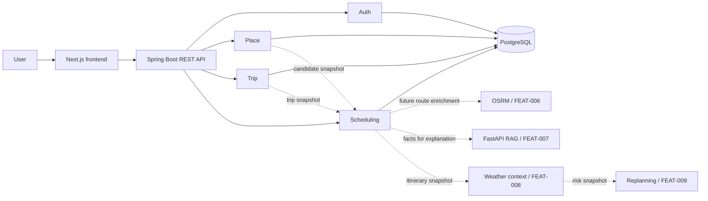
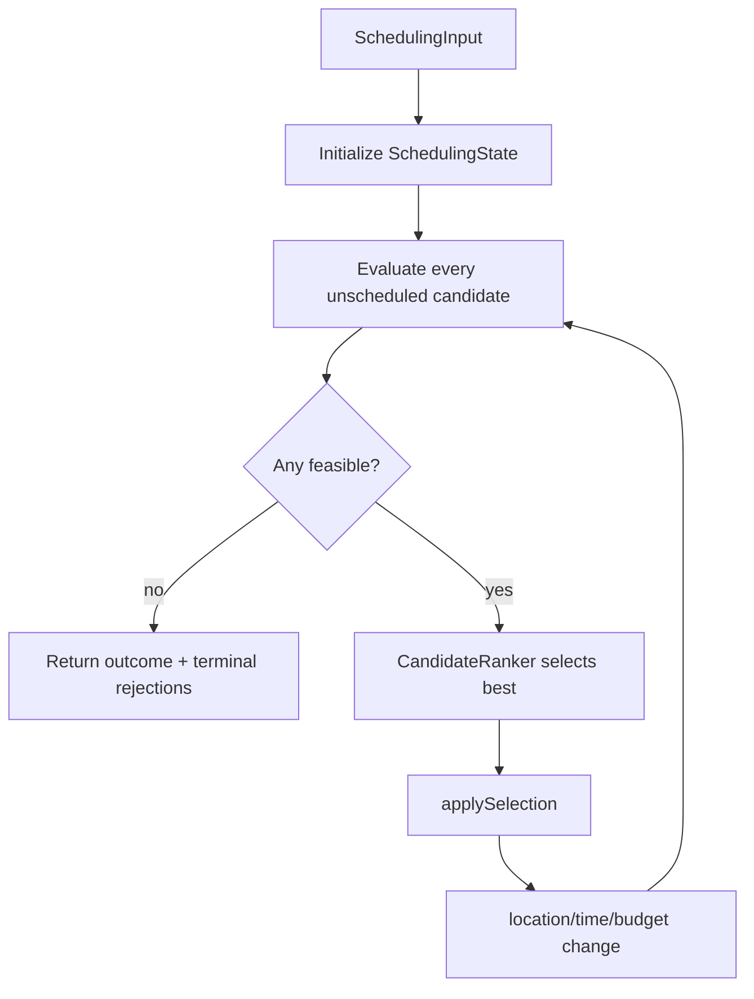

# CODEBASE_MAP — SaigonPlanTravel

> Practical reading map for the current source. Use this to understand where a request
> enters, which module owns each rule, and which files should be read before editing.

## 1. System at a glance



Auth, Place, Trip, and the FEAT-005 Scheduling baseline are implemented in the
current backend working tree. External route/RAG/context/replanning boxes are future
feature directions.

## 2. Repository layout

```text
saigonplantravel/
├── backend/     Spring Boot modular monolith
├── frontend/    Next.js application
├── infra/       local infrastructure (Docker Compose)
├── docs/        Obsidian/project/thesis documentation
└── .agents/     repo-scoped Codex skills
```

There is no current `ai-service/` implementation in the uploaded source.

## 3. Backend module map

### 3.1. `common`

Purpose: cross-cutting infrastructure only.

Important areas:

```text
common/
├── config/ApplicationTimeConfig
├── exception/GlobalExceptionHandler
└── security/
    ├── SecurityConfig
    ├── RestAuthenticationEntryPoint
    └── jwt/
```

Read this when changing authentication behavior, ProblemDetail mapping, clock/timezone,
or security access rules.

Do not move feature business logic here merely because two classes use it.

### 3.2. `auth`

```text
auth/
├── controller/AuthController
├── service/AuthService
├── security/JwtAuthenticationService
├── entity/UserAccount
├── repository/UserAccountRepository
└── dto/domain/exception
```

Main flow:

```text
POST /api/v1/auth/register
→ AuthController
→ AuthService
→ UserAccountRepository
→ users

POST /api/v1/auth/login
→ AuthService validates password
→ JwtService issues token
→ LoginResponse

Authenticated request
→ JwtAuthenticationFilter
→ JwtAuthenticationService
→ UserPrincipal
→ @AuthenticationPrincipal in controller
```

### 3.3. `place`

Core public flow:

```text
GET /api/v1/places
→ PlaceController
→ PlaceService
→ PlaceRepository + Specifications
→ PlaceMapper
→ PlacePageResponse
```

Detail flow:

```text
GET /api/v1/places/{slug}
→ PlaceService
→ Place + categories + opening hours
→ PlaceDetailResponse
```

Scheduling boundary:

```text
PlaceSchedulingQuery
        ↑
PlaceSchedulingQueryService
        ↓
PlaceRepository projections
        ↓
PlaceSchedulingCandidate
```

Important point: `PlaceSchedulingCandidate` is a purpose-specific read model for
Scheduling, not the Place entity/domain aggregate.

### 3.4. `trip`

Main API flow:

```text
Authenticated user
→ TripController
→ principal.id()
→ TripService
→ TripPolicy + CategoryService
→ TripRepository
→ trips + trip_category_preferences
→ TripMapper
→ TripResponse
```

Scheduling boundary:

```text
TripSchedulingQuery#getByPublicId(publicId, userId)
→ TripService
→ TripRepository ownership lookup
→ TripSchedulingSnapshot
```

Scheduling must use this snapshot instead of importing `Trip` or `TripRepository`.

### 3.5. `scheduling`

Current structure:

```text
scheduling/
├── config/
├── controller/
├── domain/
│   ├── algorithm/
│   ├── scoring/
│   ├── travel/
│   └── visit/
├── dto/
├── entity/
├── exception/
├── mapper/
├── repository/
└── service/
```

Public application flow:

```text
Authenticated request
→ ItineraryController
→ SchedulingService
→ TripSchedulingQuery + PlaceSchedulingQuery
→ GreedyItineraryScheduler
→ Itinerary.create(...)
→ ItineraryRepository
→ ItineraryMapper
→ ItineraryResponse
```

`SchedulingService#generate` owns the transaction that loads immutable inputs,
runs the scheduler, constructs and persists the aggregate, and maps the response.
`SchedulingService#get` uses a read-only transaction to load an ownership-scoped
stored snapshot and compare the current Trip `updatedAt` with the stored timestamp.

#### Travel

```text
GeoPoint
DistanceCalculator
HaversineDistanceCalculator
TravelTimeEstimator
TravelEstimate
```

Responsibility: estimate straight-line distance and baseline travel minutes.

#### Visit

```text
PaceDurationPolicy
VisitFeasibilityInput
VisitFeasibilityEvaluator
VisitFeasibilityResult
VisitSchedule
VisitRejectionReason
```

Responsibility: adjusted visit duration, arrival/wait/start/end feasibility, opening/trip
window constraints.

#### Scoring

```text
CandidateScoringInput
CandidateScorer
CandidateScore
EvaluatedCandidate
CandidateRanker
```

Responsibility: explainable deterministic score and deterministic tie-break selection.

#### Algorithm

```text
SchedulingInput
SchedulingState
CandidateEvaluator
CandidateEvaluationResult
CandidateRejectionReason
TerminalCandidateRejection
GreedyItineraryScheduler
GreedySchedulingOutcome
```

Responsibility: evaluate all remaining candidates against the current state, rank feasible
candidates, select one, update state, and repeat.

Core runtime loop:



The recomputation is essential: after selection, distance, travel time, waiting,
remaining budget, and score can all change.

#### Persistence

Database migrations and JPA mappings define:

```text
Itinerary
├── @ElementCollection preferredCategoryIds
├── @OneToMany items       → itinerary_items
└── @OneToMany warnings    → itinerary_warnings
```

`Itinerary` maps `itineraries`; its preferred-category snapshot maps
`itinerary_preferred_categories`. Items and warnings are ordered child entities with
cascade persistence. Public reads use `ItineraryRepository#findByPublicIdAndUserId`.

Trip/User/Place/Category associations are stored as scalar foreign keys and immutable
snapshot fields. Scheduling deliberately has no JPA relationship to foreign module
entities.

V15 permits item administrative-unit name/type to both be null, matching current
Place source semantics for demo rows. It does not invent an administrative unit.

#### API and errors

```http
POST /api/v1/trips/{tripPublicId}/itineraries
GET  /api/v1/itineraries/{itineraryPublicId}
```

POST returns `201 Created` and `Location` for a non-empty itinerary. GET returns the
stored snapshot with a computed `stale` flag and never reruns the scheduler.

Relevant `ProblemDetail` codes are:

```text
INVALID_REQUEST              400
TRIP_NOT_FOUND               404
ITINERARY_NOT_FOUND          404
SCHEDULING_DATA_CONFLICT     409
NO_FEASIBLE_ITINERARY        422
```

The controller takes ownership only from `UserPrincipal`; public DTOs omit internal
Trip, Itinerary, and User numeric IDs.

## 4. Module dependency direction

Preferred dependency direction for the current MVP:

```text
controller
   ↓
application/service
   ↓
domain + owned repository
```

Cross-module scheduling reads:

```text
Scheduling
  ├──→ TripSchedulingQuery
  └──→ PlaceSchedulingQuery
```

Avoid:

```text
Scheduling → TripRepository
Scheduling → Trip Entity
Scheduling → PlaceRepository
Scheduling → Place Entity
```

Future modules should consume immutable itinerary/read contracts rather than reaching
into Scheduling persistence directly.

## 5. Database evolution map

```mermaid
flowchart LR
    V1[pgvector] --> V2[places]
    V2 --> V3[categories]
    V3 --> V4[place_categories]
    V4 --> V5[opening_hours]
    V5 --> V6[demo places]
    V6 --> V7[constraints]
    V7 --> V8[demo metadata]
    V8 --> V9[unaccent/index]
    V9 --> V10[users]
    V10 --> V11[trips]
    V11 --> V12[trip categories]
    V12 --> V13[itineraries]
    V13 --> V14[items/warnings]
    V14 --> V15[nullable administrative-unit snapshot pair]
```



When reading a JPA entity, always open the migration that owns its table beside it.

## 6. Frontend map

Current source:

```text
frontend/src/
├── app/
│   ├── page.tsx
│   └── places/
├── components/
│   ├── layout/
│   └── ui/
├── features/
│   ├── map/
│   └── places/
├── lib/api/place-api.ts
└── types/place.ts
```

Main Place exploration flow:

```text
/places route
→ URL search params
→ place API client
→ PlacesExplorer
→ filters/list/pagination/map
```

Place detail flow:

```text
/places/[slug]
→ backend place detail API
→ PlaceDetailView
```

Do not implement the itinerary UI by copying Place patterns blindly. First stabilize the
FEAT-005 public response and then model timeline/map state from that contract.

## 7. Suggested reading order for the owner

To understand the backend from fundamentals to the current scheduling work:

1. `BackendApplication.java` + `application.yaml`.
2. `SecurityConfig` → JWT filter/service → `UserPrincipal`.
3. `PlaceController` → `PlaceService` → `PlaceRepository` → `PlaceMapper`.
4. `TripController` → `TripService` → `Trip`/`TripPolicy`.
5. `TripSchedulingQuery` and `TripSchedulingSnapshot`.
6. `PlaceSchedulingQuery` → projections → `PlaceSchedulingQueryService`.
7. Scheduling `travel/`.
8. Scheduling `visit/`.
9. Scheduling `scoring/`.
10. Scheduling `algorithm/`.
11. V13–V15 migrations next to `Itinerary`, `ItineraryItem`, and
    `ItineraryWarning`.
12. `SchedulingService` → `ItineraryRepository` → `ItineraryMapper`.
13. `ItineraryController` and its MockMvc tests.

This order follows the actual dependency chain and is more useful than reading classes
alphabetically.

## 8. “Read these files before changing X” cheat sheet

| Task | Minimum files to inspect |
| --- | --- |
| Change auth access rules | `SecurityConfig`, JWT filter/service, affected controller tests |
| Change Place search | `PlaceSearchRequest`, normalizer, specifications, repository/service, FEAT-003 |
| Change opening semantics | `OpeningHour`, Place scheduling snapshots/service, FEAT-002/005 tests |
| Change Trip fields | V11/V12, `Trip`, request/response, policy, mapper, scheduling snapshot, FEAT-004/005 |
| Change scoring | `CandidateScoringInput`, scorer, ranker, GREEDY spec, scheduler test |
| Change travel estimate | scheduling config/policy, travel package, FEAT-005/006 assumptions |
| Change itinerary persistence | V13–V15, all itinerary entities/repository, FEAT-005 sections 12/17.E |
| Change itinerary API | controller, service, response records, mapper, security/error tests, FEAT-005 API |
| Add routing | stable itinerary response + FEAT-006; do not change GREEDY order |
| Add RAG | stable Place/Itinerary read contracts + FEAT-007; AI explains, does not choose |
| Add weather | stable itinerary item time/coordinate/indoor snapshots + FEAT-008 |
| Add replanning | stable itinerary/context contracts + FEAT-009; preserve base itinerary |
